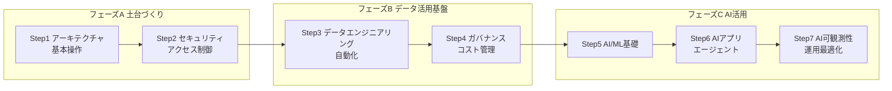
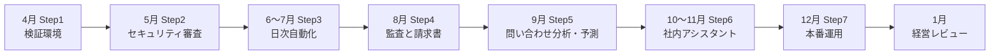

# Snowflake アーキテクト育成 学習ロードマップ【全体概要編】

> 本書は「Snowflake学習ロードマップと重要トピック」の7ステップに沿って、各ステップの**ゴール・学習トピック・ハンズオン演習課題**の全体像を示すものです。
> 全体を**スノー商事のデータ基盤プロジェクト（約10か月）の物語**として構成しています。各ステップの詳細な解説・手順・現場の事例は「詳細編」（Step 1〜7 のページ）にあります。

---

## 0. このドキュメントの位置づけ

| 項目 | 内容 |
| --- | --- |
| 対象者 | Snowflakeでデータ基盤・AI基盤を設計・構築するエンジニア（SQLの基礎知識あり） |
| 学習方針 | 資格試験ではなく**実務で設計・構築できること**をゴールとする。すべてのステップでハンズオンを必須とする |
| 構成方針 | 大枠 → 詳細。まず全体像と各ステップの役割を把握し、その後にステップごとの詳細へ進む |
| 演習の進め方 | 全ステップで**共通の業務シナリオ**を使い、前のステップの成果物の上に次のステップを積み上げる |

---

## 1. 全体像

### 1.1 7ステップと3つのフェーズ

7つのステップは、役割ごとに3つのフェーズに分けて捉えると理解しやすくなります。

| フェーズ | ステップ | テーマ | 一言でいうと |
| --- | --- | --- | --- |
| **A. 土台づくり** | 1 | アーキテクチャと基本操作 | Snowflakeの「仕組み」と「動かし方」を知る |
| | 2 | セキュリティとアクセス制御 | 「誰が・どこから・何に」触れるかを設計する |
| **B. データ活用基盤** | 3 | データエンジニアリングと自動化 | データを「流し込み・加工し・自動で回す」 |
| | 4 | データガバナンスとコスト管理 | データとお金を「守り・見張る」 |
| **C. AI活用** | 5 | AI & ML（基礎） | SQLだけでAI/MLを「使う」 |
| | 6 | 高度なAIアプリ開発とエージェント | AIを組み合わせて「アプリを作る」 |
| | 7 | AI可観測性と運用最適化 | 作ったAIを「測り・改善し・運用する」 |

### 1.2 なぜこの順番なのか

- **Step1 → 2**：リソースの仕組み（ウェアハウス・オブジェクト階層）を知らないとロール設計ができない。
- **Step2 → 3**：データを入れる前に「誰がロードし、誰が読むか」を決めておかないと、後から権限を付け直す手戻りが発生する。
- **Step3 → 4**：保護・監視の対象となるデータとパイプラインが揃ってはじめて、マスキングや品質監視が意味を持つ。
- **Step4 → 5**：AI機能は機密データにも触れ、クレジット消費も大きい。ガバナンスとコスト監視が先に整っている必要がある。
- **Step5 → 6 → 7**：単体のAI機能 → 組み合わせたアプリ → 本番品質での運用、と段階的に難度を上げる。

### 1.3 学習期間の目安

| ステップ | 目安期間 | 学習時間の目安 | ハンズオン比率 |
| --- | --- | --- | --- |
| Step1 | 1〜2週 | 15〜20h | 50% |
| Step2 | 1〜2週 | 15〜20h | 60% |
| Step3 | 3〜4週 | 35〜45h | 70% |
| Step4 | 2〜3週 | 25〜30h | 60% |
| Step5 | 2〜3週 | 25〜30h | 70% |
| Step6 | 3〜4週 | 35〜45h | 70% |
| Step7 | 2週 | 20〜25h | 60% |
| 最終課題 | 2〜3週 | 30〜40h | 90% |
| **合計** | **約4〜5か月** | **約200〜255h** | |

※ 業務と並行して週10時間程度を想定。

### 1.4 共通演習シナリオ：スノー商事の10か月

全ステップを通して、架空企業「スノー商事」（全国にECサイトと実店舗を持つ小売企業）のデータ基盤を段階的に構築します。
学習者は**「あなた」**として物語の中に入り、社内の依頼や困りごとを1つずつ解決していきます。各ステップは「誰かからの依頼」で始まり、演習で解決し、最後に次の依頼が届いて終わります。

> **【場面】4月6日（月）10:00　情報システム部の会議室**
>
> 北村部長：「売上も顧客も問い合わせも、部署ごとにバラバラに持っている。これを一か所に集めて、ゆくゆくは社員が日本語でデータに質問できるようにしたい。」
>
> 佐伯さん：「いきなり AI からやると必ず崩れます。土台、パイプライン、ガバナンスの順に積みましょう。」
>
> 北村部長：「任せる。ただし毎月、何ができて、いくらかかったかは報告してね。」

#### 登場人物

| 名前 | 所属・役割 | 物語での立ち位置 |
| --- | --- | --- |
| **あなた** | 情報システム部 データ基盤チーム | 主人公。中途入社のデータエンジニア。物語を通じてアーキテクトへ成長する |
| 北村部長 | 情報システム部長 | プロジェクトオーナー。予算と優先順位を決める。「で、いくらかかるの？」が口癖 |
| 佐伯さん | データ基盤チームの先輩 | レビュー役。現場の落とし穴を教えてくれる |
| 高田さん | 経営企画部 アナリスト | Mart 層と BI の主要ユーザー。月初の経営会議資料を作る |
| 森さん | マーケティング部 | 顧客分析・キャンペーン担当。個人情報を「見たい」側 |
| 石井さん | 情報セキュリティ室 | セキュリティ審査・監査の窓口 |
| 野口さん | 経理部 | Snowflake の請求書を受け取り、月次のコスト報告を求める |
| 中川さん | EC 事業部 システム担当 | EC サイトとアクセスログの提供元。ときどき予告なく仕様を変える |
| 小池さん | 営業本部 東日本エリアマネージャー | 自分の地域の売上だけ見られればよい |
| 大野さん | カスタマーサポート部 リーダー | 問い合わせ対応の効率化に AI を使いたい |

#### 物語の年表

| 時期 | ステップ | 物語上の出来事 | 冒頭に届く依頼 |
| --- | --- | --- | --- |
| 4月 | Step 1 | 入社・キックオフ。検証環境づくり | 北村部長「まずは売上とアクセスログを Snowflake に入れて、触れる環境を作ってほしい」 |
| 5月 | Step 2 | 社内公開前のセキュリティ審査 | 石井さん「他部署に開放する前に、誰が何を見られるのか説明してください」 |
| 6〜7月 | Step 3 | 手作業ロードからの脱却。日次自動化 | 高田さん「毎朝あなたが手でロードしてるの、休みの日はどうするの？」 |
| 8月 | Step 4 | 個人情報の内部監査と、想定外の請求書 | 石井さん「顧客のメールアドレス、アナリストに丸見えですよね」／野口さん「今月の請求、先月の3倍なんですが」 |
| 9月 | Step 5 | 問い合わせ分析と売上予測を経営会議へ | 大野さん「問い合わせが月1万件。全部読めないので傾向を掴みたい」 |
| 10〜11月 | Step 6 | 社内アシスタントの開発 | 北村部長「社長が『データに日本語で質問できるようにしろ』と」 |
| 12月 | Step 7 | 本番運用開始。品質とコストの説明責任 | 北村部長「アシスタント、良くなってるの？数字で見せて」 |
| 1月 | 最終課題 | 経営層への設計レビュー | ― |

#### 各ステップの読み方

| 要素 | 見た目 | 役割 |
| --- | --- | --- |
| この章の物語 | 各ステップの冒頭（1.0） | その月に何が起きていて、誰の依頼を解決するのか |
| 場面 | 演習の直前 | 「なぜ今この演習をやるのか」。前の演習の結果から次の困りごとへつなぐ |
| 現場の事例 | 第4章 | 演習で作った環境で実際に起きそうな障害・監査・問い合わせを、調査 → 原因 → 対処 → 再発防止の順に追体験する |

扱うデータは次のとおりです。

| データ | 形式 | 主に使うステップ |
| --- | --- | --- |
| 売上明細（店舗・EC） | CSV（日次でクラウドストレージに着地） | 1, 3, 4, 5 |
| 顧客マスタ（氏名・メール・住所など個人情報を含む） | CSV | 2, 4 |
| ECアクセスログ | JSON（半構造化） | 1, 3 |
| 問い合わせ履歴 | テキスト | 5, 6 |
| 商品マニュアル・社内規程 | PDF | 5, 6 |

### 1.5 演習環境の前提

| 項目 | 内容 |
| --- | --- |
| アカウント | Snowflakeトライアルアカウント または 社内検証用アカウント（Enterprise Edition以上を推奨。マスキングポリシー・行アクセスポリシー等はEnterprise以上の機能） |
| リージョン | Cortex機能の提供状況はリージョンにより異なるため、事前に確認する（必要に応じてクロスリージョン推論を有効化） |
| ツール | Snowsight、Snowflake CLI、dbt（Step3）、Python 3.x（Step5〜7） |
| 命名規則 | `<環境>_<層>_DB`（例：`DEV_RAW_DB`, `DEV_STG_DB`, `DEV_MART_DB`）を全ステップで統一する |
| コスト上限 | 演習開始時にリソースモニターで上限を設定しておく（詳細はStep4で学ぶが、設定だけはStep1で行う） |

---

## 2. 各ステップの概要

---

### Step 1：基礎 ― アーキテクチャと基本操作

**物語の入口（4月）**：北村部長「まずは売上とアクセスログを Snowflake に入れて、触れる環境を作ってほしい」

#### ゴール
Snowflakeの3層構造（ストレージ／コンピュート／クラウドサービス）を説明でき、ウェアハウスやオブジェクトを**目的に合わせて作り分けられる**。

#### 主要トピック

| トピック | 押さえるポイント |
| --- | --- |
| 3層アーキテクチャ | ストレージとコンピュートの分離がもたらす利点（独立スケール、同時実行の分離） |
| 仮想ウェアハウス | サイズ、自動サスペンド／自動再開、マルチクラスター、標準型とSnowpark最適化型の使い分け |
| オブジェクト階層 | アカウント > データベース > スキーマ > テーブル／ビュー |
| テーブルの種類 | 永続・一時・仮テーブルの違いとコスト（Time Travel／Fail-safeとの関係） |
| データ型 | 構造化データ型と半構造化データ型（VARIANT、OBJECT、ARRAY）、`FLATTEN` |
| 操作ツール | Snowsight（Worksheet、クエリプロファイル）、Snowflake CLI |
| 基本機能 | Time Travel、ゼロコピークローン、結果キャッシュ |

#### ハンズオン演習課題

| ID | 課題 | 完了条件 |
| --- | --- | --- |
| 1-1 | 用途別ウェアハウスを3つ作成する（ロード用・変換用・分析用） | サイズと自動サスペンド時間の設定理由を説明できる |
| 1-2 | Raw／Staging／Mart の3層データベースと命名規則に沿ったスキーマを作成する | 1.5の命名規則に準拠している |
| 1-3 | 売上CSVとアクセスログJSONを手動でロードし、JSONを`FLATTEN`で展開してクエリする | JSON内のネスト項目を列として取り出せる |
| 1-4 | 同じクエリをサイズ違いのウェアハウスで実行し、クエリプロファイルで比較する | 実行時間と消費クレジットの差を表にまとめる |
| 1-5 | テーブルを誤って削除 → `UNDROP`で復元、本番DBをクローンして開発DBを作る | クローン直後のストレージ増分がほぼゼロであることを確認する |

#### 成果物
- 3層データベース構成と用途別ウェアハウスが作成された演習環境
- ウェアハウスサイズ比較レポート（1-4）

#### 理解度チェック
1. 同時に多数の分析ユーザーがクエリを実行し待ちが発生している。「サイズを上げる」と「マルチクラスターにする」のどちらを選ぶべきか、理由とともに答えよ。
2. 一時テーブルと仮テーブルの違い、それぞれをどのような用途で使うかを説明せよ。
3. ゼロコピークローンがストレージをほとんど消費しない理由を説明せよ。

---

### Step 2：セキュリティとアクセス制御

**物語の入口（5月）**：石井さん「他部署に開放する前に、誰が何を見られるのか説明してください」

#### ゴール
最小権限の原則に基づき、**認証・ネットワーク・権限の3つの防御層**を設計・実装できる。

#### 主要トピック

| トピック | 押さえるポイント |
| --- | --- |
| RBAC | システムロール（ACCOUNTADMIN、SECURITYADMIN、SYSADMIN、USERADMIN）の役割分担、アクセスロールと機能ロールの2層設計、将来の権限（FUTURE GRANTS） |
| 認証 | MFA、SSO（SAML）、OAuth、キーペア認証とローテーション、プログラムアクセストークン |
| 認証ポリシー | ユーザー種別（人間／サービス）ごとに許可する認証方式を制御 |
| ネットワーク | ネットワークポリシー、ネットワークルール、プライベート接続の概要 |
| サービスユーザー | `TYPE = SERVICE` のユーザーとキーペア認証による機械間接続 |

#### ハンズオン演習課題

| ID | 課題 | 完了条件 |
| --- | --- | --- |
| 2-1 | スノー商事向けロール階層を設計する（例：データエンジニア、アナリスト、マーケ担当、パイプライン用サービス） | ロール階層図と権限マトリクス（ロール × DB/スキーマ × 権限）を作成 |
| 2-2 | 2-1をSQLで実装する。アクセスロール（DB/スキーマ単位）と機能ロール（職務単位）を分離し、FUTURE GRANTSを設定 | 各ロールで想定どおり「見える／見えない」ことを検証 |
| 2-3 | パイプライン用サービスユーザーを作成し、キーペア認証でSnowflake CLIから接続する | パスワードなしで接続でき、鍵ローテーション手順を文書化 |
| 2-4 | 認証ポリシーで人間ユーザーにMFAを必須化し、ネットワークポリシーで接続元IPを制限する | 許可外IPからの接続が拒否されることを確認 |
| 2-5 | 権限不足エラーをわざと発生させ、`SHOW GRANTS` などで原因を特定する | トラブルシュート手順を手順書化 |

#### 成果物
- ロール設計書（階層図・権限マトリクス）
- ロール作成用SQLスクリプト一式（再実行可能な形で管理）

#### 理解度チェック
1. ACCOUNTADMINを日常業務で使ってはいけない理由と、代わりに使うべきロールを答えよ。
2. アクセスロールと機能ロールを分けると、組織変更時にどのような利点があるか。
3. サービスユーザーにパスワード認証ではなくキーペア認証を使う理由を説明せよ。

---

### Step 3：データエンジニアリングと自動化

**物語の入口（6〜7月）**：高田さん「毎朝あなたが手でロードしてるの、休みの日はどうするの？」

#### ゴール
外部ストレージから Raw → Staging → Mart までの**自動化されたデータパイプライン**を設計・構築できる。

#### 主要トピック

| トピック | 押さえるポイント |
| --- | --- |
| ロード／アンロード | ステージ（内部／外部）、ファイル形式、`COPY INTO`、エラー処理オプション、アンロード |
| 継続的ロード | Snowpipe（自動取り込み）と、バッチロードとの使い分け |
| 変更データ検知 | Streams（差分の追跡）とTasks（スケジュール実行、タスクグラフ） |
| 宣言型パイプライン | Dynamic Tables（ターゲットラグ、増分リフレッシュ）とStreams/Tasksの使い分け |
| 変換の管理 | dbtプロジェクトのSnowflake上での実行、モデルの層構造、テスト |
| オープンフォーマット | Apache Icebergテーブルの概要と使いどころ |
| ビューの選択 | ビュー／マテリアライズドビュー／Dynamic Tablesの比較 |

#### ハンズオン演習課題

| ID | 課題 | 完了条件 |
| --- | --- | --- |
| 3-1 | 外部ステージとファイル形式を定義し、売上CSVを`COPY INTO`でRaw層へロード。不正行を含むファイルでエラー処理を確認 | エラー行を特定・隔離する手順を説明できる |
| 3-2 | Snowpipeで売上ファイルの自動取り込みを構成する | ファイル配置後、自動でRawテーブルに反映される |
| 3-3 | Streams + Tasksで、Raw層の差分をStaging層へクレンジングしながらMERGEするパイプラインを作る | 追加・更新データのみが処理されることを確認 |
| 3-4 | Dynamic TablesでStaging → Mart（日次売上サマリー、顧客別購買サマリー）を構築する | ターゲットラグの設定根拠を説明できる |
| 3-5 | 3-3〜3-4の変換ロジックをdbtモデルとして書き直し、テスト（not null、unique等）を追加する | dbtのテストがすべて成功する |
| 3-6 | 同じ要件を「Streams/Tasks」「Dynamic Tables」「dbt」で実装した比較表を作成する | 保守性・コスト・リアルタイム性の観点で推奨パターンを提言 |

#### 成果物
- Raw → Staging → Mart の自動パイプライン（稼働状態）
- パイプライン構成図と実装方式の比較表（3-6）

#### 理解度チェック
1. 1日1回の大量ファイルと、数分おきの小ファイルの取り込みで、`COPY INTO`とSnowpipeをどう使い分けるか。
2. Dynamic Tablesを使うべき場面と、Streams/Tasksを使うべき場面をそれぞれ挙げよ。
3. Iceberg テーブルを採用する動機となる要件を挙げよ。

---

### Step 4：データガバナンスとコスト管理

**物語の入口（8月）**：石井さん「顧客のメールアドレス、アナリストに丸見えですよね」／野口さん「今月の請求、先月の3倍なんですが」

#### ゴール
機密データの保護・データ品質の監視・コストの可視化と統制を、**Snowflake Horizonの機能で一元的に運用**できる。

#### 主要トピック

| トピック | 押さえるポイント |
| --- | --- |
| Snowflake Horizon | ガバナンス機能群の全体像（カタログ、保護、品質、系統） |
| 機密データの分類 | 自動分類による個人情報の検出、システムタグの付与 |
| オブジェクトタグ | タグ設計、タグの自動伝播、タグベースのマスキング |
| データ保護ポリシー | ダイナミックデータマスキング、行アクセスポリシー |
| データ系統 | アクセス履歴、オブジェクトの依存関係 |
| データ品質 | データメトリック関数（DMF）、Expectations、失敗時の通知 |
| コスト管理 | リソースモニター、Budgets、`ACCOUNT_USAGE`ビューによる消費分析 |

#### ハンズオン演習課題

| ID | 課題 | 完了条件 |
| --- | --- | --- |
| 4-1 | 顧客マスタに機密データ分類を実行し、検出された個人情報項目にタグを付与する | 分類結果と付与タグの一覧を作成 |
| 4-2 | タグベースのマスキングポリシーを作成し、アナリストロールにはメール・電話番号がマスクされて見えるようにする | ロールごとの表示差をスクリーンショットで記録 |
| 4-3 | 行アクセスポリシーで、地域担当者が自分の担当地域の売上だけを参照できるようにする | マッピングテーブル方式で実装し、担当変更がテーブル更新のみで済む |
| 4-4 | Staging層にDMF（NULL件数、重複件数、鮮度）を設定し、閾値違反時に通知する | わざと不正データを投入し、通知が届くことを確認 |
| 4-5 | ウェアハウスにリソースモニター、アカウントにBudgetsを設定し、`ACCOUNT_USAGE`からウェアハウス別・ロール別のクレジット消費を集計する | 月次コストレポートのクエリを作成 |
| 4-6 | アクセス履歴を使い、「顧客のメールアドレス列を過去1週間に誰が参照したか」を調べる | 監査用クエリとして保存 |

#### 成果物
- ガバナンス設計書（タグ体系、ポリシー一覧、適用対象）
- データ品質監視設定と、コストモニタリング用クエリ集

#### 理解度チェック
1. 列ごとにマスキングポリシーを割り当てる方式と、タグベースのマスキングの違いと利点を説明せよ。
2. 行アクセスポリシーでマッピングテーブルを使う設計の利点は何か。
3. リソースモニターとBudgetsの役割の違いを説明せよ。

---

### Step 5：Snowflake AI & ML（基礎）

**物語の入口（9月）**：大野さん「問い合わせが月1万件。全部読めないので傾向を掴みたい」

#### ゴール
SQLから呼び出せる組み込みAI/ML機能を使い、**テキスト分析・予測・検索・自然言語での問い合わせ**をすばやく実現できる。

#### 主要トピック

| トピック | 押さえるポイント |
| --- | --- |
| Cortex AI Functions | `AI_COMPLETE`、`AI_CLASSIFY`、`AI_SENTIMENT`、`AI_EXTRACT`、要約、翻訳、構造化出力 |
| ドキュメント処理 | `AI_PARSE_DOCUMENT`によるPDFからのテキスト・レイアウト抽出 |
| ML関数 | 時系列予測（FORECAST）、異常検知、分類、Top Insights |
| Cortex Search | 非構造化データのハイブリッド検索サービスの作成とクエリ |
| Cortex Analyst | セマンティックビュー（セマンティックモデル）による自然言語 → SQL変換、検証済みクエリ |
| コスト | AI関数のトークン課金の考え方、使用状況の確認方法 |

#### ハンズオン演習課題

| ID | 課題 | 完了条件 |
| --- | --- | --- |
| 5-1 | 問い合わせ履歴に対し、感情分析・カテゴリ分類・要約をSQLで一括実行し、結果をMart層に保存する | 「カテゴリ別の不満度」を集計できる |
| 5-2 | `AI_COMPLETE`の構造化出力で、問い合わせ本文から「商品名・問題種別・緊急度」をJSONで抽出する | 出力スキーマが常に一定である |
| 5-3 | 日次売上に対して時系列予測モデルを作成し、今後30日の売上を予測する。あわせて異常検知で売上の異常日を検出する | 予測結果と実績を比較するグラフを作成 |
| 5-4 | 商品マニュアルPDFを`AI_PARSE_DOCUMENT`で解析・チャンク分割し、Cortex Searchサービスを作成する | 自然文の質問で関連箇所が上位に返る |
| 5-5 | 売上Mart向けのセマンティックビューを作成し、Cortex Analystで「先月の地域別売上トップ3は？」などに回答させる | 検証済みクエリを5件以上登録し、回答精度が改善したことを確認 |
| 5-6 | 5-1〜5-5で消費したAI関連クレジットを集計する | 機能別コストを表にまとめる |

#### 成果物
- 問い合わせ分析テーブル、売上予測テーブル
- 商品マニュアル検索サービス、売上分析用セマンティックビュー

#### 理解度チェック
1. Cortex Search と Cortex Analyst は、それぞれどのような種類のデータ・質問に向いているか。
2. 大量の行に AI 関数を適用する際に、コストを抑えるための工夫を3つ挙げよ。
3. セマンティックビューに業務用語の同義語や検証済みクエリを登録する目的は何か。

---

### Step 6：高度なAIアプリ開発とエージェント

**物語の入口（10〜11月）**：北村部長「社長が『データに日本語で質問できるようにしろ』と」

#### ゴール
構造化データと非構造化データを横断して回答する **AIエージェント／RAGアプリケーション**を設計・構築し、外部ツールと統合できる。

#### 主要トピック

| トピック | 押さえるポイント |
| --- | --- |
| ベクトル埋め込み | `AI_EMBED`／`EMBED_TEXT`系関数、VECTOR型、類似度関数による検索 |
| RAG設計 | チャンク分割戦略、検索 → 生成の流れ、Cortex Searchを使う場合との比較 |
| Cortex Agents | ツール（Cortex Analyst、Cortex Search、カスタムツール）のオーケストレーション、システムプロンプト、スレッドとマルチターン |
| エージェントの運用設定 | バージョニング、共有、マルチテナンシー、承認・ユーザー入力の扱い |
| Cortex Code / Agent SDK | Python・TypeScriptからのエージェント組み込み |
| MCP | Snowflake管理のMCPサーバーによる外部AIクライアントとの連携 |
| Cortex Guardrails | 有害・不適切な入出力の抑止 |

#### ハンズオン演習課題

| ID | 課題 | 完了条件 |
| --- | --- | --- |
| 6-1 | 社内規程PDFを自前でチャンク分割・ベクトル化し、VECTOR型テーブルと類似度検索でRAGを実装する | Step5のCortex Search版と回答品質・実装工数を比較 |
| 6-2 | Cortex Analyst（売上）とCortex Search（商品マニュアル・問い合わせ）をツールに持つ「スノー商事アシスタント」エージェントを作成する | 「売上が落ちた商品の問い合わせ傾向は？」のような横断質問に回答できる |
| 6-3 | システムプロンプトで回答方針（口調、根拠の提示、回答範囲外の扱い）を定義し、マルチターン会話で文脈が引き継がれることを確認する | 回答に参照元が明示される |
| 6-4 | Agent SDK または REST API を使い、エージェントを呼び出す簡易アプリ（Python）を作成する | ストリーミングで回答が表示される |
| 6-5 | Snowflake管理のMCPサーバーを構成し、外部のMCP対応クライアントからエージェント／検索サービスを利用する | 外部クライアントからの問い合わせに回答が返る |
| 6-6 | Guardrailsを有効化し、不適切な入力やプロンプトインジェクション的な入力への挙動を確認する | テスト入力と挙動の一覧を作成 |
| 6-7 | Step2のロール設計に沿って、エージェントが利用者の権限の範囲内でのみデータに回答することを確認する | 権限の異なる2ロールで回答差を検証 |

#### 成果物
- 「スノー商事アシスタント」エージェント（稼働状態）と呼び出し用アプリ
- エージェント設計書（ツール構成、プロンプト方針、権限設計）

#### 理解度チェック
1. 自前のベクトル検索とCortex Searchは、どのような判断基準で使い分けるか。
2. エージェントにツールを追加しすぎると、どのような問題が起こりうるか。
3. エージェント経由のデータアクセスでも行アクセスポリシーやマスキングが効くことが重要なのはなぜか。

---

### Step 7：AI可観測性と運用最適化

**物語の入口（12月）**：北村部長「アシスタント、良くなってるの？数字で見せて」

#### ゴール
構築したAIシステムの**品質を定量評価し、コストと性能を継続的に改善する運用サイクル**を回せる。

#### 主要トピック

| トピック | 押さえるポイント |
| --- | --- |
| AI Observability | 評価メトリクス（回答の関連性、根拠性、文脈の関連性など）、トレースの記録、イベントテーブル |
| 評価 | Cortex Agent／Cortex Analyst の評価、評価用データセットの作り方、フィードバックAPI |
| モニタリング | Cortex Search・Cortex Agentのリクエスト監視、リソース予算 |
| 安全性 | Cortex Guard／Guardrails の運用 |
| 性能とコスト | プロビジョンドスループット（PTU）の考え方、モデル選択によるコスト最適化 |
| ML Ops | モデルレジストリ（バージョン管理・推論）、特徴量ストア |

#### ハンズオン演習課題

| ID | 課題 | 完了条件 |
| --- | --- | --- |
| 7-1 | Step6のエージェント向けに、質問と期待回答のペアからなる評価データセット（20問以上）を作成する | 構造化データ系・非構造化データ系・横断系を網羅 |
| 7-2 | AI Observabilityで評価を実行し、メトリクスを記録する。プロンプトやツール構成を変更して再評価し、改善効果を比較する | 変更前後のスコア比較表を作成 |
| 7-3 | 利用者フィードバック（良い／悪い）を収集する仕組みを組み込み、低評価の回答を分析する | 低評価の主な原因を分類 |
| 7-4 | エージェント・検索サービスのリクエスト数、レイテンシ、コストを可視化するダッシュボードを作成する | 週次でレビューできる状態にする |
| 7-5 | Step5の売上予測を、Snowpark MLで学習したモデルに置き換えてモデルレジストリに登録し、バージョン管理と推論を行う | 新旧モデルの精度比較と切り替え手順を文書化 |
| 7-6 | 使用モデルを変更した場合の精度とコストのトレードオフを評価する | 推奨モデルと根拠をまとめる |

#### 成果物
- 評価データセットと評価結果レポート
- AI運用ダッシュボード、運用手順書（評価・改善サイクル）

#### 理解度チェック
1. 「なんとなく良くなった」ではなく、AIアプリの改善を定量的に示すには何を準備すべきか。
2. 高価なモデルと安価なモデルを使い分ける判断基準を挙げよ。
3. モデルレジストリを使わずにモデルを運用すると、どのような問題が起こるか。

---

## 3. 最終課題（キャプストーン）

全ステップの成果物を統合し、**「スノー商事 データ＆AI基盤」**として設計レビューを受けられる状態に仕上げます。

| 項目 | 要件 |
| --- | --- |
| アーキテクチャ設計書 | 3層データ構造、ウェアハウス構成、パイプライン、AI機能の全体構成図と設計根拠 |
| セキュリティ・ガバナンス | ロール設計、認証方式、マスキング・行アクセスポリシー、データ品質監視 |
| 稼働するシステム | 日次でデータが自動更新され、エージェントが最新データに基づいて回答する |
| 品質・コスト | 評価結果と月次コスト見積もり、改善計画 |
| 発表 | 30分の設計レビュー（想定質問：スケール時の課題、障害時の復旧、コスト増への対応） |

---

## 4. 詳細編の構成

各ステップの詳細編は、次の構成になっています。

| 章 | 内容 |
| --- | --- |
| 1. 概要 | 1.0「この章の物語」で、その月の依頼と登場人物を示す。あわせてゴール・チェックリスト・所要時間 |
| 2. 概念解説 | 各トピックの仕組み・設計上の判断ポイント |
| 3. ハンズオン | 演習課題ごとの「場面」→ SQL／Python コードと実行手順 → 確認ポイント → 考察課題 |
| 4. 現場の事例 | 実務で起きそうな障害・監査・問い合わせを、調べる → 原因 → 対処 → 再発防止の順に追体験する |
| 5. 考察課題の解答例 | 完了条件を満たす実装例と解説 |
| 6. 理解度チェックの解答 | 設計判断の考え方 |
| 7. 参考資料 | 関連する Snowflake 公式ドキュメント（ロードマップのソース番号に対応）と、次のステップへの接続 |

全ステップの事例は「事例索引」ページに種類別にまとめてあります。
