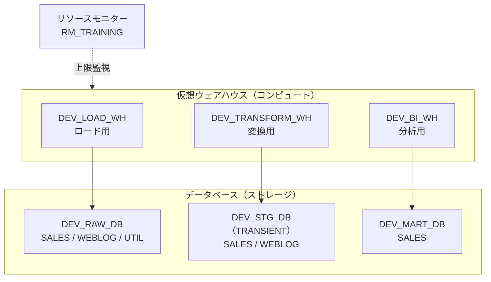

# Step 1 詳細編：基礎 ― アーキテクチャと基本操作

> 学習ロードマップ【全体概要編】の Step 1 を詳しく扱う資料です。
> 構成は「1. 概要 → 2. 概念解説 → 3. ハンズオン → 4. 現場の事例（ケーススタディ） → 5. 考察課題の解答例 → 6. 理解度チェックの解答 → 7. 参考資料」の順です。前半で全体像をつかんでから手を動かし、最後に実際の運用で起こりがちな出来事を追体験する流れになっています。

---

## 1. 概要

### 1.0 この章の物語

2026年4月。あなたはスノー商事 情報システム部 データ基盤チームに中途入社しました。最初の仕事は、売上とアクセスログを Snowflake に入れて「とりあえず触れる」検証環境を作ることです。

> **【場面】4月6日（月）10:00　情報システム部の会議室**
>
> 北村部長：「売上とアクセスログ、まずは Snowflake に入れて触れるようにしてほしい。経営企画の高田さんが早く触りたがってる。」
>
> 佐伯さん：「最初にウェアハウスを1個だけ作って全部そこでやると、あとで必ず揉めるよ。どの処理がいくら使ったのか、誰も説明できなくなる。」
>
> 北村部長：「そう、それ。で、いくらかかるの？ 検証だからって青天井は困るよ。」
>
> あなた：「上限を決めて、超えそうなら止まる仕組みを最初に入れます。」

> **【場面】4月6日（月）15:30　キックオフ後、執務フロアにて**
>
> 高田さん：「5月の経営会議で、EC の売上をデバイス別に出したいんです。スマホ経由がどれくらいか、社長がずっと気にしていて。」
>
> 中川さん：「アクセスログなら JSON で毎日出せますよ。ただ、項目はサイト改修でちょこちょこ変わるかもしれません。」
>
> 佐伯さん：「『変わるかもしれない』は『必ず変わる』と読み替えておいてね。」

**この章であなたが解決すること**

- ロード・変換・分析で取り合いにならないよう、用途別にウェアハウスを分け、使いすぎの歯止めをかける（演習 1-1）
- Raw／Staging／Mart の3層データベースをコードで作り、何度でも同じ環境を再現できるようにする（演習 1-2）
- 売上 CSV とアクセスログ JSON を取り込み、高田さんが集計できる列の形に展開する（演習 1-3）
- 北村部長の「大きくすれば速いの？ いくらかかるの？」に、推測ではなく計測で答える（演習 1-4）
- 誤操作から復旧する手順と、本番データを壊さずに試せる検証環境の作り方を身につける（演習 1-5）

### 1.1 このステップのゴール

Snowflakeの3層構造（ストレージ／コンピュート／クラウドサービス）を説明できること。そのうえで、ウェアハウスやデータベースなどのオブジェクトを**目的に合わせて作り分けられる**ようになることがゴールです。

### 1.2 到達目標チェックリスト

- [ ] 3層アーキテクチャのそれぞれの役割と、「ストレージとコンピュートの分離」がもたらす利点を説明できる
- [ ] ウェアハウスのサイズ・自動サスペンド・マルチクラスター・種類を、ワークロードに応じて選べる
- [ ] 「スケールアップ」と「スケールアウト」の使い分けを説明できる
- [ ] 永続・一時・仮テーブルの違いを、Time Travel／Fail-safe とコストの観点で説明できる
- [ ] 半構造化データ（JSON）を VARIANT 型でロードし、パス記法と `FLATTEN` で列として取り出せる
- [ ] クエリプロファイルを読み、プルーニングやスピルの有無を確認できる
- [ ] Time Travel・`UNDROP`・ゼロコピークローンで、誤操作からの復旧や検証環境の作成ができる
- [ ] Snowflake CLI から SQL ファイルを実行できる

### 1.3 所要時間の目安

| パート | 目安 |
| --- | --- |
| 概念解説の読み込み | 4〜5h |
| 環境準備（3.0） | 1h |
| 演習 1-1〜1-5 | 8〜10h |
| 考察課題・理解度チェック | 2〜3h |
| **合計** | **15〜20h** |

### 1.4 このステップで作るもの



---

## 2. 概念解説

### 2.1 3層アーキテクチャ

Snowflakeは、次の3つの層がそれぞれ独立して動く構造になっています。

| 層 | 役割 | 課金の考え方 |
| --- | --- | --- |
| **ストレージ層** | データをマイクロパーティション（列指向・圧縮・不変のファイル）としてクラウドストレージに保存する | 保存容量（月額） |
| **コンピュート層** | 仮想ウェアハウスがクエリを実行する。ウェアハウス同士はリソースを共有しない | ウェアハウスの稼働時間（クレジット） |
| **クラウドサービス層** | 認証、メタデータ管理、クエリの最適化、トランザクション管理、結果キャッシュなどを担う | 1日のコンピュート消費の10%を超えた分のみ課金 |

**設計上の意味**
ストレージとコンピュートが分かれているため、「同じデータに対して、ロード処理と分析クエリを別々のウェアハウスで同時に実行する」ことができ、両者が互いの性能に影響しません。この性質があるからこそ、「用途別にウェアハウスを分ける」という設計が基本パターンになります（演習 1-1）。

### 2.2 マイクロパーティションとプルーニング

- テーブルのデータは、自動的に数十〜数百MB単位のマイクロパーティションに分割されて保存されます。
- 各パーティションについて、列ごとの最小値・最大値などのメタデータがクラウドサービス層に保持されます。
- `WHERE` 句の条件に合わないパーティションはメタデータの段階で読み飛ばされます（**プルーニング**）。
- パーティションは不変（immutable）です。`UPDATE` や `DELETE` を実行すると、該当するパーティションが新たに書き直されます。これが後述の Time Travel の仕組みの土台になっています。

> 設計のポイント：日付などでよく絞り込む列は、ロード時の並び順がそろっているほどプルーニングが効きます。本格的なクラスタリング設計は Step 3 以降で扱います。

### 2.3 仮想ウェアハウス

#### サイズとクレジット（標準ウェアハウス Gen1 の場合）

| サイズ | XS | S | M | L | XL | 2XL | 3XL | 4XL |
| --- | --- | --- | --- | --- | --- | --- | --- | --- |
| クレジット／時 | 1 | 2 | 4 | 8 | 16 | 32 | 64 | 128 |

- サイズを1段階上げると、計算リソースも時間あたりのクレジットも**2倍**になります。
- 課金は**秒単位**です。ただし、ウェアハウスが起動（再開）するたびに**最低60秒分**が課金されます。
- 自動サスペンド（`AUTO_SUSPEND`）は、アイドル状態が指定の秒数続くと停止する設定です。自動再開（`AUTO_RESUME`）は、クエリが来ると自動で起動する設定です。

#### スケールアップとスケールアウト

| 方式 | 操作 | 効くケース |
| --- | --- | --- |
| **スケールアップ** | サイズを上げる（XS → M など） | 1本のクエリが重い（大量データのスキャン、複雑な結合、スピルの発生） |
| **スケールアウト** | マルチクラスター化する（同じサイズのクラスタを自動で増減させる） | 同時に実行されるクエリが多く、キューで待ちが発生する（BIの利用者が多いなど） |

- マルチクラスターウェアハウスは Enterprise Edition 以上の機能です。
- スケーリングポリシーには2種類あります。`STANDARD` は待ちの発生を抑えることを優先し、`ECONOMY` はクレジット消費を抑えることを優先します。

#### ウェアハウスの種類

| 種類 | 特徴 | 主な用途 |
| --- | --- | --- |
| 標準（Gen1） | 従来型の標準ウェアハウス | 一般的なSQL処理 |
| 標準（Gen2） | 次世代の標準ウェアハウス。`RESOURCE_CONSTRAINT = STANDARD_GEN_2`（または `GENERATION` 句）で指定する | 一般的なSQL処理の高速化 |
| Snowpark最適化型 | ノードあたりのメモリが大きい。`WAREHOUSE_TYPE = 'SNOWPARK-OPTIMIZED'` で指定する | メモリを多く使う Python 処理、ML の学習（Step 5〜7） |

> 注意：`RESOURCE_CONSTRAINT` を指定しなかった場合にどの世代のウェアハウスが作られるかは、組織やリージョンによって異なります。作成後に `SHOW WAREHOUSES` の `resource_constraint` 列で確認する習慣をつけてください。Gen2 や Snowpark 最適化型は時間あたりのクレジットが Gen1 と異なるため、採用前に公式の料金表（Credit Consumption Table）で確認します。

#### 設計の基本パターン

1. **ワークロードごとにウェアハウスを分ける**（ロード／変換／BI／データサイエンス）。
   - コストをワークロード別に把握できるようになります。
   - 互いの性能に影響しません。
   - ワークロードごとに最適なサイズを設定できます。
2. **小さいサイズから始めて、計測してから上げる。** サイズを決めるときは、推測よりもクエリプロファイルを根拠にします。
3. **自動サスペンドは短めにする。** バッチ処理用なら60秒程度、BI用はキャッシュを活かすため数分程度が目安です。

### 2.4 オブジェクト階層

```
組織（Organization）
└─ アカウント（Account）
   ├─ アカウントレベルのオブジェクト：ユーザー、ロール、ウェアハウス、リソースモニター、ネットワークポリシー …
   └─ データベース（Database）
      └─ スキーマ（Schema）
         └─ スキーマレベルのオブジェクト：テーブル、ビュー、ステージ、ファイル形式、シーケンス、関数、プロシージャ、タスク、ストリーム …
```

- オブジェクトは `データベース.スキーマ.オブジェクト` の完全修飾名で指定できます。
- セッションには「現在のロール・ウェアハウス・データベース・スキーマ」というコンテキストがあり、`USE ROLE` や `USE WAREHOUSE` などで切り替えます。
- **ウェアハウスとデータベースは別の階層にある**点が重要です。どのウェアハウスからでも、権限さえあればどのデータベースにもアクセスできます。

### 2.5 テーブルの種類とデータ保護

| 種類 | 存続期間 | Time Travel | Fail-safe | 主な用途 |
| --- | --- | --- | --- | --- |
| 永続テーブル | 明示的に削除するまで | 0〜1日（Enterprise以上は最大90日） | 7日 | 本番データ、Mart層 |
| 仮テーブル（TRANSIENT） | 明示的に削除するまで | 0〜1日 | なし | 再作成が可能な中間データ（Staging層など） |
| 一時テーブル（TEMPORARY） | セッションの終了まで | 0〜1日 | なし | セッション内の作業用 |

- **Time Travel**：指定した期間内であれば、過去の時点のデータを参照したり、削除したオブジェクトを復元（`UNDROP`）したりできます。
- **Fail-safe**：Time Travel の期間が終わった後、Snowflake 社だけが復旧に使える7日間の保護期間です。利用者が直接操作することはできません。
- Time Travel と Fail-safe で保持されるデータにも**ストレージ料金がかかります**。更新が多いのに再作成が可能なデータは、仮テーブルにするとコストを抑えられます。
- データベースやスキーマを `TRANSIENT` として作成すると、その中に作るテーブルはすべて仮テーブルになります。

> Step 3 以降で扱うテーブル：外部テーブル、Apache Iceberg テーブル、ハイブリッドテーブル、動的テーブル。

### 2.6 データ型と半構造化データ

| 分類 | 主な型 |
| --- | --- |
| 数値 | `NUMBER(p,s)`, `FLOAT` |
| 文字列 | `VARCHAR`（= `STRING`, `TEXT`） |
| 日付・時刻 | `DATE`, `TIME`, `TIMESTAMP_NTZ`, `TIMESTAMP_LTZ`, `TIMESTAMP_TZ` |
| 論理 | `BOOLEAN` |
| 半構造化 | `VARIANT`, `OBJECT`, `ARRAY` |
| その他 | `BINARY`, `GEOGRAPHY`, `GEOMETRY`, `VECTOR`（Step 6） |

半構造化データの基本操作は次のとおりです。

```sql
-- パス記法：コロンでトップレベル、ドットで下の階層を指定し、:: で型変換する
SELECT raw_event:user.customer_id::STRING FROM events;

-- 配列を行に展開する：LATERAL FLATTEN
SELECT f.value:product_id::STRING
FROM events e, LATERAL FLATTEN(INPUT => e.raw_event:items) f;
```

- `VARIANT` 型で受け取ったデータも、内部では可能な範囲で列指向に最適化されて保存されます。そのため、よく使うキーはそのまま高速に参照できます。
- **Raw層では VARIANT のまま保存し、Staging層で型の付いた列に展開する**のが典型的なパターンです。こうしておくと、スキーマが変わっても取り込み処理が壊れません。

### 2.7 キャッシュ

| キャッシュ | 場所 | 内容 | 注意点 |
| --- | --- | --- | --- |
| 結果キャッシュ | クラウドサービス層 | クエリの結果。同じクエリで、元のデータに変更がなければ再利用される（原則24時間） | ウェアハウスが停止していても使われる。性能を検証するときは `USE_CACHED_RESULT = FALSE` で無効化する |
| ローカルディスクキャッシュ | ウェアハウス | 読み込んだマイクロパーティションのデータ | ウェアハウスがサスペンドすると消える |
| メタデータ | クラウドサービス層 | 行数、最小値・最大値など | `COUNT(*)` などはウェアハウスを使わずに返ることがある |

### 2.8 Time Travel とゼロコピークローン

```sql
-- 過去の時点を参照する（3つの指定方法）
SELECT * FROM t AT(OFFSET => -60*10);                  -- 10分前
SELECT * FROM t AT(TIMESTAMP => '2026-09-28 10:00'::TIMESTAMP_LTZ);
SELECT * FROM t BEFORE(STATEMENT => '<クエリID>');      -- 特定のクエリを実行する直前

-- 削除したオブジェクトを復元する
UNDROP TABLE t;

-- ゼロコピークローン（テーブル、スキーマ、データベースの単位で作成できる）
CREATE DATABASE dev_clone CLONE prod_db;
CREATE TABLE t_restored CLONE t BEFORE(STATEMENT => '<クエリID>');
```

- クローンはメタデータだけをコピーし、元のマイクロパーティションを共有します。そのため、作成直後はストレージがほとんど増えません。クローン側を変更すると、変更されたパーティションの分だけストレージが増えます。
- 「過去の時点をクローンする → `SWAP WITH` で入れ替える」という組み合わせは、誤った更新から復旧するときの定番の手順です。

### 2.9 操作ツール

| ツール | 用途 |
| --- | --- |
| **Snowsight** | Web UI。ワークシート、クエリ履歴、クエリプロファイル、オブジェクトの参照、コストの確認などに使う |
| **Snowflake CLI（`snow`）** | コマンドラインツール。SQL の実行、ファイルのアップロード、Snowpark や Streamlit のデプロイなどに使う。旧来の SnowSQL の後継にあたる |

**クエリプロファイルで見るべき箇所**

1. **Most Expensive Nodes**：時間がかかっている処理はどこか。
2. **Partitions scanned / total**：プルーニングが効いているか。
3. **Bytes spilled to local / remote storage**：メモリが不足していないか。スピルが発生している場合は、サイズを上げることを検討します。
4. **Percentage scanned from cache**：ローカルディスクキャッシュが効いているか。

---

## 3. ハンズオン

各演習は **「手順（コード）」→「確認ポイント」→「考察課題」** の順に進みます。考察課題の解答例は第5章にあります。ハンズオンで作った環境の上で起こりがちな出来事は、第4章「現場の事例」で扱います。

### 3.0 環境準備

#### (1) ロールの使い方（Step 1 の間の暫定ルール）

| 作業 | 使用するロール |
| --- | --- |
| リソースモニターの作成と割り当て | `ACCOUNTADMIN`（この作業だけに使う） |
| ウェアハウス・データベースの作成、データの操作 | `SYSADMIN` |

> 職務に応じた本格的なロール設計は Step 2 で行います。Step 1 では「ACCOUNTADMIN を日常の作業に使わない」ことだけを守ってください。

#### (2) リソースモニターの作成（コストの安全装置）

```sql
USE ROLE ACCOUNTADMIN;

CREATE OR REPLACE RESOURCE MONITOR RM_TRAINING
  WITH CREDIT_QUOTA = 50              -- 月50クレジットを上限とする（組織の予算に合わせて調整）
       FREQUENCY = MONTHLY
       START_TIMESTAMP = IMMEDIATELY
  TRIGGERS
    ON 80  PERCENT DO NOTIFY
    ON 100 PERCENT DO SUSPEND          -- 実行中のクエリが終わってから停止
    ON 110 PERCENT DO SUSPEND_IMMEDIATE;  -- 実行中のクエリも中断して停止
```

> 通知を受け取るには、ユーザーのメールアドレスが検証済みであり、通知が有効になっている必要があります。ウェアハウスへの割り当ては演習 1-1 で行います。

#### (3) サンプルデータの確認

演習 1-4 では、Snowflake が提供するサンプルデータベースを使います。

```sql
SHOW DATABASES LIKE 'SNOWFLAKE_SAMPLE_DATA';

-- 見つからない場合（ACCOUNTADMIN で実行する）
CREATE DATABASE SNOWFLAKE_SAMPLE_DATA FROM SHARE SFC_SAMPLES.SAMPLE_DATA;
GRANT IMPORTED PRIVILEGES ON DATABASE SNOWFLAKE_SAMPLE_DATA TO ROLE SYSADMIN;
```

#### (4) Snowflake CLI のセットアップ

```bash
# インストール（例：pip を使う場合。OS 別のインストーラーも提供されている）
pip install snowflake-cli
snow --version

# 接続設定を対話形式で追加する（接続名は training とする）
snow connection add
#  → アカウント識別子、ユーザー名、認証情報、ロール（SYSADMIN）、ウェアハウスなどを入力する

# 接続を確認する
snow connection test -c training
snow sql -q "SELECT CURRENT_ACCOUNT(), CURRENT_ROLE(), CURRENT_VERSION()" -c training
```

> Step 1 ではパスワード認証（＋MFA）で構いません。Step 2 で、サービスユーザーを使ったキーペア認証に切り替えます。

---

### 演習 1-1：用途別ウェアハウスを作る

> **【場面】4月7日（火）9:30　データ基盤チームの島**
>
> 佐伯さん：「前の会社で、夜間バッチと BI を同じウェアハウスで回してたんだ。月末にバッチが延びて、朝の役員向けダッシュボードが全部固まった。本番で一回痛い目を見たよ。」
>
> あなた：「ロード用、変換用、分析用の3つに分けます。サイズもそれぞれ別に決めます。」
>
> 佐伯さん：「いいね。それと部長の『青天井は困る』への答えも最初に作っておこう。リソースモニターを付けてから使い始めること。」

**ねらい**：ワークロードの性質に合わせて、サイズ・自動サスペンド・スケーリングの設定を決められるようにする。

#### 手順

```sql
USE ROLE SYSADMIN;

-- ロード用：ファイルの取り込みは並列度が効く一方、常時稼働は不要
CREATE WAREHOUSE IF NOT EXISTS DEV_LOAD_WH
  WAREHOUSE_SIZE      = XSMALL
  AUTO_SUSPEND        = 60
  AUTO_RESUME         = TRUE
  INITIALLY_SUSPENDED = TRUE
  COMMENT = 'Raw層へのロード用';

-- 変換用：結合や集計が多いので1段階大きくする
CREATE WAREHOUSE IF NOT EXISTS DEV_TRANSFORM_WH
  WAREHOUSE_SIZE      = SMALL
  AUTO_SUSPEND        = 60
  AUTO_RESUME         = TRUE
  INITIALLY_SUSPENDED = TRUE
  COMMENT = 'Staging/Mart層の変換用';

-- 分析（BI）用：同時接続に備えてマルチクラスター化する（Enterprise以上）
CREATE WAREHOUSE IF NOT EXISTS DEV_BI_WH
  WAREHOUSE_SIZE      = XSMALL
  MIN_CLUSTER_COUNT   = 1
  MAX_CLUSTER_COUNT   = 2
  SCALING_POLICY      = STANDARD
  AUTO_SUSPEND        = 300          -- ローカルキャッシュを活かすため長めにする
  AUTO_RESUME         = TRUE
  INITIALLY_SUSPENDED = TRUE
  COMMENT = 'BI・アドホック分析用';

-- 世代と種類を確認する
SHOW WAREHOUSES LIKE 'DEV_%';
```

> Standard Edition の場合は、`MIN_CLUSTER_COUNT` / `MAX_CLUSTER_COUNT` / `SCALING_POLICY` の3行を削除して作成してください。

リソースモニターを割り当てます。

```sql
USE ROLE ACCOUNTADMIN;
ALTER WAREHOUSE DEV_LOAD_WH      SET RESOURCE_MONITOR = RM_TRAINING;
ALTER WAREHOUSE DEV_TRANSFORM_WH SET RESOURCE_MONITOR = RM_TRAINING;
ALTER WAREHOUSE DEV_BI_WH        SET RESOURCE_MONITOR = RM_TRAINING;
USE ROLE SYSADMIN;
```

#### 確認ポイント

- `SHOW WAREHOUSES` の結果で、`state` が `SUSPENDED` になっている（作成しただけでは課金されない）。
- `resource_constraint` 列で、ウェアハウスの世代を確認できる。
- `resource_monitor` 列が `RM_TRAINING` になっている。

#### 考察課題

- **Q1-1a**：3つのウェアハウスそれぞれについて、サイズと自動サスペンドの秒数を決めた理由を説明せよ。
- **Q1-1b**：「ウェアハウスを1つにまとめて M サイズで共用する」案と比べたときの、利点と欠点を挙げよ。

---

### 演習 1-2：3層データベースを作る（CLI から実行する）

> **【場面】4月8日（水）11:00　佐伯さんとの1on1**
>
> 佐伯さん：「ウェアハウスは Snowsight の画面から作った？ 来月、本番アカウントにまったく同じものを作れる？」
>
> あなた：「……設定値をメモから拾えば、たぶん。」
>
> 佐伯さん：「『たぶん』は本番で事故になる。データベースからはファイルに書いて、CLI で流そう。何回流しても壊れないように書くのがコツ。」

**ねらい**：Raw／Staging／Mart の3層構造を、命名規則に沿って**コードとして**作成する。

#### 手順

ローカルに `01_create_databases.sql` というファイルを作成します。

```sql
-- 01_create_databases.sql
USE ROLE SYSADMIN;

-- Raw層：ソースのデータをそのまま保持する。再取得できない可能性があるため永続とする
CREATE DATABASE IF NOT EXISTS DEV_RAW_DB
  DATA_RETENTION_TIME_IN_DAYS = 1
  COMMENT = 'Raw層：ソースのデータをそのまま保持';
CREATE SCHEMA IF NOT EXISTS DEV_RAW_DB.SALES;
CREATE SCHEMA IF NOT EXISTS DEV_RAW_DB.WEBLOG;
CREATE SCHEMA IF NOT EXISTS DEV_RAW_DB.UTIL;      -- ステージ・ファイル形式を置く

-- Staging層：Raw層からいつでも再作成できるため TRANSIENT にして Fail-safe のコストを避ける
CREATE TRANSIENT DATABASE IF NOT EXISTS DEV_STG_DB
  DATA_RETENTION_TIME_IN_DAYS = 1
  COMMENT = 'Staging層：型の変換とクレンジング';
CREATE SCHEMA IF NOT EXISTS DEV_STG_DB.SALES;
CREATE SCHEMA IF NOT EXISTS DEV_STG_DB.WEBLOG;

-- Mart層：業務利用する成果物。永続とする
CREATE DATABASE IF NOT EXISTS DEV_MART_DB
  DATA_RETENTION_TIME_IN_DAYS = 1
  COMMENT = 'Mart層：分析・BI向け';
CREATE SCHEMA IF NOT EXISTS DEV_MART_DB.SALES;

-- Raw層のテーブル
-- 売上：ソースの型の揺れでロードが失敗しないよう、Raw層では文字列で受ける
CREATE TABLE IF NOT EXISTS DEV_RAW_DB.SALES.SALES_ORDERS (
  ORDER_ID      STRING,
  ORDER_DATE    STRING,
  STORE_ID      STRING,
  CHANNEL       STRING,
  CUSTOMER_ID   STRING,
  PRODUCT_ID    STRING,
  QUANTITY      STRING,
  UNIT_PRICE    STRING,
  _SOURCE_FILE  STRING,          -- どのファイルから来た行か（追跡用）
  _LOADED_AT    TIMESTAMP_LTZ    -- いつロードされたか
);

-- アクセスログ：JSONを VARIANT のまま保持する
CREATE TABLE IF NOT EXISTS DEV_RAW_DB.WEBLOG.EVENTS (
  RAW_EVENT     VARIANT,
  _SOURCE_FILE  STRING,
  _LOADED_AT    TIMESTAMP_LTZ
);

-- ステージとファイル形式
CREATE STAGE IF NOT EXISTS DEV_RAW_DB.UTIL.LANDING_STAGE
  DIRECTORY = (ENABLE = TRUE)
  COMMENT = '演習用の内部ステージ';

CREATE FILE FORMAT IF NOT EXISTS DEV_RAW_DB.UTIL.FF_CSV
  TYPE = CSV
  SKIP_HEADER = 1
  FIELD_OPTIONALLY_ENCLOSED_BY = '"'
  NULL_IF = ('', 'NULL')
  ENCODING = 'UTF8';

CREATE FILE FORMAT IF NOT EXISTS DEV_RAW_DB.UTIL.FF_JSON
  TYPE = JSON;
```

CLI から実行します。

```bash
snow sql -f 01_create_databases.sql -c training
```

#### 確認ポイント

```sql
SHOW DATABASES LIKE 'DEV_%';          -- DEV_STG_DB の options 列に TRANSIENT と表示される
SHOW SCHEMAS IN DATABASE DEV_RAW_DB;
SHOW TABLES IN DATABASE DEV_RAW_DB;
```

- 同じファイルをもう一度実行してもエラーにならない（`IF NOT EXISTS` によって**再実行しても安全**になっている）。

#### 考察課題

- **Q1-2a**：Staging層を TRANSIENT にした理由と、そのリスクを説明せよ。
- **Q1-2b**：Raw層の売上テーブルを、すべて STRING 型で定義した理由を説明せよ。
- **Q1-2c**：DDL を Snowsight 上で直接実行せず、ファイルとして管理して CLI から実行することの利点は何か。

---

### 演習 1-3：CSV と JSON をロードし、JSON を展開する

> **【場面】4月13日（月）10:15　中川さんからのチャット**
>
> 中川さん：「アクセスログのサンプル、共有フォルダに置きました。1行1イベントの JSON です。カートの中身は配列で入ってます。」
>
> 高田さん：「ありがとうございます！ で、これってデバイス別に集計できる形になるんですか？」
>
> あなた：「まず JSON のまま Raw 層に入れて、Staging 層で列に展開します。今日中にビューで見られるようにします。」
>
> 佐伯さん：「受け取る段階で型を決めつけないこと。先週の中川さんの『ちょこちょこ変わるかも』、忘れてないよね。」

**ねらい**：ステージ・ファイル形式・`COPY INTO` の基本を身につけ、半構造化データを列に展開できるようにする。

#### 手順 A：演習用データの準備

本来はソースシステムから届くファイルの代わりに、SQL でダミーデータを生成して内部ステージに書き出します。これはデータの準備作業です。アンロードの詳しい仕組みは Step 3 で学びます。

```sql
USE ROLE SYSADMIN;
USE WAREHOUSE DEV_LOAD_WH;

-- 売上CSV（100万行）
COPY INTO @DEV_RAW_DB.UTIL.LANDING_STAGE/sales/sales_
FROM (
  SELECT
    'ORD' || LPAD(SEQ4()::STRING, 8, '0')                                     AS order_id,
    TO_CHAR(DATEADD(day, -UNIFORM(0, 364, RANDOM()), CURRENT_DATE()), 'YYYY-MM-DD') AS order_date,
    'S'   || LPAD(UNIFORM(1, 50, RANDOM())::STRING, 3, '0')                   AS store_id,
    IFF(UNIFORM(1, 10, RANDOM()) <= 4, 'EC', 'STORE')                         AS channel,
    'C'   || LPAD(UNIFORM(1, 20000, RANDOM())::STRING, 6, '0')                AS customer_id,
    'P'   || LPAD(UNIFORM(1, 500, RANDOM())::STRING, 4, '0')                  AS product_id,
    UNIFORM(1, 5, RANDOM())                                                   AS quantity,
    UNIFORM(100, 20000, RANDOM())                                             AS unit_price
  FROM TABLE(GENERATOR(ROWCOUNT => 1000000))
)
FILE_FORMAT = (TYPE = CSV COMPRESSION = GZIP FIELD_OPTIONALLY_ENCLOSED_BY = '"')
HEADER = TRUE;

-- アクセスログJSON（20万件、1行に1つのJSON）
COPY INTO @DEV_RAW_DB.UTIL.LANDING_STAGE/weblog/weblog_
FROM (
  SELECT OBJECT_CONSTRUCT(
    'event_id',   UUID_STRING(),
    'event_ts',   TO_CHAR(DATEADD(second, -UNIFORM(0, 2592000, RANDOM()),
                          CURRENT_TIMESTAMP()::TIMESTAMP_NTZ), 'YYYY-MM-DD"T"HH24:MI:SS'),
    'event_type', GET(ARRAY_CONSTRUCT('page_view', 'add_to_cart', 'purchase'), UNIFORM(0, 2, RANDOM())),
    'user', OBJECT_CONSTRUCT(
        'customer_id', 'C' || LPAD(UNIFORM(1, 20000, RANDOM())::STRING, 6, '0'),
        'device',      GET(ARRAY_CONSTRUCT('pc', 'sp', 'tablet'), UNIFORM(0, 2, RANDOM()))),
    'page', OBJECT_CONSTRUCT(
        'url',      '/products/P' || LPAD(UNIFORM(1, 500, RANDOM())::STRING, 4, '0'),
        'referrer', GET(ARRAY_CONSTRUCT('search', 'sns', 'direct', 'mail'), UNIFORM(0, 3, RANDOM()))),
    'items', ARRAY_SLICE(ARRAY_CONSTRUCT(
        OBJECT_CONSTRUCT('product_id', 'P' || LPAD(UNIFORM(1, 500, RANDOM())::STRING, 4, '0'), 'qty', UNIFORM(1, 3, RANDOM())),
        OBJECT_CONSTRUCT('product_id', 'P' || LPAD(UNIFORM(1, 500, RANDOM())::STRING, 4, '0'), 'qty', UNIFORM(1, 3, RANDOM())),
        OBJECT_CONSTRUCT('product_id', 'P' || LPAD(UNIFORM(1, 500, RANDOM())::STRING, 4, '0'), 'qty', UNIFORM(1, 3, RANDOM()))
      ), 0, UNIFORM(1, 3, RANDOM()))     -- 商品数は1〜3件のランダム
  )
  FROM TABLE(GENERATOR(ROWCOUNT => 200000))
)
FILE_FORMAT = (TYPE = JSON COMPRESSION = GZIP);

-- 出力されたファイルを確認する
LIST @DEV_RAW_DB.UTIL.LANDING_STAGE;
```

#### 手順 B：Raw層へのロード

```sql
-- 売上：ロード時にファイル名とロード日時を付与する（COPY の変換機能を使う）
COPY INTO DEV_RAW_DB.SALES.SALES_ORDERS
  (ORDER_ID, ORDER_DATE, STORE_ID, CHANNEL, CUSTOMER_ID, PRODUCT_ID, QUANTITY, UNIT_PRICE, _SOURCE_FILE, _LOADED_AT)
FROM (
  SELECT $1, $2, $3, $4, $5, $6, $7, $8, METADATA$FILENAME, CURRENT_TIMESTAMP()
  FROM @DEV_RAW_DB.UTIL.LANDING_STAGE/sales/
)
FILE_FORMAT = (FORMAT_NAME = 'DEV_RAW_DB.UTIL.FF_CSV');

-- アクセスログ
COPY INTO DEV_RAW_DB.WEBLOG.EVENTS (RAW_EVENT, _SOURCE_FILE, _LOADED_AT)
FROM (
  SELECT $1, METADATA$FILENAME, CURRENT_TIMESTAMP()
  FROM @DEV_RAW_DB.UTIL.LANDING_STAGE/weblog/
)
FILE_FORMAT = (FORMAT_NAME = 'DEV_RAW_DB.UTIL.FF_JSON');

-- 同じ COPY をもう一度実行してみる → 0件になる（ロード済みのファイルは自動でスキップされる）
```

#### 手順 C：JSON の探索と展開

```sql
USE WAREHOUSE DEV_TRANSFORM_WH;

-- (1) まず中身を見る
SELECT RAW_EVENT FROM DEV_RAW_DB.WEBLOG.EVENTS LIMIT 5;

-- (2) JSON にどんなキーがあるか洗い出す（スキーマがわからないデータの探索に使う）
SELECT DISTINCT f.path, TYPEOF(f.value) AS value_type
FROM DEV_RAW_DB.WEBLOG.EVENTS e,
     LATERAL FLATTEN(INPUT => e.RAW_EVENT, RECURSIVE => TRUE) f
WHERE e.RAW_EVENT IS NOT NULL
ORDER BY 1
LIMIT 100;

-- (3) パス記法で列として取り出し、Staging のビューにする
CREATE OR REPLACE VIEW DEV_STG_DB.WEBLOG.V_EVENTS AS
SELECT
  RAW_EVENT:event_id::STRING           AS event_id,
  RAW_EVENT:event_ts::TIMESTAMP_NTZ    AS event_ts,
  RAW_EVENT:event_type::STRING         AS event_type,
  RAW_EVENT:user.customer_id::STRING   AS customer_id,
  RAW_EVENT:user.device::STRING        AS device,
  RAW_EVENT:page.url::STRING           AS page_url,
  RAW_EVENT:page.referrer::STRING      AS referrer,
  _LOADED_AT
FROM DEV_RAW_DB.WEBLOG.EVENTS;

-- (4) 配列 items を FLATTEN して、1商品＝1行にする
CREATE OR REPLACE VIEW DEV_STG_DB.WEBLOG.V_EVENT_ITEMS AS
SELECT
  e.RAW_EVENT:event_id::STRING     AS event_id,
  e.RAW_EVENT:event_type::STRING   AS event_type,
  i.index                          AS item_no,
  i.value:product_id::STRING       AS product_id,
  i.value:qty::NUMBER              AS qty
FROM DEV_RAW_DB.WEBLOG.EVENTS e,
     LATERAL FLATTEN(INPUT => e.RAW_EVENT:items) i;

-- (5) 売上も型を付けたビューにする（型変換に失敗した値は NULL にする）
CREATE OR REPLACE VIEW DEV_STG_DB.SALES.V_SALES_ORDERS AS
SELECT
  ORDER_ID,
  TRY_TO_DATE(ORDER_DATE)        AS order_date,
  STORE_ID,
  CHANNEL,
  CUSTOMER_ID,
  PRODUCT_ID,
  TRY_TO_NUMBER(QUANTITY)        AS quantity,
  TRY_TO_NUMBER(UNIT_PRICE)      AS unit_price,
  _SOURCE_FILE,
  _LOADED_AT
FROM DEV_RAW_DB.SALES.SALES_ORDERS;

-- (6) 活用例：購入イベントでデバイス別の商品購入点数を集計する
SELECT v.device, SUM(i.qty) AS total_qty
FROM DEV_STG_DB.WEBLOG.V_EVENTS v
JOIN DEV_STG_DB.WEBLOG.V_EVENT_ITEMS i ON v.event_id = i.event_id
WHERE v.event_type = 'purchase'
GROUP BY v.device
ORDER BY total_qty DESC;
```

#### 確認ポイント

- `SALES_ORDERS` が 1,000,000 行、`EVENTS` が 200,000 行になっている。
- `V_EVENT_ITEMS` の行数が `EVENTS` より多い（1イベントに1〜3商品が含まれるため）。
- 2回目の `COPY INTO` で、ロードされる件数が 0 件になる。

#### 考察課題

- **Q1-3a**：2回目の `COPY INTO` でデータが重複しなかったのはなぜか。どのような条件のときに重複してロードされる危険があるか。
- **Q1-3b**：JSON を Raw 層で VARIANT のまま保持し、Staging 層で展開する設計の利点を説明せよ。
- **発展**：`V_EVENTS` をテーブルとして実体化した場合と、ビューのままにした場合のクエリ性能を比較せよ（Step 3 の Dynamic Tables への布石）。

---

### 演習 1-4：ウェアハウスサイズによる性能とコストの違いを計測する

> **【場面】4月16日（木）17:00　北村部長の席の前**
>
> 高田さん：「ビューで集計できました！ でも、1年分をまとめて出すとちょっと待たされますね。」
>
> 北村部長：「じゃあウェアハウスを L にすればいいんじゃない？ ……で、いくらかかるの？」
>
> 佐伯さん：「L は XS の8倍のクレジットです。ただ、速く終わればトータルは変わらないこともある。感覚で決めずに、測ってから決めましょう。」
>
> あなた：「サイズ別に同じクエリを流して、秒数とクレジットの表にします。」

**ねらい**：「サイズを上げると何が変わるのか」を、推測ではなく計測で理解する。

#### 手順

```sql
USE ROLE SYSADMIN;

-- 計測専用のウェアハウス（他の演習の影響を受けないようにする）
CREATE WAREHOUSE IF NOT EXISTS DEV_BENCH_WH
  WAREHOUSE_SIZE = XSMALL AUTO_SUSPEND = 60 AUTO_RESUME = TRUE INITIALLY_SUSPENDED = TRUE;
USE ROLE ACCOUNTADMIN;
ALTER WAREHOUSE DEV_BENCH_WH SET RESOURCE_MONITOR = RM_TRAINING;
USE ROLE SYSADMIN;

USE WAREHOUSE DEV_BENCH_WH;
ALTER SESSION SET USE_CACHED_RESULT = FALSE;   -- 結果キャッシュを無効にする
```

次の「計測ブロック」を、サイズを **XSMALL → SMALL → MEDIUM → LARGE** と変えながら4回実行します。

```sql
-- ===== 計測ブロック（<SIZE> を書き換えて実行する） =====
ALTER WAREHOUSE DEV_BENCH_WH SUSPEND;                         -- ローカルキャッシュを消す（すでに停止中ならエラーになるが無視してよい）
ALTER WAREHOUSE DEV_BENCH_WH SET WAREHOUSE_SIZE = <SIZE>;
ALTER SESSION SET QUERY_TAG = 'step1_bench_<SIZE>';

-- TPC-H Q1相当（約6億行をスキャンして集計する）
SELECT
  l_returnflag, l_linestatus,
  SUM(l_quantity)                                         AS sum_qty,
  SUM(l_extendedprice)                                    AS sum_base_price,
  SUM(l_extendedprice * (1 - l_discount))                 AS sum_disc_price,
  SUM(l_extendedprice * (1 - l_discount) * (1 + l_tax))   AS sum_charge,
  AVG(l_quantity)                                         AS avg_qty,
  COUNT(*)                                                AS count_order
FROM SNOWFLAKE_SAMPLE_DATA.TPCH_SF100.LINEITEM
WHERE l_shipdate <= DATEADD(day, -90, '1998-12-01'::DATE)
GROUP BY l_returnflag, l_linestatus
ORDER BY l_returnflag, l_linestatus;
-- ===== ここまで =====
```

計測が終わったら、結果を集計します。

```sql
ALTER SESSION UNSET QUERY_TAG;
ALTER WAREHOUSE DEV_BENCH_WH SUSPEND;
ALTER WAREHOUSE DEV_BENCH_WH SET WAREHOUSE_SIZE = XSMALL;

SELECT
  query_tag,
  warehouse_size,
  ROUND(execution_time / 1000, 1)                       AS exec_sec,
  ROUND(bytes_scanned / POWER(1024, 3), 2)              AS gb_scanned,
  partitions_scanned,
  partitions_total,
  bytes_spilled_to_local_storage,
  -- 実行時間 × 時間あたりクレジット による概算（Gen1 標準ウェアハウスの場合）
  ROUND(execution_time / 1000 / 3600 *
        DECODE(warehouse_size, 'X-Small', 1, 'Small', 2, 'Medium', 4, 'Large', 8), 4) AS est_credits
FROM TABLE(DEV_RAW_DB.INFORMATION_SCHEMA.QUERY_HISTORY_BY_WAREHOUSE(
       WAREHOUSE_NAME => 'DEV_BENCH_WH', RESULT_LIMIT => 100))
WHERE query_tag LIKE 'step1_bench_%'
  AND query_type = 'SELECT'
ORDER BY start_time;
```

**追加の計測：プルーニングを観察する**

```sql
-- 条件を絞り込んで、partitions_scanned と partitions_total の比率を見る
SELECT COUNT(*), SUM(l_extendedprice)
FROM SNOWFLAKE_SAMPLE_DATA.TPCH_SF100.LINEITEM
WHERE l_shipdate BETWEEN '1995-01-01' AND '1995-01-31';
```

実行後、Snowsight のクエリ履歴からクエリプロファイルを開き、「Partitions scanned」と「Partitions total」を確認します。

#### 確認ポイント

以下の結果表を完成させます。

| サイズ | 実行秒数 | スキャンGB | スピル | 概算クレジット | 気づき |
| --- | --- | --- | --- | --- | --- |
| XS | | | | | |
| S | | | | | |
| M | | | | | |
| L | | | | | |

#### 考察課題

- **Q1-4a**：サイズを2倍にしたとき、実行時間はどう変わったか。概算クレジットはどう変わったか。その理由を説明せよ。
- **Q1-4b**：実際の請求額が概算クレジットより大きくなるのはどのような場合か（ヒント：課金の最低単位）。
- **Q1-4c**：プルーニングの計測で、スキャンされたパーティションが全体の一部だけだった理由を説明せよ。

---

### 演習 1-5：Time Travel・UNDROP・ゼロコピークローン

> **【場面】4月20日（月）13:30　計測結果の報告のあと**
>
> 北村部長：「サイズを上げてもクエリ1本あたりのコストはほぼ同じ、か。わかった、その表は来月の報告にも使って。」
>
> 高田さん：「そろそろ自分でもいろいろ試したいんですけど、みんなが使うテーブルを壊したらと思うと怖くて……。」
>
> 佐伯さん：「僕は昔、WHERE を付け忘れた UPDATE で売上テーブルを全部書き換えたことがある。壊す前提で、戻し方を先に練習しておこう。」
>
> あなた：「戻し方の練習と、高田さん用に本体と切り離した検証環境を作るところまでやります。」

**ねらい**：誤った操作から復旧する手順と、コストをかけずに検証環境を作る方法を身につける。

#### 手順 A：誤った UPDATE からの復旧（クローンと SWAP）

```sql
USE ROLE SYSADMIN;
USE WAREHOUSE DEV_TRANSFORM_WH;

-- 復旧前の状態を記録しておく
SELECT COUNT(*) AS cnt, SUM(TRY_TO_NUMBER(UNIT_PRICE)) AS total_price
FROM DEV_RAW_DB.SALES.SALES_ORDERS;

-- 誤って WHERE 句を付けずに更新してしまった！
UPDATE DEV_RAW_DB.SALES.SALES_ORDERS SET UNIT_PRICE = '0';
SET bad_qid = LAST_QUERY_ID();

-- 誤った更新の直前の状態を参照できることを確認する
SELECT SUM(TRY_TO_NUMBER(UNIT_PRICE))
FROM DEV_RAW_DB.SALES.SALES_ORDERS BEFORE(STATEMENT => $bad_qid);

-- 直前の状態をクローンして、元のテーブルと入れ替える
CREATE OR REPLACE TABLE DEV_RAW_DB.SALES.SALES_ORDERS_RESTORED
  CLONE DEV_RAW_DB.SALES.SALES_ORDERS BEFORE(STATEMENT => $bad_qid);

ALTER TABLE DEV_RAW_DB.SALES.SALES_ORDERS SWAP WITH DEV_RAW_DB.SALES.SALES_ORDERS_RESTORED;

-- 復旧を確認する（最初に記録した値と一致すること）
SELECT COUNT(*), SUM(TRY_TO_NUMBER(UNIT_PRICE)) FROM DEV_RAW_DB.SALES.SALES_ORDERS;

-- 誤った状態のテーブル（入れ替え後は _RESTORED という名前になっている）を削除する
DROP TABLE DEV_RAW_DB.SALES.SALES_ORDERS_RESTORED;
```

#### 手順 B：誤った DROP からの復旧（UNDROP）

```sql
DROP TABLE DEV_RAW_DB.WEBLOG.EVENTS;
SELECT COUNT(*) FROM DEV_RAW_DB.WEBLOG.EVENTS;     -- エラーになる

SHOW TABLES HISTORY LIKE 'EVENTS' IN SCHEMA DEV_RAW_DB.WEBLOG;  -- dropped_on 列に削除日時が表示される
UNDROP TABLE DEV_RAW_DB.WEBLOG.EVENTS;
SELECT COUNT(*) FROM DEV_RAW_DB.WEBLOG.EVENTS;     -- 200,000 件に戻っている
```

#### 手順 C：データベースを丸ごとクローンして検証環境を作る

```sql
-- Raw層全体をクローンして、検証用のサンドボックスを作る
CREATE DATABASE SANDBOX_RAW_DB CLONE DEV_RAW_DB;

-- ストレージの状況を比較する（メトリクスへの反映には時間がかかることがある）
SELECT table_catalog, table_name, active_bytes, time_travel_bytes, retained_for_clone_bytes
FROM DEV_RAW_DB.INFORMATION_SCHEMA.TABLE_STORAGE_METRICS
WHERE table_schema = 'SALES' AND table_name = 'SALES_ORDERS'
UNION ALL
SELECT table_catalog, table_name, active_bytes, time_travel_bytes, retained_for_clone_bytes
FROM SANDBOX_RAW_DB.INFORMATION_SCHEMA.TABLE_STORAGE_METRICS
WHERE table_schema = 'SALES' AND table_name = 'SALES_ORDERS';

-- クローン側を変更する → 変更したパーティションの分だけクローン側のストレージが増える
DELETE FROM SANDBOX_RAW_DB.SALES.SALES_ORDERS WHERE CHANNEL = 'EC';
-- しばらく待ってから、上のストレージ比較クエリを再度実行する

-- 元のテーブルに影響がないことを確認する
SELECT CHANNEL, COUNT(*) FROM DEV_RAW_DB.SALES.SALES_ORDERS GROUP BY CHANNEL;
```

#### 確認ポイント

- 手順 A の実行後、合計金額が誤った更新の前の値に戻っている。
- 手順 C のクローン直後、`SANDBOX_RAW_DB` 側のテーブルの `active_bytes` が、元のテーブルに比べて非常に小さい（ほぼ0）。
- クローン側で DELETE しても、元のテーブルの件数は変わらない。

#### 考察課題

- **Q1-5a**：手順 A で、`INSERT OVERWRITE` で上書きする方法ではなく「クローンして SWAP」する方法を選ぶ利点は何か。
- **Q1-5b**：手順 A の誤った UPDATE の後、`DEV_RAW_DB` の `time_travel_bytes` はどうなると予想されるか。理由とともに答えよ。
- **Q1-5c**：本番DBをクローンして開発環境を作る運用で、注意すべき点を挙げよ（ヒント：データの中身と権限）。

---

### 3.6 後片付け

```sql
USE ROLE SYSADMIN;
DROP DATABASE IF EXISTS SANDBOX_RAW_DB;
DROP WAREHOUSE IF EXISTS DEV_BENCH_WH;
-- DEV_RAW_DB / DEV_STG_DB / DEV_MART_DB と DEV_*_WH は Step 2 以降でも使うため残す
```

---

## 4. 現場の事例（ケーススタディ）

演習で作った環境を、4月下旬から高田さんたちが実際に使い始めました。使われ始めると、演習では起きなかった出来事が次々に起こります。ここでは、Step 1 の知識で解ける5つの出来事を「状況 → 調べる → 原因 → 対処 → 再発防止 → 学び」の順に追体験します。

| 事例 | 種類 | 深刻度 | 関連する節・演習 |
| --- | --- | --- | --- |
| 1-A 売上テーブルを CREATE OR REPLACE で空にした | 障害対応 | 高 | 2.5、2.8、演習 1-2、1-5 |
| 1-B 週末ずっと動いていたウェアハウス | コスト | 中 | 2.3、3.0(2)、演習 1-1 |
| 1-C アクセスログの device が突然 NULL だらけになった | 依頼対応 | 中 | 2.6、演習 1-3 |
| 1-D 消し忘れたクローンが抱えていたもの | 設計判断 | 低 | 2.5、2.8、演習 1-5 |
| 1-E 経営会議の前、ダッシュボードが固まる | 性能 | 中 | 2.3、2.7、2.9、演習 1-1、1-4 |

> 前提：この時点では、あなたも高田さんも、BI ツールの接続用ユーザー（`BI_TRIAL_USER`）も、Step 1 の暫定ルールどおり `SYSADMIN` で作業しています。これが Step 2 の宿題になります。
>
> `SNOWFLAKE.ACCOUNT_USAGE` のビューは、Step 1 の間は `ACCOUNTADMIN` で参照します（参照専用のロールは Step 2 で整えます）。これらのビューには数十分〜数時間の反映遅延があります。直近のクエリをすぐに見たいときは、演習 1-4 で使った `INFORMATION_SCHEMA` のテーブル関数を使います。

---

### 事例 1-A：売上テーブルを CREATE OR REPLACE で空にした

> **【事例】4月22日（水）11:40　高田さんからのチャット**
>
> 高田さん：「売上のビュー、さっきから0件なんですけど……。私、何か消しちゃいました？」
>
> あなた：「（10分前に、列を1つ追加しようとして DDL ファイルを流した記憶がある）……いえ、たぶん私です。確認します。」
>
> 佐伯さん：「落ち着いて。まず何も上書きしないこと。1日以内なら戻せる。」

#### 調べる

まず「何が起きたか」を事実で確認します。慌てて COPY を流し直したりしないことが大切です。

```sql
USE ROLE SYSADMIN;
USE WAREHOUSE DEV_TRANSFORM_WH;

-- (1) 本当に空か
SELECT COUNT(*) FROM DEV_RAW_DB.SALES.SALES_ORDERS;          -- 0

-- (2) 同じ名前のテーブルの履歴を見る
SHOW TABLES HISTORY LIKE 'SALES_ORDERS' IN SCHEMA DEV_RAW_DB.SALES;
-- 同じ名前で2行表示される：
--   今のテーブル（dropped_on が空、rows = 0）
--   置き換えられた古いテーブル（dropped_on に今日の時刻、rows = 1,000,000）

-- (3) 直前に何を実行したか（自分のクエリ履歴から探す）
SELECT start_time, query_text
FROM TABLE(DEV_RAW_DB.INFORMATION_SCHEMA.QUERY_HISTORY(RESULT_LIMIT => 200))
WHERE query_text ILIKE '%SALES_ORDERS%'
  AND query_type LIKE 'CREATE%'
ORDER BY start_time DESC;
```

#### 原因

- `_FILE_ROW_NUMBER` 列を追加するために、`01_create_databases.sql` のテーブル定義を書き換えて再実行した。その際、「定義の変更を反映させたい」と考えて `CREATE TABLE IF NOT EXISTS` を `CREATE OR REPLACE TABLE` に変えていた。
- `CREATE OR REPLACE TABLE` は「既存のテーブルを削除して、新しく空のテーブルを作る」操作です。100万行のテーブルが、空のテーブルに置き換わりました。
- Staging のビュー `V_SALES_ORDERS` はテーブルを名前で参照しているため、エラーにならず0件を返していました。そのため、高田さんからは「データが消えた」ように見えました。

#### 対処

置き換えられた古いテーブルは、Time Travel の保持期間（`DEV_RAW_DB` は1日）の間は「削除されたテーブル」として残っています。ただし、**同じ名前のテーブルが存在する間は `UNDROP` できません**。先に今の空のテーブルを別名に退避します。

```sql
-- (1) 空のテーブルを退避する（削除ではなく RENAME にしておくと、万一のときに調査できる）
ALTER TABLE DEV_RAW_DB.SALES.SALES_ORDERS RENAME TO DEV_RAW_DB.SALES.SALES_ORDERS_BROKEN_20260422;

-- (2) 置き換えられた古いテーブルを復元する（削除された中で最も新しいものが戻る）
UNDROP TABLE DEV_RAW_DB.SALES.SALES_ORDERS;

-- (3) 確認する
SELECT COUNT(*) FROM DEV_RAW_DB.SALES.SALES_ORDERS;          -- 1,000,000
SELECT COUNT(*) FROM DEV_STG_DB.SALES.V_SALES_ORDERS;        -- ビューも元に戻る

-- (4) 本来やりたかった列の追加は ALTER TABLE で行う
ALTER TABLE DEV_RAW_DB.SALES.SALES_ORDERS ADD COLUMN _FILE_ROW_NUMBER NUMBER;

-- (5) 退避したテーブルは、復旧を確認してから削除する
DROP TABLE DEV_RAW_DB.SALES.SALES_ORDERS_BROKEN_20260422;
```

| 検討した別の方法 | 採用しなかった理由 |
| --- | --- |
| ステージのファイルから COPY し直す | 新しいテーブルはロード履歴が空なので、ロードそのものはできる。しかし `_LOADED_AT` が変わり、元の状態とは一致しない。ステージのファイルが削除されていれば、そもそも使えない |
| 退避せずに `UNDROP` する | 同じ名前のテーブルがあるためエラーになる |
| 翌日まで様子を見る | 保持期間（1日）を過ぎると、利用者の手では戻せなくなる |

> 同じ名前で `CREATE OR REPLACE` を2回実行していた場合は、削除されたバージョンが複数残っています。`UNDROP` は最も新しく削除されたものから戻すため、「RENAME → UNDROP」を繰り返して目的のバージョンまでたどります。

#### 再発防止

- **テーブルの DDL は `CREATE TABLE IF NOT EXISTS` を基本とし、定義の変更は `ALTER TABLE` で行う。** `CREATE OR REPLACE` は、ビューや、元データから作り直せる集計テーブルなど、置き換えても失うものがないオブジェクトに限る。
- DDL ファイルの変更は Git でレビューしてから実行する（Q1-2c）。「`OR REPLACE` が追加された差分」はレビューで必ず確認する項目にする。
- Raw 層の Time Travel を1日より長くするかを検討する（Enterprise 以上では最大90日。ただしストレージ料金が増える）。
- Raw 層のテーブルを誰が削除・置き換えできるかは、Step 2 のロール設計で絞り込む。

#### この事例の学び

- `CREATE OR REPLACE TABLE` は「削除＋作成」です。置き換えられた古いテーブルは Time Travel の期間内であれば、RENAME で名前を空けてから `UNDROP` で戻せます（2.8、演習 1-5 手順 B）。
- 復旧の第一歩は「これ以上上書きしない」ことです。`SHOW TABLES HISTORY` とクエリ履歴で、事実を確かめてから動きます。
- 永続テーブルと Time Travel の保持期間の設計（2.5）が、そのまま「何時間以内なら戻せるか」を決めます。

---

### 事例 1-B：週末ずっと動いていたウェアハウス

> **【事例】4月27日（月）9:10　高田さんからのチャット**
>
> 高田さん：「おはようございます。ダッシュボードが開かないんです。『ウェアハウスが停止されています』みたいなエラーが出ます。」
>
> あなた：「（メールを見ると、土曜の夜にリソースモニターの 80% 通知が届いていた）……すみません、すぐ調べます。」
>
> 佐伯さん：「ロード用のウェアハウスも止まってるね。リソースモニターが仕事をした、ってことだ。何が使ったのかを見よう。」

#### 調べる

「どのウェアハウスが」「いつ」「誰のクエリで」動いていたかを、順に絞り込みます。

```sql
USE ROLE ACCOUNTADMIN;

-- (1) リソースモニターの状態（used_credits と remaining_credits を確認する）
SHOW RESOURCE MONITORS LIKE 'RM_TRAINING';

-- (2) どのウェアハウスが、どの日に、どれだけ消費したか
SELECT warehouse_name,
       DATE_TRUNC('day', start_time)  AS day,
       COUNT(*)                       AS billed_hours,   -- 消費があった1時間枠の数
       ROUND(SUM(credits_used), 2)    AS credits
FROM SNOWFLAKE.ACCOUNT_USAGE.WAREHOUSE_METERING_HISTORY
WHERE start_time >= '2026-04-20'::TIMESTAMP_LTZ
  AND warehouse_name LIKE 'DEV_%'
GROUP BY 1, 2
ORDER BY 1, 2;

-- (3) 週末の DEV_BI_WH で、誰がどれくらいクエリを実行していたか
SELECT user_name,
       DATE_TRUNC('hour', start_time) AS hour,
       COUNT(*)                       AS queries
FROM SNOWFLAKE.ACCOUNT_USAGE.QUERY_HISTORY
WHERE warehouse_name = 'DEV_BI_WH'
  AND start_time BETWEEN '2026-04-24 18:00'::TIMESTAMP_LTZ AND '2026-04-27 09:00'::TIMESTAMP_LTZ
GROUP BY 1, 2
ORDER BY 2;

-- (4) クエリの間隔を見る
SELECT start_time,
       DATEDIFF(second, LAG(start_time) OVER (ORDER BY start_time), start_time) AS gap_sec,
       LEFT(query_text, 80) AS query_head
FROM SNOWFLAKE.ACCOUNT_USAGE.QUERY_HISTORY
WHERE warehouse_name = 'DEV_BI_WH'
  AND user_name = 'BI_TRIAL_USER'
  AND start_time >= '2026-04-25'::TIMESTAMP_LTZ
ORDER BY start_time
LIMIT 50;
```

分かったことは次のとおりです。

| 観察 | 内容 |
| --- | --- |
| 消費の内訳 | 週末の消費はほぼすべて `DEV_BI_WH`。金曜 18時から日曜 6時ごろまで、毎時およそ1クレジット（XS 1クラスタの常時稼働）で約36クレジット |
| クエリの主 | 人ではなく `BI_TRIAL_USER`（BI ツールの接続用ユーザー） |
| 間隔 | ほぼ正確に300秒おき。SQL には毎回異なる時刻の条件が埋め込まれている |
| 停止の経緯 | 土曜 20時ごろに 80%（40クレジット）の通知、日曜 6時ごろに 100% に達して `SUSPEND` が発動 |

#### 原因

- 金曜の午後、高田さんが BI ツールのダッシュボードに「5分ごとの自動更新」を設定した。
- `DEV_BI_WH` の `AUTO_SUSPEND` は 300 秒。**アイドルが300秒に達する前に次の更新クエリが届く**ため、ウェアハウスは一度も停止しなかった。
- 更新クエリは実行のたびに異なる時刻の条件を含んでいたため、SQL の文字列が毎回異なり、結果キャッシュ（2.7）も使われなかった。
- `RM_TRAINING` は3つのウェアハウスすべてに割り当てられているため、BI の暴走でロード用・変換用のウェアハウスまで止まった。

#### 対処

1. 高田さんと相談し、自動更新を「平日 8時〜20時、30分ごと」に変更してもらう。
2. 北村部長に状況と金額を報告し、4月の残り数日分として上限の引き上げを承認してもらう。リソースモニターで停止したウェアハウスは、上限を引き上げるか、次の期間に入るまで再開できません。

```sql
USE ROLE ACCOUNTADMIN;
ALTER RESOURCE MONITOR RM_TRAINING SET CREDIT_QUOTA = 60;   -- 北村部長の承認を得て一時的に引き上げる
SHOW RESOURCE MONITORS LIKE 'RM_TRAINING';                   -- remaining_credits が戻ったことを確認する
```

#### 再発防止

- BI 用のウェアハウスには専用のリソースモニターを割り当て、BI が上限に達してもロードや変換は止まらないようにする（1つのウェアハウスに割り当てられるリソースモニターは1つだけです）。

```sql
USE ROLE ACCOUNTADMIN;
CREATE RESOURCE MONITOR IF NOT EXISTS RM_TRAINING_BI
  WITH CREDIT_QUOTA = 15
       FREQUENCY = MONTHLY
       START_TIMESTAMP = IMMEDIATELY
  TRIGGERS
    ON 50  PERCENT DO NOTIFY           -- 早めに気づけるよう、通知を一段階増やす
    ON 80  PERCENT DO NOTIFY
    ON 100 PERCENT DO SUSPEND;
ALTER WAREHOUSE DEV_BI_WH SET RESOURCE_MONITOR = RM_TRAINING_BI;
USE ROLE SYSADMIN;
```

- 「定期実行するクエリの間隔」と「`AUTO_SUSPEND` の秒数」の関係を、BI ツールを接続するときのチェック項目にする。間隔が `AUTO_SUSPEND` より短いと、ウェアハウスは止まりません。
- 月曜の朝に、上の (2) のクエリで週末の消費を確認する習慣をつける。コストの本格的な監視と配賦は Step 4 で扱います。

#### この事例の学び

- `AUTO_SUSPEND` は「アイドルが続いたら止める」設定です。定期的にクエリが届く限り、ウェアハウスは止まりません（2.3）。
- リソースモニターは、割り当てたウェアハウスをまとめて止めます。何を一緒に止めてよいかを考えて、モニターの単位を決めます（3.0(2)）。
- 消費の調査は「ウェアハウス → 時間帯 → ユーザー → クエリ」の順に絞り込むと速く進みます。用途別にウェアハウスを分けていたこと（演習 1-1）が、ここで効きました。

---

### 事例 1-C：アクセスログの device が突然 NULL だらけになった

> **【事例】4月28日（火）10:05　高田さんからのチャット**
>
> 高田さん：「デバイス別のグラフ、昨日の分だけ『不明』が100%になってます。スマホのお客さんが消えた……わけないですよね？」
>
> あなた：「昨日の夕方、中川さんからもらった新しいログファイルを手でロードしました。そのファイルを見てみます。」

#### 調べる

「どのファイルから NULL が出ているか」を見ると、原因の範囲を一気に絞れます。Raw 層に `_SOURCE_FILE` を持たせておいた（演習 1-2）のは、このためです。

```sql
USE ROLE SYSADMIN;
USE WAREHOUSE DEV_TRANSFORM_WH;

-- (1) ファイルごとの NULL 件数
SELECT e._SOURCE_FILE,
       COUNT(*)                               AS events,
       COUNT_IF(v.device IS NULL)             AS device_null
FROM DEV_RAW_DB.WEBLOG.EVENTS e
JOIN DEV_STG_DB.WEBLOG.V_EVENTS v
  ON v.event_id = e.RAW_EVENT:event_id::STRING
GROUP BY 1
ORDER BY 1;
-- → weblog/weblog_20260427.json.gz（約7,000件）だけ、device_null が全件になっている

-- (2) 新しいファイルに含まれるキーを洗い出す（演習 1-3 手順 C (2) と同じ方法）
SELECT DISTINCT f.path
FROM DEV_RAW_DB.WEBLOG.EVENTS e,
     LATERAL FLATTEN(INPUT => e.RAW_EVENT, RECURSIVE => TRUE) f
WHERE e._SOURCE_FILE LIKE '%20260427%'
ORDER BY 1;
-- → user.device が無くなり、user.device_type が増えている

-- (3) Raw 層にデータ自体は残っているか
SELECT RAW_EVENT:user FROM DEV_RAW_DB.WEBLOG.EVENTS
WHERE _SOURCE_FILE LIKE '%20260427%' LIMIT 5;
-- → {"customer_id": "C001234", "device_type": "sp"} のように、値はそのまま入っている
```

#### 原因

- EC サイトの改修に合わせて、アプリ側でキー名が `user.device` から `user.device_type` に変わっていた。中川さんのチームでは「値の意味は同じなので影響なし」と判断し、連絡していなかった。
- Staging のビュー `V_EVENTS` は `RAW_EVENT:user.device` を参照している。存在しないキーをパス記法で参照すると、エラーにはならず NULL が返る。そのため、ロードもビューも「成功」しているように見えた。

#### 対処

Raw 層は JSON を VARIANT のまま保持しているので、**ロードし直す必要はありません**。Staging のビューを、新旧どちらのキーでも読めるように直すだけで、過去分も含めて元に戻ります。

```sql
CREATE OR REPLACE VIEW DEV_STG_DB.WEBLOG.V_EVENTS AS
SELECT
  RAW_EVENT:event_id::STRING           AS event_id,
  RAW_EVENT:event_ts::TIMESTAMP_NTZ    AS event_ts,
  RAW_EVENT:event_type::STRING         AS event_type,
  RAW_EVENT:user.customer_id::STRING   AS customer_id,
  -- 2026-04-27 以降のファイルは device_type。旧キーを優先し、無ければ新キーを使う
  COALESCE(RAW_EVENT:user.device, RAW_EVENT:user.device_type)::STRING AS device,
  RAW_EVENT:page.url::STRING           AS page_url,
  RAW_EVENT:page.referrer::STRING      AS referrer,
  _LOADED_AT
FROM DEV_RAW_DB.WEBLOG.EVENTS;

-- 確認：上の (1) を再実行し、device_null が 0 になっていること
```

もし Raw 層を「device 列を持つ型付きのテーブル」にしていたら、新しいファイルの device の値はロードの時点で捨てられ、中川さんにファイルの再送を頼むところから始めることになっていました。

#### 再発防止

- 中川さんと「キー名・型・値の種類を変えるときは、1週間前までにデータ基盤チームへ連絡する」という取り決めを結ぶ。連絡先と、変更時に共有してもらうサンプルファイルの形式も決める。
- ロードの後に、主要な列の NULL 件数をファイル単位で確認するクエリ（上の (1)）を流す。「ロードが成功したか」だけでなく「中身が期待どおりか」を見る。
- 既知のキーの一覧を持っておき、(2) の結果と比べて「新しく増えたキー」を検出する。これらのチェックの自動化は Step 3 で扱います。

#### この事例の学び

- 「Raw は VARIANT のまま、Staging で展開する」設計（2.6）は、ソースの仕様変更をビューの修正だけで吸収できるようにするためのものです。
- パス記法は存在しないキーに対して NULL を返します。エラーにならない分、気づきにくいので、NULL の件数を監視します（演習 1-3）。
- `_SOURCE_FILE` や `_LOADED_AT` のような追跡用の列が、原因の範囲を絞る決め手になります（演習 1-2）。

---

### 事例 1-D：消し忘れたクローンが抱えていたもの

> **【事例】4月30日（木）16:00　4月のコスト報告をまとめている最中**
>
> 佐伯さん：「`SANDBOX_TAKADA_DB` ってまだ使ってる？ 作ったのは演習の日だよね。」
>
> あなた：「高田さんが試すために、20日に `DEV_RAW_DB` から作ったクローンです。……たぶん、もう使ってないです。」
>
> 佐伯さん：「クローンは作った直後はタダだけど、放っておくと元のデータを抱え込むんだ。それに、中身は本番と同じデータだってことも忘れずに。」

#### 調べる

```sql
-- (1) サンドボックスの棚卸し（作成日時・所有者・コメントを見る）
USE ROLE SYSADMIN;
SHOW DATABASES LIKE 'SANDBOX_%';

-- (2) ストレージの内訳（ACCOUNT_USAGE は反映に時間がかかる）
USE ROLE ACCOUNTADMIN;
SELECT table_catalog, table_schema, table_name, deleted,
       ROUND(active_bytes             / POWER(1024, 2), 1) AS active_mb,
       ROUND(time_travel_bytes        / POWER(1024, 2), 1) AS time_travel_mb,
       ROUND(failsafe_bytes           / POWER(1024, 2), 1) AS failsafe_mb,
       ROUND(retained_for_clone_bytes / POWER(1024, 2), 1) AS retained_for_clone_mb
FROM SNOWFLAKE.ACCOUNT_USAGE.TABLE_STORAGE_METRICS
WHERE table_catalog IN ('DEV_RAW_DB', 'SANDBOX_TAKADA_DB')
ORDER BY table_catalog, table_schema, table_name;
USE ROLE SYSADMIN;
```

| 観察 | 内容 |
| --- | --- |
| 作成と利用 | 4月20日に作成され、23日以降はクエリが実行されていない |
| ストレージ | `DEV_RAW_DB.SALES.SALES_ORDERS` の `retained_for_clone_bytes` が、`active_bytes` とほぼ同じ大きさになっている |
| 中身 | 売上とアクセスログがそのまま入っている（`CUSTOMER_ID` を含む）。`SYSADMIN` を持つ人なら誰でも読める |

#### 原因

- 4月23日、演習用の売上データを作り直すため、`SALES_ORDERS` を `TRUNCATE` してからロードし直した。元のテーブルから見ると古いマイクロパーティションは不要になったが、**クローン側がまだそのパーティションを参照している**ため、削除されずに残った。この分が、元のテーブルの `retained_for_clone_bytes` として計上される。
- クローンの作成時に「誰が・いつまで使うか」を決めておらず、使い終わったことに誰も気づかなかった。

#### 対処

1. 高田さんに、残しておきたい分析結果がないかを確認する（必要なものだけ自分のテーブルに保存してもらう）。
2. クローンを削除する。

```sql
USE ROLE SYSADMIN;
DROP DATABASE IF EXISTS SANDBOX_TAKADA_DB;
```

> 削除してもすぐに料金がゼロになるわけではありません。削除したデータベースは Time Travel の期間（ここでは1日）の後、永続データベースであれば Fail-safe の7日間も保持されます。

この検証環境のデータ量は数十MBなので、金額としてはわずかです。しかし本番の数TBのテーブルで同じことが起きると、「誰も使っていないクローンのために、テーブル1つ分のストレージ料金を払い続ける」ことになります。

#### 再発防止

- サンドボックスは作成時に、所有者と有効期限をコメントに書く。週に一度 `SHOW DATABASES LIKE 'SANDBOX_%'` で棚卸しし、期限切れのものを削除する。

```sql
CREATE DATABASE SANDBOX_TAKADA_DB CLONE DEV_RAW_DB
  COMMENT = 'owner=takada / purpose=売上の試行分析 / expires=2026-05-15';
```

- 元のテーブルを全件入れ替える予定があるときは、先にクローンの有無を確認する。
- 本番のクローンを他の人に渡すときは、「中身（個人情報）」と「権限」を必ず確認する（Q1-5c）。誰がどのデータベースを読めるかの設計は Step 2、個人情報のマスキングは Step 4 で扱います。

#### この事例の学び

- ゼロコピークローンが「ほぼ無料」なのは作成した直後だけです。元とクローンのどちらかを変更すると、共有していたパーティションが片方のために残り続けます（2.8）。
- 削除したオブジェクトも、Time Travel と Fail-safe の間はストレージを消費します（2.5）。
- クローンはデータの中身と権限もそのまま連れてきます。「コピーを作る」ことは「データを配る」ことだと考えます（演習 1-5 Q1-5c）。

---

### 事例 1-E：経営会議の前、ダッシュボードが固まる

> **【事例】5月1日（金）14:20　経営企画部のフロア**
>
> 高田さん：「来週8日の経営会議の資料を、部のみんなで一斉に確認しているんです。そしたらダッシュボードが1分くらい固まって……。」
>
> 北村部長：「L にすれば解決でしょ？ ……で、いくらかかるの？」
>
> あなた：「大きくして効く遅さと、効かない遅さがあります。10分ください。待っているのか、処理が重いのかを切り分けます。」

#### 調べる

「遅い」には、**キューで順番を待っている**場合と、**クエリ自体が重い**場合があります。前者ならスケールアウト、後者ならスケールアップが効きます（2.3）。直近のクエリなので、反映遅延のない `INFORMATION_SCHEMA` のテーブル関数を使います。

```sql
USE ROLE SYSADMIN;

-- (1) 今のウェアハウスの状態（started_clusters, running, queued を見る）
SHOW WAREHOUSES LIKE 'DEV_BI_WH';

-- (2) 1分ごとの「待ち時間」と「実行時間」と「スピル」
SELECT DATE_TRUNC('minute', start_time)                AS minute,
       COUNT(*)                                        AS queries,
       ROUND(AVG(queued_overload_time) / 1000, 1)      AS avg_queued_sec,
       ROUND(AVG(execution_time)       / 1000, 1)      AS avg_exec_sec,
       SUM(bytes_spilled_to_local_storage)             AS spilled_local,
       SUM(bytes_spilled_to_remote_storage)            AS spilled_remote
FROM TABLE(DEV_RAW_DB.INFORMATION_SCHEMA.QUERY_HISTORY_BY_WAREHOUSE(
       WAREHOUSE_NAME => 'DEV_BI_WH', RESULT_LIMIT => 1000))
WHERE start_time >= DATEADD(hour, -2, CURRENT_TIMESTAMP())
GROUP BY 1
ORDER BY 1;
```

さらに、実行時間が最も長かったクエリのクエリプロファイルを Snowsight で開き、スピルとプルーニングを確認します（2.9）。

| 観察 | 内容 |
| --- | --- |
| クエリ数 | 14時台に1分あたり80〜100本。画面を開くたび・フィルタを変えるたびに8グラフ分のクエリが一斉に届く（6人分） |
| 待ち時間 | 平均 20〜40秒。実行時間は平均 8〜12秒 |
| スピル | local / remote ともに 0 |
| クラスタ | `started_clusters` が上限の 2 に達したまま、`queued` が0にならない |
| クエリの中身 | どのグラフも Staging のビュー `V_SALES_ORDERS` を直接集計しており、毎回100万行の型変換と集計をやり直している |

#### 原因

- 遅さの大部分は**キュー待ち**でした。1本1本のクエリは10秒前後で、スピルもありません。1つのクラスタが同時に実行できるクエリの本数には上限があり（`MAX_CONCURRENCY_LEVEL`、既定値は8）、一斉に届くクエリの数に対してクラスタの数（最大2）が足りていませんでした。
- 加えて、Mart 層がまだ空で、ダッシュボードが Staging のビューを直接読んでいたため、同じ集計を全員が何度も計算し直していました。

#### 対処

「L にする」案と比べて、判断の根拠を北村部長に説明します。

| 案 | 効果 | コスト |
| --- | --- | --- |
| サイズを L にする | 1本あたりの実行時間が縮むので、待ちもある程度は減る。ただし、原因（同時に届く本数）には直接効かない | 混んでいない時間帯も含め、稼働中はずっと XS の8倍（8クレジット／時） |
| **最大クラスタ数を増やす（採用）** | 混んでいる時間帯だけクラスタが増え、待ちが解消する | 増えたクラスタが動いている時間だけ、1クラスタあたり1クレジット／時 |

```sql
-- 経営会議の資料確認期間（5/1〜5/8）だけ、最大クラスタ数を増やす
ALTER WAREHOUSE DEV_BI_WH SET MAX_CLUSTER_COUNT = 4;

-- 会議が終わったら元に戻す
-- ALTER WAREHOUSE DEV_BI_WH SET MAX_CLUSTER_COUNT = 2;
```

> マルチクラスターは Enterprise Edition 以上の機能です。Standard Edition の場合は、一時的にサイズを1段階上げて1本あたりの時間を縮め、待ち行列を短くするのが次善策になります。

あわせて、ダッシュボードが使う集計を Mart 層に作り、毎回100万行を集計し直さずに済むようにします。

```sql
USE WAREHOUSE DEV_TRANSFORM_WH;

-- Mart 層の日次売上サマリー。Staging からいつでも作り直せるので OR REPLACE でよい（事例 1-A との違い）
CREATE OR REPLACE TABLE DEV_MART_DB.SALES.DAILY_SALES AS
SELECT order_date,
       store_id,
       channel,
       COUNT(*)                   AS order_lines,
       SUM(quantity)              AS total_qty,
       SUM(quantity * unit_price) AS sales_amount
FROM DEV_STG_DB.SALES.V_SALES_ORDERS
GROUP BY order_date, store_id, channel;
```

ダッシュボードの参照先を `DAILY_SALES` に切り替えると、1本あたりの処理がさらに軽くなり、同じクエリの結果キャッシュも効きやすくなります（2.7）。

#### 再発防止

- 月初（経営会議の前週）は利用が集中する、という業務の波を把握しておき、その期間だけ最大クラスタ数を上げる運用にする。北村部長には「増えた分だけの課金」であることを事前に共有しておく。
- 経営会議の週は、`RM_TRAINING_BI`（事例 1-B）の残りクレジットを事前に確認し、会議の直前に BI が止まらないようにする。
- ダッシュボードは Mart 層を参照する、というルールにする。Mart の定期的な更新の自動化は Step 3（Dynamic Tables など）で扱います。

#### この事例の学び

- 「遅い」ときは、まず**待ち時間（キュー）**と**実行時間・スピル**を分けて見ます。キュー待ちにはスケールアウト、スピルや重いスキャンにはスケールアップが効きます（2.3、理解度チェック問1）。
- サイズの判断は、推測ではなくクエリ履歴とクエリプロファイルを根拠にします（2.9、演習 1-4）。
- 同じ集計を全員が繰り返しているなら、コンピュートを増やす前に、集計結果を Mart 層に置けないかを考えます。

---

## 5. 考察課題の解答例

### 演習 1-1

**Q1-1a（解答例）**

| ウェアハウス | サイズ | 自動サスペンド | 理由 |
| --- | --- | --- | --- |
| DEV_LOAD_WH | XS | 60秒 | 演習のファイル量であれば XS で十分に処理できる。バッチでのロードは処理が終われば使わないため、すぐに止める |
| DEV_TRANSFORM_WH | S | 60秒 | 結合や集計はスキャン量が多く、ロードより重い。バッチで実行する想定なので、すぐに止める |
| DEV_BI_WH | XS（最大2クラスタ） | 300秒 | 1本1本のクエリは軽いが、利用者が同時に使う。そのため、サイズではなくクラスタ数で対応する。人が操作する合間に停止してキャッシュが消えないよう、少し長めにする |

**Q1-1b（解答例）**
1つに共用する案の利点は、管理対象が少なく、起動していれば待ち時間がないことです。欠点は次のとおりです。
- 重い変換処理と BI クエリが同じリソースを奪い合い、BI の応答が遅くなる。
- どの業務にどれだけのコストがかかっているかを分けて把握できない。
- 軽い処理にも M サイズの料金がかかる。
- 誰かが使っている間は停止しにくく、アイドル時間の課金が増えやすい。

### 演習 1-2

**Q1-2a（解答例）**
Staging層は Raw層からいつでも再作成できるデータなので、Fail-safe（7日間）の保護は不要です。TRANSIENT にすると、その分のストレージコストを削減できます。特に更新が頻繁なテーブルは、書き換えられた古いパーティションが Fail-safe 期間中も保持されるため、削減効果が大きくなります。リスクは、Time Travel の期間を過ぎると Snowflake 社による復旧手段もなくなることです。そのため、「Raw層のデータが残っていて、再作成の手順が自動化されていること」が前提条件になります。

**Q1-2b（解答例）**
ソースシステムの不具合で数値の列に文字が混じった場合、型付きの列で受けているとロードそのものが失敗し、データが欠けてしまいます。Raw層ではとにかく「受け取ったものをそのまま保存する」ことを優先します。型の変換と不正値の扱い（`TRY_TO_NUMBER` などで NULL にする、エラー用のテーブルに退避する）は Staging 層の責務とします。このように層ごとの責務を分けるのが狙いです。

**Q1-2c（解答例）**
- Git でバージョン管理でき、変更内容をレビューできる。
- 開発・検証・本番の各環境に、同じ構成を再現できる。
- `IF NOT EXISTS` などを使って再実行しても安全にしておけば、CI/CD に組み込める。
- 手作業による設定漏れや、環境ごとの差異を防げる。

### 演習 1-3

**Q1-3a（解答例）**
Snowflake は、テーブルごとに「どのファイルをロードしたか」のメタデータを一定期間（64日間）保持しています。そのため、同じファイルは自動的にスキップされます。重複ロードの危険があるのは次のような場合です。
- `FORCE = TRUE` を指定した場合。
- 同じファイルを別名で置き直した場合や、内容を変えずに再送された場合。
- 保持期間を過ぎた古いファイルを再度ロードした場合。
- テーブルを作り直した場合（メタデータがリセットされる）。

### 演習 1-4

**Q1-4a（解答例）**
スキャンが中心で十分に並列化できるクエリでは、サイズを2倍にすると実行時間がおおむね半分になります。時間あたりのクレジットは2倍なので、**クエリ1本あたりのクレジットはほぼ変わりません**。つまり「同じコストで速く終わる」状態です。ただし、データ量が小さい場合や、処理の一部を並列化できない場合は、サイズを上げても速くならず、コストだけが増えます。スピルが発生していたサイズから上げたときは、メモリ不足が解消されることで、2倍以上速くなることもあります。

**Q1-4b（解答例）**
ウェアハウスは起動するたびに最低60秒分が課金されます。数秒で終わるクエリのために大きなウェアハウスを起動すると、実行時間に比べて課金額が大きくなります。また、自動サスペンドまでのアイドル時間も課金対象です。そのため、概算の値は実際の請求額より小さくなります。実際の消費量は `WAREHOUSE_METERING_HISTORY` で確認します（Step 4）。

**Q1-4c（解答例）**
LINEITEM テーブルは出荷日（`l_shipdate`）の順におおむね並んだ状態でロードされています。そのため、各マイクロパーティションの出荷日の最小値・最大値の範囲が狭くなっています。WHERE 句の期間と重ならないパーティションは、メタデータを見るだけで読み飛ばされました。

### 演習 1-5

**Q1-5a（解答例）**
- SWAP はメタデータを入れ替えるだけなので、テーブルの大きさにかかわらず一瞬で完了する。
- 入れ替える前に、クローンしたテーブルの中身を十分に検証できる。
- 誤った状態のテーブルも一時的に残るため、原因の調査に使える。
- `INSERT OVERWRITE` はデータ全体を書き直すため、実行時間がかかるうえに、さらに Time Travel 用のストレージを消費する。

**Q1-5b（解答例）**
増えます。パーティションは不変なので、全件を UPDATE すると全パーティションが新しく書き直されます。古いパーティションは Time Travel 用として保持期間中は残るため、一時的にテーブル約1つ分のストレージが追加で消費されます。永続テーブルの場合は、Time Travel の期間が終わった後も、Fail-safe として7日間保持されます。

**Q1-5c（解答例）**
- **データの中身**：本番の個人情報や機密データがそのまま開発環境にコピーされる。マスキングポリシー（Step 4）の適用や、クローン後の匿名化が必要になる。
- **権限**：データベースをクローンすると、その中の子オブジェクトの権限は引き継がれる。開発者に本番と同等のアクセス権が付いたままになっていないか確認する。
- **コスト**：クローン側で大量に更新すると、ストレージが増えていく。不要になったクローンは定期的に削除する。
- **依存関係**：タスクやパイプなどのオブジェクトもクローンされる場合がある。意図しない処理が動かないよう、状態を確認する。

---

## 6. 理解度チェックの解答

**問1**：同時に多数の分析ユーザーがクエリを実行し、待ちが発生している。「サイズを上げる」と「マルチクラスターにする」のどちらを選ぶべきか。

> **マルチクラスターにする（スケールアウト）**。待ちの原因は、クエリ1本が重いことではなく、同時に実行されるクエリの数が多いことです。サイズを上げると個々のクエリは速く終わりますが、同時に実行できる数が増えるわけではなく、コストも常に2倍かかります。マルチクラスターであれば、混んでいる時間帯だけクラスタが増えるため、コスト効率が良くなります。ただし、クエリプロファイルでスピルが確認される場合は、サイズを上げることも併せて検討します。

**問2**：一時テーブルと仮テーブルの違いと、それぞれの用途を説明せよ。

> どちらも Fail-safe がなく、Time Travel は最大1日です。違いは存続期間です。**一時テーブル**は作成したセッションの中でしか見えず、セッションが終わると自動で削除されます。ストアドプロシージャ内の中間結果など、その場限りの作業に使います。**仮テーブル**は明示的に削除するまで残り、他のセッションからも参照できます。Staging 層や ETL の中間テーブルなど、「永続的に使うが、再作成できる」データに使います。

**問3**：ゼロコピークローンがストレージをほとんど消費しない理由を説明せよ。

> クローンは、元のオブジェクトが参照しているマイクロパーティションへの**参照（メタデータ）だけをコピー**するためです。パーティションは不変なので、元のテーブルとクローンが同じパーティションを安全に共有できます。どちらかが更新されると、更新された部分だけが新しいパーティションとして書かれます。そのため、ストレージは「変更した分だけ」増えていきます。

---

## 7. 参考資料

ロードマップのソース番号に対応する Snowflake 公式ドキュメントです。

| 番号 | ドキュメント | 関連する節 |
| --- | --- | --- |
| 55, 60, 61 | 仮想ウェアハウス（概要） | 2.3 |
| 40 | ウェアハウスの操作 | 2.3、演習1-1 |
| 84 | 仮想ウェアハウス > 考慮事項 | 2.3 |
| 151 | 仮想ウェアハウス > マルチクラスター | 2.3、演習1-1 |
| 78 | 仮想ウェアハウス > 次世代標準ウェアハウス（Gen2） | 2.3 |
| 175 | Snowpark 用に最適化されたウェアハウス | 2.3 |
| 81 | 仮想ウェアハウス > Adaptive warehouses | 2.3（発展） |
| 23 | 仮想ウェアハウス > ロードのモニター | 演習1-4 |
| 59, 87 | データベース、テーブル、およびビュー（概要） | 2.4 |
| 47 | テーブル構造（マイクロパーティション） | 2.2 |
| 43 | 仮テーブルおよび一時テーブル | 2.5 |
| 73 | 考慮事項 > データストレージ | 2.5、演習1-5 |
| 70 | 考慮事項 > テーブルデザイン | 2.5、演習1-2 |
| 49 | データ型 | 2.6 |
| 123 | 考慮事項 > クローニング | 2.8、演習1-5 |
| 136 | ビジネス継続性およびデータ復旧（Time Travel / Fail-safe） | 2.5、2.8 |
| 88 | Snowsight でテーブルを操作する | 2.9 |
| 122 | Data engineering > データのロード | 演習1-3（Step 3 で詳しく扱う） |

---

### 次のステップへの接続

Step 1 では、便宜上すべての操作を `SYSADMIN` で行いました。Step 2 では、「データエンジニアは Raw 層と Staging 層に書き込める」「アナリストは Mart 層を読むだけ」といった**職務に応じたロール**を設計します。その後、ここで作った3層データベースと3つのウェアハウスに権限を割り当て直します。

> **【場面】5月7日（木）10:00　情報セキュリティ室の打ち合わせスペース**
>
> 北村部長：「高田さんの評判が良くてね。マーケの森さんたちも使いたいと言ってる。今月中に他部署にも開放したい。」
>
> 石井さん：「開放する前に、誰が何を見られるのか説明してください。今は BI の接続用ユーザーも含めて、全員が SYSADMIN だと聞きましたが。」
>
> あなた：「……はい。検証の間の暫定ルールでした。」
>
> 佐伯さん：「ちょうどいい機会です。職務ごとのロールを設計して、来週までに権限の一覧表で説明します。」
