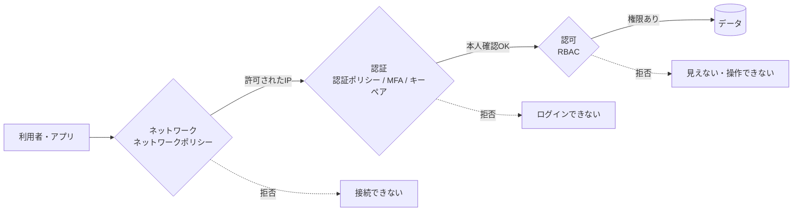
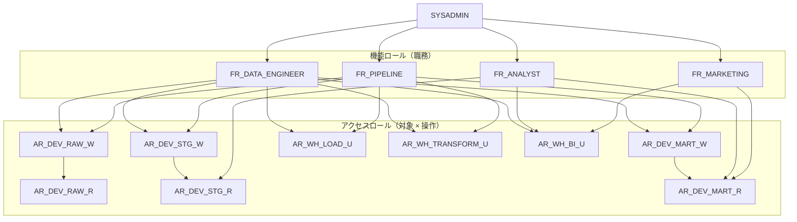

# Step 2 詳細編：セキュリティとアクセス制御

> 学習ロードマップ【全体概要編】の Step 2 を詳しく扱う資料です。
> 構成は「1. 概要 → 2. 概念解説 → 3. ハンズオン → 4. 現場の事例（ケーススタディ） → 5. 考察課題の解答例 → 6. 理解度チェックの解答 → 7. 参考資料」の順です。
> **前提**：Step 1 で作成した `DEV_RAW_DB` / `DEV_STG_DB` / `DEV_MART_DB`、`DEV_LOAD_WH` / `DEV_TRANSFORM_WH` / `DEV_BI_WH`、Snowflake CLI の接続設定 `training` が残っていること。

---

## 1. 概要

### 1.0 この章の物語

> **【場面】5月7日（木）10:20　情報セキュリティ室の打ち合わせスペース（Step 1 の最後の場面の続き）**
>
> 石井さん：「権限の一覧表は来週で結構です。ただ、審査は権限だけではありません。今はパスワードだけで、どこからでもログインできますよね。」
>
> 石井さん：「それから、BI の接続用ユーザー。あれは誰のパスワードで、誰が管理しているんですか？」
>
> 北村部長：「6月1日には本公開したいんだ。間に合う？」
>
> 佐伯さん：「25日から高田さんと森さんに試験公開して、月末に審査、6月1日に本公開。それで行きましょう。公開してから権限を絞ると、必ず『昨日まで見えてたのに』って揉めますから。」

> **【場面】5月7日（木）11:30　データ基盤チームの島**
>
> 佐伯さん：「石井さんの審査項目は、3つに分かれる。誰であるか、どこから来たか、何ができるか。」
>
> あなた：「認証、ネットワーク、認可ですね。今は私も高田さんも `BI_TRIAL_USER` も、全部 SYSADMIN です。」
>
> 佐伯さん：「まずは暫定の SYSADMIN を外せるように、職務ごとのロールを作るところからだね。」

**この章であなたが解決すること**

| 石井さん・周囲からの宿題 | 解決する演習・節 |
| --- | --- |
| 「誰が何を見られるのか」を、設計書として説明できるようにする | 演習 2-1 |
| 設計書どおりに実装されていることを、実際に見せる | 演習 2-2 |
| あなた個人のアカウントで動いている毎日のロードを、パスワードを使わない専用のユーザーに移す | 演習 2-3 |
| 「パスワードだけ」「どこからでも」のログインを塞ぐ | 演習 2-4 |
| 公開後に必ず来る「見えない」問い合わせと、監査の一覧依頼に備える | 演習 2-5 |
| 暫定の SYSADMIN を外し、`BI_TRIAL_USER` をサービスユーザーにするなど、審査の指摘と試験公開中のトラブルに対応する | 第4章（事例 2-A〜2-E） |

### 1.1 このステップのゴール

最小権限の原則に基づき、**「認証（誰であるか）」「ネットワーク（どこから来たか）」「認可（何ができるか）」の3つの防御層**を設計し、SQL として実装できるようになることがゴールです。



### 1.2 到達目標チェックリスト

- [ ] システムロール（ACCOUNTADMIN / SECURITYADMIN / USERADMIN / SYSADMIN / PUBLIC）の役割分担を説明できる
- [ ] 「アクセスロール」と「機能ロール」の2層でロールを設計し、権限マトリクスに落とし込める
- [ ] `GRANT ... ON ALL` と `GRANT ... ON FUTURE` を使い分け、将来作られるオブジェクトの権限まで設計できる
- [ ] 所有権（OWNERSHIP）と、ビューを経由したアクセスの仕組みを説明できる
- [ ] セカンダリロールの挙動を理解し、権限の検証時に正しく無効化できる
- [ ] 人間のユーザーとサービスユーザー（`TYPE = SERVICE`）を区別し、それぞれに適した認証方式を選べる
- [ ] キーペア認証を設定し、鍵のローテーションを実施できる
- [ ] 認証ポリシーで MFA の必須化や認証方式の制限ができる
- [ ] ネットワークルールとネットワークポリシーで接続元を制限できる
- [ ] 権限エラーの原因を `SHOW GRANTS` などで特定できる

### 1.3 所要時間の目安

| パート | 目安 |
| --- | --- |
| 概念解説の読み込み | 4〜5h |
| 演習 2-1（設計） | 2〜3h |
| 演習 2-2〜2-5（実装・検証） | 7〜9h |
| 考察課題・理解度チェック | 2〜3h |
| **合計** | **15〜20h** |

### 1.4 このステップで作るもの



※ 矢印は「上位のロールが下位のロールを継承する」向きです（`GRANT ROLE 下位 TO ROLE 上位`）。

---

## 2. 概念解説

### 2.1 Snowflake のアクセス制御モデル

Snowflake のアクセス制御は、次の2つの考え方を組み合わせたものです。

| モデル | 意味 |
| --- | --- |
| **RBAC（ロールベースアクセス制御）** | 権限はユーザーではなく**ロール**に付与し、ユーザーはロールを通じて権限を得る |
| **DAC（任意アクセス制御）** | すべてのオブジェクトには**所有者（OWNERSHIP を持つロール）**がいて、所有者はそのオブジェクトの権限を他のロールに付与できる |

押さえておくべき用語は次の4つです。

- **セキュリティ保護可能なオブジェクト**：権限を付与できる対象。ウェアハウス、データベース、スキーマ、テーブルなど。
- **権限（Privilege）**：`USAGE`、`SELECT`、`INSERT`、`CREATE TABLE`、`OWNERSHIP` など。
- **ロール**：権限の入れ物。ロールを別のロールに付与すると、**継承（階層）**ができる。
- **ユーザー**：ロールを付与される主体。人間のユーザーとサービスユーザーがある。

> **重要**：テーブルを `SELECT` するには、テーブルへの `SELECT` だけでなく、**親のデータベースとスキーマへの `USAGE`** と、クエリを実行する**ウェアハウスへの `USAGE`** が必要です。権限エラーの多くは、この「親の USAGE」の付け忘れが原因です。

### 2.2 システムロール

| ロール | 役割 | 日常的に使うか |
| --- | --- | --- |
| **ORGADMIN** | 組織レベルの管理（アカウントの作成など） | 使わない |
| **ACCOUNTADMIN** | アカウントの最上位ロール。SYSADMIN と SECURITYADMIN を継承し、課金情報の参照や各種ポリシーの適用も行える | **使わない**（限られた管理者に付与し、MFA を必須にする） |
| **SECURITYADMIN** | `MANAGE GRANTS` 権限を持ち、あらゆるオブジェクトの権限付与・取り消しを行える。USERADMIN を継承する | 権限の管理作業のみ |
| **USERADMIN** | ユーザーとロールの作成・管理 | ユーザー・ロールの管理作業のみ |
| **SYSADMIN** | ウェアハウスやデータベースなど、オブジェクトの作成・管理 | オブジェクトの管理作業 |
| **PUBLIC** | 全ユーザー・全ロールに自動で付与される | ここに権限を付与しない |

**推奨される階層**：独自に作成したロールは、最終的に **SYSADMIN に継承させます**。こうしておくと、SYSADMIN はすべてのオブジェクトを管理できます。逆に、どこにも継承させていない「孤立したロール」があると、そのロールが作ったオブジェクトを管理者が管理できなくなります。

### 2.3 アクセスロールと機能ロールの2層設計

| 層 | 名前の例 | 表すもの | 権限の付け方 |
| --- | --- | --- | --- |
| **アクセスロール** | `AR_DEV_MART_R`（Mart層の読み取り） | 「どのオブジェクトに」「何ができるか」 | オブジェクトの権限を直接付与する |
| **機能ロール** | `FR_ANALYST`（アナリスト） | 「職務」 | アクセスロールを組み合わせて付与する。オブジェクトの権限は直接付与しない |

**2層に分ける利点**

- **組織の変化に強い**：新しい職務ができても、既存のアクセスロールを組み合わせるだけで済む。
- **監査しやすい**：「Mart層を読めるのは誰か」を、`AR_DEV_MART_R` を継承しているロールをたどるだけで答えられる。
- **付与漏れが起きにくい**：新しいテーブルに対する権限は、アクセスロールの FUTURE GRANTS で一元的に管理できる。

> **補足：データベースロール**
> アクセスロールは、アカウントレベルのロールではなく**データベースロール**（`CREATE DATABASE ROLE`）として作ることもできます。データベースロールには、データベースのクローンや共有と一緒に扱えるという利点があります。本教材ではわかりやすさを優先してアカウントロールで実装し、データベースロールは発展課題とします。

### 2.4 ALL と FUTURE のグラント

```sql
-- 既存のオブジェクトすべてに付与する（実行した時点のオブジェクトが対象）
GRANT SELECT ON ALL TABLES IN SCHEMA db.sch TO ROLE r;

-- これから作られるオブジェクトにも自動で付与されるようにする
GRANT SELECT ON FUTURE TABLES IN SCHEMA db.sch TO ROLE r;
```

- 既存のオブジェクトと将来のオブジェクトの両方をカバーするには、**ALL と FUTURE をセットで**実行します。
- FUTURE GRANTS はデータベース単位でもスキーマ単位でも設定できます。ただし、**同じ種類のオブジェクトについて両方が設定されている場合は、スキーマ単位の設定が優先され、データベース単位の設定は無視されます**。これは権限トラブルの典型的な原因の一つです（演習 2-5）。
- FUTURE GRANTS はオブジェクトが**作成されたとき**に適用されます。すでに存在するオブジェクトには、あとから FUTURE GRANTS を設定しても適用されません。

### 2.5 所有権とビューのアクセス

- オブジェクトを作成したロールが、そのオブジェクトの**所有者**になります。所有者は、そのオブジェクトの権限を他のロールに付与できます。
- 所有権は `GRANT OWNERSHIP ... COPY CURRENT GRANTS` で移せます。
- **ビューの参照に必要な権限**：利用者に必要なのは、ビューに対する `SELECT` だけです。ビューが参照している元のテーブルへのアクセス権は、**ビューの所有者**の権限で評価されます。
  - この仕組みを使うと、「Raw層は見せずに、Staging層のビューだけを見せる」といった設計ができます。
  - 定義を利用者に見せたくない場合や、最適化の過程で情報が漏れないようにしたい場合は、**セキュアビュー**（`CREATE SECURE VIEW`）を使います。

#### 管理アクセススキーマ

通常のスキーマでは、オブジェクトの所有者が自由に権限を付与できます。そのため、各自が作ったテーブルの権限がばらばらに管理されやすくなります。`CREATE SCHEMA ... WITH MANAGED ACCESS` で作成した**管理アクセススキーマ**では、権限を付与できるのがスキーマの所有者（と `MANAGE GRANTS` を持つロール）に限られます。そのため、権限の管理を一元化できます。

### 2.6 プライマリロールとセカンダリロール

- **プライマリロール**：`USE ROLE` で指定するロールです。オブジェクトを作成すると、このロールが所有者になります。
- **セカンダリロール**：`USE SECONDARY ROLES ALL` を実行すると、ユーザーに付与されている**他のすべてのロールの権限**も同時に使えるようになります（オブジェクトの作成権限は除く）。
- 新しく作成したユーザーは、デフォルトでセカンダリロールが有効（`DEFAULT_SECONDARY_ROLES = ('ALL')`）になっている場合があります。

> **検証時の注意**：セカンダリロールが有効なまま `USE ROLE FR_MARKETING` に切り替えても、他のロールの権限で「見えてしまう」ことがあります。ロールごとの権限を検証するときは、必ず `USE SECONDARY ROLES NONE;` を実行してください。

### 2.7 ユーザーの種類と認証方式

#### ユーザーの種類（`TYPE` プロパティ）

| TYPE | 対象 | 特徴 |
| --- | --- | --- |
| `PERSON`（または未指定） | 人間 | パスワード、MFA、SSO を使う |
| `SERVICE` | アプリ・パイプライン | パスワードでのログインや MFA はできない。キーペア、OAuth、プログラムアクセストークン（PAT）などを使う |
| `LEGACY_SERVICE` | 移行期間中の旧来のサービス接続 | パスワードの使用が一時的に許される。`SERVICE` への移行を前提とする |

#### 認証方式

| 方式 | 主な用途 | ポイント |
| --- | --- | --- |
| パスワード＋**MFA** | 人間のユーザー | Snowflake はパスワードだけの単一要素ログインを廃止する方針で、パスワードを使うユーザーには MFA が必須になっていく。MFA の方式はパスキー、認証アプリ（TOTP）、Duo |
| **SSO（SAML / OIDC）** | 人間のユーザー（企業での標準的な方式） | 社内の IdP（Entra ID、Okta など）で認証する。SCIM を使うと、ユーザーとグループを IdP から自動でプロビジョニングできる |
| **キーペア認証** | サービスユーザー | RSA 鍵ペアの公開鍵を Snowflake に登録し、秘密鍵で署名した JWT で認証する。鍵は2つまで登録できるため、無停止でローテーションできる |
| **OAuth** | BI ツールなどの外部アプリ | Snowflake OAuth または External OAuth |
| **プログラムアクセストークン（PAT）** | REST API や、キーペアに対応していないツール | 有効期限付きのトークン。ロールを限定でき、サービスユーザーではネットワークポリシーの適用が前提になる |

### 2.8 認証ポリシー

**認証ポリシー**を使うと、アカウント全体またはユーザー単位で、次のような制御ができます。

| パラメータ | 制御の内容 |
| --- | --- |
| `AUTHENTICATION_METHODS` | 許可する認証方式（`PASSWORD`、`SAML`、`OAUTH`、`KEYPAIR`、`PROGRAMMATIC_ACCESS_TOKEN` など） |
| `MFA_ENROLLMENT` | MFA の登録を必須にするかどうか |
| `CLIENT_TYPES` | 接続を許可するクライアント（`SNOWFLAKE_UI`、`SNOWFLAKE_CLI`、`DRIVERS` など） |
| `SECURITY_INTEGRATIONS` | 利用を許可する SSO や OAuth の連携設定 |

- **ユーザー単位のポリシーは、アカウント単位のポリシーより優先されます**。
- MFA の登録は Snowsight でしか行えません。そのため、`MFA_ENROLLMENT = 'REQUIRED'` にする場合は、`CLIENT_TYPES` に `SNOWFLAKE_UI` を含める必要があります。
- `CLIENT_TYPES` による制御はクライアントの自己申告に基づく「ベストエフォート」です。厳密なセキュリティ境界としては扱わないでください。

### 2.9 ネットワークルールとネットワークポリシー

```sql
-- ネットワークルール：許可・拒否する「接続元」を定義する（スキーマレベルのオブジェクト）
CREATE NETWORK RULE db.sch.nr_office MODE = INGRESS TYPE = IPV4 VALUE_LIST = ('203.0.113.0/24');

-- ネットワークポリシー：ルールを束ねて、許可リスト・拒否リストとして使う（アカウントレベルのオブジェクト）
CREATE NETWORK POLICY np_office ALLOWED_NETWORK_RULE_LIST = ('db.sch.nr_office');

-- 適用する（アカウント全体 / ユーザー単位 / セキュリティ連携単位）
ALTER USER some_user SET NETWORK_POLICY = np_office;
```

- ネットワークルールの `TYPE` には、IP アドレス（`IPV4`）のほか、AWS の VPC エンドポイント ID や Azure の Private Endpoint などを指定できます。
- 適用範囲の優先順位は **ユーザー ＞ セキュリティ連携 ＞ アカウント** です。より具体的な範囲の設定が優先されます。
- **アカウント全体へ適用するときの注意**：自分の接続元 IP が許可リストに入っていないと、自分自身も締め出されます。適用する前に、`SELECT CURRENT_IP_ADDRESS();` で自分の IP を確認してください。また、まずユーザー単位で検証してから、アカウント全体に適用します。
- さらに厳しく制御したい場合は、AWS PrivateLink などのプライベート接続を使い、インターネットを経由しない構成にします（概要のみ理解できればよい）。

### 2.10 権限のトラブルシューティング

Snowflake は、権限がないオブジェクトについて「存在しない」と区別のつかないエラーを返します。

```
SQL compilation error: Object 'DEV_RAW_DB.SALES.SALES_ORDERS' does not exist or not authorized.
```

このエラーが出たときは、次の順で確認します。

| 順 | 確認すること | 使うコマンド |
| --- | --- | --- |
| 1 | 今のロール、セカンダリロール、ウェアハウスは何か | `SELECT CURRENT_ROLE(), CURRENT_SECONDARY_ROLES(), CURRENT_WAREHOUSE();` |
| 2 | そのオブジェクトに誰が権限を持っているか | `SHOW GRANTS ON TABLE <name>;` |
| 3 | 今のロールが何を持っているか（継承したロールを含む） | `SHOW GRANTS TO ROLE <role>;` を階層に沿ってたどる |
| 4 | 親のデータベース・スキーマへの USAGE はあるか | `SHOW GRANTS ON SCHEMA <name>;` |
| 5 | FUTURE GRANTS の設定が期待どおりか（スキーマ単位の設定で上書きされていないか） | `SHOW FUTURE GRANTS IN SCHEMA <name>;` / `IN DATABASE <name>;` |
| 6 | ユーザーにそのロールが付与されているか | `SHOW GRANTS TO USER <user>;` |

---

## 3. ハンズオン

各演習は **「手順（コード）」→「確認ポイント」→「考察課題」** の順に進みます。考察課題の解答例は第5章にあります。

### 3.0 環境準備

#### (1) Step 1 の環境を確認する

```sql
USE ROLE SYSADMIN;
SHOW DATABASES LIKE 'DEV_%';      -- DEV_RAW_DB / DEV_STG_DB / DEV_MART_DB
SHOW WAREHOUSES LIKE 'DEV_%';     -- DEV_LOAD_WH / DEV_TRANSFORM_WH / DEV_BI_WH
SHOW VIEWS IN DATABASE DEV_STG_DB; -- V_SALES_ORDERS / V_EVENTS / V_EVENT_ITEMS
```

#### (2) セキュリティ用オブジェクトを置くデータベースを作る

ネットワークルールと認証ポリシーはスキーマレベルのオブジェクトです。業務データとは分けて、管理用のデータベースに置きます。

```sql
USE ROLE SYSADMIN;
CREATE DATABASE IF NOT EXISTS ADMIN_DB COMMENT = 'セキュリティ・ガバナンス用オブジェクト';
CREATE SCHEMA   IF NOT EXISTS ADMIN_DB.SECURITY;

-- スキーマの所有権を SECURITYADMIN に移し、セキュリティ担当が管理する
GRANT USAGE ON DATABASE ADMIN_DB TO ROLE SECURITYADMIN;
GRANT OWNERSHIP ON SCHEMA ADMIN_DB.SECURITY TO ROLE SECURITYADMIN COPY CURRENT GRANTS;

-- 認証ポリシーを適用する権限を SECURITYADMIN に委譲する（ACCOUNTADMIN で実行する）
USE ROLE ACCOUNTADMIN;
GRANT APPLY AUTHENTICATION POLICY ON ACCOUNT TO ROLE SECURITYADMIN;
```

#### (3) 作業ファイルを用意する

この Step では、SQL を次の3つのファイルに分けて管理し、CLI から実行します。

| ファイル | 内容 | 実行するロール |
| --- | --- | --- |
| `02_roles.sql` | ロールの作成、ロール階層の定義、権限の付与 | USERADMIN / SECURITYADMIN |
| `03_users.sql` | ユーザーの作成 | USERADMIN |
| `04_policies.sql` | 認証ポリシー、ネットワークポリシー | SECURITYADMIN |

---

### 演習 2-1：スノー商事向けのロールを設計する

> **【場面】5月8日（金）14:00　ホワイトボードの前**
>
> 森さん：「マーケは30人いるので、全員ダッシュボードが見られればいいです。あ、でも顧客の生データも見られると嬉しいなあ。」
>
> 高田さん：「経営企画は集計済みのデータが中心です。ただ、数字が合わないときに一段手前の Staging も覗きたいんです。」
>
> 佐伯さん：「ここで人ごとにロールを作ると、1年後には誰も説明できなくなる。職務ごとに作ろう。」
>
> 石井さん：「実装の前に、表になった設計書をください。まずそこで合意しましょう。」

**ねらい**：業務要件から、ロールの階層と権限マトリクスを設計する。実装に入る前に、**設計書として合意できる形にする**ことを重視します。

#### 業務要件

スノー商事の情報システム部から、次の要件を受け取りました。

| 利用者 | 人数 | やりたいこと | 制約 |
| --- | --- | --- | --- |
| データエンジニア | 3名 | 全層のテーブルの作成・更新。パイプラインの開発 | — |
| アナリスト | 10名 | Mart層での分析。調査のために Staging層も参照したい | Raw層は見せない（個人情報を含む生データのため） |
| マーケティング担当 | 30名 | BI ツールで Mart層のダッシュボードを見る | 参照のみ。Mart層以外は見せない |
| データパイプライン | 1系統 | 毎日のファイルロード、Staging層・Mart層への変換 | 人間のアカウントを使わない。パスワードを使わない |
| セキュリティ管理者 | 1〜2名 | ユーザーと権限の管理 | 業務データの中身を見る必要はない |

#### 課題

1. 必要な**アクセスロール**と**機能ロール**を洗い出し、命名規則を決める。
2. ロール階層図を描く。
3. 権限マトリクス（機能ロール × 対象 × 権限）を作る。
4. 各機能ロールが**使えるウェアハウス**を決める。

> まず自分で設計してから、次の「設計例」と比較してください。以降の演習は、この設計例に沿って進めます。

#### 設計例

**命名規則**

| 種類 | 形式 | 例 |
| --- | --- | --- |
| アクセスロール（データ） | `AR_<環境>_<層>_<R/W>` | `AR_DEV_MART_R` |
| アクセスロール（ウェアハウス） | `AR_WH_<用途>_U` | `AR_WH_BI_U` |
| 機能ロール | `FR_<職務>` | `FR_ANALYST` |

**アクセスロールの定義**

| アクセスロール | 内容 |
| --- | --- |
| `AR_DEV_<層>_R` | データベース・スキーマの USAGE、テーブル・ビューの SELECT（既存＋将来） |
| `AR_DEV_<層>_W` | `_R` を継承し、それに加えてテーブルの INSERT / UPDATE / DELETE / TRUNCATE、スキーマ内でのテーブル・ビューの作成。Raw層ではステージの READ / WRITE とファイル形式の USAGE も含む |
| `AR_WH_<用途>_U` | ウェアハウスの USAGE |

**権限マトリクス**

| 機能ロール | Raw | Staging | Mart | LOAD_WH | TRANSFORM_WH | BI_WH |
| --- | --- | --- | --- | --- | --- | --- |
| `FR_DATA_ENGINEER` | W | W | W | ○ | ○ | ○ |
| `FR_PIPELINE` | W | W | W | ○ | ○ | — |
| `FR_ANALYST` | — | R | R | — | — | ○ |
| `FR_MARKETING` | — | — | R | — | — | ○ |

※ セキュリティ管理者には独自のロールを作らず、システムロールの `SECURITYADMIN` を付与します。業務データへのアクセス権は持たせません。

#### 考察課題

- **Q2-1a**：`FR_PIPELINE` と `FR_DATA_ENGINEER` は権限がほぼ同じである。それでも別々のロールに分ける理由を説明せよ。
- **Q2-1b**：アナリストが Staging層を参照するとき、Staging層のビューは Raw層のテーブルを参照している。アナリストに Raw層の権限がなくてもビューを参照できるのはなぜか。

---

### 演習 2-2：ロールを実装し、見え方を検証する

> **【場面】5月12日（火）10:00　石井さんとのオンライン会議**
>
> 石井さん：「設計書は了解しました。では、本当にそのとおりになっているか、画面で見せてください。」
>
> あなた：「マーケのロールで Raw 層を……あれ、見えちゃいました。」
>
> 佐伯さん：「セカンダリロールが効いてるね。自分に全部のロールが付いてるから、切らないと検証にならないよ。」
>
> 石井さん：「では、ロールごとの『見える・見えない』を表にして、再現できる手順と一緒に提出してください。高田さんの暫定の SYSADMIN を外すのは、それを確認してからにしましょう。」

**ねらい**：2-1 の設計を再実行可能な SQL として実装し、各ロールで「見える／見えない」を検証する。

#### 手順 A：`02_roles.sql` の作成と実行

```sql
-- 02_roles.sql
-- ============================================================
-- 1. ロールの作成（USERADMIN）
-- ============================================================
USE ROLE USERADMIN;

-- アクセスロール（データ）
CREATE ROLE IF NOT EXISTS AR_DEV_RAW_R;
CREATE ROLE IF NOT EXISTS AR_DEV_RAW_W;
CREATE ROLE IF NOT EXISTS AR_DEV_STG_R;
CREATE ROLE IF NOT EXISTS AR_DEV_STG_W;
CREATE ROLE IF NOT EXISTS AR_DEV_MART_R;
CREATE ROLE IF NOT EXISTS AR_DEV_MART_W;
-- アクセスロール（ウェアハウス）
CREATE ROLE IF NOT EXISTS AR_WH_LOAD_U;
CREATE ROLE IF NOT EXISTS AR_WH_TRANSFORM_U;
CREATE ROLE IF NOT EXISTS AR_WH_BI_U;
-- 機能ロール
CREATE ROLE IF NOT EXISTS FR_DATA_ENGINEER COMMENT = 'データエンジニア';
CREATE ROLE IF NOT EXISTS FR_PIPELINE      COMMENT = 'データパイプライン（サービスユーザー用）';
CREATE ROLE IF NOT EXISTS FR_ANALYST       COMMENT = 'アナリスト';
CREATE ROLE IF NOT EXISTS FR_MARKETING     COMMENT = 'マーケティング担当';

-- ============================================================
-- 2. ロール階層（USERADMIN はロールの所有者なので付与できる）
-- ============================================================
-- W は R を継承する
GRANT ROLE AR_DEV_RAW_R  TO ROLE AR_DEV_RAW_W;
GRANT ROLE AR_DEV_STG_R  TO ROLE AR_DEV_STG_W;
GRANT ROLE AR_DEV_MART_R TO ROLE AR_DEV_MART_W;

-- 機能ロール ← アクセスロール
GRANT ROLE AR_DEV_RAW_W, AR_DEV_STG_W, AR_DEV_MART_W TO ROLE FR_DATA_ENGINEER;
GRANT ROLE AR_WH_LOAD_U, AR_WH_TRANSFORM_U, AR_WH_BI_U TO ROLE FR_DATA_ENGINEER;

GRANT ROLE AR_DEV_RAW_W, AR_DEV_STG_W, AR_DEV_MART_W TO ROLE FR_PIPELINE;
GRANT ROLE AR_WH_LOAD_U, AR_WH_TRANSFORM_U TO ROLE FR_PIPELINE;

GRANT ROLE AR_DEV_STG_R, AR_DEV_MART_R TO ROLE FR_ANALYST;
GRANT ROLE AR_WH_BI_U TO ROLE FR_ANALYST;

GRANT ROLE AR_DEV_MART_R TO ROLE FR_MARKETING;
GRANT ROLE AR_WH_BI_U TO ROLE FR_MARKETING;

-- 機能ロールはすべて SYSADMIN に継承させる（孤立したロールを作らない）
GRANT ROLE FR_DATA_ENGINEER, FR_PIPELINE, FR_ANALYST, FR_MARKETING TO ROLE SYSADMIN;

-- ============================================================
-- 3. オブジェクト権限の付与（SECURITYADMIN：MANAGE GRANTS を持つ）
-- ============================================================
USE ROLE SECURITYADMIN;

-- ---------- ウェアハウス ----------
GRANT USAGE ON WAREHOUSE DEV_LOAD_WH      TO ROLE AR_WH_LOAD_U;
GRANT USAGE ON WAREHOUSE DEV_TRANSFORM_WH TO ROLE AR_WH_TRANSFORM_U;
GRANT USAGE ON WAREHOUSE DEV_BI_WH        TO ROLE AR_WH_BI_U;

-- ---------- 読み取り（R）：Raw / Staging / Mart で同じパターン ----------
-- Raw
GRANT USAGE  ON DATABASE DEV_RAW_DB                       TO ROLE AR_DEV_RAW_R;
GRANT USAGE  ON ALL SCHEMAS    IN DATABASE DEV_RAW_DB     TO ROLE AR_DEV_RAW_R;
GRANT USAGE  ON FUTURE SCHEMAS IN DATABASE DEV_RAW_DB     TO ROLE AR_DEV_RAW_R;
GRANT SELECT ON ALL TABLES     IN DATABASE DEV_RAW_DB     TO ROLE AR_DEV_RAW_R;
GRANT SELECT ON FUTURE TABLES  IN DATABASE DEV_RAW_DB     TO ROLE AR_DEV_RAW_R;
GRANT SELECT ON ALL VIEWS      IN DATABASE DEV_RAW_DB     TO ROLE AR_DEV_RAW_R;
GRANT SELECT ON FUTURE VIEWS   IN DATABASE DEV_RAW_DB     TO ROLE AR_DEV_RAW_R;
-- Staging
GRANT USAGE  ON DATABASE DEV_STG_DB                       TO ROLE AR_DEV_STG_R;
GRANT USAGE  ON ALL SCHEMAS    IN DATABASE DEV_STG_DB     TO ROLE AR_DEV_STG_R;
GRANT USAGE  ON FUTURE SCHEMAS IN DATABASE DEV_STG_DB     TO ROLE AR_DEV_STG_R;
GRANT SELECT ON ALL TABLES     IN DATABASE DEV_STG_DB     TO ROLE AR_DEV_STG_R;
GRANT SELECT ON FUTURE TABLES  IN DATABASE DEV_STG_DB     TO ROLE AR_DEV_STG_R;
GRANT SELECT ON ALL VIEWS      IN DATABASE DEV_STG_DB     TO ROLE AR_DEV_STG_R;
GRANT SELECT ON FUTURE VIEWS   IN DATABASE DEV_STG_DB     TO ROLE AR_DEV_STG_R;
-- Mart
GRANT USAGE  ON DATABASE DEV_MART_DB                      TO ROLE AR_DEV_MART_R;
GRANT USAGE  ON ALL SCHEMAS    IN DATABASE DEV_MART_DB    TO ROLE AR_DEV_MART_R;
GRANT USAGE  ON FUTURE SCHEMAS IN DATABASE DEV_MART_DB    TO ROLE AR_DEV_MART_R;
GRANT SELECT ON ALL TABLES     IN DATABASE DEV_MART_DB    TO ROLE AR_DEV_MART_R;
GRANT SELECT ON FUTURE TABLES  IN DATABASE DEV_MART_DB    TO ROLE AR_DEV_MART_R;
GRANT SELECT ON ALL VIEWS      IN DATABASE DEV_MART_DB    TO ROLE AR_DEV_MART_R;
GRANT SELECT ON FUTURE VIEWS   IN DATABASE DEV_MART_DB    TO ROLE AR_DEV_MART_R;

-- ---------- 書き込み（W）：R に加えて DML とオブジェクト作成 ----------
-- Raw
GRANT INSERT, UPDATE, DELETE, TRUNCATE ON ALL TABLES    IN DATABASE DEV_RAW_DB TO ROLE AR_DEV_RAW_W;
GRANT INSERT, UPDATE, DELETE, TRUNCATE ON FUTURE TABLES IN DATABASE DEV_RAW_DB TO ROLE AR_DEV_RAW_W;
GRANT CREATE TABLE, CREATE VIEW ON ALL SCHEMAS    IN DATABASE DEV_RAW_DB TO ROLE AR_DEV_RAW_W;
GRANT CREATE TABLE, CREATE VIEW ON FUTURE SCHEMAS IN DATABASE DEV_RAW_DB TO ROLE AR_DEV_RAW_W;
GRANT READ, WRITE ON ALL STAGES          IN DATABASE DEV_RAW_DB TO ROLE AR_DEV_RAW_W;
GRANT READ, WRITE ON FUTURE STAGES       IN DATABASE DEV_RAW_DB TO ROLE AR_DEV_RAW_W;
GRANT USAGE       ON ALL FILE FORMATS    IN DATABASE DEV_RAW_DB TO ROLE AR_DEV_RAW_W;
GRANT USAGE       ON FUTURE FILE FORMATS IN DATABASE DEV_RAW_DB TO ROLE AR_DEV_RAW_W;
-- Staging
GRANT INSERT, UPDATE, DELETE, TRUNCATE ON ALL TABLES    IN DATABASE DEV_STG_DB TO ROLE AR_DEV_STG_W;
GRANT INSERT, UPDATE, DELETE, TRUNCATE ON FUTURE TABLES IN DATABASE DEV_STG_DB TO ROLE AR_DEV_STG_W;
GRANT CREATE TABLE, CREATE VIEW ON ALL SCHEMAS    IN DATABASE DEV_STG_DB TO ROLE AR_DEV_STG_W;
GRANT CREATE TABLE, CREATE VIEW ON FUTURE SCHEMAS IN DATABASE DEV_STG_DB TO ROLE AR_DEV_STG_W;
-- Mart
GRANT INSERT, UPDATE, DELETE, TRUNCATE ON ALL TABLES    IN DATABASE DEV_MART_DB TO ROLE AR_DEV_MART_W;
GRANT INSERT, UPDATE, DELETE, TRUNCATE ON FUTURE TABLES IN DATABASE DEV_MART_DB TO ROLE AR_DEV_MART_W;
GRANT CREATE TABLE, CREATE VIEW ON ALL SCHEMAS    IN DATABASE DEV_MART_DB TO ROLE AR_DEV_MART_W;
GRANT CREATE TABLE, CREATE VIEW ON FUTURE SCHEMAS IN DATABASE DEV_MART_DB TO ROLE AR_DEV_MART_W;
```

> Step 3 で Dynamic Tables やタスクを使うようになったら、`CREATE DYNAMIC TABLE` や `CREATE TASK` などの権限を W ロールに追加します。

CLI から実行します。

```bash
snow sql -f 02_roles.sql -c training
```

#### 手順 B：検証用に自分のユーザーへ機能ロールを付与する

```sql
USE ROLE USERADMIN;
SET me = CURRENT_USER();
GRANT ROLE FR_DATA_ENGINEER TO USER IDENTIFIER($me);
GRANT ROLE FR_ANALYST       TO USER IDENTIFIER($me);
GRANT ROLE FR_MARKETING     TO USER IDENTIFIER($me);
GRANT ROLE FR_PIPELINE      TO USER IDENTIFIER($me);
```

#### 手順 C：FUTURE GRANTS の効果を確かめる（データエンジニアとして Mart のテーブルを作る）

```sql
USE ROLE FR_DATA_ENGINEER;
USE SECONDARY ROLES NONE;          -- 必ず実行する（2.6 を参照）
USE WAREHOUSE DEV_TRANSFORM_WH;

CREATE OR REPLACE TABLE DEV_MART_DB.SALES.DAILY_SALES AS
SELECT order_date, channel, store_id,
       SUM(quantity * unit_price) AS sales_amount,
       COUNT(DISTINCT order_id)   AS order_count
FROM DEV_STG_DB.SALES.V_SALES_ORDERS
GROUP BY order_date, channel, store_id;

-- 作成したテーブルの権限を確認する → AR_DEV_MART_R に SELECT が自動で付与されている
SHOW GRANTS ON TABLE DEV_MART_DB.SALES.DAILY_SALES;
```

#### 手順 D：ロールごとの見え方を検証する

次の検証スクリプトを、ロールを切り替えながら実行します。

```sql
-- ===== 検証ブロック（<ROLE> と <WH> を書き換えて実行する） =====
USE ROLE <ROLE>;
USE SECONDARY ROLES NONE;
USE WAREHOUSE <WH>;

SELECT COUNT(*) FROM DEV_RAW_DB.SALES.SALES_ORDERS;           -- (a) Raw テーブル
SELECT COUNT(*) FROM DEV_STG_DB.SALES.V_SALES_ORDERS;         -- (b) Staging ビュー
SELECT COUNT(*) FROM DEV_MART_DB.SALES.DAILY_SALES;           -- (c) Mart テーブル
INSERT INTO DEV_MART_DB.SALES.DAILY_SALES (order_date, channel, store_id, sales_amount, order_count)
  VALUES ('2000-01-01', 'TEST', 'S000', 0, 0);                -- (d) Mart への書き込み
DELETE FROM DEV_MART_DB.SALES.DAILY_SALES WHERE channel = 'TEST';
SHOW DATABASES;                                               -- (e) 見えるデータベース
-- ===== ここまで =====
```

> Snowsight でまとめて実行すると、最初のエラーで止まります。エラーが出ることを想定した文は、1文ずつ選択して実行してください。

| ロール | ウェアハウス |
| --- | --- |
| `FR_DATA_ENGINEER` | `DEV_TRANSFORM_WH` |
| `FR_ANALYST` | `DEV_BI_WH` |
| `FR_MARKETING` | `DEV_BI_WH` |

さらに、ウェアハウスの制限も確認します。

```sql
USE ROLE FR_MARKETING;
USE SECONDARY ROLES NONE;
USE WAREHOUSE DEV_TRANSFORM_WH;    -- エラーになることを確認する
```

#### 確認ポイント

次の期待結果表と、実際の結果が一致することを確認します（○＝成功、×＝エラー）。

| ロール | (a) Raw | (b) Staging | (c) Mart 読み取り | (d) Mart 書き込み | (e) 見えるDB |
| --- | --- | --- | --- | --- | --- |
| `FR_DATA_ENGINEER` | ○ | ○ | ○ | ○ | RAW / STG / MART |
| `FR_ANALYST` | × | ○ | ○ | × | STG / MART |
| `FR_MARKETING` | × | × | ○ | × | MART |

- `02_roles.sql` をもう一度実行してもエラーにならない。

#### 考察課題

- **Q2-2a**：`USE SECONDARY ROLES NONE` を実行せずに `FR_MARKETING` で (a) を実行すると、どうなるか。実際に試し、結果を説明せよ。
- **Q2-2b**：FUTURE GRANTS をデータベース単位で設定した。この方式の利点と、注意すべき点を説明せよ。
- **発展**：アクセスロールをデータベースロール（`CREATE DATABASE ROLE DEV_MART_DB.MART_R` など）で実装し直し、アカウントロール方式との違いをまとめよ。

---

### 演習 2-3：サービスユーザーとキーペア認証

> **【場面】5月14日（木）15:00　審査の2回目**
>
> 石井さん：「ロールの見え方は確認しました。ところで、毎日の売上ロードは誰のアカウントで動いていますか？」
>
> あなた：「……私のアカウントで、SYSADMIN で流しています。」
>
> 石井さん：「では、あなたが異動したら止まりますね。パスワードはどこに書いてありますか？」
>
> 佐伯さん：「前の会社で、辞めた人のアカウントを消したら夜間バッチが全部止まったことがあってね。機械には機械用のユーザーを作ろう。パスワードなしで。」

**ねらい**：パスワードを使わない機械どうしの接続を構成し、鍵を無停止でローテーションする手順を身につける。

#### 手順 A：鍵ペアの生成（ローカル端末）

```bash
mkdir -p ~/.snowflake/keys && cd ~/.snowflake/keys

# 秘密鍵（パスフレーズで暗号化する。本番ではシークレット管理サービスに保管する）
openssl genrsa 2048 | openssl pkcs8 -topk8 -v2 aes-256-cbc -inform PEM -out svc_pipeline_key.p8
# 公開鍵
openssl rsa -in svc_pipeline_key.p8 -pubout -out svc_pipeline_key.pub

chmod 600 svc_pipeline_key.p8

# Snowflake に登録する値（ヘッダー行とフッター行を除いた本体を1行にしたもの）
grep -v "PUBLIC KEY" svc_pipeline_key.pub | tr -d '\n'
```

#### 手順 B：サービスユーザーの作成（`03_users.sql`）

```sql
-- 03_users.sql
USE ROLE USERADMIN;

-- パイプライン用のサービスユーザー
CREATE USER IF NOT EXISTS SVC_PIPELINE
  TYPE              = SERVICE
  DEFAULT_ROLE      = FR_PIPELINE
  DEFAULT_WAREHOUSE = DEV_LOAD_WH
  COMMENT           = 'データパイプライン用。キーペア認証のみ';
GRANT ROLE FR_PIPELINE TO USER SVC_PIPELINE;

-- 公開鍵を登録する（手順 A で出力した文字列を貼り付ける）
ALTER USER SVC_PIPELINE SET RSA_PUBLIC_KEY = 'MIIBIjANBgkqh...（省略）...IDAQAB';

-- 検証用の人間のユーザー（演習 2-4 で使う）
CREATE USER IF NOT EXISTS TRN_ANALYST
  TYPE                    = PERSON
  PASSWORD                = '<十分に強いパスワード>'
  MUST_CHANGE_PASSWORD    = TRUE
  DEFAULT_ROLE            = FR_ANALYST
  DEFAULT_WAREHOUSE       = DEV_BI_WH
  DEFAULT_SECONDARY_ROLES = ()
  EMAIL                   = '<検証に使うメールアドレス>'
  COMMENT                 = '演習用のアナリストユーザー';
GRANT ROLE FR_ANALYST TO USER TRN_ANALYST;
```

登録した公開鍵のフィンガープリントを確認します。

```sql
DESC USER SVC_PIPELINE;   -- RSA_PUBLIC_KEY_FP の値を確認する
```

```bash
# ローカルで計算したフィンガープリントと一致すること
openssl rsa -pubin -in svc_pipeline_key.pub -outform DER | openssl dgst -sha256 -binary | openssl enc -base64
```

#### 手順 C：CLI からキーペア認証で接続する

`~/.snowflake/config.toml` に接続設定を追加します。

```toml
[connections.pipeline]
account          = "<アカウント識別子>"
user             = "SVC_PIPELINE"
authenticator    = "SNOWFLAKE_JWT"
private_key_file = "~/.snowflake/keys/svc_pipeline_key.p8"
role             = "FR_PIPELINE"
warehouse        = "DEV_LOAD_WH"
```

```bash
# パスフレーズは環境変数で渡す（設定ファイルに書かない）
export PRIVATE_KEY_PASSPHRASE='<パスフレーズ>'

snow connection test -c pipeline
snow sql -c pipeline -q "SELECT CURRENT_USER(), CURRENT_ROLE()"

# パイプラインとしてロールの権限でロードできることを確認する（ロード済みのファイルはスキップされ 0 件になる）
snow sql -c pipeline -q "COPY INTO DEV_RAW_DB.SALES.SALES_ORDERS (ORDER_ID, ORDER_DATE, STORE_ID, CHANNEL, CUSTOMER_ID, PRODUCT_ID, QUANTITY, UNIT_PRICE, _SOURCE_FILE, _LOADED_AT) FROM (SELECT \$1,\$2,\$3,\$4,\$5,\$6,\$7,\$8, METADATA\$FILENAME, CURRENT_TIMESTAMP() FROM @DEV_RAW_DB.UTIL.LANDING_STAGE/sales/) FILE_FORMAT = (FORMAT_NAME = 'DEV_RAW_DB.UTIL.FF_CSV')"
```

#### 手順 D：鍵のローテーション（無停止）

Snowflake のユーザーには、公開鍵を2つ（`RSA_PUBLIC_KEY` と `RSA_PUBLIC_KEY_2`）まで登録できます。この仕組みを使い、新旧の鍵を並行して有効にしておく期間を設けることで、接続を止めずに鍵を切り替えられます。

```bash
# 1. 新しい鍵ペアを生成する
openssl genrsa 2048 | openssl pkcs8 -topk8 -v2 aes-256-cbc -inform PEM -out svc_pipeline_key_v2.p8
openssl rsa -in svc_pipeline_key_v2.p8 -pubout -out svc_pipeline_key_v2.pub
chmod 600 svc_pipeline_key_v2.p8
grep -v "PUBLIC KEY" svc_pipeline_key_v2.pub | tr -d '\n'
```

```sql
-- 2. 新しい公開鍵を2つ目の枠に登録する（この時点では新旧どちらの鍵でも接続できる）
USE ROLE USERADMIN;
ALTER USER SVC_PIPELINE SET RSA_PUBLIC_KEY_2 = '<新しい公開鍵>';
```

```bash
# 3. クライアント側の設定を新しい秘密鍵に切り替えて、接続を確認する
#    （config.toml の private_key_file を svc_pipeline_key_v2.p8 に変更する）
snow connection test -c pipeline
```

```sql
-- 4. 古い公開鍵を削除する
ALTER USER SVC_PIPELINE UNSET RSA_PUBLIC_KEY;
DESC USER SVC_PIPELINE;   -- RSA_PUBLIC_KEY_FP が空、RSA_PUBLIC_KEY_2_FP に値がある
```

> 次回のローテーションでは、空いた `RSA_PUBLIC_KEY` の枠に新しい鍵を登録します。つまり、2つの枠を交互に使います。

#### 確認ポイント

- パスワードなしで `SVC_PIPELINE` として接続でき、`CURRENT_ROLE()` が `FR_PIPELINE` になっている。
- ローテーションの途中（手順 D-2 の後）は、新旧どちらの鍵でも接続できる。
- ローテーションの完了後は、古い鍵で接続できない。

#### 考察課題

- **Q2-3a**：サービスユーザーを `TYPE = SERVICE` で作成する利点を説明せよ。
- **Q2-3b**：鍵のローテーション手順を、運用手順書の形式でまとめよ（実施頻度、担当者、手順、切り戻し方法を含める）。
- **発展**：`SVC_PIPELINE` にプログラムアクセストークン（`ALTER USER ... ADD PROGRAMMATIC ACCESS TOKEN`）を発行し、キーペア認証と比べた利点と欠点をまとめよ。サービスユーザーの場合は、トークンの発行と利用にネットワークポリシーが必要になる点に注意すること（演習 2-4 の後に実施するとよい）。

---

### 演習 2-4：認証ポリシーとネットワークポリシー

> **【場面】5月19日（火）9:30　石井さんから届いたチェックリスト**
>
> 石井さん：「残りの審査項目は2つです。人のログインは多要素認証を必須にすること。社外の見知らぬ IP からは接続できないようにすること。」
>
> あなた：「SVC_PIPELINE はもうパスワードなしなので、あとは人のほうですね。」
>
> 佐伯さん：「いきなりアカウント全体にネットワークポリシーを掛けちゃだめだよ。昔それで自分を締め出して、サポートに電話したことがある。」
>
> 佐伯さん：「まずは演習用のユーザーだけで、拒否と許可の両方を確かめよう。」

**ねらい**：「どの認証方式で」「どこから」接続できるかを、ユーザーの種類ごとに制御する。

> **安全のための原則**：この演習では、ポリシーを**演習用のユーザー（`TRN_ANALYST`、`SVC_PIPELINE`）にだけ**適用します。アカウント全体への適用は発展課題とし、自分が締め出されないよう細心の注意を払ってください。

#### 手順 A：自分の接続元 IP を確認する

```sql
SELECT CURRENT_IP_ADDRESS();   -- 以降の <MY_IP> に使う
```

#### 手順 B：ポリシーを作成する（`04_policies.sql`）

```sql
-- 04_policies.sql
USE ROLE SECURITYADMIN;
USE SCHEMA ADMIN_DB.SECURITY;

-- ---------- 認証ポリシー ----------
-- 人間のユーザー用：パスワードを使う場合は MFA を必須にする
CREATE AUTHENTICATION POLICY IF NOT EXISTS AP_HUMAN
  AUTHENTICATION_METHODS = ('PASSWORD', 'SAML')
  MFA_ENROLLMENT         = 'REQUIRED'
  CLIENT_TYPES           = ('SNOWFLAKE_UI', 'SNOWFLAKE_CLI', 'DRIVERS')
  COMMENT                = '人間のユーザー用：MFA必須';

-- サービスユーザー用：キーペアと PAT のみ。Snowsight からのログインは認めない
CREATE AUTHENTICATION POLICY IF NOT EXISTS AP_SERVICE
  AUTHENTICATION_METHODS = ('KEYPAIR', 'PROGRAMMATIC_ACCESS_TOKEN')
  MFA_ENROLLMENT         = 'OPTIONAL'      -- SNOWFLAKE_UI を除外するため OPTIONAL にする
  CLIENT_TYPES           = ('DRIVERS', 'SNOWFLAKE_CLI')
  COMMENT                = 'サービスユーザー用：キーペア/PATのみ';

-- ---------- ネットワークルール ----------
-- 許可する接続元（自分の IP）
CREATE NETWORK RULE IF NOT EXISTS NR_TRAINING_ALLOWED
  MODE = INGRESS TYPE = IPV4
  VALUE_LIST = ('<MY_IP>/32')
  COMMENT = '演習用：許可する接続元';

-- 拒否の挙動を確かめるためのダミー（ドキュメント用の予約アドレス）
CREATE NETWORK RULE IF NOT EXISTS NR_DUMMY_ONLY
  MODE = INGRESS TYPE = IPV4
  VALUE_LIST = ('192.0.2.1/32')
  COMMENT = '演習用：拒否の検証（どこからも接続できない）';

-- ---------- ネットワークポリシー ----------
CREATE NETWORK POLICY IF NOT EXISTS NP_TRAINING
  ALLOWED_NETWORK_RULE_LIST = ('ADMIN_DB.SECURITY.NR_TRAINING_ALLOWED')
  COMMENT = '演習用：自分の IP のみ許可';

CREATE NETWORK POLICY IF NOT EXISTS NP_BLOCK_TEST
  ALLOWED_NETWORK_RULE_LIST = ('ADMIN_DB.SECURITY.NR_DUMMY_ONLY')
  COMMENT = '演習用：拒否の検証';
```

```bash
snow sql -f 04_policies.sql -c training
```

#### 手順 C：拒否されることを確認する

```sql
USE ROLE SECURITYADMIN;
ALTER USER TRN_ANALYST SET NETWORK_POLICY = NP_BLOCK_TEST;
```

ブラウザのシークレットウィンドウで、`TRN_ANALYST` として Snowsight にログインします。**ログインが拒否される**ことを確認してください。

#### 手順 D：許可に切り替え、MFA の登録を求められることを確認する

```sql
USE ROLE SECURITYADMIN;
ALTER USER TRN_ANALYST SET NETWORK_POLICY = NP_TRAINING;
ALTER USER TRN_ANALYST SET AUTHENTICATION POLICY ADMIN_DB.SECURITY.AP_HUMAN;
```

再度 `TRN_ANALYST` でログインします。パスワードの変更と、MFA（パスキーや認証アプリなど）の登録を求められることを確認します。MFA を登録したら、そのままログインを完了させます。

#### 手順 E：サービスユーザーにポリシーを適用する

```sql
USE ROLE SECURITYADMIN;
ALTER USER SVC_PIPELINE SET NETWORK_POLICY = NP_TRAINING;
ALTER USER SVC_PIPELINE SET AUTHENTICATION POLICY ADMIN_DB.SECURITY.AP_SERVICE;
```

```bash
# キーペア認証では引き続き接続できる
snow connection test -c pipeline
```

#### 手順 F：ログイン履歴で結果を確認する

```sql
USE ROLE ACCOUNTADMIN;   -- 監視用のロールは Step 4 で整備する
SELECT event_timestamp, user_name, client_ip, reported_client_type,
       first_authentication_factor, second_authentication_factor,
       is_success, error_code, error_message
FROM TABLE(ADMIN_DB.INFORMATION_SCHEMA.LOGIN_HISTORY_BY_USER(
       USER_NAME => 'TRN_ANALYST', RESULT_LIMIT => 20))
ORDER BY event_timestamp DESC;
```

#### 確認ポイント

- `NP_BLOCK_TEST` を適用している間は、`TRN_ANALYST` でログインできない。ログイン履歴に、失敗したログインとエラーの内容が記録されている。
- `NP_TRAINING` と `AP_HUMAN` を適用した後は、MFA の登録を経てログインできる。ログイン履歴の `second_authentication_factor` に値が入っている。
- `SVC_PIPELINE` は、キーペア認証で接続できる。

#### 考察課題

- **Q2-4a**：`AP_SERVICE` で `CLIENT_TYPES` から `SNOWFLAKE_UI` を外した。この設定の効果と、この設定だけに頼ってはいけない理由を説明せよ。
- **Q2-4b**：アカウント全体にネットワークポリシーを適用するとき、どのような手順で進めれば締め出しを防げるか。
- **発展**：自分以外の管理者と協力し、アカウント全体に `AP_HUMAN` 相当の認証ポリシーを適用する計画を立てよ（対象外にするユーザー、周知の方法、切り戻しの方法を含める）。

---

### 演習 2-5：権限のトラブルシューティング

> **【場面】5月21日（木）16:00　試験公開の直前**
>
> 佐伯さん：「来週から高田さんと森さんが触り始める。公開直後の問い合わせは、9割が『見えない』か『動かない』だよ。」
>
> あなた：「エラーは全部『存在しないか、権限がない』なんですよね。どっちなのか分からない。」
>
> 石井さん：「それと、監査用に、アナリストのロールが実際にアクセスできるものの一覧もください。」
>
> 佐伯さん：「わざと壊して、直す練習をしておこう。手順書にしておけば、夜中に呼ばれても慌てない。」

**ねらい**：典型的な権限トラブルを意図的に起こし、原因を特定する手順を身につける。

#### シナリオ 1：新しいスキーマのテーブルが、アナリストから見えない

データエンジニアが Mart層に新しいスキーマを作りました。そのスキーマの担当者は、よかれと思って、スキーマ単位で FUTURE GRANTS を追加しました。

```sql
-- データエンジニアの作業
USE ROLE FR_DATA_ENGINEER;
USE SECONDARY ROLES NONE;
USE WAREHOUSE DEV_TRANSFORM_WH;
CREATE SCHEMA DEV_MART_DB.MARKETING;

-- セキュリティ管理者が、スキーマ単位の FUTURE GRANTS を追加した
USE ROLE SECURITYADMIN;
GRANT SELECT ON FUTURE TABLES IN SCHEMA DEV_MART_DB.MARKETING TO ROLE FR_MARKETING;

-- データエンジニアがテーブルを作る
USE ROLE FR_DATA_ENGINEER;
CREATE TABLE DEV_MART_DB.MARKETING.CHANNEL_SUMMARY AS
SELECT channel, SUM(sales_amount) AS sales_amount
FROM DEV_MART_DB.SALES.DAILY_SALES GROUP BY channel;

-- アナリストが参照する → エラーになる
USE ROLE FR_ANALYST;
USE SECONDARY ROLES NONE;
USE WAREHOUSE DEV_BI_WH;
SELECT * FROM DEV_MART_DB.MARKETING.CHANNEL_SUMMARY;
```

**課題**：2.10 の手順で原因を特定し、修正せよ。

```sql
-- 調査に使うコマンドの例
USE ROLE SECURITYADMIN;
SHOW GRANTS ON TABLE DEV_MART_DB.MARKETING.CHANNEL_SUMMARY;
SHOW FUTURE GRANTS IN SCHEMA   DEV_MART_DB.MARKETING;
SHOW FUTURE GRANTS IN DATABASE DEV_MART_DB;
```

#### シナリオ 2：「クエリが実行できない」という問い合わせ

新しく入社したマーケティング担当者のために、別の管理者が次のようにロールを作りました。

```sql
USE ROLE USERADMIN;
CREATE ROLE FR_MARKETING_NEW;
GRANT ROLE AR_DEV_MART_R TO ROLE FR_MARKETING_NEW;
SET me = CURRENT_USER();
GRANT ROLE FR_MARKETING_NEW TO USER IDENTIFIER($me);

USE ROLE FR_MARKETING_NEW;
USE SECONDARY ROLES NONE;
SELECT * FROM DEV_MART_DB.SALES.DAILY_SALES LIMIT 10;   -- エラーになる
```

**課題**：原因を特定して修正し、さらに、このロールの作り方に含まれる**設計上の問題を2つ**指摘せよ。

#### シナリオ 3：あるロールが「実質的に」何をできるのかを一覧にする

監査部門から、「`FR_ANALYST` が実際にアクセスできるオブジェクトの一覧を出してほしい」と依頼されました。ロールの継承をたどって一覧にするクエリを作ります。

```sql
USE ROLE ACCOUNTADMIN;   -- ACCOUNT_USAGE の参照に必要（データの反映には最大2時間程度かかる）
WITH RECURSIVE role_tree AS (
  SELECT 'FR_ANALYST'::STRING AS role_name, 0 AS depth
  UNION ALL
  SELECT g.name, rt.depth + 1
  FROM SNOWFLAKE.ACCOUNT_USAGE.GRANTS_TO_ROLES g
  JOIN role_tree rt ON g.grantee_name = rt.role_name
  WHERE g.granted_on = 'ROLE'
    AND g.privilege  = 'USAGE'
    AND g.deleted_on IS NULL
)
SELECT rt.depth, rt.role_name AS via_role,
       g.privilege, g.granted_on, g.table_catalog, g.table_schema, g.name
FROM role_tree rt
JOIN SNOWFLAKE.ACCOUNT_USAGE.GRANTS_TO_ROLES g
  ON g.grantee_name = rt.role_name
WHERE g.deleted_on IS NULL
  AND g.granted_on <> 'ROLE'
ORDER BY rt.depth, via_role, g.granted_on, g.name;
```

**課題**：このクエリの結果に含まれないもの（FUTURE GRANTS、ビューを経由したアクセスなど）を挙げ、監査部門への回答として補足すべき内容をまとめよ。

#### 成果物：権限トラブルの対応手順書

3つのシナリオを踏まえて、次の構成で手順書を作成します。

| 章 | 内容 |
| --- | --- |
| 1. 初動確認 | ロール、セカンダリロール、ウェアハウスの確認 |
| 2. 切り分け | オブジェクト側の権限 → ロール側の権限 → 親オブジェクトの USAGE → FUTURE GRANTS → ユーザーへの付与 |
| 3. よくある原因 | シナリオ 1〜3 で学んだこと |
| 4. 修正の原則 | 機能ロールにオブジェクト権限を直接付与しない、など |

---

### 3.6 後片付け

```sql
-- シナリオ用に作ったオブジェクトを削除する
USE ROLE SYSADMIN;
DROP SCHEMA IF EXISTS DEV_MART_DB.MARKETING;
USE ROLE USERADMIN;
DROP ROLE IF EXISTS FR_MARKETING_NEW;

-- 拒否検証用のポリシーを削除する
USE ROLE SECURITYADMIN;
DROP NETWORK POLICY IF EXISTS NP_BLOCK_TEST;
DROP NETWORK RULE   IF EXISTS ADMIN_DB.SECURITY.NR_DUMMY_ONLY;

-- ロール、ユーザー（SVC_PIPELINE / TRN_ANALYST）、NP_TRAINING、AP_HUMAN、AP_SERVICE は Step 3 以降でも使うため残す
```

> **注意**：自宅や別の拠点など、接続元の IP が変わると、`NP_TRAINING` を適用したユーザーは接続できなくなります。その場合は `NR_TRAINING_ALLOWED` の `VALUE_LIST` を更新してください（`ALTER NETWORK RULE ... SET VALUE_LIST = (...)`）。

---

## 4. 現場の事例（ケーススタディ）

演習で作ったロール・ユーザー・ポリシーの上で、社内公開の前後に実際に起こりがちな出来事を追体験します。審査での指摘から、試験公開（5月25日〜）中の問い合わせ、ヒヤリとするインシデントまでを、「調べる → 原因 → 対処 → 再発防止」の順にたどります。

| 事例 | 種類 | 深刻度 | 関連する節・演習 |
| --- | --- | --- | --- |
| 2-A ACCOUNTADMIN を持つ人が5人いた | セキュリティ・監査 | 高 | 2.2、理解度チェック 問1 |
| 2-B 暫定の SYSADMIN と、残っていたユーザーの棚卸し | セキュリティ・監査 | 高 | 2.2、2.3、2.5、2.7、演習 2-3、演習 2-5 シナリオ 3 |
| 2-C 新しいテーブルだけ、また見えなくなった | 依頼対応 | 中 | 2.4、2.5（管理アクセススキーマ）、演習 2-2、演習 2-5 シナリオ 1 |
| 2-D パイプラインの秘密鍵が Git にコミットされていた | セキュリティ・障害対応 | 高 | 2.7、2.9、演習 2-3 手順 D、演習 2-4 |
| 2-E 在宅勤務の日にログインできない | 障害対応 | 中 | 2.9、演習 2-4、Q2-4b |

---

### 事例 2-A：ACCOUNTADMIN を持つ人が5人いた

> **【事例】5月13日（水）17:40　石井さんからのメール**
>
> 石井さん：「事前チェックで気になった点です。ACCOUNTADMIN ロールを持っているユーザーが5人います。この人数は必要ですか？ 全員 MFA は設定済みですか？」
>
> あなた：「5人……？ 私と佐伯さんしか使っていないはずですが。」
>
> 佐伯さん：「アカウントを開設したときのユーザーが残ってるんじゃないかな。3月に導入支援のベンダーさんが作ったでしょう。」

#### 調べる

まず、ACCOUNTADMIN が「誰に付与されているか」と、「実際に使われているか」を分けて確認します。

```sql
USE ROLE ACCOUNTADMIN;

-- (1) 現時点の付与先（即時に反映される）
SHOW GRANTS OF ROLE ACCOUNTADMIN;

-- (2) 付与先ユーザーの属性（ACCOUNT_USAGE は最大2時間程度遅れて反映される）
SELECT g.grantee_name AS user_name, u.type, u.has_password, u.has_mfa,
       u.default_role, u.last_success_login, g.granted_by, g.created_on
FROM SNOWFLAKE.ACCOUNT_USAGE.GRANTS_TO_USERS g
JOIN SNOWFLAKE.ACCOUNT_USAGE.USERS u
  ON u.name = g.grantee_name AND u.deleted_on IS NULL
WHERE g.role = 'ACCOUNTADMIN'
  AND g.deleted_on IS NULL;

-- (3) 過去30日に ACCOUNTADMIN で実際に何をしたか
SELECT user_name, query_type, COUNT(*) AS query_count, MAX(start_time) AS last_used
FROM SNOWFLAKE.ACCOUNT_USAGE.QUERY_HISTORY
WHERE role_name = 'ACCOUNTADMIN'
  AND start_time >= DATEADD(day, -30, CURRENT_TIMESTAMP())
GROUP BY user_name, query_type
ORDER BY user_name, query_count DESC;
```

調査の結果は、次のとおりでした。

| ユーザー | 状況 | MFA |
| --- | --- | --- |
| あなた | `DEFAULT_ROLE` が ACCOUNTADMIN のまま。ログインすると最初は ACCOUNTADMIN になる | あり |
| 佐伯さん | 管理作業にだけ使っている | あり |
| 北村部長 | 契約時に最初に作られたユーザー。月に1回、請求画面を見るためだけにログインしている | なし |
| `VENDOR_SETUP` | 導入支援ベンダーの共有ユーザー。契約は4月末で終了済み。パスワードのみ | なし |
| 前任の担当者 | 3月までの担当者。4月に営業本部へ異動した | なし |

#### 原因

- アカウント開設時に「とりあえず全員に最上位の権限を」付与し、その後の見直しをしていなかった。
- 「付与されている人」と「使う必要がある人」を区別して管理していなかった。北村部長の目的は請求の確認だけで、ACCOUNTADMIN は過剰だった。
- 退職・異動・契約終了のときに、ロールを外す手順がなかった（事例 2-B につながる）。

#### 対処

ACCOUNTADMIN の付与先を、MFA を設定した**2名**（あなたと佐伯さん）に絞ります。どちらかが不在でも対応できるよう、1名にはしません。

```sql
USE ROLE ACCOUNTADMIN;

-- 不要な付与を外す（ユーザー名は実際のものに置き換える）
REVOKE ROLE ACCOUNTADMIN FROM USER VENDOR_SETUP;
REVOKE ROLE ACCOUNTADMIN FROM USER <前任者のユーザー>;
REVOKE ROLE ACCOUNTADMIN FROM USER KITAMURA;

-- 残す2名も、ログイン直後に最上位ロールにならないようにする
ALTER USER <あなたのユーザー> SET DEFAULT_ROLE = SYSADMIN;
ALTER USER SAEKI              SET DEFAULT_ROLE = SYSADMIN;

-- 反映を確認する
SHOW GRANTS OF ROLE ACCOUNTADMIN;
```

- 北村部長の「請求を見たい」という目的には、ACCOUNTADMIN ではなく、利用状況を参照するための専用の権限（`SNOWFLAKE` データベースのデータベースロールなど）で応えます。コストの見える化は Step 4 で本格的に扱うため、それまでは月次の数字をあなたが報告することで合意しました。
- `VENDOR_SETUP` と前任者のユーザーそのものの扱いは、事例 2-B の棚卸しで決めます。

**緊急用アカウント（ブレークグラス）の考え方**

石井さんとの協議で、将来 SSO を導入することを見越し、IdP の障害時にも入れる緊急用のユーザーを1つ用意する方針にしました。

| 項目 | 方針 |
| --- | --- |
| 目的 | SSO の障害時や、管理者2名がともに対応できないときに限って使う |
| 認証 | SSO に依存しないパスワード＋MFA。資格情報は封印して保管し、開封には2名の立ち会いを必要とする |
| 日常の利用 | しない。`DEFAULT_ROLE` も ACCOUNTADMIN にしない |
| 監視 | このユーザーのログインは、`LOGIN_HISTORY` で毎日確認する（アラートでの自動化は Step 4 以降） |
| 見直し | 使用したら、その都度パスワードを変更し、記録を残す |

#### 再発防止

- 四半期ごとに `SHOW GRANTS OF ROLE ACCOUNTADMIN` / `SECURITYADMIN` の結果を石井さんに提出する。
- 「ACCOUNTADMIN は MFA を設定した2名まで。日常の作業は SYSADMIN / SECURITYADMIN / USERADMIN で行う」を運用ルールとして明文化する。
- 過剰な権限が欲しくなったときは「何をしたいのか」を聞き、目的に合った最小の権限で応える。

#### この事例の学び

- ACCOUNTADMIN は「付けておけば楽」な権限ではなく、漏えい時の被害が最大になる権限です（2.2、理解度チェック 問1）。
- 「付与されているか」は `SHOW GRANTS OF ROLE`、「使われているか」は `QUERY_HISTORY` の `role_name` で確かめ、両方を見て判断します。
- 最上位の権限は「2名以上・MFA 必須・日常では使わない」が基本です。緊急用アカウントは、使わないことと、使われたらわかることをセットで設計します。

---

### 事例 2-B：暫定の SYSADMIN と、残っていたユーザーの棚卸し

> **【事例】5月15日（金）10:00　データ基盤チームの定例**
>
> 石井さん：「ACCOUNTADMIN の件はありがとうございました。ついでに全ユーザーの棚卸しもお願いします。4月に異動した人や、契約が終わった人は残っていませんか？」
>
> 佐伯さん：「演習 2-2 の見え方の確認は済んだから、Step 1 の暫定ルールを終わらせよう。高田さんと `BI_TRIAL_USER` は、まだ SYSADMIN だよね。」
>
> あなた：「はい。しかも `BI_TRIAL_USER` は、パスワードを BI ツールの設定画面に書いたままです。」

#### 調べる

「ユーザーの一覧」「ユーザーに付いているロール」「持ち主のいないオブジェクト」の順に確認します。

```sql
USE ROLE ACCOUNTADMIN;

-- (1) ユーザーの一覧：最後にログインした日時が古い順（ログインしたことがないユーザーが先頭に来る）
SELECT name, type, disabled, has_password, has_mfa, default_role,
       created_on, last_success_login
FROM SNOWFLAKE.ACCOUNT_USAGE.USERS
WHERE deleted_on IS NULL
ORDER BY last_success_login NULLS FIRST;

-- (2) ユーザーに直接付与されているロール
SELECT grantee_name AS user_name, role, granted_by, created_on
FROM SNOWFLAKE.ACCOUNT_USAGE.GRANTS_TO_USERS
WHERE deleted_on IS NULL
ORDER BY user_name, role;

-- (3) 直近のログインの状況（ユーザー・接続元ごと）
SELECT user_name, client_ip, reported_client_type,
       COUNT_IF(is_success = 'YES') AS success_count,
       COUNT_IF(is_success = 'NO')  AS failure_count,
       MAX(event_timestamp)         AS last_attempt
FROM SNOWFLAKE.ACCOUNT_USAGE.LOGIN_HISTORY
WHERE event_timestamp >= DATEADD(day, -60, CURRENT_TIMESTAMP())
GROUP BY user_name, client_ip, reported_client_type
ORDER BY user_name, last_attempt DESC;

-- (4) 誰にも継承されていない独自ロール（孤立したロール）が所有しているテーブル
SELECT t.table_catalog, t.table_schema, t.table_name, t.table_owner
FROM SNOWFLAKE.ACCOUNT_USAGE.TABLES t
WHERE t.deleted IS NULL
  AND t.table_owner NOT IN ('SYSADMIN', 'ACCOUNTADMIN', 'SECURITYADMIN', 'USERADMIN')
  AND NOT STARTSWITH(t.table_owner, 'FR_')
ORDER BY t.table_owner, t.table_catalog, t.table_schema, t.table_name;
```

調査の結果、次のものが見つかりました。

| 対象 | 状況 | 判断 |
| --- | --- | --- |
| `TAKADA` | Step 1 の暫定ルールで SYSADMIN を付けたまま。Raw 層の個人情報まで見られるうえ、テーブルの削除もできる | 機能ロール `FR_ANALYST` に付け替える |
| `BI_TRIAL_USER` | BI ツールの接続用ユーザー。`TYPE` は未指定（人間扱い）で、パスワード認証・SYSADMIN・MFA なし | サービスユーザーにし、専用のロールを作る |
| `VENDOR_SETUP` | 契約は4月末で終了。5月に入ってからのログインはない | 無効化する |
| 前任者のユーザー | 4月に営業本部へ異動。4月後半に1回だけログインがある | 無効化する（本人に利用目的を確認する） |
| ロール `POC_ROLE` | ベンダーが検証用に作ったロール。SYSADMIN に継承されておらず、`POC_DB` とその中のテーブルを所有している | SYSADMIN の管理下に戻す |

#### 原因

- 検証期間の「とりあえず」の設定（ユーザーへの SYSADMIN の付与、人間扱いのままの接続用ユーザー、検証用のロール）が、そのまま残っていた。
- 入社・異動・退職・契約終了のときに、ユーザーとロールを見直す仕組みがなかった。人事の情報と Snowflake のユーザーが連動していない。
- ベンダーが作ったロールを SYSADMIN に継承させていなかったため、そのロールが所有するオブジェクトが管理者の目から外れていた（2.2 の「孤立したロール」）。

#### 対処

```sql
-- (1) 高田さんは、職務に合った機能ロールに付け替える（先に付けてから、SYSADMIN を外す）
USE ROLE USERADMIN;   -- ユーザーの所有者で実行する（ACCOUNTADMIN で作ったユーザーなら ACCOUNTADMIN）
GRANT ROLE FR_ANALYST TO USER TAKADA;
ALTER USER TAKADA SET DEFAULT_ROLE = FR_ANALYST DEFAULT_WAREHOUSE = DEV_BI_WH DEFAULT_SECONDARY_ROLES = ();

USE ROLE SECURITYADMIN;
REVOKE ROLE SYSADMIN FROM USER TAKADA;

-- 試験公開で使い始める森さんは、最初から機能ロールで作る（演習 2-3 の TRN_ANALYST と同じ形）
USE ROLE USERADMIN;
CREATE USER IF NOT EXISTS MORI
  TYPE = PERSON  PASSWORD = '<十分に強いパスワード>'  MUST_CHANGE_PASSWORD = TRUE
  DEFAULT_ROLE = FR_MARKETING  DEFAULT_WAREHOUSE = DEV_BI_WH  DEFAULT_SECONDARY_ROLES = ()
  COMMENT = 'マーケティング部 森さん（5月25日から試験公開）';
GRANT ROLE FR_MARKETING TO USER MORI;

-- (2) 使われていないユーザーは、すぐに削除せず、まず無効化する
USE ROLE USERADMIN;
ALTER USER VENDOR_SETUP          SET DISABLED = TRUE;
ALTER USER <前任者のユーザー>    SET DISABLED = TRUE;

-- (3) 孤立したロールを SYSADMIN の管理下に戻し、中身を確認してから始末を決める
USE ROLE SECURITYADMIN;
GRANT ROLE POC_ROLE TO ROLE SYSADMIN;
SHOW GRANTS TO ROLE POC_ROLE;
```

`BI_TRIAL_USER` は、演習 2-3 の `SVC_PIPELINE` と同じ考え方で、パスワードを使わないサービスユーザーに切り替えます。BI ツール専用の機能ロール `BI_TRIAL_ROLE` を作り、Mart 層の読み取りと BI 用ウェアハウスだけを、アクセスロール経由で与えます。

```sql
-- (4) BI ツール専用の機能ロール（オブジェクト権限は直接付けず、アクセスロールを継承させる）
USE ROLE USERADMIN;
CREATE ROLE IF NOT EXISTS BI_TRIAL_ROLE COMMENT = 'BI ツールの検証用（BI_TRIAL_USER 専用）';
GRANT ROLE AR_DEV_MART_R, AR_WH_BI_U TO ROLE BI_TRIAL_ROLE;
GRANT ROLE BI_TRIAL_ROLE TO ROLE SYSADMIN;          -- 孤立させない
GRANT ROLE BI_TRIAL_ROLE TO USER BI_TRIAL_USER;

-- (5) 公開鍵を登録し、BI ツール側の接続設定をキーペア認証に切り替えて、接続を確認する
ALTER USER BI_TRIAL_USER SET RSA_PUBLIC_KEY = '<BI ツール用の公開鍵>';
ALTER USER BI_TRIAL_USER SET DEFAULT_ROLE = BI_TRIAL_ROLE DEFAULT_WAREHOUSE = DEV_BI_WH;

-- (6) 切り替えを確認できたら、パスワードを消してサービスユーザーにし、SYSADMIN を外す
ALTER USER BI_TRIAL_USER UNSET PASSWORD;
ALTER USER BI_TRIAL_USER SET TYPE = SERVICE;
USE ROLE SECURITYADMIN;
REVOKE ROLE SYSADMIN FROM USER BI_TRIAL_USER;
-- 演習 2-4 で AP_SERVICE を作ったあとに、SVC_PIPELINE と同様に適用する
ALTER USER BI_TRIAL_USER SET AUTHENTICATION POLICY ADMIN_DB.SECURITY.AP_SERVICE;
```

- BI ツールによっては、キーペア認証ではなく OAuth（2.7）での接続が標準になっています。使う BI ツールが対応している方式は、そのツールと Snowflake の公式ドキュメントで確認してください。
- (6) の順番が大切です。BI ツールが新しい方式で接続できることを確かめる前にパスワードを消すと、その瞬間に高田さんたちのダッシュボードが開かなくなります。

- **削除より先に無効化する理由**：無効化したユーザーは、`ALTER USER ... SET DISABLED = FALSE` で元に戻せます。もし何かの処理がそのユーザーで動いていたとしても、影響が出てから戻せます。一定期間（例：30日）何も起きなければ `DROP USER` します。
- **ユーザーを削除してもテーブルは消えない**：Snowflake では、オブジェクトを所有するのはユーザーではなく**ロール**です。`VENDOR_SETUP` を削除しても、`POC_ROLE` や SYSADMIN が所有するオブジェクトは残ります。逆に言えば、「所有しているロール」を管理下に置かない限り、オブジェクトは放置され続けます。
- `POC_DB` の中身が必要なら、所有権を SYSADMIN に移してから `POC_ROLE` を削除します。

```sql
USE ROLE SECURITYADMIN;
GRANT OWNERSHIP ON ALL TABLES IN DATABASE POC_DB TO ROLE SYSADMIN COPY CURRENT GRANTS;
GRANT OWNERSHIP ON ALL SCHEMAS IN DATABASE POC_DB TO ROLE SYSADMIN COPY CURRENT GRANTS;
GRANT OWNERSHIP ON DATABASE POC_DB TO ROLE SYSADMIN COPY CURRENT GRANTS;
-- ビューやステージなど、ほかの種類のオブジェクトも同様に移してから DROP ROLE POC_ROLE; を実行する
```

#### 再発防止

- 人事の異動・退職の連絡（毎月の人事発令）を受けたら、`GRANTS_TO_USERS` と照合してロールを付け替える手順を作る。
- 本公開後は SSO と SCIM でユーザーを IdP から自動で管理する方向で検討する（2.7）。人事システムと連動すれば、退職者の無効化の漏れを防げる。
- 外部の委託先のユーザーには、作成時に `COMMENT` へ契約期限を書き、可能なら有効期限（`DAYS_TO_EXPIRY`）を設定する。
- 独自ロールを作ったら、必ず SYSADMIN に継承させる（2.2）。棚卸しのクエリ (4) を四半期ごとに実行する。

#### この事例の学び

- 棚卸しでは「ユーザー」「ユーザーに付いたロール」「ロールが所有するオブジェクト」の3つを見ます。`USERS`、`GRANTS_TO_USERS`、`LOGIN_HISTORY` を組み合わせると、放置されたユーザーを見つけられます。
- オブジェクトの所有者はロールです（2.1、2.5）。ユーザーを消す前に、そのユーザーが使っていたロールと、そのロールが所有しているものを確認します。
- 検証期間の「とりあえず」は、公開前に必ず片付けます。付けたままの SYSADMIN は、演習 2-2 で作った権限設計をすべて迂回してしまいます。

---

### 事例 2-C：新しいテーブルだけ、また見えなくなった

> **【事例】5月27日（水）9:20　高田さんからのチャット**
>
> 高田さん：「昨日の夕方に見えるようにしてもらった WEEKLY_SALES、今朝また『存在しないか、権限がない』と出ます。DAILY_SALES は普通に見えるんですけど。」
>
> あなた：「今朝、集計を直して作り直したんです……。でも FUTURE GRANTS はデータベース単位で設定してあるから、自動で付くはずなんですが。」
>
> 佐伯さん：「あ。先週、BI ツールの書き戻し機能を試したときに、SALES スキーマにだけ FUTURE GRANTS を足したかも。INSERT だけだから関係ないと思ってたんだけど。」

#### 調べる

演習 2-5 で作った手順書（2.10 の順序）に沿って切り分けます。

```sql
-- (1) 高田さんのロールで再現する（セカンダリロールを必ず切る）
USE ROLE FR_ANALYST;
USE SECONDARY ROLES NONE;
USE WAREHOUSE DEV_BI_WH;
SELECT COUNT(*) FROM DEV_MART_DB.SALES.DAILY_SALES;    -- 見える
SELECT COUNT(*) FROM DEV_MART_DB.SALES.WEEKLY_SALES;   -- エラー

-- (2) オブジェクト側の権限を比べる
USE ROLE SECURITYADMIN;
SHOW GRANTS ON TABLE DEV_MART_DB.SALES.DAILY_SALES;    -- AR_DEV_MART_R に SELECT がある
SHOW GRANTS ON TABLE DEV_MART_DB.SALES.WEEKLY_SALES;   -- AR_DEV_MART_R への SELECT がない。BI_TRIAL_ROLE への INSERT だけがある

-- (3) FUTURE GRANTS を比べる
SHOW FUTURE GRANTS IN DATABASE DEV_MART_DB;
SHOW FUTURE GRANTS IN SCHEMA   DEV_MART_DB.SALES;      -- BI_TRIAL_ROLE への INSERT ON FUTURE TABLES がある
```

昨日の夕方に最初に「見えない」と言われたとき、あなたは原因を調べずに、テーブルの所有者である `FR_DATA_ENGINEER` のまま、応急処置として次の文を実行していました。その場では見えるようになりましたが、今朝 `CREATE OR REPLACE` で作り直したため、この付与は消えていました。

```sql
-- 昨日の応急処置（設計に反する直接付与）
USE ROLE FR_DATA_ENGINEER;
GRANT SELECT ON TABLE DEV_MART_DB.SALES.WEEKLY_SALES TO ROLE FR_ANALYST;
```

#### 原因

| 層 | 何が起きたか |
| --- | --- |
| 直接の原因 | 5月20日に、BI ツールの書き戻し機能を試すため、`BI_TRIAL_ROLE`（事例 2-B で作成）へのスキーマ単位の `INSERT ON FUTURE TABLES` が追加された。**権限の種類（INSERT）も相手のロールも違うのに**、同じ種類のオブジェクト（テーブル）ではスキーマ単位の設定が優先されるため、`DEV_MART_DB.SALES` ではデータベース単位の `AR_DEV_MART_R` / `AR_DEV_MART_W` への FUTURE GRANTS が**適用されなくなった**（2.4） |
| 気づきにくかった理由 | 設定を追加する前からあった `DAILY_SALES` は影響を受けない。ビューも影響を受けない（スキーマ単位で設定したのはテーブルだけのため）。「新しいテーブルだけ見えない」という症状になる |
| 所有権の問題 | 通常のスキーマでは、テーブルの所有者（`FR_DATA_ENGINEER`）が自由に権限を付与できる。そのため、アクセスロールを経由しない付与が、レビューなしで行われていた。また、`CREATE OR REPLACE` で作り直すと、個別の付与は引き継がれない（`COPY GRANTS` を指定しない限り） |

影響は読み取りだけではありません。データベース単位の `AR_DEV_MART_W` への FUTURE GRANTS（INSERT など）も無視されるため、放置していれば、データエンジニアがこのスキーマに作ったテーブルに Step 3 のパイプライン（`FR_PIPELINE`）が書き込もうとしたときに、権限エラーで失敗していたはずです。

#### 対処

```sql
USE ROLE SECURITYADMIN;

-- (1) スキーマ単位の FUTURE GRANTS と、それによって個別に付いた権限を取り消す
REVOKE INSERT ON FUTURE TABLES IN SCHEMA DEV_MART_DB.SALES FROM ROLE BI_TRIAL_ROLE;
REVOKE INSERT ON ALL TABLES    IN SCHEMA DEV_MART_DB.SALES FROM ROLE BI_TRIAL_ROLE;

-- (2) この間に作られたテーブルに、アクセスロールの権限を付け直す
GRANT SELECT ON ALL TABLES IN SCHEMA DEV_MART_DB.SALES TO ROLE AR_DEV_MART_R;
GRANT INSERT, UPDATE, DELETE, TRUNCATE ON ALL TABLES IN SCHEMA DEV_MART_DB.SALES TO ROLE AR_DEV_MART_W;

-- (3) 確認する
SHOW FUTURE GRANTS IN SCHEMA DEV_MART_DB.SALES;        -- 何も返らない
SHOW GRANTS ON TABLE DEV_MART_DB.SALES.WEEKLY_SALES;   -- AR_DEV_MART_R に SELECT がある
```

最後に、`FR_ANALYST` ＋ `USE SECONDARY ROLES NONE` で `WEEKLY_SALES` が見えることを確かめてから、高田さんに連絡しました。BI ツールの書き戻しを本格的に使う場合は、書き戻し専用のスキーマを別に作り、そのスキーマ用のアクセスロールで管理する方針にしました。

#### 再発防止

- Mart 層のスキーマを**管理アクセススキーマ**にし、テーブルの所有者が勝手に権限を付与できないようにする（2.5）。

  ```sql
  USE ROLE SYSADMIN;   -- スキーマの所有者で実行する
  ALTER SCHEMA DEV_MART_DB.SALES ENABLE MANAGED ACCESS;
  ```

- 「スキーマ単位の FUTURE GRANTS は原則として使わない。どうしても必要な場合は、データベース単位で設定しているアクセスロールの分も、同じスキーマに設定する」をルールにする。
- 新しいロールには、オブジェクト権限を直接付けず、アクセスロールを継承させる（2.3）。
- 定期点検として、全スキーマで `SHOW FUTURE GRANTS IN SCHEMA` を実行し、想定外の設定がないか確認する。

#### この事例の学び

- 「昨日までのものは見える、新しいものだけ見えない」は、FUTURE GRANTS を疑うサインです。スキーマ単位の設定がデータベース単位の設定を黙って無効にします（2.4、演習 2-5 シナリオ 1）。
- 通常のスキーマでは、所有者なら誰でも権限を付与できます。一元管理したいスキーマは管理アクセススキーマにします（2.5）。
- 応急処置で直接付与すると、その場は解決しても、作り直したときに消えたり、監査の一覧から漏れたりします。直すときは「設計どおりの形」に戻します。

---

### 事例 2-D：パイプラインの秘密鍵が Git にコミットされていた

> **【事例】5月28日（木）13:15　佐伯さんからの電話**
>
> 佐伯さん：「ロードスクリプトのリポジトリを見てたら、`keys/svc_pipeline_key_v2.p8` と `.env` が入ってる。`.env` にはパスフレーズも書いてあるよ。」
>
> あなた：「検証のときにスクリプトの隣にコピーして……`.gitignore` に入れ忘れました。」
>
> 佐伯さん：「リポジトリは情報システム部の全員が見られる。漏れたものとして扱おう。まず鍵を替えて、それから誰かが使っていないかを見る。」

#### 調べる

調査より先に鍵を替えるのが原則ですが、「どの鍵が漏れたか」だけは最初に確かめます。演習 2-3 のローテーション後なので、今使っている鍵は `RSA_PUBLIC_KEY_2` の枠にあるはずです。

```bash
# コミットされた秘密鍵から公開鍵のフィンガープリントを計算する
openssl rsa -in keys/svc_pipeline_key_v2.p8 -pubout -outform DER | openssl dgst -sha256 -binary | openssl enc -base64
```

```sql
USE ROLE USERADMIN;
DESC USER SVC_PIPELINE;   -- RSA_PUBLIC_KEY_2_FP の値と一致する → 現在有効な鍵が漏れている
```

鍵を替えた後（対処の後）で、不審な接続がなかったかを確認します。

```sql
USE ROLE ACCOUNTADMIN;

-- (1) 直近の接続元（最新の数時間分は INFORMATION_SCHEMA の LOGIN_HISTORY_BY_USER で補う）
SELECT client_ip, reported_client_type, first_authentication_factor, is_success,
       COUNT(*) AS attempts, MIN(event_timestamp) AS first_seen, MAX(event_timestamp) AS last_seen
FROM SNOWFLAKE.ACCOUNT_USAGE.LOGIN_HISTORY
WHERE user_name = 'SVC_PIPELINE'
  AND event_timestamp >= DATEADD(day, -7, CURRENT_TIMESTAMP())
GROUP BY client_ip, reported_client_type, first_authentication_factor, is_success
ORDER BY last_seen DESC;

-- (2) SVC_PIPELINE が実行したクエリに、いつもと違うものがないか
SELECT start_time, role_name, warehouse_name, query_type, LEFT(query_text, 100) AS query_head
FROM SNOWFLAKE.ACCOUNT_USAGE.QUERY_HISTORY
WHERE user_name = 'SVC_PIPELINE'
  AND start_time >= DATEADD(day, -7, CURRENT_TIMESTAMP())
ORDER BY start_time DESC;
```

結果、接続元は演習 2-4 で許可した IP だけで、クエリもいつもの `COPY INTO` だけでした。演習 2-4 で `SVC_PIPELINE` に適用したネットワークポリシー `NP_TRAINING` により、仮に鍵を持ち出されても、許可していない場所からは接続できない状態だったことも確認できました。

#### 原因

- 秘密鍵とパスフレーズを、リポジトリの作業ディレクトリに置いていた。演習 2-3 では `~/.snowflake/keys` に置く手順だったが、スクリプトの動作確認のためにコピーしていた。
- `.gitignore` に鍵ファイル（`*.p8`）や `.env` が含まれていなかった。
- コミット前に秘密情報を検出する仕組みがなかった。

#### 対処

演習 2-3 の手順 D と同じ「2つの枠」の仕組みを使います。今回は空いている `RSA_PUBLIC_KEY` の枠に新しい鍵を登録し、切り替えが済みしだい、漏れた鍵をすぐに削除します。通常のローテーションとの違いは、**新旧の鍵を並行して有効にしておく期間を、数日ではなく数分にする**ことです。

```bash
# 1. 新しい鍵ペアを、リポジトリの外で生成する
cd ~/.snowflake/keys
openssl genrsa 2048 | openssl pkcs8 -topk8 -v2 aes-256-cbc -inform PEM -out svc_pipeline_key_v3.p8
openssl rsa -in svc_pipeline_key_v3.p8 -pubout -out svc_pipeline_key_v3.pub
chmod 600 svc_pipeline_key_v3.p8
grep -v "PUBLIC KEY" svc_pipeline_key_v3.pub | tr -d '\n'
```

```sql
-- 2. 空いている1つ目の枠に新しい公開鍵を登録する
USE ROLE USERADMIN;
ALTER USER SVC_PIPELINE SET RSA_PUBLIC_KEY = '<新しい公開鍵 v3>';
```

```bash
# 3. config.toml の private_key_file を svc_pipeline_key_v3.p8 に変え、新しいパスフレーズで接続を確認する
export PRIVATE_KEY_PASSPHRASE='<新しいパスフレーズ>'
snow connection test -c pipeline
```

```sql
-- 4. 漏れた鍵をすぐに削除する
ALTER USER SVC_PIPELINE UNSET RSA_PUBLIC_KEY_2;
DESC USER SVC_PIPELINE;   -- RSA_PUBLIC_KEY_FP に値があり、RSA_PUBLIC_KEY_2_FP が空
```

- **不正利用の形跡があった場合**は、切り替えを待たずに `ALTER USER SVC_PIPELINE UNSET RSA_PUBLIC_KEY_2;`（必要なら `SET DISABLED = TRUE`）を先に実行します。パイプラインが止まっても、漏れた鍵で接続され続けるよりはましです。
- Git の履歴からファイルを消す作業もしますが、**履歴を消しても「漏れなかったこと」にはなりません**。クローン済みの端末に残っている可能性があるため、鍵を替えることが本当の対処です。
- 石井さんに、発生から対処完了までの時刻と、調査結果（不審な接続なし）を報告しました。

#### 再発防止

- `.gitignore` に `*.p8`、`*.pem`、`.env` を追加し、コミット前に秘密情報を検出するツール（pre-commit フックなど）を導入する。
- 秘密鍵とパスフレーズは、シークレット管理サービスに保管する。パイプラインの実行環境は Step 3 で整備するため、そのときに鍵の置き場所も決める。
- Q2-3b の運用手順書に「漏えい時の手順（並行期間を最小にする）」を追記する。
- サービスユーザーにはネットワークポリシーを必ず適用する。今回被害が出なかったのは、この「2つ目の壁」があったからです。

#### この事例の学び

- `RSA_PUBLIC_KEY` と `RSA_PUBLIC_KEY_2` の2つの枠は、定期ローテーションだけでなく、緊急時の即時切り替えにも使えます（2.7、演習 2-3 手順 D）。
- 漏えいが疑われたら「まず鍵を替える、次に使われていないかを調べる」の順です。調べるには `LOGIN_HISTORY`（接続元）と `QUERY_HISTORY`（操作の内容）を使います。
- 認証（鍵）が破られても、ネットワーク（接続元の制限）で止められます。防御の層を重ねる意味は、こういうときにわかります（1.1、2.9）。

---

### 事例 2-E：在宅勤務の日にログインできない

> **【事例】5月29日（金）9:05　森さんからのチャット**
>
> 森さん：「今日は在宅なんですが、Snowflake にログインできません。昨日、会社からは普通に使えたのに。」
>
> あなた：「VPN はつないでいますか？」
>
> 森さん：「つないでます！ メールも社内ポータルも見られますよ。」

試験公開では、石井さんとの合意に基づき、試験公開の利用者にユーザー単位のネットワークポリシーを適用していました。

```sql
-- 5月25日の試験公開時に適用した設定（抜粋）
USE ROLE SECURITYADMIN;
CREATE NETWORK RULE ADMIN_DB.SECURITY.NR_OFFICE
  MODE = INGRESS TYPE = IPV4
  VALUE_LIST = ('203.0.113.0/24')
  COMMENT = '本社・支店の出口 IP';
CREATE NETWORK POLICY NP_OFFICE
  ALLOWED_NETWORK_RULE_LIST = ('ADMIN_DB.SECURITY.NR_OFFICE');
ALTER USER TAKADA SET NETWORK_POLICY = NP_OFFICE;
ALTER USER MORI   SET NETWORK_POLICY = NP_OFFICE;
```

#### 調べる

```sql
USE ROLE SECURITYADMIN;

-- (1) 森さんのユーザーに、どのネットワークポリシーが効いているか
SHOW PARAMETERS LIKE 'NETWORK_POLICY' IN USER MORI;

-- (2) 許可している接続元
DESC NETWORK RULE ADMIN_DB.SECURITY.NR_OFFICE;

-- (3) 失敗したログインの接続元とエラーの内容
USE ROLE ACCOUNTADMIN;
SELECT event_timestamp, client_ip, reported_client_type, is_success, error_code, error_message
FROM TABLE(ADMIN_DB.INFORMATION_SCHEMA.LOGIN_HISTORY_BY_USER(
       USER_NAME => 'MORI', RESULT_LIMIT => 20))
ORDER BY event_timestamp DESC;
```

ログイン履歴の `client_ip` は、オフィスの IP でも、社内ネットワーク担当に確認した VPN の出口 IP でもなく、**森さんの自宅のインターネット回線の IP** でした。エラーの内容も、ネットワークポリシーによる拒否を示していました。

#### 原因

- 許可リストに、オフィスの出口 IP しか登録していなかった（VPN の出口 IP が抜けていた）。
- さらに、スノー商事の VPN は**スプリットトンネル**（社内向けの通信だけを VPN に通し、インターネット上のサービスへの通信は自宅の回線から直接出す方式）だった。そのため、VPN をつないでいても、Snowflake への通信は自宅の IP から出ていた。
- 試験公開の前に、在宅勤務の経路で接続を試していなかった（Q2-4b の手順 1「接続元の洗い出し」が不十分だった）。

#### 対処

1. 社内ネットワーク担当に依頼し、Snowflake のアカウントのドメインへの通信を VPN 経由にしてもらう。
2. VPN の出口 IP を許可リストに追加する。**`SET VALUE_LIST` はリスト全体の置き換え**なので、既存のオフィスの IP も必ず含めます。

```sql
USE ROLE SECURITYADMIN;
ALTER NETWORK RULE ADMIN_DB.SECURITY.NR_OFFICE
  SET VALUE_LIST = ('203.0.113.0/24', '198.51.100.8/29');   -- オフィス ＋ VPN の出口
ALTER NETWORK RULE ADMIN_DB.SECURITY.NR_OFFICE
  SET COMMENT = '本社・支店・VPN の出口 IP（2026-05-29 VPN を追加）';
DESC NETWORK RULE ADMIN_DB.SECURITY.NR_OFFICE;
```

3. 経路の変更が済むまでの当日は、森さんに出社してもらうことで合意しました。**自宅の IP を許可リストに足すことはしません**。自宅の回線の IP は変わることが多く、また、個人の回線を「社内」と同じ扱いにすることになるためです。

**「例外ユーザー」を作りたくなったら**

外出の多い営業担当など、「VPN を使えない人だけ別扱いにしたい」という要望は、今後も出てきます。ネットワークポリシーはユーザー単位の設定がアカウント単位の設定より優先されるため（2.9）、例外用のポリシーを作ってそのユーザーに適用すれば実現はできます。ただし、次の点に注意します。

| 注意点 | 内容 |
| --- | --- |
| 置き換えであって追加ではない | ユーザー単位のポリシーを適用すると、そのユーザーにはアカウント単位のポリシーが**まったく適用されなくなる**。例外用のポリシーにも、オフィスや VPN の IP を含める必要がある |
| 例外は弱い部分になる | 接続元の制限を緩める代わりに、MFA の必須化（`AP_HUMAN`）を必ず組み合わせる |
| 期限と記録 | 誰を、なぜ、いつまで例外にしたのかを記録し、棚卸し（事例 2-B）の対象にする |

#### 再発防止

- 本公開の前に、オフィス・VPN（在宅）・BI ツールのサーバーなど、**すべての接続経路から実際にログインを試す**チェックリストを作る。
- 許可している IP とその理由を、ネットワークルールの `COMMENT` と設計書の両方に記録する。
- 利用者向けの案内に「ログインできないときは、接続元の IP（ブラウザで確認できるもの）を添えて連絡してください」と書いておく。

#### この事例の学び

- 「VPN をつないでいる」ことと「Snowflake への通信が VPN の出口から出ている」ことは別です。ログイン履歴の `client_ip` で、実際の接続元を確かめます（2.9、演習 2-4 手順 F）。
- `ALTER NETWORK RULE ... SET VALUE_LIST` はリスト全体を置き換えます。既存の許可先を消して、別の誰かを締め出さないようにします。
- ユーザー単位のポリシーは、アカウント単位のポリシーを「上書き」します。例外を作るときは、弱くなった分を認証（MFA）で補い、期限を決めます。

---

## 5. 考察課題の解答例

### 演習 2-1

**Q2-1a（解答例）**
権限の内容が同じでも、**利用する主体と運用が異なる**ためです。
- **監査**：クエリ履歴やアクセス履歴で、人間の操作と自動処理を区別できる。
- **将来の差分**：パイプラインは BI 用のウェアハウスを使わない。今後、エンジニアにだけ開発用スキーマの権限を追加する、といった違いも生じる。
- **影響の分離**：エンジニアのロールを変更しても、本番のパイプラインが止まらない。
- **トークンの制限**：PAT の `ROLE_RESTRICTION` で、パイプラインが使えるロールを1つに固定できる。

**Q2-1b（解答例）**
ビューを参照するときに利用者に必要なのは、ビューへの `SELECT` と、親のデータベース・スキーマへの `USAGE` だけです。ビューが参照している Raw層のテーブルへのアクセス権は、**ビューの所有者（SYSADMIN）の権限**で評価されます。そのため、アナリストは Raw層を直接見られないまま、加工済みのビューを通じてデータを利用できます。一方で、ビューの所有者が誰であるかは重要になります。所有者が持つ権限の範囲で、ビューを作れば何でも見せられてしまうためです。ビューの作成権限を誰に与えるかは慎重に決めます。

### 演習 2-2

**Q2-2a（解答例）**
セカンダリロールが有効（`ALL`）な状態だと、ユーザーに付与されている `FR_DATA_ENGINEER` の権限も合わせて評価されます。そのため、`FR_MARKETING` に切り替えていても Raw層を参照**できてしまいます**。これを知らずに検証すると、「権限設計が正しくない」と誤って判断したり、逆に「問題ない」と見逃したりします。ロールの権限を検証するときは、必ずセカンダリロールを無効にします。

**Q2-2b（解答例）**
- **利点**：データベースの中にスキーマを追加しても、スキーマごとに設定し直さずに済む。
- **注意点**：
  - スキーマ単位で FUTURE GRANTS を1つでも設定すると、同じ種類のオブジェクトについてはデータベース単位の設定が**そのスキーマでは無効になる**（演習 2-5 シナリオ 1）。
  - FUTURE GRANTS は既存のオブジェクトには適用されないため、ALL とセットで実行する必要がある。
  - 機密性の高いスキーマを追加した場合でも、自動で参照可能になってしまう。そのようなスキーマは、別のデータベースに分けるか、管理アクセススキーマにして個別に管理する。

### 演習 2-3

**Q2-3a（解答例）**
- パスワードでのログインや、Snowsight からのログインができなくなる。そのため、「人間がサービスアカウントを借りて操作する」ことを防げる。
- MFA の対象外になるため、自動処理が MFA のプロンプトで止まることがない。
- アカウントの中で、人間のユーザーとサービスユーザーを区別して管理・監査できる。
- パスワードだけの認証を廃止する方針とも整合する。

**Q2-3b（解答例：要点）**

| 項目 | 内容 |
| --- | --- |
| 実施頻度 | 90日ごと（社内のセキュリティ規程に従う）。秘密鍵が漏えいした疑いがあるときは即時 |
| 担当 | 鍵の生成と保管：パイプラインの運用担当。公開鍵の登録：USERADMIN |
| 手順 | ① 新しい鍵ペアを生成 → ② 空いている枠に公開鍵を登録 → ③ シークレット管理サービスの秘密鍵を更新し、接続を確認 → ④ 古い公開鍵を削除 → ⑤ `DESC USER` でフィンガープリントを記録 |
| 切り戻し | ④の前であれば、クライアントの設定を古い秘密鍵に戻すだけで済む。④の後に問題が見つかった場合は、古い公開鍵を再登録する（そのため、古い秘密鍵は一定期間保管してから破棄する） |

### 演習 2-4

**Q2-4a（解答例）**
Snowsight からのログインが拒否されるため、サービスユーザーを人間が対話的に使うことを防ぐ効果があります。ただし、`CLIENT_TYPES` はクライアントが自己申告する情報に基づいて判定する**ベストエフォート**の仕組みです。偽装される可能性があるため、これだけに頼ってはいけません。実際の防御は、`AUTHENTICATION_METHODS` でパスワードを除外すること（キーペアの秘密鍵がなければ認証できない状態にすること）、ネットワークポリシーで接続元を限定することと組み合わせて成り立ちます。

**Q2-4b（解答例）**
1. 利用中の接続元（オフィス、VPN、BI ツールや ETL ツールのサーバー、クラウドサービスの送信元 IP など）を洗い出す。ログイン履歴の `client_ip` を集計すると漏れを防げる。
2. 許可リストのネットワークルールを作成し、まず演習用のユーザーや一部のユーザーに適用して検証する。
3. `ACCOUNTADMIN` を持つ別のセッションを開いたままにして、アカウントに適用する。
4. 適用した後に、各経路からの接続を確認する。問題があれば、開いておいたセッションから `ALTER ACCOUNT UNSET NETWORK_POLICY` で切り戻す。
5. 特定のユーザーだけ例外にする必要がある場合は、ユーザー単位のネットワークポリシー（アカウント単位より優先される）で対応する。

### 演習 2-5

**シナリオ 1（解答例）**
- **原因**：スキーマ `DEV_MART_DB.MARKETING` に、スキーマ単位の `FUTURE TABLES` のグラントが設定されました。そのため、このスキーマでは、データベース単位の `GRANT SELECT ON FUTURE TABLES IN DATABASE DEV_MART_DB TO ROLE AR_DEV_MART_R` が適用されませんでした。`SHOW GRANTS ON TABLE` を実行すると、`AR_DEV_MART_R` への SELECT がないことがわかります。
- **修正**：
  ```sql
  USE ROLE SECURITYADMIN;
  REVOKE SELECT ON FUTURE TABLES IN SCHEMA DEV_MART_DB.MARKETING FROM ROLE FR_MARKETING;
  GRANT  SELECT ON ALL TABLES    IN SCHEMA DEV_MART_DB.MARKETING TO ROLE AR_DEV_MART_R;
  ```
  既存のテーブルには ALL で付与し直します。スキーマ単位の FUTURE GRANTS がなくなれば、以降に作られるテーブルには、データベース単位の設定が再び適用されます。あわせて、「機能ロールにオブジェクト権限を直接付与しない」というルールを周知します。

**シナリオ 2（解答例）**
- **原因**：`FR_MARKETING_NEW` にウェアハウスの USAGE（`AR_WH_BI_U`）が付与されていません。そのため、クエリを実行するウェアハウスがありません。修正するには、`GRANT ROLE AR_WH_BI_U TO ROLE FR_MARKETING_NEW;` を実行します。
- **設計上の問題**：
  1. 既存の `FR_MARKETING` と同じ職務なのに、新しい機能ロールを作っている。ロールは職務ごとに作り、人ごとには作らない。新入社員には既存の `FR_MARKETING` を付与すべき。
  2. 作成したロールを SYSADMIN に継承させておらず、孤立したロールになっている。

**シナリオ 3（解答例）**
`GRANTS_TO_ROLES` からわかるのは「現時点で明示的に付与されている権限」だけです。次の点を補足して回答します。
- **FUTURE GRANTS**：今後作られるオブジェクトにも自動で権限が付与される。`SHOW FUTURE GRANTS IN DATABASE` の結果を添付する。
- **ビューを経由したアクセス**：Staging層のビューを通じて、間接的に Raw層のデータを参照できる。どのビューがどのテーブルを参照しているかは、オブジェクトの依存関係（Step 4）で補足する。
- **ユーザーの側の要因**：セカンダリロールによって、そのロールを持つユーザーが他のロールの権限も同時に使える場合がある。
- **反映の遅延**：`ACCOUNT_USAGE` のデータは最大で約2時間遅れて反映される。直前に変更した権限は含まれていない可能性がある。
- **行・列の制御**：マスキングポリシーや行アクセスポリシーによって、実際に見えるデータがさらに絞られる（Step 4 で導入する）。

---

## 6. 理解度チェックの解答

**問1**：ACCOUNTADMIN を日常業務で使ってはいけない理由と、代わりに使うべきロールを答えよ。

> ACCOUNTADMIN は、課金情報やすべてのオブジェクト、セキュリティ設定まで操作できる最上位のロールです。誤操作や認証情報の漏えいが起きたときの被害が最も大きくなります。また、ACCOUNTADMIN で作ったオブジェクトは ACCOUNTADMIN が所有することになり、他の管理者が扱いにくくなります。日常業務では、作業の内容に応じて次のロールを使い分けます。
> - オブジェクトの管理：`SYSADMIN`
> - 権限の管理：`SECURITYADMIN`
> - ユーザー・ロールの管理：`USERADMIN`
> - 業務データの操作：各機能ロール
>
> ACCOUNTADMIN は2名以上の限られた管理者にだけ付与し、MFA を必須にします。

**問2**：アクセスロールと機能ロールを分けると、組織の変更時にどのような利点があるか。

> 組織の変更は、「職務が変わる・増える」という形で起こることがほとんどです。2層に分けておけば、新しい職務には既存のアクセスロールを組み合わせた機能ロールを作るだけで済み、オブジェクトの権限を1つずつ付け直す必要がありません。異動した人については、機能ロールの付与を付け替えるだけで済みます。また、「このデータにアクセスできるのは誰か」を、アクセスロールを継承しているロールをたどるだけで答えられるため、組織が変わっても監査の手順は変わりません。

**問3**：サービスユーザーにパスワード認証ではなくキーペア認証を使う理由を説明せよ。

> パスワードは推測や使い回し、フィッシングによって漏えいしやすいです。また、自動処理では MFA の追加認証に応答できないため、パスワードだけの単一要素認証になってしまいます。キーペア認証では、秘密鍵そのものがネットワークを流れることはなく、秘密鍵で署名したトークンで認証します。そのため、強度の高い認証を自動処理でも実現できます。さらに、公開鍵を2つまで登録できるため、接続を止めずに鍵をローテーションでき、定期的な更新を運用に組み込みやすいという利点もあります。

---

## 7. 参考資料

ロードマップのソース番号に対応する Snowflake 公式ドキュメントです。

| 番号 | ドキュメント | 関連する節 |
| --- | --- | --- |
| 85 | アクセス制御の概要 | 2.1、2.2 |
| 112 | セキュリティ > アクセス制御 | 2.1〜2.6 |
| 1 | アクセス制御権限 | 2.1、演習2-2 |
| 102 | アクセス制御の構成 | 2.3、2.4、演習2-2 |
| 68 | アクセス制御のベストプラクティス | 2.3、演習2-1 |
| 106 | ビュー > セキュアビュー | 2.5 |
| 90 | アクセス制御の問題のトラブルシューティング | 2.10、演習2-5 |
| 63 | 認証 > Snowflake認証の概要 | 2.7 |
| 95 | 認証 > 多要素認証（MFA） | 2.7、演習2-4 |
| 107 | 認証 > 認証ポリシー | 2.8、演習2-4 |
| 53 | 認証 > フェデレーション認証および SSO | 2.7 |
| 99 | 認証 > OAuth | 2.7 |
| 110 | 認証 > キーペア認証およびローテーション | 2.7、演習2-3 |
| 30 | 認証 > プログラムアクセストークン | 2.7、演習2-3 発展 |
| 21 | 認証 > ワークロードIDフェデレーション | 2.7（発展：クラウドのIDを使ったサービス認証） |
| 108 | 認証 > API 認証およびシークレット | 演習2-3（シークレット管理） |
| 5 | 管理および承認 > SCIM サポート | 2.7 |
| 98 | 管理および承認 > セッションおよびセッションポリシー | 発展（アイドルタイムアウトの設定） |
| 100 | ネットワークセキュリティ > ネットワークポリシー | 2.9、演習2-4 |
| 101 | ネットワークセキュリティ > ネットワークルール | 2.9、演習2-4 |
| 19 | ネットワークセキュリティ > Network policy advisor | 演習2-4 Q2-4b（許可リストの作成支援） |
| 72 | ネットワークセキュリティ > 悪意のある IP 保護 | 2.9 |
| 97, 8 | プライベート接続（インバウンド / アウトバウンド） | 2.9 |
| 16 | 暗号化 | 補足（保存時・転送時の暗号化は既定で有効） |
| 104, 103 | Snowflake のセキュリティ保護 / セキュリティ（全体） | 1.1 |
| 105 | 管理および承認 > トラストセンター | 発展（セキュリティ設定の自動チェック） |

※ ソース 50・71・111（Cortex Agents 関連）は、エージェントの権限設計として Step 6 で扱います。

---

### 次のステップへの接続

Step 2 で、「誰が、どこから、何にアクセスできるか」の土台ができました。Step 3 では、この権限設計の上でデータパイプラインを構築します。具体的には、`SVC_PIPELINE`（`FR_PIPELINE`）が Snowpipe や Streams / Tasks、Dynamic Tables を使って、Raw → Staging → Mart を自動で更新する仕組みを作ります。その過程で、W ロールに `CREATE TASK` や `CREATE DYNAMIC TABLE` などの権限を追加していきます。

> **【場面】5月29日（金）17:30　情報セキュリティ室の会議室**
>
> 石井さん：「ロール設計、サービスユーザー、MFA、接続元の制限。指摘事項の対応も含めて確認しました。6月1日の本公開を承認します。」
>
> 北村部長：「よし。月曜から経営企画とマーケに正式に開放しよう。」
>
> 高田さん：「ありがとうございます！ 月曜の朝いちばんに、週末の売上を見たいんですけど……もう入ってますよね？」
>
> あなた：「あっ。ロードは毎朝、私が出社してから手で流しているので……。」
>
> 佐伯さん：「せっかくパスワードなしで動ける `SVC_PIPELINE` を作ったんだから、次は本当に一人で働いてもらおうか。」
