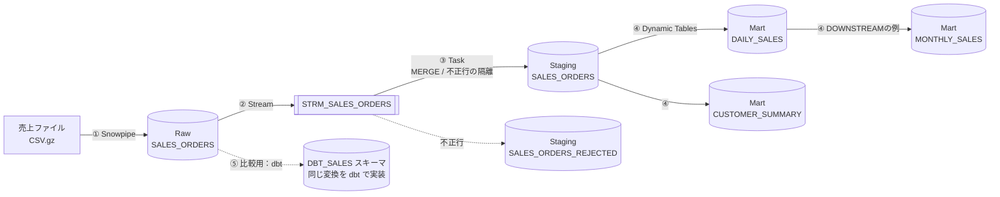
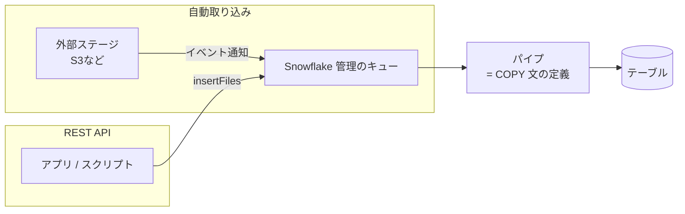

# Step 3 詳細編：データエンジニアリングと自動化

> 学習ロードマップ【全体概要編】の Step 3 を詳しく扱う資料です。
> 構成は「1. 概要 → 2. 概念解説 → 3. ハンズオン → 4. 現場の事例（ケーススタディ） → 5. 考察課題の解答例 → 6. 理解度チェックの解答 → 7. 参考資料」の順です。
> **前提**：Step 1 の3層データベースとウェアハウス、Step 2 のロール（`FR_PIPELINE` / `FR_DATA_ENGINEER` など）とサービスユーザー `SVC_PIPELINE`（キーペア認証）が残っていること。

---

## 1. 概要

### 1.0 この章の物語

> **【場面】6月1日（月）9:40　経営企画部の島**
>
> 高田さん：「今朝のダッシュボード、まだ昨日の数字だよね？」
>
> あなた：「すみません、POS の売上ファイルを手でロードしている途中でした。いつも9時半ごろに終わるんですが。」
>
> 高田さん：「毎朝あなたが手でロードしてるの、休みの日はどうするの？ 来月の月初会議、あなたが夏休みでも資料は作らないといけないんだけど。」
>
> あなた：「……ですよね。自動化します。」

> **【場面】6月1日（月）14:00　データ基盤チームの席**
>
> 佐伯さん：「自動化はいいけど、自動にすると**失敗も自動で、誰も見ていないところで起きる**からね。前の現場で、夜間バッチが3日止まっていたのに誰も気づかなかったことがある。」
>
> 北村部長：「で、自動化するといくらかかるの？ 人が毎朝30分やるのと比べて。」
>
> 佐伯さん：「方式もいくつかあるから、同じものを何通りか作って比べてみたら？ 7月末に結論を出せば、8月からの本運用に間に合う。」

この章であなたが解決すること：

- 形式の崩れた売上ファイルが届いても、データを失わずに取り込める（演習 3-1）
- ファイルが届いたら、人が何もしなくても Raw 層に入る（演習 3-2）
- Raw 層の差分だけを、クレンジングと重複排除をしながら Staging 層に反映する（演習 3-3）
- Mart 層の集計が、決めた鮮度で自動的に更新され続ける（演習 3-4）
- 同じ変換をテスト付きの dbt でも作り、チームで保守できる形を検討する（演習 3-5）
- 通しで動かして方式を比較し、北村部長に採用案を提言する（演習 3-6）

### 1.1 このステップのゴール

ファイルが届いてから Raw → Staging → Mart に反映されるまでを、**人手を介さずに動く自動パイプライン**として設計・構築できるようになることがゴールです。あわせて、同じ要件を複数の方式（Streams/Tasks、Dynamic Tables、dbt）で実装し、**要件に応じて方式を選べる**ようになることを目指します。

### 1.2 このステップで作るパイプライン



| 区間 | 方式 | 演習 |
| --- | --- | --- |
| ファイル → Raw | `COPY INTO`（バッチ）/ Snowpipe（継続的） | 3-1、3-2 |
| Raw → Staging | Streams + Tasks（差分の MERGE） | 3-3 |
| Staging → Mart | Dynamic Tables（宣言型） | 3-4 |
| Raw → Mart（比較用） | dbt Projects on Snowflake | 3-5 |
| 全体 | 通し試験と方式の比較 | 3-6 |

### 1.3 到達目標チェックリスト

- [ ] `COPY INTO` のエラー処理オプション（`ON_ERROR`、`VALIDATION_MODE`）を使い分け、不正なファイルや行に対処できる
- [ ] データをファイルとしてアンロードできる（パーティション分割、Parquet 形式）
- [ ] Snowpipe の仕組み（自動取り込み / REST API）を説明し、構成できる
- [ ] ストリームの仕組み（オフセット、差分の種類、失効）を説明できる
- [ ] タスクとタスクグラフを作成し、ストリームと組み合わせて差分処理を自動化できる
- [ ] Dynamic Tables のターゲットラグとリフレッシュモードを、要件から決められる
- [ ] dbt プロジェクトを Snowflake 上にデプロイし、実行・テストできる
- [ ] Streams/Tasks、Dynamic Tables、dbt の使い分けを、根拠とともに提言できる
- [ ] Apache Iceberg テーブルを採用すべき場面を説明できる

### 1.4 所要時間の目安

| パート | 目安 |
| --- | --- |
| 概念解説の読み込み | 7〜8h |
| 環境準備（3.0） | 1h |
| 演習 3-1〜3-6 | 22〜28h |
| 考察課題・理解度チェック | 4〜5h |
| **合計** | **35〜45h** |

---

## 2. 概念解説

### 2.1 データロードの全体像

| 方式 | 起動のきっかけ | 使うコンピュート | 向いているケース |
| --- | --- | --- | --- |
| **`COPY INTO`** | 人やスケジューラーが実行する | 指定したウェアハウス | 1日1回など、まとまった量のバッチ |
| **Snowpipe** | ファイルの到着（クラウドのイベント通知 または REST API の呼び出し） | サーバーレス（Snowflake が管理） | 小さなファイルが頻繁に届く、数分以内の鮮度が必要 |
| **Snowpipe Streaming** | アプリケーションからの行単位の送信 | サーバーレス | ファイルを介さない、秒単位の低遅延 |
| **Openflow** | コネクタ（SaaS、データベース、ストリーミングなど） | Snowflake が提供するデータ統合基盤 | 多様なソースとの連携（本教材では扱わない） |

### 2.2 ステージとファイル形式

| ステージの種類 | 置き場所 | 用途 |
| --- | --- | --- |
| 内部ステージ（名前付き） | Snowflake が管理するストレージ | CLI の `snow stage copy`（PUT）でアップロードしたファイル |
| テーブルステージ / ユーザーステージ | テーブルごと / ユーザーごとに自動で存在 | ちょっとした作業用（Snowpipe はユーザーステージに対応しない） |
| **外部ステージ** | S3 / GCS / Azure Blob | 本番の着地点。**ストレージ統合**（`STORAGE INTEGRATION`）で認証し、アクセスキーを Snowflake に保存しない |

### 2.3 `COPY INTO` のエラー処理

| オプション | 挙動 |
| --- | --- |
| `ON_ERROR = ABORT_STATEMENT` | エラーが1件でもあれば、ロード全体を中止する（`COPY INTO` の既定値） |
| `ON_ERROR = CONTINUE` | エラーの行だけを飛ばして、残りをロードする |
| `ON_ERROR = SKIP_FILE` | エラーを含むファイルを丸ごと飛ばす（Snowpipe の既定値）。`SKIP_FILE_<n>` や `SKIP_FILE_<n>%` で許容する件数・割合を指定できる |
| `VALIDATION_MODE = RETURN_ERRORS` など | 実際にはロードせず、エラーだけを返す（ドライラン）。ロード時に列を変換する COPY では使えない |

**設計の原則**：「ファイルとしての形式エラー（列数の不一致、閉じていない引用符など）」は COPY の段階で検知します。一方、「値の妥当性（数値に文字が入っている、日付の形式が違うなど）」は、Raw 層で文字列のまま受けて、**Staging 層で判定して隔離**します。こうして2段階に分けると、データを失わずに不正を管理できます。

**重複ロードの防止**：COPY はテーブルごとにロード済みファイルのメタデータ（64日間）を保持し、同じファイルを自動でスキップします（Step 1 で確認済み）。

### 2.4 アンロード

```sql
COPY INTO @stage/export/daily_sales/
FROM (SELECT ... FROM mart_table)
PARTITION BY ('ym=' || TO_CHAR(order_date, 'YYYY-MM'))   -- パーティションごとにフォルダを分ける
FILE_FORMAT = (TYPE = PARQUET)
HEADER = TRUE;                                            -- Parquet では列名を保持する
```

- 他システムへのデータ提供や、データレイクへの書き出しに使います。
- **`SINGLE = TRUE`** で1ファイルにまとめることや、**`MAX_FILE_SIZE`** でファイルの大きさを調整することもできます。

### 2.5 Snowpipe



- **パイプ**は「どのステージから、どのテーブルへ、どう COPY するか」を定義したオブジェクトです。
- 取り込みの起動方法は2つあります。
  - **自動取り込み（`AUTO_INGEST = TRUE`）**：外部ステージで、クラウドのイベント通知（S3 なら SQS）を使う。
  - **REST API**：`insertFiles` エンドポイントにファイル名を送る。**内部ステージではこちらを使います**。
- Snowpipe の COPY では、使えないオプションがあります（`ON_ERROR = ABORT_STATEMENT`、`PURGE`、`FORCE` など）。
- ロード時刻を記録したい場合は、`METADATA$START_SCAN_TIME` を使うのが推奨です。
- ウェアハウスを使わないサーバーレスの課金です（課金体系は改定されることがあるため、公式の料金表で確認してください）。ファイルの大きさは、目安として圧縮後 100〜250MB 程度が推奨されています。**極端に小さなファイルを大量に送ると、処理効率もコスト効率も悪くなります**。

### 2.6 ストリーム（Streams）

ストリームは、テーブルに対する**変更（差分）を追跡するオブジェクト**です。データそのものを持たず、「どこまで読んだか」を表す**オフセット**だけを持ちます。

| 項目 | 内容 |
| --- | --- |
| 差分の見え方 | 元のテーブルの列に加えて、`METADATA$ACTION`（INSERT / DELETE）、`METADATA$ISUPDATE`（更新の一部かどうか）、`METADATA$ROW_ID` が付く。更新は「DELETE と INSERT の組」として表れる |
| 種類 | **標準**（挿入・更新・削除のすべて）、**APPEND_ONLY**（挿入のみ。追記型のテーブル向けで軽い）、**INSERT_ONLY**（外部テーブル・Iceberg 用） |
| オフセットが進むタイミング | ストリームを読む **DML 文がコミットしたとき**。SELECT するだけでは進まない |
| トランザクション内の挙動 | 同じトランザクションの中では、何度読んでも同じ差分が見える。そのため、**1つの差分を複数のテーブルへ振り分ける処理は、明示的なトランザクションで囲む** |
| 失効（stale） | オフセットが元のテーブルのデータ保持期間を超えると、ストリームは使えなくなる。Snowflake は保持期間を最大 14 日（`MAX_DATA_EXTENSION_TIME_IN_DAYS`）まで自動で延長するが、**定期的に消費する**ことが前提 |
| 初期データ | 通常は作成後の変更だけが対象。`SHOW_INITIAL_ROWS = TRUE` を指定すると、最初の消費時に既存の全行も差分として返す |
| 前提 | 元のテーブルで変更の追跡（`CHANGE_TRACKING`）が有効であること。テーブルの所有者以外がストリームを作る場合は、事前に所有者が有効にしておく |

### 2.7 タスク（Tasks）

| 項目 | 内容 |
| --- | --- |
| 中身 | 1つの SQL 文、ストアドプロシージャの呼び出し、または Snowflake Scripting のブロック |
| スケジュール | `SCHEDULE = '5 MINUTE'` または `SCHEDULE = 'USING CRON 0 6 * * * Asia/Tokyo'` |
| 実行条件 | `WHEN SYSTEM$STREAM_HAS_DATA('<stream>')`。この判定はウェアハウスを起動せずに行われるため、**差分がなければコストはかからない** |
| コンピュート | ユーザー管理のウェアハウス（`WAREHOUSE = ...`）または**サーバーレス**（ウェアハウスを指定しない。Snowflake がサイズを自動調整する） |
| タスクグラフ | ルートタスクの下に `AFTER` で子タスクをつなぎ、DAG を作る。ルートタスクだけがスケジュールを持つ |
| トリガー型タスク | スケジュールを指定せず `WHEN SYSTEM$STREAM_HAS_DATA(...)` だけで定義すると、ストリームにデータが入ったときに起動する |
| 状態 | 作成直後は**停止中（suspended）**。`ALTER TASK ... RESUME` で開始する。タスクグラフでは、子タスクから順に RESUME する（または `SYSTEM$TASK_DEPENDENTS_ENABLE` を使う） |
| 権限 | タスクの所有者ロールの権限で実行される。実行には、アカウントレベルの `EXECUTE TASK` 権限（サーバーレスの場合は `EXECUTE MANAGED TASK` も）が必要 |
| 失敗時 | `SUSPEND_TASK_AFTER_NUM_FAILURES` で、連続して失敗したときに自動で停止させる。通知はアラートやイベントテーブルと組み合わせる（Step 4、7） |

### 2.8 Dynamic Tables

Dynamic Tables は、**「結果をどう作るか（SELECT 文）」と「どれくらい新しければよいか（ターゲットラグ）」を宣言するだけ**で、Snowflake が更新のスケジュールと差分の計算を自動で管理するテーブルです。

```sql
CREATE DYNAMIC TABLE mart.daily_sales
  TARGET_LAG   = '15 minutes'       -- 元データの変更から、最大15分以内に反映されればよい
  WAREHOUSE    = transform_wh
  REFRESH_MODE = INCREMENTAL        -- AUTO / INCREMENTAL / FULL
AS
SELECT order_date, SUM(amount) AS sales_amount
FROM stg.sales_orders
GROUP BY order_date;
```

| 項目 | 内容 |
| --- | --- |
| ターゲットラグ | 「元データより最大でどれだけ遅れてよいか」。短いほど更新の頻度が上がり、コストが増える |
| `TARGET_LAG = DOWNSTREAM` | 自分自身では更新の頻度を決めず、**下流の Dynamic Table が必要とするときだけ**更新する。中間テーブルに使う |
| リフレッシュモード | **INCREMENTAL**：変更された部分だけを再計算する。**FULL**：毎回すべてを作り直す。**AUTO**：Snowflake が選ぶ（どちらになったかは `SHOW DYNAMIC TABLES` の `refresh_mode` と `refresh_mode_reason` で確認できる） |
| 増分更新の条件 | クエリの形によっては増分更新ができない（例外は公式ドキュメントに一覧がある）。本番では、AUTO に任せるより、**INCREMENTAL を明示して、できなければ作成時にエラーで気づける**ようにするのが確実 |
| 依存関係 | Dynamic Table どうしを連鎖させると、Snowflake がグラフとして管理し、上流から順に一貫した時点で更新する |
| 監視 | Snowsight のグラフ表示、`DYNAMIC_TABLE_REFRESH_HISTORY` |

### 2.9 Streams/Tasks、Dynamic Tables、dbt の比較

| 観点 | Streams + Tasks | Dynamic Tables | dbt（Projects on Snowflake） |
| --- | --- | --- | --- |
| 書き方 | 手続き型（MERGE などの処理を自分で書く） | 宣言型（SELECT 文とラグだけ） | 宣言型（SELECT 文のモデル）＋テンプレート |
| 差分処理 | 自分で実装する（柔軟だが手間がかかる） | 自動 | incremental モデルとして自分で条件を書く |
| スケジュール | タスクで自分で定義する | ターゲットラグから自動で決まる | タスクや外部のオーケストレーターで実行する |
| 得意なこと | 複数テーブルへの振り分け、外部関数の呼び出し、細かい制御、副作用のある処理 | 集計や結合を、一定の鮮度で維持し続ける | テスト、ドキュメント、モデルの依存関係の管理、Git を中心にした開発フロー |
| 苦手なこと | 処理が増えると複雑になり、保守が大変になる | 手続き的な処理、1回きりのバッチ、非決定的な関数 | 分単位の鮮度（実行の起動が別に必要） |

**典型的な組み合わせ**：取り込み直後の複雑なクレンジングは Streams/Tasks、集計の維持は Dynamic Tables、チーム開発とテストの基盤として dbt。dbt のモデルは Dynamic Table として実体化することもできます（dbt の `materialized='dynamic_table'`）。

### 2.10 ビュー・マテリアライズドビュー・Dynamic Tables の使い分け

| 種類 | 結果の保存 | 鮮度 | 制約 | 向いている用途 |
| --- | --- | --- | --- | --- |
| ビュー | しない（毎回計算） | 常に最新 | なし | 軽い変換、アクセス制御の窓口 |
| セキュアビュー | しない | 常に最新 | 最適化の一部が制限される | 定義や元データを隠したい場合（Step 2） |
| マテリアライズドビュー | する（自動で維持） | 常に最新 | **単一テーブルのみ**（結合できない）。Enterprise 以上 | 1つの大きなテーブルに対する、繰り返し実行される重い集計 |
| Dynamic Tables | する | ターゲットラグ以内 | 一部の関数・構文は増分更新に対応しない | 結合を含む変換パイプライン |

### 2.11 Apache Iceberg テーブル

- Iceberg は、オープンなテーブル形式です。データは**自社のクラウドストレージに Parquet 形式で**置かれ、Snowflake 以外のエンジン（Spark、Trino など）からも読み書きできます。
- **カタログ**（テーブルのメタデータの管理者）によって、2つの型に分かれます。
  - **Snowflake 管理**（`CATALOG = 'SNOWFLAKE'`）：Snowflake から読み書きでき、他のエンジンからは読み取れる。
  - **外部カタログ**（AWS Glue、Snowflake Open Catalog など）：他のエンジンが管理するテーブルを、Snowflake から参照する。
- データの置き場所は、**外部ボリューム**（`EXTERNAL VOLUME`）で指定します。
- **採用を検討する場面**：データレイクがすでにある、複数のエンジンで同じデータを使いたい、特定のベンダーへの依存を避けたい、ストレージを自社で管理したい、といった場合。
- Snowflake の通常のテーブルに比べると、一部の機能に制約があります。「なんとなく」ではなく、要件がある場合に選びます。

> **その他のテーブルの種類**：ハイブリッドテーブル（行単位の高速な読み書きが必要なアプリ向け）、Interactive tables（低遅延の対話型分析向け）もあります。いずれも、要件がはっきりしている場合に選ぶ特殊な選択肢です。

---

## 3. ハンズオン

各演習は **「手順（コード）」→「確認ポイント」→「考察課題」** の順に進みます。考察課題の解答例は第5章にあります。

### 3.0 環境準備

#### (1) Step 3 で必要になる権限を追加する（`05_grants_step3.sql`）

Step 2 の権限設計に、パイプライン用のオブジェクト（ストリーム、パイプ、タスク、Dynamic Tables、dbt プロジェクト）の権限を追加します。**機能ロールに直接付与せず、アクセスロールに追加する**という Step 2 の原則を守ります。

```sql
-- 05_grants_step3.sql
-- ============================================================
-- 1. アクセスロールへの追加（SECURITYADMIN）
-- ============================================================
USE ROLE SECURITYADMIN;

-- R：Dynamic Tables の読み取り（テーブルとは別のオブジェクト種別として扱われる）
GRANT SELECT ON ALL DYNAMIC TABLES    IN DATABASE DEV_STG_DB  TO ROLE AR_DEV_STG_R;
GRANT SELECT ON FUTURE DYNAMIC TABLES IN DATABASE DEV_STG_DB  TO ROLE AR_DEV_STG_R;
GRANT SELECT ON ALL DYNAMIC TABLES    IN DATABASE DEV_MART_DB TO ROLE AR_DEV_MART_R;
GRANT SELECT ON FUTURE DYNAMIC TABLES IN DATABASE DEV_MART_DB TO ROLE AR_DEV_MART_R;

-- W（Raw）：ストリームとパイプ
GRANT CREATE STREAM, CREATE PIPE ON ALL SCHEMAS    IN DATABASE DEV_RAW_DB TO ROLE AR_DEV_RAW_W;
GRANT CREATE STREAM, CREATE PIPE ON FUTURE SCHEMAS IN DATABASE DEV_RAW_DB TO ROLE AR_DEV_RAW_W;

-- W（Staging）：タスクと Dynamic Tables
GRANT CREATE TASK, CREATE DYNAMIC TABLE ON ALL SCHEMAS    IN DATABASE DEV_STG_DB TO ROLE AR_DEV_STG_W;
GRANT CREATE TASK, CREATE DYNAMIC TABLE ON FUTURE SCHEMAS IN DATABASE DEV_STG_DB TO ROLE AR_DEV_STG_W;

-- W（Mart）：Dynamic Tables と、その運用（手動リフレッシュ・監視）
GRANT CREATE DYNAMIC TABLE ON ALL SCHEMAS    IN DATABASE DEV_MART_DB TO ROLE AR_DEV_MART_W;
GRANT CREATE DYNAMIC TABLE ON FUTURE SCHEMAS IN DATABASE DEV_MART_DB TO ROLE AR_DEV_MART_W;
GRANT MONITOR, OPERATE ON FUTURE DYNAMIC TABLES IN DATABASE DEV_MART_DB TO ROLE AR_DEV_MART_W;

-- ============================================================
-- 2. パイプライン管理用スキーマ（dbt プロジェクトの置き場所）
-- ============================================================
USE ROLE SYSADMIN;
CREATE SCHEMA IF NOT EXISTS ADMIN_DB.PIPELINE COMMENT = 'dbtプロジェクトなどパイプライン管理用';
-- dbt の出力先スキーマ（dbt にスキーマの作成権限を与えないため、先に作っておく）
CREATE SCHEMA IF NOT EXISTS DEV_STG_DB.DBT_SALES;
CREATE SCHEMA IF NOT EXISTS DEV_MART_DB.DBT_SALES;

USE ROLE SECURITYADMIN;
GRANT USAGE ON DATABASE ADMIN_DB TO ROLE FR_DATA_ENGINEER;
GRANT USAGE, CREATE DBT PROJECT ON SCHEMA ADMIN_DB.PIPELINE TO ROLE FR_DATA_ENGINEER;

-- ============================================================
-- 3. アカウントレベルの権限（ACCOUNTADMIN）
-- ============================================================
USE ROLE ACCOUNTADMIN;
GRANT EXECUTE TASK         ON ACCOUNT TO ROLE FR_PIPELINE;
GRANT EXECUTE MANAGED TASK ON ACCOUNT TO ROLE FR_PIPELINE;
GRANT EXECUTE TASK         ON ACCOUNT TO ROLE FR_DATA_ENGINEER;

-- ============================================================
-- 4. Raw テーブルの変更追跡を有効にする（所有者の SYSADMIN が行う）
-- ============================================================
USE ROLE SYSADMIN;
ALTER TABLE DEV_RAW_DB.SALES.SALES_ORDERS SET CHANGE_TRACKING = TRUE;
```

```bash
snow sql -f 05_grants_step3.sql -c training
```

> **所有者の方針**：この Step で作るパイプラインのオブジェクト（パイプ、ストリーム、タスク、Staging のテーブル、Mart の Dynamic Tables）は、すべて **`FR_PIPELINE` が所有**するようにします。自動処理が人間の機能ロールに依存しないようにするためです。検証のために自分のユーザーで `USE ROLE FR_PIPELINE` を使いますが、本番では `SVC_PIPELINE` からデプロイする運用を想定しています。

#### (2) 作業用のセッション設定

以降、特に断りがない場合は、次の設定で作業します。

```sql
USE ROLE FR_PIPELINE;
USE SECONDARY ROLES NONE;
USE WAREHOUSE DEV_TRANSFORM_WH;
```

---

### 演習 3-1：COPY INTO のエラー処理とアンロード

> **【場面】6月3日（水）9:15　データ基盤チームの席**
>
> あなた：「今朝の COPY、エラーで全部止まりました。1行だけ引用符が閉じていなかったみたいです。」
>
> 佐伯さん：「既定の `ABORT_STATEMENT` だからね。1行のために全部止めるのか、その行だけ飛ばすのか。自動化する前に、壊れたファイルが来たときの振る舞いを決めておこう。」
>
> 高田さん（チャットで）：「あと、月初に経理向けの CSV を毎回手で作ってるんだけど、あれも出せたりする？」
>
> 佐伯さん：「アンロードもついでにやっておくといいよ。ファイルで欲しいという依頼は必ず来るから。」

**ねらい**：形式に問題のあるファイルを安全に扱う方法と、データを外部に提供するためのアンロードを身につける。

#### 手順 A：不正なファイルを用意してアップロードする

ローカルに `bad_sales.csv` を作成します。

```csv
order_id,order_date,store_id,channel,customer_id,product_id,quantity,unit_price
ORDX0000001,2026-09-28,S001,EC,C000001,P0001,2,1500
ORDX0000002,2026-09-28,S001,EC,C000002,P0002,1
ORDX0000003,2026/09/28,S002,STORE,C000003,P0003,abc,2000
ORDX0000005,2026-09-28,S004,STORE,C000005,P0005,3,800
ORDX0000004,2026-09-28,S003,"STORE,C000004,P0004,1,3000
```

> 引用符が閉じていない行は、それ以降の行を巻き込んで1つの値として読まれてしまいます。そのため、検証しやすいようにファイルの最終行に置いています。

| 行 | 問題 | 検知される段階 |
| --- | --- | --- |
| ORDX0000002 | 列が1つ足りない | COPY（形式エラー） |
| ORDX0000003 | 日付の形式が違う、数量が数字でない | Staging（値のエラー）※Raw では文字列として受け入れられる |
| ORDX0000004 | 引用符が閉じていない | COPY（形式エラー） |

```bash
snow stage copy ./bad_sales.csv @DEV_RAW_DB.UTIL.LANDING_STAGE/errors/ -c training --role FR_PIPELINE
snow sql -c training --role FR_PIPELINE -q "LIST @DEV_RAW_DB.UTIL.LANDING_STAGE/errors/"
```

#### 手順 B：ロードする前にエラーを調べる（ドライラン）

`VALIDATION_MODE` は、ロード時に列を変換する COPY では使えません。そのため、ファイルと同じ列構成の一時テーブルに対して検証します。

```sql
CREATE TEMPORARY TABLE TMP_VALIDATE_SALES (
  ORDER_ID STRING, ORDER_DATE STRING, STORE_ID STRING, CHANNEL STRING,
  CUSTOMER_ID STRING, PRODUCT_ID STRING, QUANTITY STRING, UNIT_PRICE STRING
);

COPY INTO TMP_VALIDATE_SALES
FROM @DEV_RAW_DB.UTIL.LANDING_STAGE/errors/
FILE_FORMAT = (FORMAT_NAME = 'DEV_RAW_DB.UTIL.FF_CSV')
VALIDATION_MODE = RETURN_ALL_ERRORS;
-- ERROR 列、LINE 列、CHARACTER 列などで、どの行の何が問題かを確認する
```

#### 手順 C：ON_ERROR の違いを確かめる

```sql
-- (1) 既定（ABORT_STATEMENT）：ロード全体が中止される
COPY INTO DEV_RAW_DB.SALES.SALES_ORDERS
  (ORDER_ID, ORDER_DATE, STORE_ID, CHANNEL, CUSTOMER_ID, PRODUCT_ID, QUANTITY, UNIT_PRICE, _SOURCE_FILE, _LOADED_AT)
FROM (SELECT $1,$2,$3,$4,$5,$6,$7,$8, METADATA$FILENAME, CURRENT_TIMESTAMP()
      FROM @DEV_RAW_DB.UTIL.LANDING_STAGE/errors/)
FILE_FORMAT = (FORMAT_NAME = 'DEV_RAW_DB.UTIL.FF_CSV');

-- (2) SKIP_FILE：ファイルごと飛ばされる（0件ロード、status が LOAD_FAILED になる）
-- 上の COPY 文の末尾に ON_ERROR = SKIP_FILE を付けて実行する

-- (3) CONTINUE：エラーの行だけを飛ばしてロードする
COPY INTO DEV_RAW_DB.SALES.SALES_ORDERS
  (ORDER_ID, ORDER_DATE, STORE_ID, CHANNEL, CUSTOMER_ID, PRODUCT_ID, QUANTITY, UNIT_PRICE, _SOURCE_FILE, _LOADED_AT)
FROM (SELECT $1,$2,$3,$4,$5,$6,$7,$8, METADATA$FILENAME, CURRENT_TIMESTAMP()
      FROM @DEV_RAW_DB.UTIL.LANDING_STAGE/errors/)
FILE_FORMAT = (FORMAT_NAME = 'DEV_RAW_DB.UTIL.FF_CSV')
ON_ERROR = CONTINUE;
-- 結果の rows_parsed / rows_loaded / errors_seen / first_error を確認する

-- ロードの履歴を確認する
SELECT file_name, status, row_count, row_parsed, error_count, first_error_message, last_load_time
FROM TABLE(DEV_RAW_DB.INFORMATION_SCHEMA.COPY_HISTORY(
       TABLE_NAME => 'DEV_RAW_DB.SALES.SALES_ORDERS',
       START_TIME => DATEADD(hour, -1, CURRENT_TIMESTAMP())))
ORDER BY last_load_time DESC;

-- Raw に入った行を確認する（ORDX0000003 は文字列のまま入っている）
SELECT * FROM DEV_RAW_DB.SALES.SALES_ORDERS WHERE ORDER_ID LIKE 'ORDX%';
```

> ORDX0000003 は、演習 3-3 で Staging に取り込むときに「不正行」として隔離されます。

#### 手順 D：アンロード（Mart のデータを Parquet で書き出す）

```sql
USE ROLE FR_DATA_ENGINEER;
USE SECONDARY ROLES NONE;
USE WAREHOUSE DEV_TRANSFORM_WH;

COPY INTO @DEV_RAW_DB.UTIL.LANDING_STAGE/export/daily_sales/
FROM (SELECT order_date, channel, store_id, sales_amount, order_count
      FROM DEV_MART_DB.SALES.DAILY_SALES)
PARTITION BY ('ym=' || TO_CHAR(order_date, 'YYYY-MM'))
FILE_FORMAT = (TYPE = PARQUET)
HEADER = TRUE;

LIST @DEV_RAW_DB.UTIL.LANDING_STAGE/export/daily_sales/;

-- 書き出した Parquet を、ロードせずに直接クエリしてみる
SELECT $1:ORDER_DATE::DATE AS order_date, $1:SALES_AMOUNT::NUMBER AS sales_amount
FROM @DEV_RAW_DB.UTIL.LANDING_STAGE/export/daily_sales/ (FILE_FORMAT => 'DEV_RAW_DB.UTIL.FF_PARQUET')
LIMIT 10;
```

> 最後のクエリの前に、ファイル形式 `FF_PARQUET` を作成しておきます：`CREATE FILE FORMAT DEV_RAW_DB.UTIL.FF_PARQUET TYPE = PARQUET;`（`FR_PIPELINE` などの W ロールで作成する）。

#### 確認ポイント

- `VALIDATION_MODE` で、ORDX0000002 と ORDX0000004 の2行のエラーが返る（ORDX0000003 は返らない）。
- `ON_ERROR = CONTINUE` では、3行（ORDX0000001 / 0000003 / 0000005）がロードされる。
- `export/daily_sales/ym=YYYY-MM/` のフォルダごとに Parquet ファイルができている。

#### 考察課題

- **Q3-1a**：本番の日次バッチでは、`ABORT_STATEMENT` / `SKIP_FILE` / `CONTINUE` のどれを選ぶべきか。業務への影響と、エラーに気づけるかどうかの観点から論ぜよ。
- **Q3-1b**：ORDX0000003 のような「値のエラー」を COPY の段階で弾かず、Raw 層に入れておく利点は何か。

---

### 演習 3-2：Snowpipe による継続的な取り込み

> **【場面】6月10日（水）10:00　POS ベンダーとのオンライン定例**
>
> POS ベンダー：「売上ファイルは、これまでどおり毎晩 2 時ごろにストレージへ置きます。ただ、店舗の締めが遅れた日は、朝 6 時ごろに追加のファイルを置くこともあります。」
>
> あなた：「時刻が決まっていないなら、決まった時刻に COPY を回すより、ファイルが置かれたら取り込むほうが確実ですね。」
>
> 佐伯さん：「Snowpipe だね。ただし、ロードの失敗はもう画面に出てこなくなる。どこで気づくかも、一緒に考えておいて。」

**ねらい**：ファイルが届いたら自動でロードされる仕組みを構成する。

クラウドストレージを使えるかどうかで、2つのコースがあります。

| コース | 構成 | 前提 |
| --- | --- | --- |
| **A（本番の標準構成）** | S3 の外部ステージ ＋ 自動取り込み（イベント通知） | AWS アカウントと、IAM ロール・S3 のイベント通知を設定できる権限 |
| **B（クラウドストレージがない場合）** | 内部ステージ ＋ REST API（Python から呼び出す） | Python 3.x、`SVC_PIPELINE` のキーペア（Step 2） |

どちらのコースでも、パイプを経由して Raw テーブルにロードする点は同じです。可能であればコース A を実施し、コース B の仕組みも読んで理解しておいてください。

#### コース A：S3 の外部ステージと自動取り込み

**A-1. ストレージ統合を作る（ACCOUNTADMIN）**

```sql
USE ROLE ACCOUNTADMIN;
CREATE STORAGE INTEGRATION IF NOT EXISTS SI_SNOW_LANDING
  TYPE = EXTERNAL_STAGE
  STORAGE_PROVIDER = 'S3'
  ENABLED = TRUE
  STORAGE_AWS_ROLE_ARN = 'arn:aws:iam::<AWSアカウントID>:role/<Snowflake用のIAMロール>'
  STORAGE_ALLOWED_LOCATIONS = ('s3://<バケット名>/landing/');

DESC INTEGRATION SI_SNOW_LANDING;
-- STORAGE_AWS_IAM_USER_ARN と STORAGE_AWS_EXTERNAL_ID を、IAM ロールの信頼ポリシーに設定する（AWS 側の作業）

GRANT USAGE ON INTEGRATION SI_SNOW_LANDING TO ROLE AR_DEV_RAW_W;
```

**A-2. 外部ステージとパイプを作る（FR_PIPELINE）**

```sql
USE ROLE FR_PIPELINE;
USE SECONDARY ROLES NONE;

-- 外部ステージの作成には CREATE STAGE 権限が必要（Step 2 では付与していないため、SECURITYADMIN で AR_DEV_RAW_W に追加する）
-- GRANT CREATE STAGE ON SCHEMA DEV_RAW_DB.UTIL TO ROLE AR_DEV_RAW_W;
CREATE STAGE IF NOT EXISTS DEV_RAW_DB.UTIL.S3_LANDING_STAGE
  URL = 's3://<バケット名>/landing/'
  STORAGE_INTEGRATION = SI_SNOW_LANDING
  FILE_FORMAT = DEV_RAW_DB.UTIL.FF_CSV;

CREATE PIPE IF NOT EXISTS DEV_RAW_DB.SALES.PIPE_SALES_ORDERS
  AUTO_INGEST = TRUE
  COMMENT = '売上ファイルの自動取り込み'
AS
COPY INTO DEV_RAW_DB.SALES.SALES_ORDERS
  (ORDER_ID, ORDER_DATE, STORE_ID, CHANNEL, CUSTOMER_ID, PRODUCT_ID, QUANTITY, UNIT_PRICE, _SOURCE_FILE, _LOADED_AT)
FROM (SELECT $1,$2,$3,$4,$5,$6,$7,$8, METADATA$FILENAME, METADATA$START_SCAN_TIME
      FROM @DEV_RAW_DB.UTIL.S3_LANDING_STAGE/sales/)
FILE_FORMAT = (FORMAT_NAME = 'DEV_RAW_DB.UTIL.FF_CSV')
ON_ERROR = SKIP_FILE;

SHOW PIPES IN SCHEMA DEV_RAW_DB.SALES;
-- notification_channel 列の SQS の ARN を、S3 バケットのイベント通知（オブジェクト作成時）の送信先に設定する（AWS 側の作業）
```

**A-3. ファイルを置いて確認する**：3-6 の手順 A で作る差分ファイルを、S3 の `landing/sales/` にアップロードします。1〜2分後にパイプの状態とロードの履歴を確認します（確認方法はコース B の B-4 と同じです）。

#### コース B：内部ステージと REST API

**B-1. パイプを作る（FR_PIPELINE）**

内部ステージでは自動取り込みを使えないため、`AUTO_INGEST = FALSE`（既定値）で作成します。

```sql
USE ROLE FR_PIPELINE;
USE SECONDARY ROLES NONE;

CREATE PIPE IF NOT EXISTS DEV_RAW_DB.SALES.PIPE_SALES_ORDERS
  COMMENT = '売上ファイルの取り込み（REST API 起動）'
AS
COPY INTO DEV_RAW_DB.SALES.SALES_ORDERS
  (ORDER_ID, ORDER_DATE, STORE_ID, CHANNEL, CUSTOMER_ID, PRODUCT_ID, QUANTITY, UNIT_PRICE, _SOURCE_FILE, _LOADED_AT)
FROM (SELECT $1,$2,$3,$4,$5,$6,$7,$8, METADATA$FILENAME, METADATA$START_SCAN_TIME
      FROM @DEV_RAW_DB.UTIL.LANDING_STAGE)
FILE_FORMAT = (FORMAT_NAME = 'DEV_RAW_DB.UTIL.FF_CSV')
PATTERN = '.*incoming/.*[.]csv[.]gz'
ON_ERROR = SKIP_FILE;

DESC PIPE DEV_RAW_DB.SALES.PIPE_SALES_ORDERS;
```

> パイプの所有者を `FR_PIPELINE` にしておくことで、既定のロールが `FR_PIPELINE` である `SVC_PIPELINE` から REST API を呼び出せるようにします。

**B-2. REST API を呼び出すスクリプトを用意する（ローカル端末）**

```bash
pip install snowflake-ingest cryptography
```

`ingest_files.py` を作成します。

```python
"""指定したステージ上のファイルを Snowpipe の取り込みキューに登録する。"""
import os
import sys
import time

from cryptography.hazmat.primitives import serialization
from snowflake.ingest import SimpleIngestManager, StagedFile

ACCOUNT = os.environ["SNOWFLAKE_ACCOUNT"]            # アカウント識別子（例：myorg-myaccount）
HOST = f"{ACCOUNT}.snowflakecomputing.com"
USER = "SVC_PIPELINE"
PIPE = "DEV_RAW_DB.SALES.PIPE_SALES_ORDERS"
KEY_PATH = os.path.expanduser("~/.snowflake/keys/svc_pipeline_key_v2.p8")  # Step 2 でローテーション後の鍵


def load_private_key() -> str:
    with open(KEY_PATH, "rb") as f:
        key = serialization.load_pem_private_key(
            f.read(),
            password=os.environ["PRIVATE_KEY_PASSPHRASE"].encode(),
        )
    return key.private_bytes(
        encoding=serialization.Encoding.PEM,
        format=serialization.PrivateFormat.PKCS8,
        encryption_algorithm=serialization.NoEncryption(),
    ).decode()


def main(paths: list[str]) -> None:
    manager = SimpleIngestManager(
        account=ACCOUNT, host=HOST, user=USER, pipe=PIPE, private_key=load_private_key()
    )
    # パスは、パイプ定義のステージ（LANDING_STAGE）からの相対パスで指定する
    resp = manager.ingest_files([StagedFile(p, None) for p in paths])
    print("受付結果:", resp["responseCode"])

    # 取り込みの結果を最大2分間ポーリングする
    for _ in range(12):
        time.sleep(10)
        hist = manager.get_history()
        for f in hist.get("files", []):
            print(f["path"], f["status"], f.get("rowsInserted"), f.get("firstError"))
        if hist.get("files"):
            break


if __name__ == "__main__":
    main(sys.argv[1:])
```

> `SNOWFLAKE_ACCOUNT` の値の形式によっては接続に失敗する場合があります。その場合は、Snowsight のアカウント情報に表示される URL のホスト名に合わせて `HOST` を設定してください。

**B-3. ファイルを置いて取り込む**：3-6 の手順 A で `incoming/` に差分ファイルを置いたら、次を実行します。

```bash
export SNOWFLAKE_ACCOUNT='<アカウント識別子>'
export PRIVATE_KEY_PASSPHRASE='<パスフレーズ>'
python ingest_files.py incoming/sales_delta_01.csv.gz
```

**B-4. 状態とロードの履歴を確認する（コース A・B 共通）**

```sql
SELECT SYSTEM$PIPE_STATUS('DEV_RAW_DB.SALES.PIPE_SALES_ORDERS');   -- executionState が RUNNING であること

SELECT file_name, status, row_count, error_count, first_error_message, pipe_received_time, last_load_time
FROM TABLE(DEV_RAW_DB.INFORMATION_SCHEMA.COPY_HISTORY(
       TABLE_NAME => 'DEV_RAW_DB.SALES.SALES_ORDERS',
       START_TIME => DATEADD(hour, -1, CURRENT_TIMESTAMP())))
ORDER BY last_load_time DESC;
```

#### 確認ポイント

- パイプの `executionState` が `RUNNING` である。
- ファイルを置いて（コース B では API を呼び出して）から1〜2分以内に、`COPY_HISTORY` に `Loaded` として記録される。
- 同じファイルをもう一度登録しても、重複してロードされない。

#### 考察課題

- **Q3-2a**：パイプでは `ON_ERROR = ABORT_STATEMENT` を使えない。その理由を、Snowpipe の処理単位から説明せよ。
- **Q3-2b**：Snowpipe でロードしたファイルが、エラーで `SKIP_FILE` された場合に気づく仕組みを設計せよ（ヒント：エラー通知、`COPY_HISTORY` の定期チェック）。

---

### 演習 3-3：Streams + Tasks で Raw → Staging を自動化する

> **【場面】6月17日（水）11:30　データ基盤チームの席**
>
> 高田さん：「Raw に売上が自動で入るようになったのはありがたいんだけど、数量が文字列のままだと集計に使えないよね。」
>
> あなた：「Staging への変換は、まだ私が毎朝 SQL を流しています……。」
>
> 佐伯さん：「毎回全件を変換し直すと、データが増えるほど遅くなる。**増えた分だけ**を拾って MERGE しよう。POS は訂正データを同じ注文番号で送ってくるから、重複の扱いも決めておくこと。3-1 で残した不正な行も、捨てずに隔離しておきたいね。」

**ねらい**：Raw 層の差分だけを取り出し、クレンジング・重複排除をしながら Staging 層に MERGE する処理を、自動で動くようにする。不正な行は捨てずに隔離する。

#### 手順 A：Staging のテーブルを作る

```sql
USE ROLE FR_PIPELINE;
USE SECONDARY ROLES NONE;
USE WAREHOUSE DEV_TRANSFORM_WH;

-- 型を付けた Staging テーブル（DEV_STG_DB は TRANSIENT なので、中のテーブルも仮テーブルになる）
CREATE TABLE IF NOT EXISTS DEV_STG_DB.SALES.SALES_ORDERS (
  ORDER_ID      STRING        NOT NULL,
  ORDER_DATE    DATE          NOT NULL,
  STORE_ID      STRING,
  CHANNEL       STRING,
  CUSTOMER_ID   STRING,
  PRODUCT_ID    STRING,
  QUANTITY      NUMBER(10,0),
  UNIT_PRICE    NUMBER(12,0),
  AMOUNT        NUMBER(14,0),
  _SOURCE_FILE  STRING,
  _LOADED_AT    TIMESTAMP_LTZ,
  _UPDATED_AT   TIMESTAMP_LTZ
);

-- 不正な行の隔離先（Raw の値をそのまま保持し、理由を付ける）
CREATE TABLE IF NOT EXISTS DEV_STG_DB.SALES.SALES_ORDERS_REJECTED (
  ORDER_ID STRING, ORDER_DATE STRING, STORE_ID STRING, CHANNEL STRING,
  CUSTOMER_ID STRING, PRODUCT_ID STRING, QUANTITY STRING, UNIT_PRICE STRING,
  _SOURCE_FILE  STRING,
  _LOADED_AT    TIMESTAMP_LTZ,
  REJECT_REASON STRING,
  REJECTED_AT   TIMESTAMP_LTZ
);

-- 処理結果の記録用（タスクグラフの子タスクが書き込む）
CREATE TABLE IF NOT EXISTS DEV_STG_DB.SALES.PIPELINE_AUDIT (
  RUN_AT        TIMESTAMP_LTZ,
  TARGET_TABLE  STRING,
  ROW_COUNT     NUMBER,
  REJECTED_ROWS NUMBER
);
```

#### 手順 B：ストリームを作る

```sql
-- Raw は追記型なので APPEND_ONLY。既存の100万行も初回に取り込むため SHOW_INITIAL_ROWS = TRUE
CREATE STREAM IF NOT EXISTS DEV_RAW_DB.SALES.STRM_SALES_ORDERS
  ON TABLE DEV_RAW_DB.SALES.SALES_ORDERS
  APPEND_ONLY = TRUE
  SHOW_INITIAL_ROWS = TRUE
  COMMENT = 'Raw 売上の差分（Staging への MERGE 用）';

-- 差分を覗いてみる（SELECT するだけではオフセットは進まない）
SELECT METADATA$ACTION, METADATA$ISUPDATE, ORDER_ID, _SOURCE_FILE
FROM DEV_RAW_DB.SALES.STRM_SALES_ORDERS
LIMIT 10;

SELECT COUNT(*) FROM DEV_RAW_DB.SALES.STRM_SALES_ORDERS;   -- 既存の行＋3-1 でロードした行
```

#### 手順 C：タスクグラフを作る

```sql
-- ルートタスク：差分があるときだけ、5分ごとに実行する
CREATE OR REPLACE TASK DEV_STG_DB.SALES.T_MERGE_SALES_ORDERS
  WAREHOUSE = DEV_TRANSFORM_WH
  SCHEDULE  = '5 MINUTE'
  SUSPEND_TASK_AFTER_NUM_FAILURES = 3
  COMMENT   = 'Raw → Staging：売上の差分を MERGE し、不正行を隔離する'
  WHEN SYSTEM$STREAM_HAS_DATA('DEV_RAW_DB.SALES.STRM_SALES_ORDERS')
AS
BEGIN
  -- 1つの差分を2つのテーブルへ振り分けるため、明示的なトランザクションで囲む
  -- （トランザクション内ではストリームが同じ差分を返し、COMMIT でオフセットが進む）
  BEGIN TRANSACTION;

  -- (1) 妥当な行を MERGE する（同じ注文 ID が複数あれば、最後にロードされた行を採用）
  MERGE INTO DEV_STG_DB.SALES.SALES_ORDERS t
  USING (
    SELECT
      ORDER_ID,
      TRY_TO_DATE(ORDER_DATE, 'YYYY-MM-DD')                        AS ORDER_DATE,
      STORE_ID,
      UPPER(TRIM(CHANNEL))                                         AS CHANNEL,
      CUSTOMER_ID,
      PRODUCT_ID,
      TRY_TO_NUMBER(QUANTITY)                                      AS QUANTITY,
      TRY_TO_NUMBER(UNIT_PRICE)                                    AS UNIT_PRICE,
      TRY_TO_NUMBER(QUANTITY) * TRY_TO_NUMBER(UNIT_PRICE)          AS AMOUNT,
      _SOURCE_FILE,
      _LOADED_AT
    FROM DEV_RAW_DB.SALES.STRM_SALES_ORDERS
    WHERE ORDER_ID IS NOT NULL
      AND TRY_TO_DATE(ORDER_DATE, 'YYYY-MM-DD') IS NOT NULL
      AND TRY_TO_NUMBER(QUANTITY)   IS NOT NULL
      AND TRY_TO_NUMBER(UNIT_PRICE) IS NOT NULL
    QUALIFY ROW_NUMBER() OVER (PARTITION BY ORDER_ID ORDER BY _LOADED_AT DESC, _SOURCE_FILE DESC) = 1
  ) s
  ON t.ORDER_ID = s.ORDER_ID
  WHEN MATCHED AND s._LOADED_AT >= t._LOADED_AT THEN UPDATE SET
    ORDER_DATE = s.ORDER_DATE, STORE_ID = s.STORE_ID, CHANNEL = s.CHANNEL,
    CUSTOMER_ID = s.CUSTOMER_ID, PRODUCT_ID = s.PRODUCT_ID,
    QUANTITY = s.QUANTITY, UNIT_PRICE = s.UNIT_PRICE, AMOUNT = s.AMOUNT,
    _SOURCE_FILE = s._SOURCE_FILE, _LOADED_AT = s._LOADED_AT, _UPDATED_AT = CURRENT_TIMESTAMP()
  WHEN NOT MATCHED THEN INSERT
    (ORDER_ID, ORDER_DATE, STORE_ID, CHANNEL, CUSTOMER_ID, PRODUCT_ID, QUANTITY, UNIT_PRICE, AMOUNT,
     _SOURCE_FILE, _LOADED_AT, _UPDATED_AT)
  VALUES
    (s.ORDER_ID, s.ORDER_DATE, s.STORE_ID, s.CHANNEL, s.CUSTOMER_ID, s.PRODUCT_ID, s.QUANTITY, s.UNIT_PRICE, s.AMOUNT,
     s._SOURCE_FILE, s._LOADED_AT, CURRENT_TIMESTAMP());

  -- (2) 不正な行を隔離する
  INSERT INTO DEV_STG_DB.SALES.SALES_ORDERS_REJECTED
  SELECT
    ORDER_ID, ORDER_DATE, STORE_ID, CHANNEL, CUSTOMER_ID, PRODUCT_ID, QUANTITY, UNIT_PRICE,
    _SOURCE_FILE, _LOADED_AT,
    ARRAY_TO_STRING(ARRAY_CONSTRUCT_COMPACT(
      IFF(ORDER_ID IS NULL, 'ORDER_ID が空', NULL),
      IFF(TRY_TO_DATE(ORDER_DATE, 'YYYY-MM-DD') IS NULL, 'ORDER_DATE が不正', NULL),
      IFF(TRY_TO_NUMBER(QUANTITY)   IS NULL, 'QUANTITY が不正', NULL),
      IFF(TRY_TO_NUMBER(UNIT_PRICE) IS NULL, 'UNIT_PRICE が不正', NULL)
    ), ' / ') AS REJECT_REASON,
    CURRENT_TIMESTAMP()
  FROM DEV_RAW_DB.SALES.STRM_SALES_ORDERS
  WHERE ORDER_ID IS NULL
     OR TRY_TO_DATE(ORDER_DATE, 'YYYY-MM-DD') IS NULL
     OR TRY_TO_NUMBER(QUANTITY)   IS NULL
     OR TRY_TO_NUMBER(UNIT_PRICE) IS NULL;

  COMMIT;
END;

-- 子タスク：MERGE の後に、処理結果を記録する
CREATE OR REPLACE TASK DEV_STG_DB.SALES.T_AUDIT_SALES_ORDERS
  WAREHOUSE = DEV_TRANSFORM_WH
  COMMENT   = 'Staging 売上の件数を記録する'
  AFTER DEV_STG_DB.SALES.T_MERGE_SALES_ORDERS
AS
INSERT INTO DEV_STG_DB.SALES.PIPELINE_AUDIT
SELECT CURRENT_TIMESTAMP(), 'DEV_STG_DB.SALES.SALES_ORDERS',
       (SELECT COUNT(*) FROM DEV_STG_DB.SALES.SALES_ORDERS),
       (SELECT COUNT(*) FROM DEV_STG_DB.SALES.SALES_ORDERS_REJECTED);

-- 子タスクから順に開始する
ALTER TASK DEV_STG_DB.SALES.T_AUDIT_SALES_ORDERS RESUME;
ALTER TASK DEV_STG_DB.SALES.T_MERGE_SALES_ORDERS RESUME;

-- 初回はスケジュールを待たずに手動で実行する
EXECUTE TASK DEV_STG_DB.SALES.T_MERGE_SALES_ORDERS;
```

> **CLI から実行する場合**：タスクの本体に Snowflake Scripting のブロック（`BEGIN ... END;`）を使っているため、Snowsight 以外のクライアントでは文の区切りが正しく解釈されないことがあります。その場合は、本体を `EXECUTE IMMEDIATE $$ ... $$` で囲んでください。

> **サーバーレスにする場合**：`WAREHOUSE = ...` の行を削除し、代わりに `USER_TASK_MANAGED_INITIAL_WAREHOUSE_SIZE = 'SMALL'` を指定します。実行時間が短く頻繁なタスクでは、ウェアハウスの最低60秒の課金を避けられるため、サーバーレスのほうが安くなることがあります。

#### 手順 D：実行結果を確認する

```sql
-- タスクの実行履歴
SELECT name, state, scheduled_time, completed_time, error_code, error_message
FROM TABLE(DEV_STG_DB.INFORMATION_SCHEMA.TASK_HISTORY(
       SCHEDULED_TIME_RANGE_START => DATEADD(hour, -1, CURRENT_TIMESTAMP())))
ORDER BY scheduled_time DESC;

-- 結果の確認
SELECT COUNT(*) FROM DEV_STG_DB.SALES.SALES_ORDERS;              -- 1,000,002件（100万件＋ORDX0000001 / 0000005）
SELECT * FROM DEV_STG_DB.SALES.SALES_ORDERS_REJECTED;            -- ORDX0000003 が理由付きで入っている
SELECT COUNT(*) FROM DEV_RAW_DB.SALES.STRM_SALES_ORDERS;         -- 0件（オフセットが進んだ）
SELECT * FROM DEV_STG_DB.SALES.PIPELINE_AUDIT ORDER BY RUN_AT DESC;
```

Snowsight で **[Monitoring] → [Task History]** を開き、タスクグラフの表示と実行の状態も確認しておきます。

#### 確認ポイント

- 初回の実行で、Raw の妥当な行がすべて Staging に入り、不正な行は `SALES_ORDERS_REJECTED` に入っている。
- 実行後、ストリームの件数が 0 になっている。
- 差分がない間は、タスクの履歴が `SKIPPED` になり、ウェアハウスが起動しない。

#### 考察課題

- **Q3-3a**：タスクの本体を `BEGIN TRANSACTION ... COMMIT` で囲まなかった場合、何が起こるか。
- **Q3-3b**：MERGE の USING 句で `QUALIFY ROW_NUMBER() ...` による重複排除をしなかった場合、どのような問題が起こりうるか。
- **Q3-3c**：このタスクが3日間止まっていたとする。再開したときに問題なく差分を処理できるか。何日以上止まると問題になるか。

---

### 演習 3-4：Dynamic Tables で Staging → Mart を構築する

> **【場面】6月24日（水）15:00　経営企画部の島**
>
> 高田さん：「Staging は5分おきに更新されてるのに、ダッシュボードの日次売上は5月に作ったときの数字のままなんだけど。」
>
> あなた：「Mart の `DAILY_SALES` は Step 2 で CTAS で作った、一度きりのテーブルでした。」
>
> 高田さん：「店長会議で昼の数字を見たいから、15分遅れくらいなら十分。顧客別のサマリーは1時間おきでいいよ。」
>
> 佐伯さん：「集計の維持なら、手続きを書かずに『どれくらい新しければいいか』を宣言する Dynamic Tables が向いている。」

**ねらい**：集計の維持を宣言的に定義し、ターゲットラグとリフレッシュモードの効果を確かめる。

#### 手順 A：Step 2 の CTAS テーブルを Dynamic Table に置き換える準備

Step 2 では、`DEV_MART_DB.SALES.DAILY_SALES` を CTAS（一度きりの作成）で作りました。これを、自動で更新される Dynamic Table に置き換えます。

```sql
-- 旧テーブルの所有者（FR_DATA_ENGINEER）が削除する
USE ROLE FR_DATA_ENGINEER;
USE SECONDARY ROLES NONE;
DROP TABLE IF EXISTS DEV_MART_DB.SALES.DAILY_SALES;
```

#### 手順 B：Dynamic Tables を作る

```sql
USE ROLE FR_PIPELINE;
USE SECONDARY ROLES NONE;
USE WAREHOUSE DEV_TRANSFORM_WH;

-- 日次売上：BI で使うため、15分以内の鮮度を保つ
CREATE OR REPLACE DYNAMIC TABLE DEV_MART_DB.SALES.DAILY_SALES
  TARGET_LAG   = '15 minutes'
  WAREHOUSE    = DEV_TRANSFORM_WH
  REFRESH_MODE = INCREMENTAL
  COMMENT      = '日次・チャネル・店舗別の売上'
AS
SELECT
  ORDER_DATE,
  CHANNEL,
  STORE_ID,
  SUM(AMOUNT)   AS SALES_AMOUNT,
  SUM(QUANTITY) AS SALES_QTY,
  COUNT(*)      AS ORDER_COUNT        -- Staging で注文 ID の重複を排除済みのため COUNT(*) でよい
FROM DEV_STG_DB.SALES.SALES_ORDERS
GROUP BY ORDER_DATE, CHANNEL, STORE_ID;

-- 顧客別の購買サマリー：マーケティング施策用。1時間以内の鮮度でよい
CREATE OR REPLACE DYNAMIC TABLE DEV_MART_DB.SALES.CUSTOMER_SUMMARY
  TARGET_LAG   = '1 hour'
  WAREHOUSE    = DEV_TRANSFORM_WH
  REFRESH_MODE = INCREMENTAL
  COMMENT      = '顧客別の購買サマリー'
AS
SELECT
  CUSTOMER_ID,
  MIN(ORDER_DATE)                        AS FIRST_ORDER_DATE,
  MAX(ORDER_DATE)                        AS LAST_ORDER_DATE,
  COUNT(*)                               AS ORDER_COUNT,
  SUM(AMOUNT)                            AS TOTAL_AMOUNT,
  SUM(IFF(CHANNEL = 'EC', AMOUNT, 0))    AS EC_AMOUNT
FROM DEV_STG_DB.SALES.SALES_ORDERS
GROUP BY CUSTOMER_ID;

-- 月次売上：日次売上から作る（Dynamic Table の連鎖）
CREATE OR REPLACE DYNAMIC TABLE DEV_MART_DB.SALES.MONTHLY_SALES
  TARGET_LAG   = '1 hour'
  WAREHOUSE    = DEV_TRANSFORM_WH
  REFRESH_MODE = INCREMENTAL
  COMMENT      = '月次・チャネル別の売上'
AS
SELECT
  DATE_TRUNC('month', ORDER_DATE) AS ORDER_MONTH,
  CHANNEL,
  SUM(SALES_AMOUNT) AS SALES_AMOUNT,
  SUM(ORDER_COUNT)  AS ORDER_COUNT
FROM DEV_MART_DB.SALES.DAILY_SALES
GROUP BY DATE_TRUNC('month', ORDER_DATE), CHANNEL;
```

#### 手順 C：状態と更新履歴を確認する

```sql
SHOW DYNAMIC TABLES IN SCHEMA DEV_MART_DB.SALES;
-- target_lag / refresh_mode / refresh_mode_reason / scheduling_state を確認する

SELECT name, state, refresh_action, refresh_trigger,
       data_timestamp, refresh_start_time, refresh_end_time,
       statistics:numInsertedRows::NUMBER AS inserted_rows,
       statistics:numDeletedRows::NUMBER  AS deleted_rows
FROM TABLE(DEV_MART_DB.INFORMATION_SCHEMA.DYNAMIC_TABLE_REFRESH_HISTORY())
ORDER BY refresh_start_time DESC
LIMIT 20;
```

Snowsight で `DAILY_SALES` を開き、**[Graph]** タブで依存関係（Staging のテーブル → DAILY_SALES → MONTHLY_SALES）を確認します。

#### 手順 D：手動リフレッシュと、ラグの変更

```sql
-- すぐに反映したい場合は手動でリフレッシュする（OPERATE 権限が必要）
ALTER DYNAMIC TABLE DEV_MART_DB.SALES.DAILY_SALES REFRESH;

-- 中間テーブルを DOWNSTREAM にすると、下流の要求に合わせて更新される
-- 試しに DAILY_SALES を DOWNSTREAM に変えて、MONTHLY_SALES の更新に合わせて更新されることを確かめる
ALTER DYNAMIC TABLE DEV_MART_DB.SALES.DAILY_SALES SET TARGET_LAG = DOWNSTREAM;
-- 確認が終わったら元に戻す
ALTER DYNAMIC TABLE DEV_MART_DB.SALES.DAILY_SALES SET TARGET_LAG = '15 minutes';

-- 一時停止と再開（開発中にコストを止めたいとき）
ALTER DYNAMIC TABLE DEV_MART_DB.SALES.CUSTOMER_SUMMARY SUSPEND;
ALTER DYNAMIC TABLE DEV_MART_DB.SALES.CUSTOMER_SUMMARY RESUME;
```

#### 手順 E：増分更新ができないクエリを試す

```sql
-- 増分更新に対応していない構文を含めて、INCREMENTAL を指定するとどうなるか確かめる
CREATE OR REPLACE DYNAMIC TABLE DEV_MART_DB.SALES.TMP_DT_TEST
  TARGET_LAG = '1 hour' WAREHOUSE = DEV_TRANSFORM_WH REFRESH_MODE = INCREMENTAL
AS
SELECT CUSTOMER_ID, SUM(AMOUNT) AS TOTAL_AMOUNT, RANDOM() AS R    -- 非決定的な関数
FROM DEV_STG_DB.SALES.SALES_ORDERS
GROUP BY CUSTOMER_ID;
-- エラーになったら、REFRESH_MODE = AUTO で作り直し、SHOW DYNAMIC TABLES の refresh_mode_reason を確認する

DROP DYNAMIC TABLE IF EXISTS DEV_MART_DB.SALES.TMP_DT_TEST;
```

#### 確認ポイント

- 3つの Dynamic Table の `refresh_mode` が `INCREMENTAL` になっている。
- Step 2 で `FR_MARKETING` に付与した Mart の読み取り権限が、Dynamic Table にも適用されている（`USE ROLE FR_MARKETING` で `DAILY_SALES` を参照できる。3.0 で追加した FUTURE DYNAMIC TABLES の効果）。
- 増分更新の履歴で、2回目以降の更新時に `inserted_rows` と `deleted_rows` が全件より大幅に少ない。

#### 考察課題

- **Q3-4a**：`DAILY_SALES` のターゲットラグを「15分」、`CUSTOMER_SUMMARY` を「1時間」にした根拠を、利用者の業務とコストの両面から説明せよ。
- **Q3-4b**：ターゲットラグを「1分」にすると、何が起こるか。ウェアハウスの自動サスペンド（60秒）との関係から考えよ。
- **Q3-4c**：Staging の `SALES_ORDERS` を仮テーブル（TRANSIENT）にしていることは、Dynamic Tables の動作に影響するか。

---

### 演習 3-5：同じ変換を dbt で実装する

> **【場面】7月1日（水）10:30　データ基盤チームの週次レビュー**
>
> 佐伯さん：「動くようになったのはいい。でも、この MERGE とタスクの SQL を、半年後に別の人が読んで直せるかな。テストもないよね。」
>
> あなた：「確かに、`CHANNEL` に想定外の値が入っても誰も気づかない作りです。」
>
> 佐伯さん：「dbt でも同じものを作ってみよう。テストとドキュメントを Git で管理できる。**同じ結果になるか**を突き合わせれば、どちらの実装の検証にもなる。」

**ねらい**：3-3〜3-4 の変換ロジックを dbt のモデルとして書き直し、テストを加える。dbt Projects on Snowflake を使い、Snowflake の中でデプロイ・実行する。

> 出力先は `DBT_SALES` スキーマ（`DEV_STG_DB.DBT_SALES` / `DEV_MART_DB.DBT_SALES`）とし、3-3〜3-4 で作ったパイプラインとは別の場所に作ります。こうすることで、2つの方式を並べて比較できます。

#### 手順 A：プロジェクトの構成

```
snow_dbt/
├── dbt_project.yml
├── profiles.yml
└── models/
    ├── staging/
    │   ├── _sources.yml
    │   ├── _stg_models.yml
    │   └── stg_sales_orders.sql
    └── marts/
        ├── _mart_models.yml
        ├── daily_sales.sql
        └── customer_summary.sql
```

**`dbt_project.yml`**

```yaml
name: snow_dbt
version: "1.0.0"
profile: snow_dbt
model-paths: ["models"]

models:
  snow_dbt:
    staging:
      +database: DEV_STG_DB
      +schema: SALES          # 既定の命名規則で <target の schema>_SALES = DBT_SALES になる
      +materialized: incremental
    marts:
      +database: DEV_MART_DB
      +schema: SALES          # 同じく DBT_SALES
      +materialized: table
```

**`profiles.yml`**

```yaml
snow_dbt:
  target: dev
  outputs:
    dev:
      type: snowflake
      account: "<アカウント識別子>"   # Snowflake 上で実行する場合、認証は実行ユーザーのセッションが使われる
      user: "<ユーザー名>"
      role: FR_DATA_ENGINEER
      warehouse: DEV_TRANSFORM_WH
      database: DEV_STG_DB
      schema: DBT
      threads: 4
```

> dbt Projects on Snowflake では、`profiles.yml` に記載したロールの権限で実行され、さらに実行するユーザーが持つ権限の範囲に制限されます。パスワードなどの認証情報は書きません。

**`models/staging/_sources.yml`**

```yaml
version: 2
sources:
  - name: raw_sales
    database: DEV_RAW_DB
    schema: SALES
    tables:
      - name: sales_orders
```

**`models/staging/stg_sales_orders.sql`**

```sql
{{ config(unique_key='order_id', incremental_strategy='merge') }}

with src as (
    select *
    from {{ source('raw_sales', 'sales_orders') }}
    
    -- 前回までに取り込んだ最新のロード時刻より新しい行だけを対象にする
    where _loaded_at > (select coalesce(max(_loaded_at), '1900-01-01'::timestamp_ltz) from {{ this }})
    
)

select
    order_id,
    try_to_date(order_date, 'YYYY-MM-DD')                  as order_date,
    store_id,
    upper(trim(channel))                                   as channel,
    customer_id,
    product_id,
    try_to_number(quantity)                                as quantity,
    try_to_number(unit_price)                              as unit_price,
    try_to_number(quantity) * try_to_number(unit_price)    as amount,
    _source_file,
    _loaded_at
from src
where order_id is not null
  and try_to_date(order_date, 'YYYY-MM-DD') is not null
  and try_to_number(quantity)   is not null
  and try_to_number(unit_price) is not null
qualify row_number() over (partition by order_id order by _loaded_at desc, _source_file desc) = 1
```

**`models/staging/_stg_models.yml`**

```yaml
version: 2
models:
  - name: stg_sales_orders
    description: "型変換・重複排除済みの売上明細"
    columns:
      - name: order_id
        data_tests: [unique, not_null]
      - name: order_date
        data_tests: [not_null]
      - name: channel
        data_tests:
          - accepted_values:
              values: ["EC", "STORE"]
      - name: amount
        data_tests: [not_null]
```

**`models/marts/daily_sales.sql`**

```sql
select
    order_date,
    channel,
    store_id,
    sum(amount)   as sales_amount,
    sum(quantity) as sales_qty,
    count(*)      as order_count
from {{ ref('stg_sales_orders') }}
group by order_date, channel, store_id
```

**`models/marts/customer_summary.sql`**

```sql
select
    customer_id,
    min(order_date)                      as first_order_date,
    max(order_date)                      as last_order_date,
    count(*)                             as order_count,
    sum(amount)                          as total_amount,
    sum(iff(channel = 'EC', amount, 0))  as ec_amount
from {{ ref('stg_sales_orders') }}
group by customer_id
```

**`models/marts/_mart_models.yml`**

```yaml
version: 2
models:
  - name: daily_sales
    description: "日次・チャネル・店舗別の売上"
    columns:
      - name: sales_amount
        data_tests: [not_null]
  - name: customer_summary
    description: "顧客別の購買サマリー"
    columns:
      - name: customer_id
        data_tests: [unique, not_null]
```

#### 手順 B：デプロイと実行

```bash
# dbt プロジェクトオブジェクトとして Snowflake にデプロイする
snow dbt deploy SNOW_DBT --source ./snow_dbt \
  -c training --role FR_DATA_ENGINEER --database ADMIN_DB --schema PIPELINE

# モデルの作成とテストを実行する（build = run + test）
snow dbt execute SNOW_DBT build \
  -c training --role FR_DATA_ENGINEER --database ADMIN_DB --schema PIPELINE
```

SQL から実行することもできます。

```sql
USE ROLE FR_DATA_ENGINEER;
USE SECONDARY ROLES NONE;
USE WAREHOUSE DEV_TRANSFORM_WH;

SHOW DBT PROJECTS IN SCHEMA ADMIN_DB.PIPELINE;
EXECUTE DBT PROJECT ADMIN_DB.PIPELINE.SNOW_DBT ARGS = 'build --target dev';
```

> Snowsight の **Workspaces** で dbt プロジェクトを開き、ブラウザ上で編集・実行・デプロイすることもできます。

#### 手順 C：結果を比較する

```sql
-- 3-4（Dynamic Tables）と 3-5（dbt）の結果が一致することを確かめる
SELECT 'dynamic_table' AS impl, COUNT(*) AS rows_cnt, SUM(SALES_AMOUNT) AS total FROM DEV_MART_DB.SALES.DAILY_SALES
UNION ALL
SELECT 'dbt', COUNT(*), SUM(SALES_AMOUNT) FROM DEV_MART_DB.DBT_SALES.DAILY_SALES;

-- 差分があれば、どの行が違うかを調べる
(SELECT ORDER_DATE, CHANNEL, STORE_ID, SALES_AMOUNT FROM DEV_MART_DB.SALES.DAILY_SALES
 MINUS
 SELECT ORDER_DATE, CHANNEL, STORE_ID, SALES_AMOUNT FROM DEV_MART_DB.DBT_SALES.DAILY_SALES)
LIMIT 20;
```

#### 手順 D：テストが失敗することを確かめる

`_stg_models.yml` の `accepted_values` から `"STORE"` を削除し、再デプロイして `build` を実行します。テストが失敗し、**下流のモデル（marts）が実行されずにスキップされる**ことを確認したら、元に戻します。

#### 手順 E（発展）：dbt の実行をタスクで定期化する

```sql
CREATE OR REPLACE TASK DEV_STG_DB.SALES.T_DBT_BUILD
  WAREHOUSE = DEV_TRANSFORM_WH
  SCHEDULE  = 'USING CRON 0 6 * * * Asia/Tokyo'
AS
EXECUTE DBT PROJECT ADMIN_DB.PIPELINE.SNOW_DBT ARGS = 'build --target dev';
```

> 所有者のロール（ここでは `FR_DATA_ENGINEER`）に `EXECUTE TASK` の権限と、dbt プロジェクトの実行に必要な権限が必要です。

#### 確認ポイント

- `DEV_STG_DB.DBT_SALES.STG_SALES_ORDERS`、`DEV_MART_DB.DBT_SALES.DAILY_SALES`、`DEV_MART_DB.DBT_SALES.CUSTOMER_SUMMARY` が作られている。
- すべてのテストが成功している（`PASS`）。
- 手順 C で、Dynamic Tables 版と dbt 版の件数と合計金額が一致する。
- 2回目の `build` では、`stg_sales_orders` が差分だけを処理している（実行時間が短い）。

#### 考察課題

- **Q3-5a**：dbt の `stg_sales_orders` は、`_loaded_at` を基準に差分を取っている。3-3 のストリームによる差分の取り方と比べて、どのような弱点があるか。
- **Q3-5b**：dbt のテストで検出できることと、演習 3-3 の「不正行の隔離」で扱っていることの違いは何か。両方を組み合わせる意味を説明せよ。

---

### 演習 3-6：パイプライン全体の通し試験と、実装方式の比較

> **【場面】7月15日（水）17:00　情報システム部の会議室**
>
> 北村部長：「Streams と Tasks、Dynamic Tables、dbt。三つも作ったのはわかった。で、どれでいくの？ いくらかかるの？」
>
> あなた：「まだ部品ごとにしか動かしていないので、ファイルが届いてから Mart に出るまでを通しで測ります。」
>
> 佐伯さん：「訂正データと不正な行も混ぜてね。きれいなデータだけの試験は、本番では何の保証にもならないから。」
>
> 北村部長：「7月中に A4 1枚で。8月から本運用に切り替えたい。」

**ねらい**：ファイルの到着から Mart への反映までを通しで確かめ、3つの方式を比較して、スノー商事への推奨パターンを提言する。

#### 手順 A：差分ファイルを作る

「既存の注文の訂正（数量の変更）」「新規の注文」「不正な値を含む行」を混ぜた差分ファイルを作ります。

```sql
USE ROLE FR_PIPELINE;
USE SECONDARY ROLES NONE;
USE WAREHOUSE DEV_LOAD_WH;

COPY INTO @DEV_RAW_DB.UTIL.LANDING_STAGE/incoming/sales_delta_01.csv.gz
FROM (
  -- (1) 既存の注文 1,000 件の数量を訂正する
  SELECT ORDER_ID, ORDER_DATE, STORE_ID, CHANNEL, CUSTOMER_ID, PRODUCT_ID,
         (TRY_TO_NUMBER(QUANTITY) + 1)::STRING AS QUANTITY, UNIT_PRICE
  FROM DEV_RAW_DB.SALES.SALES_ORDERS
  WHERE ORDER_ID LIKE 'ORD0000%'
  QUALIFY ROW_NUMBER() OVER (ORDER BY ORDER_ID) <= 1000
  UNION ALL
  -- (2) 新規の注文 5,000 件（100件に1件、数量が不正）
  SELECT
    'ORDN' || LPAD(SEQ4()::STRING, 7, '0'),
    TO_CHAR(CURRENT_DATE(), 'YYYY-MM-DD'),
    'S' || LPAD(UNIFORM(1, 50, RANDOM())::STRING, 3, '0'),
    IFF(UNIFORM(1, 10, RANDOM()) <= 4, 'EC', 'STORE'),
    'C' || LPAD(UNIFORM(1, 20000, RANDOM())::STRING, 6, '0'),
    'P' || LPAD(UNIFORM(1, 500, RANDOM())::STRING, 4, '0'),
    IFF(MOD(SEQ4(), 100) = 0, 'N/A', UNIFORM(1, 5, RANDOM())::STRING),
    UNIFORM(100, 20000, RANDOM())::STRING
  FROM TABLE(GENERATOR(ROWCOUNT => 5000))
)
FILE_FORMAT = (TYPE = CSV COMPRESSION = GZIP FIELD_OPTIONALLY_ENCLOSED_BY = '"')
HEADER = TRUE
SINGLE = TRUE
OVERWRITE = TRUE;
```

> コース A（S3）の場合は、このファイルを `GET` でローカルにダウンロードしてから、S3 の `landing/sales/` にアップロードします。

#### 手順 B：取り込みを起動し、各段階の反映時刻を記録する

1. コース B の場合は、`python ingest_files.py incoming/sales_delta_01.csv.gz` を実行する（コース A では S3 に置いた時点で自動で起動する）。
2. 次のクエリを数分おきに実行し、各段階に反映された時刻を記録する。

```sql
USE ROLE FR_PIPELINE;
USE SECONDARY ROLES NONE;
USE WAREHOUSE DEV_TRANSFORM_WH;

SELECT 'raw'      AS layer, MAX(_LOADED_AT) AS last_update, COUNT_IF(ORDER_ID LIKE 'ORDN%') AS new_orders
  FROM DEV_RAW_DB.SALES.SALES_ORDERS
UNION ALL
SELECT 'staging',  MAX(_UPDATED_AT), COUNT_IF(ORDER_ID LIKE 'ORDN%') FROM DEV_STG_DB.SALES.SALES_ORDERS
UNION ALL
SELECT 'rejected', MAX(REJECTED_AT), COUNT_IF(ORDER_ID LIKE 'ORDN%') FROM DEV_STG_DB.SALES.SALES_ORDERS_REJECTED
UNION ALL
SELECT 'mart',     MAX(data_timestamp), NULL
  FROM TABLE(DEV_MART_DB.INFORMATION_SCHEMA.DYNAMIC_TABLE_REFRESH_HISTORY(NAME => 'DEV_MART_DB.SALES.DAILY_SALES'))
  WHERE state = 'SUCCEEDED';
```

3. dbt 版も `snow dbt execute SNOW_DBT build ...` で更新し、結果を比較する。

#### 手順 C：比較表を作る

次の観点で、3つの方式を比較する表を作成します。数値は、演習で実際に計測した値を記入します。

| 観点 | Streams + Tasks | Dynamic Tables | dbt |
| --- | --- | --- | --- |
| ファイル到着から反映までの時間（実測） | | | |
| 実装したコードの行数 | | | |
| 1回の更新あたりのクレジット（概算） | | | |
| 不正行の隔離のしやすさ | | | |
| テストのしやすさ | | | |
| 変更したときの影響の把握しやすさ | | | |
| 障害時の再実行のしやすさ | | | |

クレジットの概算には、次のクエリが使えます（`ACCOUNT_USAGE` には最大3時間程度の遅延があります）。

```sql
USE ROLE ACCOUNTADMIN;
SELECT warehouse_name, SUM(credits_used) AS credits
FROM SNOWFLAKE.ACCOUNT_USAGE.WAREHOUSE_METERING_HISTORY
WHERE start_time >= DATEADD(day, -1, CURRENT_TIMESTAMP())
GROUP BY warehouse_name;
```

#### 手順 D：推奨パターンを提言する

比較表をもとに、スノー商事の本番環境で採用するパイプラインの構成を、A4 1枚程度にまとめます。次の点を必ず含めてください。

- 区間ごと（ファイル → Raw、Raw → Staging、Staging → Mart）に採用する方式と、その理由
- 鮮度の要件（BI は15分、マーケティングは1時間など）と、それを満たす設定
- 障害時の検知方法と、再実行の手順
- 採用しなかった方式を、どのような条件になったら再検討するか

#### 確認ポイント

- 差分ファイルの新規注文のうち、約 50 件（100件に1件）が `SALES_ORDERS_REJECTED` に入り、残りが Staging に入っている。
- 訂正した 1,000 件の注文について、Staging の数量が更新されている（`_UPDATED_AT` が新しくなっている）。
- Mart の `DAILY_SALES` に当日分の売上が現れている。

#### 考察課題

- **Q3-6a**：訂正データ（数量の変更）が、Mart の `DAILY_SALES` に正しく反映されたのはなぜか。増分更新の仕組みから説明せよ。
- **Q3-6b**：あなたの提言を、「保守性」「コスト」「リアルタイム性」の3つの観点で要約せよ。

---

### 3.7 後片付けと、次のステップに向けた状態

```sql
-- 検証用のファイルを削除する
USE ROLE FR_PIPELINE;
USE SECONDARY ROLES NONE;
REMOVE @DEV_RAW_DB.UTIL.LANDING_STAGE/errors/;
REMOVE @DEV_RAW_DB.UTIL.LANDING_STAGE/export/;

-- コストを抑えるため、演習の合間はタスクと Dynamic Tables を止めておく
ALTER TASK DEV_STG_DB.SALES.T_MERGE_SALES_ORDERS SUSPEND;
ALTER DYNAMIC TABLE DEV_MART_DB.SALES.DAILY_SALES      SUSPEND;
ALTER DYNAMIC TABLE DEV_MART_DB.SALES.CUSTOMER_SUMMARY SUSPEND;
ALTER DYNAMIC TABLE DEV_MART_DB.SALES.MONTHLY_SALES    SUSPEND;
```

> **注意**：タスクを長期間止める場合は、ストリームの失効に注意してください（Q3-3c）。Step 4 を始めるときは、`RESUME` で再開してから作業します。
> パイプライン一式（パイプ、ストリーム、タスク、Staging のテーブル、Mart の Dynamic Tables、dbt プロジェクト）は、Step 4 以降でも使います。

---

## 4. 現場の事例（ケーススタディ）

演習で作ったパイプラインを7月に試験運用し始めると、「人が見ていないところで起きる」出来事が次々に起こります。ここでは、自動化したからこそ起きる障害・問い合わせ・コストの問題を追体験し、調べ方と再発防止の考え方を身につけます。

| 事例 | 種類 | 深刻度 | 関連する節・演習 |
| --- | --- | --- | --- |
| 3-A 列が1つ増えた朝、ダッシュボードが空だった | 障害対応 | 高 | 2.3、2.5、演習 3-1・3-2 |
| 3-B 名前を変えて届いた再送ファイル | 問い合わせ対応（データ品質） | 中 | 2.3、演習 3-3 |
| 3-C 三連休のあいだ止まっていたタスク | 障害対応 | 高 | 2.6、2.7、演習 3-3 |
| 3-D 1列の追加で、毎回全件の作り直しに | コスト | 中 | 2.8、演習 3-4 |
| 3-E EC の売上が2割減った？ | 依頼対応・設計判断 | 中 | 2.9、演習 3-5 |

### 事例 3-A：列が1つ増えた朝、ダッシュボードが空だった

> **【事例】7月7日（火）8:10　高田さんからのチャット**
>
> 高田さん：「おはようございます。ダッシュボードの昨日の店舗売上、ゼロなんですけど……。EC だけ数字が出ています。」
>
> あなた：「すぐ見ます。」
>
> 佐伯さん：「まず『ファイルは届いたのか』『届いたのに入らなかったのか』を切り分けよう。」

#### 調べる

上流から順に確認します。ファイルが届いていなければ POS ベンダーへの確認、届いていれば Snowflake 側の調査です。

```sql
USE ROLE FR_PIPELINE;
USE SECONDARY ROLES NONE;
USE WAREHOUSE DEV_TRANSFORM_WH;

-- (1) パイプは動いているか
SELECT SYSTEM$PIPE_STATUS('DEV_RAW_DB.SALES.PIPE_SALES_ORDERS');

-- (2) 昨夜からのロード結果（ファイル単位）
SELECT file_name, status, row_count, error_count, first_error_message, pipe_received_time
FROM TABLE(DEV_RAW_DB.INFORMATION_SCHEMA.COPY_HISTORY(
       TABLE_NAME => 'DEV_RAW_DB.SALES.SALES_ORDERS',
       START_TIME => DATEADD(hour, -12, CURRENT_TIMESTAMP())))
ORDER BY pipe_received_time DESC;

-- (3) パイプのロードで起きたエラーの詳細
SELECT *
FROM TABLE(DEV_RAW_DB.INFORMATION_SCHEMA.VALIDATE_PIPE_LOAD(
       PIPE_NAME  => 'DEV_RAW_DB.SALES.PIPE_SALES_ORDERS',
       START_TIME => DATEADD(hour, -12, CURRENT_TIMESTAMP())));

-- (4) ファイルの中身を、ロードせずに覗く（9列目に値があるか）
SELECT METADATA$FILENAME, $1, $7, $8, $9
FROM @DEV_RAW_DB.UTIL.LANDING_STAGE/incoming/ (FILE_FORMAT => 'DEV_RAW_DB.UTIL.FF_CSV', PATTERN => '.*sales_20260706.*')
LIMIT 5;
```

わかったこと：

| 確認 | 結果 |
| --- | --- |
| パイプの状態 | `RUNNING`（パイプ自体は正常） |
| COPY_HISTORY | 7月7日 2:05 に届いた `sales_20260706.csv.gz` が `Load failed`。`first_error_message` に「ファイルの列数がテーブルと一致しない」旨のメッセージ |
| ファイルの中身 | 9列目（`$9`）に値が入っている。ヘッダーを見ると、末尾に `POINT_USED`（ポイント利用額）が追加されていた |
| EC の数字が出ていた理由 | EC の注文ファイルは別のファイルで届いており、そちらは正常にロードされていた |

#### 原因

- POS ベンダーが7月6日の夜にレジシステムを更新し、売上 CSV の末尾に列を1つ追加した。データ基盤チームへの事前連絡はなかった。
- ファイル形式 `FF_CSV` は `ERROR_ON_COLUMN_COUNT_MISMATCH` を指定しておらず、既定値（TRUE）のため列数の不一致がエラーになった。パイプは `ON_ERROR = SKIP_FILE` のため、**ファイルが丸ごと飛ばされ、どこにも通知されなかった**。

#### 対処

1. **パイプを一時停止する**（原因を直す前に、同じ形式のファイルが次々と失敗するのを防ぐ）。
2. **失敗したファイルだけを手動の COPY で取り込む**。末尾に増えた列は無視する設定にします。
3. **パイプを作り直す**。パイプの COPY 文は `ALTER PIPE` で変更できないため、`CREATE OR REPLACE PIPE` で作り直します。

```sql
-- 1. パイプを一時停止する
ALTER PIPE DEV_RAW_DB.SALES.PIPE_SALES_ORDERS SET PIPE_EXECUTION_PAUSED = TRUE;

-- 2. 失敗したファイルだけを取り込む（ファイルを FILES で1つに絞る）
USE WAREHOUSE DEV_LOAD_WH;
COPY INTO DEV_RAW_DB.SALES.SALES_ORDERS
  (ORDER_ID, ORDER_DATE, STORE_ID, CHANNEL, CUSTOMER_ID, PRODUCT_ID, QUANTITY, UNIT_PRICE, _SOURCE_FILE, _LOADED_AT)
FROM (SELECT $1,$2,$3,$4,$5,$6,$7,$8, METADATA$FILENAME, CURRENT_TIMESTAMP()
      FROM @DEV_RAW_DB.UTIL.LANDING_STAGE)
FILES = ('incoming/sales_20260706.csv.gz')
FILE_FORMAT = (TYPE = CSV SKIP_HEADER = 1 FIELD_OPTIONALLY_ENCLOSED_BY = '"'
               NULL_IF = ('', 'NULL') ERROR_ON_COLUMN_COUNT_MISMATCH = FALSE);

-- 3. パイプを作り直す（コース B の定義。ファイル形式だけを変える）
CREATE OR REPLACE PIPE DEV_RAW_DB.SALES.PIPE_SALES_ORDERS
  COMMENT = '売上ファイルの取り込み（REST API 起動）。末尾の追加列は無視する'
AS
COPY INTO DEV_RAW_DB.SALES.SALES_ORDERS
  (ORDER_ID, ORDER_DATE, STORE_ID, CHANNEL, CUSTOMER_ID, PRODUCT_ID, QUANTITY, UNIT_PRICE, _SOURCE_FILE, _LOADED_AT)
FROM (SELECT $1,$2,$3,$4,$5,$6,$7,$8, METADATA$FILENAME, METADATA$START_SCAN_TIME
      FROM @DEV_RAW_DB.UTIL.LANDING_STAGE)
FILE_FORMAT = (TYPE = CSV SKIP_HEADER = 1 FIELD_OPTIONALLY_ENCLOSED_BY = '"'
               NULL_IF = ('', 'NULL') ERROR_ON_COLUMN_COUNT_MISMATCH = FALSE)
PATTERN = '.*incoming/.*[.]csv[.]gz'
ON_ERROR = SKIP_FILE;
```

> **注意**：
> - Snowpipe のロード履歴はパイプに、バルクの COPY のロード履歴はテーブルに、それぞれ別に保存されます。手動の COPY は「Snowpipe で入ったファイル」を知らないため、対象を絞らずに実行すると二重にロードされるおそれがあります。万一重複しても Staging の MERGE（注文 ID がキー）で吸収されますが、Raw に重複を作らないのが原則です（事例 3-B）。
> - 作り直したパイプは、以前のパイプのロード履歴を引き継ぎません。作り直した後に `ALTER PIPE ... REFRESH` で過去のファイルをまとめて再投入すると、ロード済みのファイルまで再ロードされる場合があります。パイプの再作成の手順と注意点は、公式ドキュメントで確認してください。
> - 作り直したパイプは、作成直後から動作します（一時停止の状態は引き継がれません）。`SYSTEM$PIPE_STATUS` で `RUNNING` を確認します。

| 選択肢 | 内容 | 判断 |
| --- | --- | --- |
| 末尾の追加列を無視する（今回の対処） | `ERROR_ON_COLUMN_COUNT_MISMATCH = FALSE` | すぐに復旧できる。ただし、将来また列が増えても気づけなくなる |
| 新しい列を Raw に追加する | Raw の所有者（SYSADMIN）が `ALTER TABLE ... ADD COLUMN POINT_USED STRING` を実行し、パイプの COPY に `$9` を加える | 高田さんが「ポイント利用額も分析したい」と言えば採用する。Staging と Mart への反映も必要 |
| 列名で対応付ける | `MATCH_BY_COLUMN_NAME`（CSV では `PARSE_HEADER = TRUE` が必要）や、テーブルのスキーマ進化（`ENABLE_SCHEMA_EVOLUTION`） | 列の順番の変化に強い。ただし、ロード時の列変換（`METADATA$FILENAME` の付与など）との併用に制約があるため、採用前に公式ドキュメントで確認する |

#### 再発防止

- **失敗を通知する**：`COPY_HISTORY` で `status` が `Loaded` 以外のファイルを数え、1件以上あれば通知する仕組みを作る（アラートとメール通知は Step 4 で扱う）。

```sql
-- 通知の条件に使うクエリ（直近1時間に失敗したファイルの数）
SELECT COUNT(*) AS failed_files
FROM TABLE(DEV_RAW_DB.INFORMATION_SCHEMA.COPY_HISTORY(
       TABLE_NAME => 'DEV_RAW_DB.SALES.SALES_ORDERS',
       START_TIME => DATEADD(hour, -1, CURRENT_TIMESTAMP())))
WHERE UPPER(status) <> 'LOADED';
```

- **「届いていない」も検知する**：失敗だけでなく、朝6時の時点で前日の店舗売上が0件であれば通知する（鮮度の監視。Step 4 のデータメトリック関数で本格的に扱う）。
- **ベンダーとの取り決め**：列の追加は事前に連絡すること、追加するなら末尾に追加すること、を POS ベンダーとの運用ルールに明記する。

#### この事例の学び

- `SKIP_FILE` は「止まらない」代わりに「黙って飛ばす」。**エラー処理の選択と、失敗に気づく仕組みは必ずセットで設計する**（2.3、Q3-2b）。
- 調査は「届いたか → 入ったか → 正しく変換されたか」の順に、上流から切り分ける。Snowpipe では `COPY_HISTORY` と `VALIDATE_PIPE_LOAD` が最初の手がかりになる（2.5）。
- パイプの定義は変更できず、作り直すとロード履歴が引き継がれない。**パイプの作り直しは、再ロードの範囲まで考えてから行う**。

### 事例 3-B：名前を変えて届いた再送ファイル

> **【事例】7月14日（火）10:20　高田さんからのチャット**
>
> 高田さん：「7月12日（日）の売上、昨日の夕方に急に増えたんです。POS ベンダーさんがファイルを再送したって聞いたんですけど、二重に計上されていませんか？ 月初会議の資料に使う数字なので心配で。」
>
> あなた：「確認します。Raw には2回分入っているはずですが、Mart の集計がどうなっているかを見ます。」

#### 調べる

「Raw に何が入ったか」と「Staging・Mart にどう反映されたか」を分けて確認します。

```sql
USE ROLE FR_PIPELINE;
USE SECONDARY ROLES NONE;
USE WAREHOUSE DEV_TRANSFORM_WH;

-- (1) Raw：7月12日分がどのファイルで何件入ったか
SELECT _SOURCE_FILE, COUNT(*) AS rows_cnt, COUNT(DISTINCT ORDER_ID) AS orders, MIN(_LOADED_AT) AS loaded_at
FROM DEV_RAW_DB.SALES.SALES_ORDERS
WHERE ORDER_DATE = '2026-07-12'          -- Raw の ORDER_DATE は文字列
GROUP BY _SOURCE_FILE;

-- (2) 2つのファイルの両方に含まれる注文 ID の数
SELECT COUNT(*) AS dup_orders
FROM (SELECT ORDER_ID
      FROM DEV_RAW_DB.SALES.SALES_ORDERS
      WHERE ORDER_DATE = '2026-07-12'
      GROUP BY ORDER_ID
      HAVING COUNT(DISTINCT _SOURCE_FILE) > 1);

-- (3) Staging：注文 ID が一意になっているか
SELECT COUNT(*) AS rows_cnt, COUNT(DISTINCT ORDER_ID) AS orders
FROM DEV_STG_DB.SALES.SALES_ORDERS
WHERE ORDER_DATE = '2026-07-12';

-- (4) 増えた分はどの店舗か（再送ファイルにしかない注文）
SELECT STORE_ID, COUNT(*) AS orders, SUM(AMOUNT) AS amount
FROM DEV_STG_DB.SALES.SALES_ORDERS
WHERE ORDER_DATE = '2026-07-12'
  AND ORDER_ID NOT IN (SELECT ORDER_ID FROM DEV_RAW_DB.SALES.SALES_ORDERS
                       WHERE _SOURCE_FILE LIKE '%sales_20260712.csv.gz'
                         AND ORDER_ID IS NOT NULL)   -- NOT IN の中に NULL があると結果が0件になるため除く
GROUP BY STORE_ID;
```

わかったこと：

| 確認 | 結果 |
| --- | --- |
| Raw | `sales_20260712.csv.gz`（7月13日 2:05）と `sales_20260712_resend.csv.gz`（7月13日 17:40）の2ファイルが両方ロードされ、Raw の件数はほぼ2倍 |
| 重複 | 2つのファイルのほとんどの注文 ID が重複している |
| Staging | 行数と注文 ID の数が一致（重複なし） |
| 増えた分 | S014〜S016 の3店舗の注文だけ。最初のファイルには、この3店舗の分が入っていなかった |

#### 原因

- 3店舗のレジが通信障害で締め処理に失敗し、POS ベンダーが**全店舗分を作り直して、ファイル名を変えて再送**した。
- COPY と Snowpipe のロード済みの判定はファイル単位なので、**ファイル名が変われば別のファイルとして扱われ**、Raw には同じ注文が2回入る。
- 一方、Staging へは注文 ID をキーにした MERGE で反映しているため、同じ注文は1行にまとまる。**Mart の数字は二重計上ではなく、欠けていた3店舗分が補われた正しい値**だった。

#### 対処

- 高田さんに、調査結果（(3) と (4) の数字）を添えて「二重計上ではなく、欠けていた3店舗分が追加された」と回答した。
- 7月13日朝の時点のダッシュボードの数字は3店舗分が欠けていたため、その日に作った資料があれば差し替えてもらうよう依頼した。

#### 再発防止

- **「Raw は重複しうる層、Staging 以降は注文 ID で一意」というルールを明文化する**。アドホックな集計で Raw を直接使わないよう、アナリスト向けの説明に加える。
- **ファイルと Staging の突き合わせ**：ファイルごとに「Raw の件数」と「そのファイルが最後の反映元になっている Staging の件数」を日次で記録し、再送や欠落があった日を一覧できるようにする。
- **ベンダーとの取り決め**：再送するときは、ファイル名に `_resend` を付け、何のための再送か（全件の作り直しか、追加分だけか）を連絡してもらう。
- **MERGE で吸収できないケースを確認しておく**：

| 再送の形 | 今の MERGE で正しくなるか |
| --- | --- |
| 同じ注文 ID で全件を作り直す（今回） | なる（同じ注文は最後にロードされた行で上書き） |
| 注文 ID を振り直して再送する | ならない（別の注文として二重計上される）。注文 ID を変えないことをベンダーと取り決める |
| 取り消した注文を「行を削除して」再送する | ならない（MERGE は削除を反映しない）。取り消しは行の削除ではなく、取消フラグや数量のマイナス行で送ってもらう |

#### この事例の学び

- ロード済みの判定はファイル単位。**ファイル名を変えた再送は防げないので、冪等性（何度取り込んでも結果が同じになること）は Staging の MERGE キーで担保する**（2.3、演習 3-3）。
- 「数字が変わった」という問い合わせには、層ごとの件数を並べて答えると、原因と正しさを同時に説明できる。
- 設計の前提（注文 ID は変わらない、削除は送られてこない）は、データの提供元との取り決めとして文書にしておく。

### 事例 3-C：三連休のあいだ止まっていたタスク

> **【事例】7月21日（火）8:30　高田さんからのチャット**
>
> 高田さん：「連休明けなのに、ダッシュボードの売上が7月17日（金）で止まっています。」
>
> あなた：「Raw には土日月の分も入っています。Staging への反映が止まっているようです。」
>
> 佐伯さん：「タスクの状態と、止まった時刻を見て。それと、ストリームが失効していないかも確認してね。」

#### 調べる

```sql
USE ROLE FR_PIPELINE;
USE SECONDARY ROLES NONE;

-- (1) タスクの状態（state 列が suspended になっていないか）
SHOW TASKS IN SCHEMA DEV_STG_DB.SALES;

-- (2) 失敗した実行だけを取り出す
SELECT name, state, scheduled_time, error_code, error_message
FROM TABLE(DEV_STG_DB.INFORMATION_SCHEMA.TASK_HISTORY(
       SCHEDULED_TIME_RANGE_START => DATEADD(day, -5, CURRENT_TIMESTAMP()),
       TASK_NAME  => 'T_MERGE_SALES_ORDERS',
       ERROR_ONLY => TRUE))
ORDER BY scheduled_time DESC;

-- (3) ストリームは失効していないか（stale 列と stale_after 列）
SHOW STREAMS IN SCHEMA DEV_RAW_DB.SALES;
SELECT COUNT(*) FROM DEV_RAW_DB.SALES.STRM_SALES_ORDERS;   -- 止まっていた間の差分がたまっている

-- (4) タスクの所有者ロールが、ウェアハウスを使えるか
SHOW GRANTS TO ROLE FR_PIPELINE;
```

```sql
-- (5) 誰が、いつ権限を変えたか（ACCOUNT_USAGE は最大2時間程度の遅延がある）
USE ROLE ACCOUNTADMIN;
SELECT name, privilege, granted_on, grantee_name, created_on, deleted_on
FROM SNOWFLAKE.ACCOUNT_USAGE.GRANTS_TO_ROLES
WHERE grantee_name = 'FR_PIPELINE'
  AND deleted_on >= '2026-07-15'
ORDER BY deleted_on DESC;
```

わかったこと：

| 確認 | 結果 |
| --- | --- |
| タスクの状態 | `T_MERGE_SALES_ORDERS` が `suspended` |
| 失敗の履歴 | 7月17日（金）17:35、17:40、17:45 の3回連続で失敗。エラーメッセージは、ウェアハウスを使えない旨の内容。3回目の失敗で `SUSPEND_TASK_AFTER_NUM_FAILURES = 3` により自動停止 |
| ストリーム | `stale` は FALSE。差分は約3日分たまっている |
| 権限 | `FR_PIPELINE` から、アクセスロール `AR_WH_TRANSFORM_U` が7月17日（金）17:30 に外されていた |

#### 原因

- 7月17日（金）の夕方、あなたが Step 2 の権限の棚卸しの続きとして、「`FR_PIPELINE` はロード用のウェアハウスだけ使えればよい」と判断し、`AR_WH_TRANSFORM_U` を外した。タスクが `DEV_TRANSFORM_WH` を使っていることを確認していなかった。
- EC の注文ファイルは10分おきに届くため、直後の実行から失敗が始まり、15分後には自動停止していた。あなたは変更を終えてすぐに退社していた。
- 3回の失敗でタスクは自動停止したが、**停止を知らせる仕組みがなかった**。

#### 対処

```sql
-- 1. 権限を戻す
USE ROLE SECURITYADMIN;
GRANT ROLE AR_WH_TRANSFORM_U TO ROLE FR_PIPELINE;

-- 2. タスクを再開し、すぐに1回実行する（たまった差分をまとめて処理する）
USE ROLE FR_PIPELINE;
USE SECONDARY ROLES NONE;
ALTER TASK DEV_STG_DB.SALES.T_MERGE_SALES_ORDERS RESUME;
EXECUTE TASK DEV_STG_DB.SALES.T_MERGE_SALES_ORDERS;

-- 3. 反映を確認する（ストリームが 0 件、Staging に土日月の分がある）
SELECT COUNT(*) FROM DEV_RAW_DB.SALES.STRM_SALES_ORDERS;
SELECT ORDER_DATE, COUNT(*) FROM DEV_STG_DB.SALES.SALES_ORDERS
WHERE ORDER_DATE >= '2026-07-17' GROUP BY ORDER_DATE ORDER BY ORDER_DATE;
```

Mart の Dynamic Tables は Staging の変更を検知して自動で更新されるため、個別の操作は不要です（すぐに反映したい場合は `ALTER DYNAMIC TABLE ... REFRESH`）。

> **もしストリームが失効していたら**（止まっていた期間が長く、`stale` が TRUE になった場合。Q3-3c）：
> 1. タスクを停止したまま、ストリームを作り直す（`CREATE OR REPLACE STREAM ...`。`SHOW_INITIAL_ROWS` は付けない）。この時点以降の差分は新しいストリームが拾う。
> 2. 止まっていた期間の分を、Raw から直接 MERGE する。タスクの MERGE 文の `FROM DEV_RAW_DB.SALES.STRM_SALES_ORDERS` を `FROM DEV_RAW_DB.SALES.SALES_ORDERS WHERE _LOADED_AT >= '<最後に成功した実行の時刻>'` に置き換えて、1回だけ実行する。
> 3. タスクを再開する。
>
> 手順 1 と 2 の対象期間は少し重なりますが、注文 ID をキーにした MERGE なので、重なった分は二重になりません（事例 3-B）。

#### 再発防止

- **止まったことを通知する**：タスクの失敗は、`ERROR_INTEGRATION`（クラウドの通知サービスとの連携）で通知するか、`TASK_HISTORY` の失敗や `SHOW TASKS` の `state` を定期的に確認するアラートで通知する（Step 4）。`SUSPEND_TASK_AFTER_NUM_FAILURES` は無駄な失敗を止めてくれる一方、**通知がなければ「静かに止まる」設定**でもあります。
- **権限を外す前に、影響範囲を確認する**：そのロールが所有するタスク・パイプ・Dynamic Tables と、それぞれが使うウェアハウスを一覧してから変更する。

```sql
-- FR_PIPELINE が所有するタスクと、使っているウェアハウス
SHOW TASKS IN DATABASE DEV_STG_DB;
SELECT "name", "owner", "warehouse", "state"
FROM TABLE(RESULT_SCAN(LAST_QUERY_ID()))
WHERE "owner" = 'FR_PIPELINE';
```

- **権限の変更は金曜の夕方にしない**。変更したら、自動処理が1回成功するところまで見届ける。

#### この事例の学び

- タスクは**所有者ロールの権限で動く**。人間向けの権限整理が、自動処理を止めることがある（2.7）。
- 自動停止は「被害を広げない仕組み」であって「知らせる仕組み」ではない。**停止と失敗の通知は別に作る**。
- ストリームは多少止まっても差分を保持するが、上限を超えると失効する。**失効したときの復旧手順（作り直し＋Raw からの補完）を事前に用意しておく**（2.6、Q3-3c）。

### 事例 3-D：1列の追加で、毎回全件の作り直しに

> **【事例】7月27日（月）16:00　データ基盤チームの席**
>
> あなた：「北村部長向けの比較表を作るために、先週のクレジットを集計し直したんですが……。`DEV_TRANSFORM_WH` の1日あたりの消費が、7月22日から急に1.5倍くらいになっています。」
>
> 佐伯さん：「22日に何か変えた？」
>
> あなた：「マーケティングからの依頼で、`CUSTOMER_SUMMARY` に『最終購入からの日数』の列を足しました。」
>
> 佐伯さん：「それだ。リフレッシュモードを見てごらん。」

#### 調べる

```sql
-- (1) 日別のクレジット（ACCOUNT_USAGE は最大3時間程度の遅延がある）
USE ROLE ACCOUNTADMIN;
SELECT DATE_TRUNC('day', start_time) AS day, SUM(credits_used) AS credits
FROM SNOWFLAKE.ACCOUNT_USAGE.WAREHOUSE_METERING_HISTORY
WHERE warehouse_name = 'DEV_TRANSFORM_WH'
  AND start_time >= '2026-07-13'
GROUP BY 1
ORDER BY 1;

-- (2) Dynamic Table のリフレッシュモードと、その理由
USE ROLE FR_PIPELINE;
USE SECONDARY ROLES NONE;
SHOW DYNAMIC TABLES IN SCHEMA DEV_MART_DB.SALES;
SELECT "name", "target_lag", "refresh_mode", "refresh_mode_reason"
FROM TABLE(RESULT_SCAN(LAST_QUERY_ID()));

-- (3) 更新の履歴（毎回 FULL になっていないか、1回にどれだけ時間がかかっているか）
SELECT name, refresh_action, state, refresh_start_time,
       DATEDIFF(second, refresh_start_time, refresh_end_time) AS elapsed_sec
FROM TABLE(DEV_MART_DB.INFORMATION_SCHEMA.DYNAMIC_TABLE_REFRESH_HISTORY(
       NAME => 'DEV_MART_DB.SALES.CUSTOMER_SUMMARY'))
ORDER BY refresh_start_time DESC
LIMIT 48;
```

わかったこと：

| 確認 | 結果 |
| --- | --- |
| リフレッシュモード | `CUSTOMER_SUMMARY` だけが `FULL`。`refresh_mode_reason` に、増分更新に対応しない関数を使っている旨の説明 |
| 更新の履歴 | 7月22日以降、`refresh_action` が毎回 `FULL`。1回あたりの時間が、以前の増分更新の数倍になっている |
| 更新の頻度 | 7月から EC の注文ファイルが10分おきに届くようになり、Staging は10分おきに更新されている。そのため `CUSTOMER_SUMMARY` も、ターゲットラグ（1時間）ごとに毎回全件を作り直していた |

#### 原因

- 追加した列 `DATEDIFF(day, MAX(ORDER_DATE), CURRENT_DATE())` の `CURRENT_DATE()` は、実行するたびに値が変わる**非決定的な関数**で、増分更新に対応しない。
- 最初は `REFRESH_MODE = INCREMENTAL` で作ろうとしてエラーになったため、演習 3-4 の手順 E と同じ要領で `REFRESH_MODE = AUTO` に変えて作り直した。その結果、**エラーは消えたが、黙って FULL になった**。

#### 対処

「実行するたびに変わる値」は、Dynamic Table に保存せず、**参照するときに計算するビュー**に分けます。Dynamic Table は増分更新に戻します。

```sql
USE ROLE FR_PIPELINE;
USE SECONDARY ROLES NONE;
USE WAREHOUSE DEV_TRANSFORM_WH;

-- 1. Dynamic Table を元の定義（INCREMENTAL）に戻す。作り直した直後は1回だけ全件で初期化される
CREATE OR REPLACE DYNAMIC TABLE DEV_MART_DB.SALES.CUSTOMER_SUMMARY
  TARGET_LAG   = '1 hour'
  WAREHOUSE    = DEV_TRANSFORM_WH
  REFRESH_MODE = INCREMENTAL
  COMMENT      = '顧客別の購買サマリー'
AS
SELECT
  CUSTOMER_ID,
  MIN(ORDER_DATE)                        AS FIRST_ORDER_DATE,
  MAX(ORDER_DATE)                        AS LAST_ORDER_DATE,
  COUNT(*)                               AS ORDER_COUNT,
  SUM(AMOUNT)                            AS TOTAL_AMOUNT,
  SUM(IFF(CHANNEL = 'EC', AMOUNT, 0))    AS EC_AMOUNT
FROM DEV_STG_DB.SALES.SALES_ORDERS
GROUP BY CUSTOMER_ID;

-- 2. 「最終購入からの日数」は、参照するときに計算するビューで提供する
CREATE OR REPLACE VIEW DEV_MART_DB.SALES.V_CUSTOMER_RECENCY
  COMMENT = '顧客別の購買サマリー＋最終購入からの日数（参照時に計算）'
AS
SELECT
  s.*,
  DATEDIFF(day, s.LAST_ORDER_DATE, CURRENT_DATE()) AS DAYS_SINCE_LAST_ORDER
FROM DEV_MART_DB.SALES.CUSTOMER_SUMMARY s;
```

> 作り直した Dynamic Table とビューにも、3.0 で設定した FUTURE 権限により、Mart の読み取り権限が付きます。念のため `USE ROLE FR_MARKETING` で参照できることを確認します。

#### 再発防止

- **本番の Dynamic Table は `REFRESH_MODE = INCREMENTAL` を明示し、`AUTO` を使わない**（2.8）。増分にできない定義は作成時にエラーになるので、その時点で設計を見直せる。FULL が本当に適切な場合（小さな参照テーブルなど）は、理由をコメントに残したうえで `FULL` を明示する。
- **定期的に FULL のものを一覧する**：

```sql
SHOW DYNAMIC TABLES IN DATABASE DEV_MART_DB;
SELECT "name", "refresh_mode", "refresh_mode_reason"
FROM TABLE(RESULT_SCAN(LAST_QUERY_ID()))
WHERE "refresh_mode" <> 'INCREMENTAL';
```

- **定義を変えたら、次の日にクレジットを確認する**。今のデータ量では増加分は小さくても、FULL の費用は**テーブル全体の大きさ**に、INCREMENTAL の費用は**変更の量**に比例する。データが数年分たまると、この差は大きくなる。

> どの関数・構文が増分更新に対応するかは、Snowflake の改善によって変わることがあります。公式ドキュメントの Dynamic Tables のサポートされるクエリの一覧で確認してください。

#### この事例の学び

- `AUTO` は「動くようにしてくれる」が、「安く動くようにしてくれる」わけではない。**エラーを消すために設定を緩めると、問題が見えない場所に移るだけ**のことがある（2.8）。
- 時刻に依存する値（今日から何日前か、など）は、保存せずに参照時に計算するビューに分けると、増分更新を保てる（2.10）。
- コストの変化は、定義の変更と日付で突き合わせると原因にたどり着きやすい（コストの可視化は Step 4 で本格的に扱う）。

### 事例 3-E：EC の売上が2割減った？

> **【事例】7月29日（水）9:50　高田さんからのチャット**
>
> 高田さん：「EC の売上が、月曜から2割くらい落ちています。夏のキャンペーン中なのにおかしいと思うんですが、集計の問題ですか？」
>
> あなた：「確認します。」
>
> 佐伯さん：「そういえば、dbt の定期実行が今朝失敗していたよ。関係あるかも。」

#### 調べる

```sql
USE ROLE FR_PIPELINE;
USE SECONDARY ROLES NONE;
USE WAREHOUSE DEV_TRANSFORM_WH;

-- (1) Staging：チャネル別・日別の件数と金額
SELECT ORDER_DATE, CHANNEL, COUNT(*) AS orders, SUM(AMOUNT) AS amount
FROM DEV_STG_DB.SALES.SALES_ORDERS
WHERE ORDER_DATE >= '2026-07-20'
GROUP BY ORDER_DATE, CHANNEL
ORDER BY ORDER_DATE, CHANNEL;

-- (2) 新しい値が初めて現れた日時
SELECT CHANNEL, MIN(_LOADED_AT) AS first_loaded, COUNT(*) AS orders
FROM DEV_STG_DB.SALES.SALES_ORDERS
GROUP BY CHANNEL;
```

```sql
-- (3) dbt の定期実行（演習 3-5 の手順 E で作った T_DBT_BUILD。所有者の FR_DATA_ENGINEER で確認する）
USE ROLE FR_DATA_ENGINEER;
USE SECONDARY ROLES NONE;
SELECT name, state, scheduled_time, error_message
FROM TABLE(DEV_STG_DB.INFORMATION_SCHEMA.TASK_HISTORY(
       SCHEDULED_TIME_RANGE_START => DATEADD(day, -3, CURRENT_TIMESTAMP()),
       TASK_NAME => 'T_DBT_BUILD'))
ORDER BY scheduled_time DESC;
```

わかったこと：

| 確認 | 結果 |
| --- | --- |
| チャネル | 7月27日（月）から、`EC` と `STORE` のほかに `APP` という値が現れた。`EC` が減った分と、`APP` の金額がほぼ同じ |
| Streams/Tasks と Dynamic Tables | `APP` の行もそのまま Staging と Mart に入っている（どこにも止める仕組みがない） |
| ダッシュボード | EC の売上は「`CHANNEL = 'EC'`」で絞り込んでいるため、`APP` が含まれていない |
| dbt | 7月28日と29日の `T_DBT_BUILD` が失敗。`accepted_values` のテストが `APP` を検出し、下流の marts がスキップされていた |

#### 原因

- EC 事業部の中川さんが、スマホアプリからの注文を区別するため、7月27日から EC の注文ファイルでアプリ経由の注文を `APP` として送るように変更した。EC 事業部の定例では共有されていたが、データ基盤チームには連絡がなかった。
- **売上の総額は変わっておらず、「EC」の定義が変わった**のが、2割減に見えた理由だった。
- 想定外の値を検出できたのは dbt のテストだけだったが、その失敗を誰も見ていなかった。

#### 対処

1. 中川さんに変更内容を確認した（`APP` はスマホアプリ経由の注文で、EC 事業部の売上に含まれる）。
2. 高田さんと相談し、ダッシュボードの「EC 売上」を `CHANNEL IN ('EC', 'APP')` に変更してもらった。アプリ経由の内訳も見られるように、チャネル別の表示を追加した。
3. dbt の `_stg_models.yml` の `accepted_values` に `"APP"` を追加して再デプロイし、`build` が成功することを確認した。

```yaml
      - name: channel
        data_tests:
          - accepted_values:
              values: ["EC", "STORE", "APP"]
```

> `CUSTOMER_SUMMARY` の `EC_AMOUNT`（`CHANNEL = 'EC'` で集計）も同じ影響を受けます。アプリ経由の注文を含めるかどうかは、利用者（マーケティング）と合意してから定義を変えます。

#### 再発防止

- **チャネルの一覧を「マスタ」として持つ**：チャネルのコードと、集計上の区分（`APP` は EC に含める、など）を1つのテーブルで管理し、Mart やダッシュボードはそのテーブルと結合して区分を決める。値が増えたときの変更箇所が1か所になる。
- **想定外の値を、パイプラインの本線で検知する**：dbt のテストに頼るだけでなく、Staging に対する品質チェック（許される値の一覧との照合）を定期的に実行し、違反を通知する（データメトリック関数とアラートで Step 4 で扱う）。
- **dbt の実行が失敗したら通知する**：事例 3-C と同じく、タスクの失敗の通知を必ず設定する。
- **提供元との取り決め**：中川さんと「コードの値や列を変えるときは、データ基盤チームにも事前に連絡する」ことを合意し、連絡先を EC 事業部の変更手順に加えてもらう。

#### この事例の学び

- 不正行の隔離は「形式として使えない値」を止めるが、「形式は正しいが、意味が新しい値」は素通りする。**テストは、仕様変更という想定外を検知する安全網**になる（2.9、Q3-5b）。
- 検知の仕組みがあっても、**失敗を誰も見ていなければ無いのと同じ**。検知と通知は必ずセットにする。
- 「数字が減った」問い合わせでは、まず総額と内訳（チャネル・店舗）を分けて見ると、データの欠落なのか定義の変化なのかを切り分けられる。

---

## 5. 考察課題の解答例

### 演習 3-1

**Q3-1a（解答例）**
正解は1つではありません。「データの一部が欠けても業務を止めないほうがよいか」「欠けたデータで数字を出すことが許されないか」によって変わります。
- **売上のように、欠けると数字が狂うデータ**：`SKIP_FILE` または `ABORT_STATEMENT` を選ぶ。ファイル単位で「全部入るか、全く入らないか」にしたほうが、再送のときに扱いやすくなる。
- **ログのように、多少欠けても傾向がわかればよいデータ**：`CONTINUE` を選ぶ。
- **どれを選ぶ場合でも共通して必要なこと**：エラーに気づける仕組み。`COPY_HISTORY` の `error_count` や `status` を定期的に確認し、閾値を超えたら通知する。`CONTINUE` は、何もしなければエラーが「黙って捨てられる」ため、監視との組み合わせが特に重要。

**Q3-1b（解答例）**
- **データを失わない**：ソース側では再送できないこともある。受け取った事実を Raw 層に残しておけば、後から修正して取り込み直せる。
- **原因を分析できる**：どのファイルの、どの値が、どう不正だったかを、SQL で集計できる。
- **判定のルールを変えやすい**：例えば日付の形式に `YYYY/MM/DD` も許すことにした場合、Raw 層から再処理するだけで済む。
- **責務がはっきりする**：「形式の正しさ」は COPY、「値の正しさ」は Staging、と分けておくと、エラーの原因を切り分けやすい。

### 演習 3-2

**Q3-2a（解答例）**
Snowpipe は、ファイルが届くたびに**ファイル単位**で、サーバーレスのコンピュートを使って非同期にロードします。「1つの COPY 文」として複数のファイルをまとめて扱うわけではないため、「エラーがあれば文全体を中止する」という `ABORT_STATEMENT` の考え方が当てはまりません。そのため、ファイル単位で判断する `SKIP_FILE` が既定値になっています。

**Q3-2b（解答例）**
- **即時の通知**：パイプに `ERROR_INTEGRATION`（クラウドの通知サービスとの連携）を設定し、ロードに失敗したときに通知を受け取る。
- **定期チェック**：`COPY_HISTORY` で `status` が `Load failed` のファイルを数えるタスクまたはアラート（Step 4）を作り、1件以上あれば通知する。
- **件数の突き合わせ**：送信側が送ったファイルの数・行数と、`COPY_HISTORY` の件数を日次で突き合わせる。
- **再処理の手順**：失敗したファイルを修正し、新しい名前で置き直す（同じ名前はロード済みと見なされる場合があるため）。

### 演習 3-3

**Q3-3a（解答例）**
自動コミットのもとでは、最初の MERGE 文がコミットされた時点で、ストリームのオフセットが進みます。そのため、2つ目の INSERT 文（不正行の隔離）がストリームを読んだときには差分が空になっていて、**不正な行が隔離されずに消えてしまいます**。トランザクションで囲むと、トランザクションの中ではストリームが同じ差分を返し、COMMIT のときにまとめてオフセットが進みます。また、途中で失敗したときには ROLLBACK され、オフセットも進まないため、次回の実行でやり直せます。

**Q3-3b（解答例）**
同じ差分の中に同じ注文 ID の行が2つ以上あると（訂正のファイルが続けて届いた場合など）、MERGE の1つのターゲット行に対して、複数のソース行が一致します。この場合、**非決定的な結果になるか、エラー（重複行の検出）になります**。どちらの行の値で更新されたのかわからない状態は、データの信頼性を損ないます。`QUALIFY` で「最後にロードされた行」に絞っておけば、結果が常に一意に決まります。

**Q3-3c（解答例）**
3日であれば問題ありません。ストリームは、オフセットが元のテーブルのデータ保持期間（Raw は1日）を超えそうになると、保持期間を最大14日（`MAX_DATA_EXTENSION_TIME_IN_DAYS` の既定値）まで自動で延長します。再開すれば、止まっていた間の差分をまとめて処理できます。**14日を超えて止まるとストリームが失効（stale）し、差分を読めなくなります**。その場合は、ストリームを作り直し、止まっていた期間のデータを Raw 層から直接補完する必要があります。長期停止が想定される場合は、`SHOW STREAMS` の `stale_after` 列を監視します。

### 演習 3-4

**Q3-4a（解答例）**
- **DAILY_SALES（15分）**：店舗の運営者が、日中の売上の推移を BI で見る。数時間前の数字では判断に使えないが、秒単位の鮮度も必要ない。
- **CUSTOMER_SUMMARY（1時間）**：マーケティングのセグメント作成に使う。施策は日単位で動くため、1時間の遅れは業務に影響しない。顧客単位の集計は対象の行数が多いため、更新の頻度を下げればコストも抑えられる。

どちらの場合も、「利用者が必要とする鮮度」を聞き取ってから決めます。技術的に可能な最短のラグにしないことが原則です。

**Q3-4b（解答例）**
1分ごとに更新が走るようになります。更新と更新の間隔が自動サスペンドの60秒より短くなるため、**ウェアハウスがほぼ停止しなくなり、常時稼働とほぼ同じコストがかかります**。また、変更がないのに更新の判定が頻繁に行われます。短いラグが本当に必要な場合は、専用の小さなウェアハウスを割り当てて影響を分離し、コストを事前に見積もります。

**Q3-4c（解答例）**
Dynamic Tables は、仮テーブルの上にも作れます。増分更新は元のテーブルの変更追跡に依存しますが、変更追跡は仮テーブルでも使えます。ただし、仮テーブルの Time Travel は最大1日です。Dynamic Table の更新が長く止まり、必要な変更履歴が保持期間を過ぎてしまうと、増分更新ができなくなり、全件の再計算（再初期化）が必要になる場合があります。`DATA_RETENTION_TIME_IN_DAYS` を 0 にしないこと、更新を長期間止めないことが重要です。

### 演習 3-5

**Q3-5a（解答例）**
`_loaded_at` を基準にする方式（高水位線方式）には、次の弱点があります。
- **遅れて届いたデータを取りこぼす**：ロード時刻が前回の最大値以下の行が後から追加されると、取り込まれない（Snowpipe の並列ロードでは、ロード時刻の順序とコミットの順序が一致するとは限らない）。
- **削除や更新を検知できない**：追記だけを前提にしている。
- **毎回、対象を絞り込むクエリが必要になる**：テーブルが大きくなると、条件の判定にコストがかかる。

ストリームは、コミットされた変更をオフセットで正確に追跡するため、これらの問題が起きません。dbt で同等の正確さが必要な場合は、境界の時刻に余裕（数分の重複）を持たせて MERGE で吸収する、定期的に全件を再構築（`--full-refresh`）する、といった対策を組み合わせます。

**Q3-5b（解答例）**
- **不正行の隔離（3-3）**：**行単位**で「このデータは使えない」と判定し、正しいデータだけを先に進める仕組み。パイプラインを止めずに済む。
- **dbt のテスト**：**モデル全体**に対して「前提が成り立っているか」（一意性、NULL がないか、許される値か）を検証する仕組み。前提が崩れていれば、下流の処理を止める。

隔離の仕組みがあっても、判定ルールの漏れや、上流の仕様変更（新しいチャネル `APP` が追加された、など）は検知できません。テストは、そうした「想定外」を検知する安全網です。前者でデータを守り、後者で仕組みそのものの正しさを守る、という役割分担になります。

### 演習 3-6

**Q3-6a（解答例）**
Streams/Tasks の MERGE によって、Staging の該当行が UPDATE されます。Staging のテーブルでは変更追跡が有効なので、Dynamic Table の増分更新は、その変更を「古い行の削除と、新しい行の挿入」として受け取ります。集計の結果では、該当する日・チャネル・店舗のグループについて、古い値の分を差し引き、新しい値の分を加えて再計算します。そのため、全件を作り直さなくても、訂正が正しく反映されます。

**Q3-6b（解答例：一例）**
- **ファイル → Raw**：Snowpipe（自動取り込み）。ファイルの到着に合わせて動き、ウェアハウスの管理も不要。
- **Raw → Staging**：Streams + Tasks。不正行の隔離のように、1つの差分を複数のテーブルへ振り分ける手続き的な処理が必要なため。
- **Staging → Mart**：Dynamic Tables（または dbt のモデルを Dynamic Table として実体化する）。

| 観点 | 要約 |
| --- | --- |
| 保守性 | 集計は宣言的に書き、手続き的なコードを最小限にする。dbt を併用して、テストとドキュメントを Git で管理する |
| コスト | ターゲットラグを業務の要件に合わせ、必要以上に短くしない。差分がないときに動かない仕組み（`WHEN` 条件、増分更新）を使う |
| リアルタイム性 | ファイル到着から Mart への反映までを 15〜20 分以内に収める。これ以上の鮮度が必要になったら、Snowpipe Streaming や、より短いラグを検討する |

---

## 6. 理解度チェックの解答

**問1**：1日1回の大量ファイルと、数分おきの小ファイルの取り込みで、`COPY INTO` と Snowpipe をどう使い分けるか。

> **1日1回の大量ファイル**は、`COPY INTO` をタスクなどから定時に実行するのが基本です。ウェアハウスのサイズを適切に選べば、並列に効率よくロードでき、処理の開始と終了の時刻も管理しやすくなります。**数分おきに届く小ファイル**は、Snowpipe が適しています。ウェアハウスを起動し続ける必要がなく、到着に合わせてサーバーレスで取り込めます。ただし、極端に小さなファイルが大量に届く場合は、送信側で適度な大きさにまとめることを検討します。行単位で秒単位の鮮度が必要なら、Snowpipe Streaming を検討します。

**問2**：Dynamic Tables を使うべき場面と、Streams/Tasks を使うべき場面をそれぞれ挙げよ。

> **Dynamic Tables**：結合や集計の結果を、決まった鮮度で維持し続けたい場面。例えば、Mart のサマリーテーブルや、複数のテーブルを結合した分析用のテーブル。更新のスケジュールや差分の計算を自分で書く必要がなく、依存関係も自動で管理されます。
> **Streams/Tasks**：手続き的な制御が必要な場面。例えば、1つの差分を複数のテーブルへ振り分ける、不正な行を隔離する、外部関数やストアドプロシージャを呼び出す、差分をもとに通知や外部システムへの連携を行う、SCD Type 2 のように独自の履歴管理をする、といった場合です。

**問3**：Iceberg テーブルを採用する動機となる要件を挙げよ。

> - データレイク（S3 など）がすでにあり、そこにあるデータを Snowflake に複製せずに使いたい。
> - Spark や Trino など、Snowflake 以外のエンジンからも同じテーブルを読み書きしたい。
> - データの保管場所を自社のクラウドアカウントで管理したい（規制やデータ主権の要件）。
> - オープンな形式で保存し、将来の技術選択の自由を確保したい。
>
> これらの要件がない場合は、機能が豊富で運用も簡単な Snowflake の通常のテーブルを選ぶのが基本です。

---

## 7. 参考資料

ロードマップのソース番号に対応する Snowflake 公式ドキュメントです。

| 番号 | ドキュメント | 関連する節 |
| --- | --- | --- |
| 122 | Data engineering > データのロード | 2.1〜2.3、2.5、演習3-1、3-2 |
| 118 | Data engineering > データのアンロード | 2.4、演習3-1 |
| 10 | Data engineering > Streams and tasks | 2.6、2.7、演習3-3 |
| 117 | Data engineering > 動的テーブル | 2.8、演習3-4 |
| 125 | 考慮事項 > ビュー、マテリアライズドビュー、動的テーブル | 2.9、2.10 |
| 9 | ビュー > マテリアライズドビュー | 2.10 |
| 7 | Data engineering > Snowflake での dbt プロジェクト | 2.9、演習3-5 |
| 116 | Apache Iceberg™ > Apache Iceberg™ Tables | 2.11 |
| 119 | Apache Iceberg™ > Snowflake Open Catalog | 2.11 |
| 35 | ハイブリッドテーブル | 2.11（補足） |
| 46 | Interactive tables | 2.11（補足） |
| 13 | Data engineering > Row timestamps | 発展（行の更新時刻の自動記録） |
| 128 | Snowflake Openflow | 2.1 |
| 113 | アラートおよび通知 | Q3-2b（Step 4 で詳しく扱う） |
| 73 | 考慮事項 > データストレージ | Q3-4c |
| 123 | 考慮事項 > クローニング | 発展（パイプライン開発用のクローン環境） |
| 1 | アクセス制御権限 | 3.0 |
| 124 | Cortex Code CLI での Apache Airflow™ の使用 | 発展（外部オーケストレーターとの連携） |

※ ソース一覧のうち Cortex 関連の資料（2〜4、12、15、20、26〜28、34、41、42、44、45、48、50、51、54、71、76、79、82、83、92、93、115、121、126、127）と、ガバナンス関連の資料（94、114、120）は、それぞれ Step 5〜7、Step 4 で扱います。

---

### 次のステップへの接続

Step 3 で、データが自動で流れる仕組みができました。Step 4 では、このパイプラインに**守りと見張り**を加えます。顧客データへのマスキングと行アクセスポリシーの適用、Staging 層へのデータメトリック関数（DMF）による品質監視、そして Step 3 で動かし始めたタスク・Dynamic Tables・Snowpipe を含むコストの可視化と統制を扱います。

> **【場面】7月31日（金）17:30　データ基盤チームの島**
>
> 高田さん：「今月は一度もあなたを待たずに朝の資料が作れました。助かってます。」
>
> 佐伯さん：「動くようになったら、次は守りと見張りだね。7月の事例も、ほとんどは『気づく仕組み』があれば早く済んでいた。」
>
> 北村部長：「そういえば情報セキュリティ室の石井さんが、来週月曜に内部監査の件で話があるって。あと経理から、7月分の請求書がもうすぐ届くそうだよ。……自動化したら楽になるって話だったよね。で、いくらかかってるの？」
