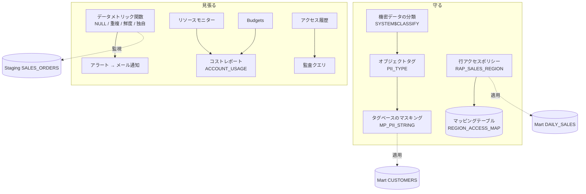

# Step 4 詳細編：データガバナンスとコスト管理

> 学習ロードマップ【全体概要編】の Step 4 を詳しく扱う資料です。
> 構成は「1. 概要 → 2. 概念解説 → 3. ハンズオン → 4. 現場の事例（ケーススタディ） → 5. 考察課題の解答例 → 6. 理解度チェックの解答 → 7. 参考資料」の順です。
> **前提**：Step 1〜3 の環境（3層データベース、ロール、`ADMIN_DB`、Step 3 のパイプラインと Mart の Dynamic Tables）が残っていること。Step 3 の最後に止めたタスクと Dynamic Tables は、`ALTER ... RESUME` で再開しておく。
> **エディション**：マスキングポリシー、行アクセスポリシー、タグベースのマスキング、データメトリック関数は **Enterprise Edition 以上**の機能です。

---

## 1. 概要

### 1.0 この章の物語

7月にパイプラインが自動で動き始め、高田さんは毎朝あなたを待たずに売上を見られるようになりました。その反動のように、8月の最初の週に2つの知らせが届きます。

> **【場面】8月3日（月）10:00　情報セキュリティ室の打ち合わせスペース**
>
> 石井さん：「今期の個人情報の内部監査、データ基盤も対象になりました。先に1つ指摘させてください。顧客のメールアドレス、アナリストに丸見えですよね。」
>
> あなた：「Step 2 のロール設計で、Mart を読めるのはアナリストとマーケだけに絞ってはいるんですが……。」
>
> 石井さん：「テーブルに触れる人を絞るのと、列の中身を見せないのは別の話です。監査報告は8月末。それまでに、どこに個人情報があって、誰に何が見えていて、誰が実際に見たのかを説明できるようにしてください。」

> **【場面】8月5日（水）9:15　経理部 野口さんからのチャット**
>
> 野口さん：「Snowflake の7月分の請求が届きました。今月の請求、先月の3倍なんですが、何か変わりました？」
>
> あなた：「7月からパイプラインを自動で回し始めたので、増えるとは思っていましたが……3倍ですか。」
>
> 佐伯さん：「『自動化したから』は説明にならないよ。どのウェアハウスの、どの処理が増えたのかを数字で言えないと、来月も同じ会話をすることになる。」

**この章であなたが解決すること**

| 困りごと | 解決する演習・事例 |
| --- | --- |
| 個人情報がどのテーブルのどの列にあるのか、一覧で説明できない | 演習 4-1 |
| アナリストやマーケティングに、個人情報がそのまま見えている | 演習 4-2（名寄せへの影響は事例 4-B） |
| エリア担当者に、他エリアの売上まで見えている | 演習 4-3（組織変更への対応は事例 4-D） |
| おかしなデータに、利用者のほうが先に気づいてしまう | 演習 4-4（アラートの死角は事例 4-E） |
| 請求額が3倍になった理由を説明できず、次の月の見通しも立たない | 事例 4-A、演習 4-5 |
| 「誰が顧客のメールアドレスを見たのか」に答えられない | 演習 4-6（削除依頼への対応は事例 4-C） |

### 1.1 このステップのゴール

Step 3 までに作った「動くデータ基盤」に、**守り（機密データの保護）** と **見張り（品質とコストの監視）** を加えます。機密データを自動で見つけて保護し、品質の劣化とコストの増加に気づける仕組みを、**Snowflake Horizon の機能で一元的に運用できる**ようになることがゴールです。

### 1.2 このステップで作るもの



### 1.3 到達目標チェックリスト

- [ ] Snowflake Horizon のガバナンス機能群（分類・タグ・ポリシー・系統・品質）の全体像を説明できる
- [ ] 機密データの分類を実行し、その結果を自社のタグ体系に反映できる
- [ ] タグベースのマスキングを設計・実装し、ロールごとに見え方を変えられる
- [ ] マッピングテーブル方式の行アクセスポリシーを実装できる
- [ ] ポリシーと Dynamic Tables・ビューの関係（誰の権限で評価されるか）を説明できる
- [ ] データメトリック関数（DMF）とエクスペクテーションで品質を監視し、違反を通知できる
- [ ] リソースモニターと Budgets を使い分け、コストの上限と予算を管理できる
- [ ] `ACCOUNT_USAGE` のビューから、ウェアハウス別・サービス別・ロール別のコストを集計できる
- [ ] アクセス履歴を使って、機密データへのアクセスを監査できる

### 1.4 所要時間の目安

| パート | 目安 |
| --- | --- |
| 概念解説の読み込み | 5〜6h |
| 環境準備（3.0） | 2h |
| 演習 4-1〜4-6 | 14〜17h |
| 考察課題・理解度チェック | 3h |
| **合計** | **25〜30h** |

---

## 2. 概念解説

### 2.1 Snowflake Horizon とガバナンス機能の全体像

Snowflake Horizon は、ガバナンスに関する機能群の総称です。この教材では、次の5つの観点で整理します。

| 観点 | 問い | 主な機能 |
| --- | --- | --- |
| **発見** | 機密データはどこにあるか | 機密データの分類、Trust Center |
| **分類の表現** | どのデータが何であるかを、どう記録するか | オブジェクトタグ、タグの自動伝播 |
| **保護** | 誰に、何を、どこまで見せるか | ダイナミックデータマスキング、タグベースのマスキング、行アクセスポリシー、（発展）集計ポリシー・射影ポリシー |
| **追跡** | 誰が、いつ、何にアクセスしたか。データはどこから来たか | アクセス履歴、オブジェクトの依存関係、データ系統 |
| **品質** | データは信頼できるか | データメトリック関数（DMF）、エクスペクテーション、データプロファイル、異常検知 |

> **RBAC（Step 2）との違い**：RBAC は「テーブルに触れるかどうか」を決めます。Step 4 のポリシーは、**触れるテーブルの中で「どの行・どの列の値を」見せるか**を決めます。両方を組み合わせて、多層的に防御します。

### 2.2 機密データの分類

- 列の名前と中身をもとに、**意味カテゴリ（SEMANTIC_CATEGORY）**（`EMAIL`、`PHONE_NUMBER`、`NAME` など）と、**プライバシーカテゴリ（PRIVACY_CATEGORY）**（`IDENTIFIER`：直接識別子、`QUASI_IDENTIFIER`：準識別子、`SENSITIVE`：機微情報）を判定します。
- 実行方法は2つあります。
  - **手動**：`SYSTEM$CLASSIFY` をテーブル単位で実行する。
  - **自動**：分類プロファイルをデータベースやスキーマに設定し、新しいテーブルを定期的に分類する。Trust Center からも設定できる。
- 判定結果をシステムタグとして自動で付けることもできます（`auto_tag`）。
- **限界**：日本語の氏名や住所など、判定できない、あるいは精度が低いものがあります。そのため、結果を人がレビューし、必要に応じてカスタムカテゴリで補います。

### 2.3 オブジェクトタグ

```sql
CREATE TAG governance.pii_type ALLOWED_VALUES 'EMAIL', 'PHONE', 'NAME', 'ADDRESS', 'BIRTHDATE';
ALTER TABLE customers MODIFY COLUMN email SET TAG governance.pii_type = 'EMAIL';
```

- タグは、オブジェクト（アカウント、データベース、スキーマ、テーブル、列、ウェアハウスなど）に付けるキーと値の組です。
- 用途は、機密データの表示（マスキングと連動）、コストの配賦（部門タグ）、所有者の記録など、多岐にわたります。
- **継承**：スキーマに付けたタグは、その中のテーブルにも継承されます。
- **自動伝播**：タグの `PROPAGATE` プロパティを設定すると、元の列から、CTAS やビューなどの派生オブジェクトの列に、タグが自動で伝播します。
- タグの付け外しには `APPLY TAG` 権限が必要です。タグを誰が管理するかは、ポリシーと同様に、ガバナンスの担当者に集約します。

### 2.4 マスキングポリシー

```sql
CREATE MASKING POLICY mp_email AS (val STRING) RETURNS STRING ->
  CASE WHEN IS_ROLE_IN_SESSION('FR_DATA_ENGINEER') THEN val
       ELSE REGEXP_REPLACE(val, '^[^@]+', '*****')     -- ドメインだけを残す
  END;
```

| 方式 | 割り当て方 | 向いているケース |
| --- | --- | --- |
| **列単位のマスキング** | 列ごとにポリシーを直接割り当てる | 対象の列が少ない |
| **タグベースのマスキング** | ポリシーを**タグに**割り当てる。タグが付いた列すべてに自動で適用される | 対象の列が多い、新しいテーブルが増える |
| **条件付きマスキング** | ポリシーの引数に他の列を追加し、その値によってマスクするかどうかを変える | 「本人の同意がある行だけ見せる」など |

- **`IS_ROLE_IN_SESSION` と `CURRENT_ROLE`**：`CURRENT_ROLE()` はプライマリロールの名前だけを返します。`IS_ROLE_IN_SESSION()` は、ロール階層やセカンダリロールで継承しているロールも考慮します。ロール階層を活かすには、後者を使うのが推奨です。
- マスキングは、クエリの中でその列が使われる**すべての箇所**（SELECT、WHERE、JOIN など）に適用されます。マスクされる利用者は、元の値で絞り込んだり結合したりできません。結合キーとして使う列をマスクする必要がある場合は、`SHA2()` などの決定的なハッシュ値でマスクし、ハッシュどうしで結合できるようにする設計を検討します。

### 2.5 行アクセスポリシー

```sql
CREATE ROW ACCESS POLICY rap_region AS (p_store_id STRING) RETURNS BOOLEAN ->
  EXISTS (SELECT 1 FROM region_access_map m
          WHERE IS_ROLE_IN_SESSION(m.role_name) AND m.store_id = p_store_id);
```

- ポリシーが TRUE を返した行だけが、クエリの結果に含まれます。
- **マッピングテーブル方式**：ロールと、見てよい値の対応を表に持たせる方式です。担当が変わっても、表を更新するだけで済み、ポリシーの定義を変える必要がありません。
- 1つのテーブル（またはビュー）に割り当てられる行アクセスポリシーは1つだけです。

### 2.6 ポリシーはどこに付けるか：Dynamic Tables・ビューとの関係

ポリシーは、**クエリを実行したロール**（ビューの場合は定義に依存する部分もある）で評価されます。この性質が、パイプラインの設計と関わってきます。

| ケース | 何が起こるか |
| --- | --- |
| Staging のテーブルに行アクセスポリシーを付け、その上に Dynamic Table を作る | Dynamic Table の更新は**所有者のロール**で実行される。所有者がポリシーで除外されていると、**Dynamic Table の中身そのものが欠ける** |
| Mart の Dynamic Table にポリシーを付ける | 利用者がクエリしたときに、利用者のロールで評価される（意図どおり） |

> **原則**：ポリシーは、**利用者が直接クエリする層（Mart やビュー）** に付けます。パイプラインが読む上流の層に付ける場合は、パイプラインのロールを必ず許可します。

### 2.7 追跡：アクセス履歴とオブジェクトの依存関係

| ビュー（`SNOWFLAKE.ACCOUNT_USAGE`） | わかること |
| --- | --- |
| `ACCESS_HISTORY` | どのクエリが、どのオブジェクトの、どの列を読んだか・書いたか（ビューを経由した場合も、元のテーブルまで記録される） |
| `OBJECT_DEPENDENCIES` | どのビューや Dynamic Table が、どのテーブルに依存しているか |
| `LOGIN_HISTORY` / `QUERY_HISTORY` | 誰がいつログインし、どのクエリを実行したか |

- `ACCOUNT_USAGE` のデータは、数十分から数時間遅れて反映されます。
- `SNOWFLAKE` データベースの参照権限は、用途別のデータベースロール（`SNOWFLAKE.GOVERNANCE_VIEWER`、`SNOWFLAKE.USAGE_VIEWER`、`SNOWFLAKE.SECURITY_VIEWER` など）で付与できます。ACCOUNTADMIN を使わずに監視や監査を行うため、これらを監視用のロールに付与します。

### 2.8 データ品質：データメトリック関数（DMF）

```sql
ALTER TABLE t SET DATA_METRIC_SCHEDULE = 'TRIGGER_ON_CHANGES';          -- 測定のタイミング（変更時、または定期）
ALTER TABLE t ADD DATA METRIC FUNCTION SNOWFLAKE.CORE.NULL_COUNT ON (customer_id);
```

| 種類 | 例 |
| --- | --- |
| システム DMF（`SNOWFLAKE.CORE`） | `NULL_COUNT`、`DUPLICATE_COUNT`、`UNIQUE_COUNT`、`ROW_COUNT`、`FRESHNESS`（鮮度）など |
| 独自の DMF | `CREATE DATA METRIC FUNCTION` で、業務ルールを SQL で定義する（例：許されないチャネルの件数） |
| エクスペクテーション | DMF の結果に「期待する値」（例：`VALUE = 0`）を付け、違反したかどうかを判定する |

- 測定の結果は `SNOWFLAKE.LOCAL.DATA_QUALITY_MONITORING_RESULTS` に記録されます。
- DMF の実行はサーバーレスで、コストがかかります。測定の頻度は、データの更新頻度と重要度に合わせて決めます。
- **違反の通知**：アラート（`CREATE ALERT`）で測定結果を定期的に確認し、違反があればメールやチャットに通知します。

### 2.9 アラートと通知

```sql
CREATE ALERT a
  WAREHOUSE = wh  SCHEDULE = '60 MINUTE'
  IF (EXISTS (<違反を検出するクエリ>))
  THEN CALL SYSTEM$SEND_EMAIL('<通知連携>', '<宛先>', '<件名>', '<本文>');
```

- 通知の送り先は、**通知連携（NOTIFICATION INTEGRATION）** で定義します（メール、Slack や Teams などの Webhook、クラウドのキュー）。
- `SNOWFLAKE.ALERT.LAST_SUCCESSFUL_SCHEDULED_TIME()` を条件に使うと、「前回のチェック以降に起きた違反だけ」を検出でき、同じ違反を何度も通知せずに済みます。
- Step 3 の Snowpipe の失敗やタスクの失敗の監視にも、同じ仕組みを使えます。

### 2.10 コストの構造と管理

| コストの種類 | 内容 | 主に確認するビュー |
| --- | --- | --- |
| コンピュート（ウェアハウス） | ウェアハウスの稼働時間 | `WAREHOUSE_METERING_HISTORY` |
| サーバーレス | Snowpipe、サーバーレスタスク、DMF、自動クラスタリング、検索最適化など | `METERING_DAILY_HISTORY`（`SERVICE_TYPE` 別）、各機能の `*_HISTORY` |
| クラウドサービス | 1日のコンピュート消費の10%を超えた分 | `METERING_DAILY_HISTORY` |
| AI 機能 | Cortex の各機能（Step 5 以降） | `METERING_DAILY_HISTORY`、Cortex 関連の使用量ビュー |
| ストレージ | アクティブ、Time Travel、Fail-safe | `DATABASE_STORAGE_USAGE_HISTORY`、`TABLE_STORAGE_METRICS` |
| データ転送 | リージョンやクラウドをまたぐ転送 | `DATA_TRANSFER_HISTORY` |

**リソースモニターと Budgets の違い**

| | リソースモニター | Budgets |
| --- | --- | --- |
| 対象 | **ウェアハウス**のクレジット（アカウント全体または個別のウェアハウス） | ウェアハウスに加えて、**サーバーレス機能や AI 機能**を含む、オブジェクトやタグの単位 |
| できること | 閾値で通知、**ウェアハウスを停止する** | 月の支出上限に対する**予測と通知**（停止はしない。ストアドプロシージャの呼び出しは可能） |
| 位置づけ | 暴走を止める「ブレーカー」 | 予算を管理する「家計簿と見通し」 |

**クエリ単位のコスト**：`QUERY_ATTRIBUTION_HISTORY` を使うと、ウェアハウスのクレジットをクエリ単位に配分した値を確認できます。ロール別、ユーザー別、クエリタグ別のコストの集計に使います。

---

## 3. ハンズオン

各演習は **「手順（コード）」→「確認ポイント」→「考察課題」** の順に進みます。考察課題の解答例は第5章にあります。

### 3.0 環境準備

#### (1) ガバナンス担当のロールとスキーマを作る（`06_governance_setup.sql`）

ポリシーやタグを管理する**データスチュワード**のロール `FR_GOVERNANCE` を作ります。データを作る側（`FR_PIPELINE` など）と、保護のルールを決める側を分けることが狙いです。

```sql
-- 06_governance_setup.sql
-- ---------- ロール ----------
USE ROLE USERADMIN;
CREATE ROLE IF NOT EXISTS FR_GOVERNANCE COMMENT = 'データスチュワード：タグ・ポリシー・品質・監査';
CREATE ROLE IF NOT EXISTS FR_REGION_KANTO  COMMENT = '関東エリア担当（自エリアの売上のみ参照）';
CREATE ROLE IF NOT EXISTS FR_REGION_KANSAI COMMENT = '関西エリア担当（自エリアの売上のみ参照）';
GRANT ROLE FR_GOVERNANCE, FR_REGION_KANTO, FR_REGION_KANSAI TO ROLE SYSADMIN;
GRANT ROLE AR_DEV_MART_R, AR_WH_BI_U TO ROLE FR_REGION_KANTO;
GRANT ROLE AR_DEV_MART_R, AR_WH_BI_U TO ROLE FR_REGION_KANSAI;
GRANT ROLE AR_WH_TRANSFORM_U TO ROLE FR_GOVERNANCE;

SET me = CURRENT_USER();
GRANT ROLE FR_GOVERNANCE    TO USER IDENTIFIER($me);
GRANT ROLE FR_REGION_KANTO  TO USER IDENTIFIER($me);
GRANT ROLE FR_REGION_KANSAI TO USER IDENTIFIER($me);

-- ---------- スキーマ ----------
USE ROLE SYSADMIN;
CREATE SCHEMA IF NOT EXISTS ADMIN_DB.GOVERNANCE COMMENT = 'タグ・ポリシー・DMF・アラート';
GRANT OWNERSHIP ON SCHEMA ADMIN_DB.GOVERNANCE TO ROLE FR_GOVERNANCE COPY CURRENT GRANTS;

USE ROLE SECURITYADMIN;
GRANT USAGE ON DATABASE ADMIN_DB TO ROLE FR_GOVERNANCE;

-- ---------- アカウントレベルの権限（ACCOUNTADMIN） ----------
USE ROLE ACCOUNTADMIN;
GRANT APPLY MASKING POLICY    ON ACCOUNT TO ROLE FR_GOVERNANCE;
GRANT APPLY ROW ACCESS POLICY ON ACCOUNT TO ROLE FR_GOVERNANCE;
GRANT APPLY TAG               ON ACCOUNT TO ROLE FR_GOVERNANCE;
GRANT EXECUTE ALERT           ON ACCOUNT TO ROLE FR_GOVERNANCE;
-- DMF の実行はテーブルの所有者のロールで行われる
GRANT EXECUTE DATA METRIC FUNCTION ON ACCOUNT TO ROLE FR_PIPELINE;
GRANT DATABASE ROLE SNOWFLAKE.DATA_METRIC_USER TO ROLE FR_PIPELINE;
-- ACCOUNT_USAGE の参照（ACCOUNTADMIN を使わずに監査・監視するため）
GRANT DATABASE ROLE SNOWFLAKE.GOVERNANCE_VIEWER TO ROLE FR_GOVERNANCE;
GRANT DATABASE ROLE SNOWFLAKE.USAGE_VIEWER      TO ROLE FR_GOVERNANCE;
GRANT DATABASE ROLE SNOWFLAKE.SECURITY_VIEWER   TO ROLE FR_GOVERNANCE;
-- 品質の測定結果の参照
GRANT APPLICATION ROLE SNOWFLAKE.DATA_QUALITY_MONITORING_VIEWER TO ROLE FR_GOVERNANCE;
-- 機密データの分類（データ所有側が実行する）
GRANT DATABASE ROLE SNOWFLAKE.CLASSIFICATION_ADMIN TO ROLE FR_DATA_ENGINEER;
```

> `FR_GOVERNANCE` には、業務データの**読み取り権限を原則として付与しません**。ポリシーを設計するのに、データの中身を見る必要はないからです（ただし、行アクセスポリシーが参照するマスタテーブルは例外とします。3.0 (2) を参照）。

#### (2) 顧客マスタと店舗マスタを用意する

```sql
-- 顧客マスタ（Raw）：個人情報を含む
USE ROLE SYSADMIN;
USE WAREHOUSE DEV_TRANSFORM_WH;
CREATE SCHEMA IF NOT EXISTS DEV_RAW_DB.CRM;

CREATE OR REPLACE TABLE DEV_RAW_DB.CRM.CUSTOMERS AS
SELECT
  'C' || LPAD((SEQ4() + 1)::STRING, 6, '0') AS CUSTOMER_ID,
  GET(ARRAY_CONSTRUCT('佐藤','鈴木','高橋','田中','伊藤','渡辺','山本','中村','小林','加藤'), UNIFORM(0, 9, RANDOM()))::STRING
    || ' ' ||
  GET(ARRAY_CONSTRUCT('太郎','花子','一郎','美咲','健太','由美','翔','さくら','大輔','愛'), UNIFORM(0, 9, RANDOM()))::STRING
                                                                          AS FULL_NAME,
  'user' || LPAD((SEQ4() + 1)::STRING, 6, '0') || '@' ||
    GET(ARRAY_CONSTRUCT('example.com','example.jp','example.net'), UNIFORM(0, 2, RANDOM()))::STRING
                                                                          AS EMAIL,
  '090-' || LPAD(UNIFORM(0, 9999, RANDOM())::STRING, 4, '0') || '-' ||
            LPAD(UNIFORM(0, 9999, RANDOM())::STRING, 4, '0')              AS PHONE,
  GET(ARRAY_CONSTRUCT('東京都','神奈川県','埼玉県','千葉県','大阪府','京都府','兵庫県','愛知県','福岡県','宮城県'),
      UNIFORM(0, 9, RANDOM()))::STRING                                    AS PREFECTURE,
  DATEADD(day, -UNIFORM(7000, 25000, RANDOM()), CURRENT_DATE())          AS BIRTH_DATE,
  IFF(UNIFORM(1, 10, RANDOM()) <= 7, 'Y', 'N')                            AS MAIL_OPT_IN
FROM TABLE(GENERATOR(ROWCOUNT => 20000));
```

```sql
-- Mart の顧客テーブルと店舗マスタ（パイプラインが所有する）
USE ROLE FR_PIPELINE;
USE SECONDARY ROLES NONE;
USE WAREHOUSE DEV_TRANSFORM_WH;

CREATE OR REPLACE DYNAMIC TABLE DEV_MART_DB.SALES.CUSTOMERS
  TARGET_LAG = '1 day' WAREHOUSE = DEV_TRANSFORM_WH REFRESH_MODE = INCREMENTAL
  COMMENT = '顧客マスタ（Mart）'
AS
SELECT CUSTOMER_ID, FULL_NAME, EMAIL, PHONE, PREFECTURE, BIRTH_DATE, MAIL_OPT_IN
FROM DEV_RAW_DB.CRM.CUSTOMERS;

CREATE OR REPLACE TABLE DEV_MART_DB.SALES.STORES AS
SELECT
  'S' || LPAD(n::STRING, 3, '0') AS STORE_ID,
  'スノー商事 ' || n || '号店'   AS STORE_NAME,
  CASE WHEN n <= 15 THEN '関東' WHEN n <= 25 THEN '関西' WHEN n <= 35 THEN '中部'
       WHEN n <= 42 THEN '九州' ELSE '東北' END AS REGION
FROM (SELECT SEQ4() + 1 AS n FROM TABLE(GENERATOR(ROWCOUNT => 50)));
```

```sql
-- 例外：行アクセスポリシーが参照する店舗マスタだけは、FR_GOVERNANCE に読み取りを許可する
USE ROLE SECURITYADMIN;
GRANT USAGE  ON DATABASE DEV_MART_DB                  TO ROLE FR_GOVERNANCE;
GRANT USAGE  ON SCHEMA   DEV_MART_DB.SALES            TO ROLE FR_GOVERNANCE;
GRANT SELECT ON TABLE    DEV_MART_DB.SALES.STORES     TO ROLE FR_GOVERNANCE;
```

#### (3) 通知連携を作る（ACCOUNTADMIN）

```sql
USE ROLE ACCOUNTADMIN;
CREATE NOTIFICATION INTEGRATION IF NOT EXISTS NI_EMAIL_TRAINING
  TYPE = EMAIL
  ENABLED = TRUE
  ALLOWED_RECIPIENTS = ('<自分の検証済みメールアドレス>');
GRANT USAGE ON INTEGRATION NI_EMAIL_TRAINING TO ROLE FR_GOVERNANCE;
```

---

### 演習 4-1：機密データを分類し、タグを付ける

> **【場面】8月4日（火）10:30　データ基盤チームの島**
>
> 石井さん：「監査の最初の資料として、個人情報がどのテーブルのどの列にあるか、一覧をください。」
>
> あなた：「顧客マスタの氏名とメールと電話……くらいだと思います。」
>
> 佐伯さん：「『くらいだと思う』が一番危ない。前の現場では、誰かが作ったコピーのテーブルに電話番号が残っていて、監査で見つかったんだ。まず機械に洗い出させて、最後は人が判断しよう。」

**ねらい**：機密データの所在を自動で洗い出し、その結果を自社のタグ体系に落とし込む。

#### 手順 A：分類を実行する（データ所有側：FR_DATA_ENGINEER）

```sql
USE ROLE FR_DATA_ENGINEER;
USE SECONDARY ROLES NONE;
USE WAREHOUSE DEV_TRANSFORM_WH;

-- 分類を実行する（まずは結果の確認だけ。タグは自動で付けない）
CALL SYSTEM$CLASSIFY('DEV_RAW_DB.CRM.CUSTOMERS', {'auto_tag': false});

-- 結果を列ごとに展開して読みやすくする
SELECT f.key AS column_name,
       f.value:recommendation:semantic_category::STRING AS semantic_category,
       f.value:recommendation:privacy_category::STRING  AS privacy_category,
       f.value:recommendation:confidence::STRING        AS confidence
FROM TABLE(FLATTEN(INPUT => PARSE_JSON(SYSTEM$GET_CLASSIFICATION_RESULT('DEV_RAW_DB.CRM.CUSTOMERS')):classification_result)) f
ORDER BY column_name;
```

> 結果の JSON の構造は、機能の更新によって変わることがあります。うまく展開できない場合は、まず `SYSTEM$GET_CLASSIFICATION_RESULT` の結果をそのまま表示し、構造を確認してください。Snowsight の **[Governance & security] → [Trust Center]** からも、分類の結果を確認できます。

#### 手順 B：分類結果をレビューし、タグ体系を決める

分類結果を次の表に書き込み、**自社のタグ（`PII_TYPE`）に何を付けるか**を決めます。

| 列 | 分類の結果（意味／プライバシー） | 判定は妥当か | 付ける PII_TYPE |
| --- | --- | --- | --- |
| FULL_NAME | | | `NAME` |
| EMAIL | | | `EMAIL` |
| PHONE | | | `PHONE` |
| PREFECTURE | | | `ADDRESS` |
| BIRTH_DATE | | | `BIRTHDATE` |
| MAIL_OPT_IN | | | （付けない） |

#### 手順 C：タグを作り、Raw と Mart の列に付ける（ガバナンス側：FR_GOVERNANCE）

```sql
USE ROLE FR_GOVERNANCE;
USE SECONDARY ROLES NONE;
USE SCHEMA ADMIN_DB.GOVERNANCE;

CREATE TAG IF NOT EXISTS PII_TYPE
  ALLOWED_VALUES 'NAME', 'EMAIL', 'PHONE', 'ADDRESS', 'BIRTHDATE'
  COMMENT = '個人情報の種類（マスキングポリシーと連動する）';

CREATE TAG IF NOT EXISTS DATA_OWNER COMMENT = 'データの責任部署';

-- Raw の顧客マスタ
ALTER TABLE DEV_RAW_DB.CRM.CUSTOMERS MODIFY
  COLUMN FULL_NAME  SET TAG PII_TYPE = 'NAME',
  COLUMN EMAIL      SET TAG PII_TYPE = 'EMAIL',
  COLUMN PHONE      SET TAG PII_TYPE = 'PHONE',
  COLUMN PREFECTURE SET TAG PII_TYPE = 'ADDRESS',
  COLUMN BIRTH_DATE SET TAG PII_TYPE = 'BIRTHDATE';

-- Mart の顧客テーブル（Dynamic Table）
ALTER DYNAMIC TABLE DEV_MART_DB.SALES.CUSTOMERS MODIFY
  COLUMN FULL_NAME  SET TAG PII_TYPE = 'NAME',
  COLUMN EMAIL      SET TAG PII_TYPE = 'EMAIL',
  COLUMN PHONE      SET TAG PII_TYPE = 'PHONE',
  COLUMN PREFECTURE SET TAG PII_TYPE = 'ADDRESS',
  COLUMN BIRTH_DATE SET TAG PII_TYPE = 'BIRTHDATE';

-- 責任部署のタグはスキーマに付ける（中のテーブルに継承される）
ALTER SCHEMA DEV_RAW_DB.CRM   SET TAG DATA_OWNER = 'CRM推進部';
ALTER SCHEMA DEV_MART_DB.SALES SET TAG DATA_OWNER = '営業企画部';
```

#### 手順 D：タグの付与状況を確認する

```sql
-- 特定のテーブルの列に付いているタグ（継承されたものを含む）
SELECT *
FROM TABLE(DEV_MART_DB.INFORMATION_SCHEMA.TAG_REFERENCES_ALL_COLUMNS('DEV_MART_DB.SALES.CUSTOMERS', 'table'));

-- アカウント全体で PII_TYPE が付いている列の一覧（ACCOUNT_USAGE は反映に最大2時間程度かかる）
SELECT object_database, object_schema, object_name, column_name, tag_value
FROM SNOWFLAKE.ACCOUNT_USAGE.TAG_REFERENCES
WHERE tag_name = 'PII_TYPE' AND object_deleted IS NULL
ORDER BY 1, 2, 3, 4;
```

#### 確認ポイント

- EMAIL と PHONE は、分類で個人情報として正しく検出されている。
- 日本語の氏名や都道府県について、分類の結果と実態の間にずれがあれば、それを記録している。
- Mart の `CUSTOMERS` の5列に `PII_TYPE` が付いている。

#### 考察課題

- **Q4-1a**：分類の結果をそのまま自動でタグ付け（`auto_tag`）するのではなく、人がレビューしてから自社のタグを付ける運用にした理由を説明せよ。
- **Q4-1b**：新しいテーブルが追加されるたびに、タグの付け漏れが起きないようにするには、どのような仕組みが考えられるか。
- **発展**：タグの自動伝播（`PROPAGATE` プロパティ）を設定したタグを使い、Raw の列に付けたタグが CTAS で作ったテーブルに伝播することを確かめよ。

---

### 演習 4-2：タグベースのマスキング

> **【場面】8月5日（水）14:00　情報セキュリティ室との定例**
>
> 石井さん：「一覧、ありがとうございます。では本題です。アナリストのロールからメールアドレスが見えている状態は、いつ塞げますか。」
>
> 森さん：「待ってください。全部隠されると、キャンペーンの配信先が社内アドレスに偏っていないかのチェックができません。せめてドメインだけでも見たいです。」
>
> 高田さん：「経営企画は、都道府県別の分析ができれば氏名もメールもいりません。」
>
> 佐伯さん：「見せ方がロールごとに違うなら、ポリシーは1つにまとめて、演習 4-1 で付けたタグに割り当てよう。列ごとに付けると、テーブルが増えるたびに必ず漏れる。」

**ねらい**：タグとマスキングポリシーを連動させ、個人情報の列を「付けたタグに応じて」自動で保護する。

#### 手順 A：マスキングポリシーを作り、タグに割り当てる

```sql
USE ROLE FR_GOVERNANCE;
USE SECONDARY ROLES NONE;
USE SCHEMA ADMIN_DB.GOVERNANCE;

-- 文字列型の個人情報用
CREATE OR REPLACE MASKING POLICY MP_PII_STRING AS (val STRING) RETURNS STRING ->
  CASE
    -- パイプラインとデータエンジニアは元の値を見られる
    WHEN IS_ROLE_IN_SESSION('FR_PIPELINE') OR IS_ROLE_IN_SESSION('FR_DATA_ENGINEER') THEN val
    -- マーケティングは、配信先の確認のためにメールのドメインだけ見られる
    WHEN IS_ROLE_IN_SESSION('FR_MARKETING')
         AND SYSTEM$GET_TAG_ON_CURRENT_COLUMN('ADMIN_DB.GOVERNANCE.PII_TYPE') = 'EMAIL'
      THEN REGEXP_REPLACE(val, '^[^@]+', '*****')
    -- アナリストは、住所（都道府県）だけ見られる（地域別の分析のため）
    WHEN IS_ROLE_IN_SESSION('FR_ANALYST')
         AND SYSTEM$GET_TAG_ON_CURRENT_COLUMN('ADMIN_DB.GOVERNANCE.PII_TYPE') = 'ADDRESS'
      THEN val
    ELSE '***MASKED***'
  END
  COMMENT = '個人情報（文字列）のマスキング。PII_TYPE タグと連動';

-- 日付型の個人情報用（生年月日は年だけ残す）
CREATE OR REPLACE MASKING POLICY MP_PII_DATE AS (val DATE) RETURNS DATE ->
  CASE
    WHEN IS_ROLE_IN_SESSION('FR_PIPELINE') OR IS_ROLE_IN_SESSION('FR_DATA_ENGINEER') THEN val
    WHEN IS_ROLE_IN_SESSION('FR_ANALYST') THEN DATE_FROM_PARTS(YEAR(val), 1, 1)
    ELSE NULL
  END
  COMMENT = '個人情報（日付）のマスキング。PII_TYPE タグと連動';

-- タグに割り当てる（データ型ごとに1つずつ割り当てられる）
ALTER TAG PII_TYPE SET MASKING POLICY MP_PII_STRING, MASKING POLICY MP_PII_DATE;
```

#### 手順 B：ロールごとの見え方を確かめる

```sql
-- ===== 検証ブロック（<ROLE> を書き換えて実行する） =====
USE ROLE <ROLE>;
USE SECONDARY ROLES NONE;
USE WAREHOUSE DEV_BI_WH;           -- FR_PIPELINE / FR_DATA_ENGINEER は DEV_TRANSFORM_WH
SELECT CUSTOMER_ID, FULL_NAME, EMAIL, PHONE, PREFECTURE, BIRTH_DATE
FROM DEV_MART_DB.SALES.CUSTOMERS
LIMIT 5;
-- ===== ここまで =====
```

| ロール | FULL_NAME | EMAIL | PHONE | PREFECTURE | BIRTH_DATE |
| --- | --- | --- | --- | --- | --- |
| `FR_DATA_ENGINEER` | 元の値 | 元の値 | 元の値 | 元の値 | 元の値 |
| `FR_ANALYST` | MASKED | MASKED | MASKED | 元の値 | 年のみ |
| `FR_MARKETING` | MASKED | ドメインのみ | MASKED | MASKED | NULL |

#### 手順 C：新しいテーブルでも、タグを付けるだけで保護されることを確かめる

```sql
-- パイプラインが、顧客の連絡先だけを持つ新しい Mart テーブルを作った
USE ROLE FR_PIPELINE;
USE SECONDARY ROLES NONE;
USE WAREHOUSE DEV_TRANSFORM_WH;
CREATE OR REPLACE TABLE DEV_MART_DB.SALES.CUSTOMER_CONTACTS AS
SELECT CUSTOMER_ID, EMAIL AS CONTACT_EMAIL, MAIL_OPT_IN
FROM DEV_RAW_DB.CRM.CUSTOMERS;

-- タグを付ける前：マーケティングからは元のメールアドレスが見えてしまう
USE ROLE FR_MARKETING;
USE SECONDARY ROLES NONE;
USE WAREHOUSE DEV_BI_WH;
SELECT * FROM DEV_MART_DB.SALES.CUSTOMER_CONTACTS LIMIT 3;

-- ガバナンス側がタグを付ける（ポリシーの割り当ては不要）
USE ROLE FR_GOVERNANCE;
ALTER TABLE DEV_MART_DB.SALES.CUSTOMER_CONTACTS
  MODIFY COLUMN CONTACT_EMAIL SET TAG ADMIN_DB.GOVERNANCE.PII_TYPE = 'EMAIL';

-- タグを付けた後：ドメインだけが見える
USE ROLE FR_MARKETING;
SELECT * FROM DEV_MART_DB.SALES.CUSTOMER_CONTACTS LIMIT 3;
```

> **注意**：このテーブルを `CREATE OR REPLACE` で作り直すと、列に付けたタグは失われます。作り直しのたびに付け直す運用は漏れの原因になるため、タグの自動伝播（発展課題）や、作成後にタグを付けるところまでをパイプラインに組み込むことを検討します。
> また、`USE ROLE SYSADMIN` で `DEV_MART_DB.SALES.CUSTOMERS` を参照すると、マスクされずに元の値が見えます。その理由は Q4-2b で考えます。

#### 確認ポイント

- 手順 B の期待結果表と、実際の結果が一致する。
- 手順 C で、ポリシーを追加で割り当てずに、タグを付けるだけで新しい列が保護される。

#### 考察課題

- **Q4-2a**：マスキングの条件に `CURRENT_ROLE()` ではなく `IS_ROLE_IN_SESSION()` を使った理由と、その場合に注意すべき点を説明せよ。
- **Q4-2b**：SYSADMIN で顧客マスタを見ると、マスクされずに元の値が見えてしまう。なぜか。これを問題と考えるなら、どう設計を変えるべきか。
- **発展**：条件付きマスキングを使い、「`MAIL_OPT_IN = 'Y'` の顧客のメールアドレスだけ、マーケティングに見せる」ポリシーを作れ。

---

### 演習 4-3：行アクセスポリシー（マッピングテーブル方式）

> **【場面】8月10日（月）11:00　営業本部とのオンライン会議**
>
> 小池さん：「列を隠す話は聞きました。うちは行のほうです。エリアの営業に売上を見せたいんですが、今のままだと関西や九州の数字まで全部見えますよね。」
>
> 高田さん：「経営企画は全エリアが見えないと困ります。そこは変えないでください。」
>
> 佐伯さん：「エリアの担当は毎年のように変わる。ポリシーの中にロール名とエリアを直接書くと、組織変更のたびに DDL を書き換えることになるよ。対応表はテーブルに出しておこう。」

**ねらい**：エリア担当者が、自分の担当エリアの売上だけを参照できるようにする。担当の変更を、マッピングテーブルの更新だけで反映できるようにする。

#### 手順 A：マッピングテーブルとポリシーを作る

```sql
USE ROLE FR_GOVERNANCE;
USE SECONDARY ROLES NONE;
USE SCHEMA ADMIN_DB.GOVERNANCE;
USE WAREHOUSE DEV_TRANSFORM_WH;

CREATE OR REPLACE TABLE REGION_ACCESS_MAP (
  ROLE_NAME STRING,
  REGION    STRING      -- 'ALL' は全エリア
);
INSERT INTO REGION_ACCESS_MAP VALUES
  ('FR_PIPELINE',      'ALL'),   -- パイプライン（Dynamic Table の下流の更新に必要）
  ('FR_DATA_ENGINEER', 'ALL'),
  ('FR_ANALYST',       'ALL'),
  ('FR_MARKETING',     'ALL'),
  ('FR_REGION_KANTO',  '関東'),
  ('FR_REGION_KANSAI', '関西');

CREATE OR REPLACE ROW ACCESS POLICY RAP_SALES_REGION AS (p_store_id STRING) RETURNS BOOLEAN ->
  EXISTS (
    SELECT 1
    FROM ADMIN_DB.GOVERNANCE.REGION_ACCESS_MAP m
    LEFT JOIN DEV_MART_DB.SALES.STORES s ON s.STORE_ID = p_store_id
    WHERE IS_ROLE_IN_SESSION(m.ROLE_NAME)
      AND (m.REGION = 'ALL' OR m.REGION = s.REGION)
  )
  COMMENT = '店舗のエリアに基づく行の制御。担当はマッピングテーブルで管理';

-- 日次売上（Mart の Dynamic Table）に適用する
ALTER DYNAMIC TABLE DEV_MART_DB.SALES.DAILY_SALES ADD ROW ACCESS POLICY RAP_SALES_REGION ON (STORE_ID);
```

#### 手順 B：ロールごとの見え方を確かめる

```sql
-- ===== 検証ブロック =====
USE ROLE <ROLE>;
USE SECONDARY ROLES NONE;
USE WAREHOUSE DEV_BI_WH;
SELECT s.REGION, COUNT(*) AS rows_cnt, SUM(d.SALES_AMOUNT) AS sales
FROM DEV_MART_DB.SALES.DAILY_SALES d
JOIN DEV_MART_DB.SALES.STORES s ON s.STORE_ID = d.STORE_ID
GROUP BY s.REGION ORDER BY s.REGION;
-- ===== ここまで =====
```

| ロール | 見えるエリア |
| --- | --- |
| `FR_ANALYST` | 全エリア |
| `FR_REGION_KANTO` | 関東のみ |
| `FR_REGION_KANSAI` | 関西のみ |

#### 手順 C：担当の変更をマッピングテーブルだけで反映する

関西担当が、中部エリアも兼務することになりました。

```sql
USE ROLE FR_GOVERNANCE;
INSERT INTO ADMIN_DB.GOVERNANCE.REGION_ACCESS_MAP VALUES ('FR_REGION_KANSAI', '中部');
-- FR_REGION_KANSAI で手順 B を再実行し、中部が見えるようになったことを確かめる
```

#### 手順 D：下流の Dynamic Table への影響を確かめる

```sql
-- MONTHLY_SALES は DAILY_SALES から作られている。更新後も全エリアの合計になっているか確かめる
USE ROLE FR_ANALYST;
USE SECONDARY ROLES NONE;
USE WAREHOUSE DEV_BI_WH;
SELECT SUM(SALES_AMOUNT) FROM DEV_MART_DB.SALES.MONTHLY_SALES;
SELECT SUM(SALES_AMOUNT) FROM DEV_MART_DB.SALES.DAILY_SALES;   -- 一致すること

-- 試しに、マッピングテーブルから FR_PIPELINE の行を削除し、MONTHLY_SALES を手動でリフレッシュすると、どうなるか
USE ROLE FR_GOVERNANCE;
DELETE FROM ADMIN_DB.GOVERNANCE.REGION_ACCESS_MAP WHERE ROLE_NAME = 'FR_PIPELINE';
USE ROLE FR_PIPELINE;
ALTER DYNAMIC TABLE DEV_MART_DB.SALES.MONTHLY_SALES REFRESH;
-- 結果を確認したら、必ず元に戻す
USE ROLE FR_GOVERNANCE;
INSERT INTO ADMIN_DB.GOVERNANCE.REGION_ACCESS_MAP VALUES ('FR_PIPELINE', 'ALL');
USE ROLE FR_PIPELINE;
ALTER DYNAMIC TABLE DEV_MART_DB.SALES.MONTHLY_SALES REFRESH;
```

#### 確認ポイント

- 手順 B の期待結果と一致する。
- 手順 C で、ポリシーの定義を変えずに、兼務が反映される。
- 手順 D で、パイプラインのロールをマッピングから外すと、下流の `MONTHLY_SALES` の中身が空になる（または欠ける）ことを確認し、元に戻した後に正しい値に戻る。

#### 考察課題

- **Q4-3a**：マッピングテーブル方式の利点を、ポリシーの中に `CASE WHEN IS_ROLE_IN_SESSION('FR_REGION_KANTO') THEN ...` と直接書く方式と比べて説明せよ。
- **Q4-3b**：手順 D で起きたことを説明し、行アクセスポリシーを適用する層の設計原則を述べよ。
- **Q4-3c**：マッピングテーブルそのものを、誰が更新できるようにすべきか。

---

### 演習 4-4：データメトリック関数による品質監視と通知

> **【場面】8月12日（水）9:20　高田さんからのチャット**
>
> 高田さん：「チャネル別の売上に『APP』という見慣れない行が出ています。これ、何ですか？経営会議の資料に載せてしまうところでした。」
>
> あなた：「中川さんに確認したら、先週からスマホアプリ経由の注文を別のチャネルとして出し始めたそうです……事前の連絡はありませんでした。」
>
> 佐伯さん：「データの異常を利用者に先に見つけられるのが、一番信用を失う。テーブルそのものを見張って、こちらが先に気づけるようにしよう。」

**ねらい**：Staging 層の品質を自動で測定し、期待から外れたら通知する。

#### 手順 A：システム DMF とエクスペクテーションを設定する（テーブルの所有者：FR_PIPELINE）

```sql
USE ROLE FR_PIPELINE;
USE SECONDARY ROLES NONE;

-- 測定のタイミング：テーブルが変更されたとき
ALTER TABLE DEV_STG_DB.SALES.SALES_ORDERS SET DATA_METRIC_SCHEDULE = 'TRIGGER_ON_CHANGES';

-- NULL の件数（顧客 ID は必須）
ALTER TABLE DEV_STG_DB.SALES.SALES_ORDERS
  ADD DATA METRIC FUNCTION SNOWFLAKE.CORE.NULL_COUNT ON (CUSTOMER_ID)
  EXPECTATION customer_id_not_null (VALUE = 0);

-- 重複の件数（注文 ID は一意）
ALTER TABLE DEV_STG_DB.SALES.SALES_ORDERS
  ADD DATA METRIC FUNCTION SNOWFLAKE.CORE.DUPLICATE_COUNT ON (ORDER_ID)
  EXPECTATION order_id_unique (VALUE = 0);

-- 鮮度（最後にロードされてから何秒経ったか。24時間以内であること）
ALTER TABLE DEV_STG_DB.SALES.SALES_ORDERS
  ADD DATA METRIC FUNCTION SNOWFLAKE.CORE.FRESHNESS ON (_LOADED_AT)
  EXPECTATION loaded_within_1day (VALUE <= 86400);
```

> **エクスペクテーションの構文**：`EXPECTATION` 句の書き方は、機能の更新で変わることがあります。エラーになる場合は、まず DMF だけを追加し、期待値の判定はアラートの条件（手順 D）で行ってください。

#### 手順 B：独自の DMF を作る（業務ルール：チャネルは EC か STORE のみ）

```sql
USE ROLE FR_GOVERNANCE;
USE SCHEMA ADMIN_DB.GOVERNANCE;

CREATE OR REPLACE DATA METRIC FUNCTION DMF_INVALID_CHANNEL_COUNT(ARG_T TABLE(ARG_C STRING))
RETURNS NUMBER
COMMENT = 'チャネルが EC / STORE 以外の行数'
AS
$$
  SELECT COUNT_IF(ARG_C NOT IN ('EC', 'STORE') OR ARG_C IS NULL) FROM ARG_T
$$;

-- テーブルの所有者（FR_PIPELINE）が使えるようにする
GRANT USAGE ON SCHEMA ADMIN_DB.GOVERNANCE TO ROLE FR_PIPELINE;
GRANT USAGE ON FUNCTION DMF_INVALID_CHANNEL_COUNT(TABLE(STRING)) TO ROLE FR_PIPELINE;
-- ※ DMF への権限付与の構文でエラーになる場合は、公式ドキュメントの「Use SQL to set up data metric functions」を確認する
USE ROLE SECURITYADMIN;
GRANT USAGE ON DATABASE ADMIN_DB TO ROLE FR_PIPELINE;

USE ROLE FR_PIPELINE;
ALTER TABLE DEV_STG_DB.SALES.SALES_ORDERS
  ADD DATA METRIC FUNCTION ADMIN_DB.GOVERNANCE.DMF_INVALID_CHANNEL_COUNT ON (CHANNEL)
  EXPECTATION valid_channel (VALUE = 0);
```

#### 手順 C：違反を起こして、測定結果を確認する

```sql
-- わざと不正なデータを入れる（Staging に直接。検証が終わったら削除する）
USE ROLE FR_PIPELINE;
USE WAREHOUSE DEV_TRANSFORM_WH;
INSERT INTO DEV_STG_DB.SALES.SALES_ORDERS
  (ORDER_ID, ORDER_DATE, STORE_ID, CHANNEL, CUSTOMER_ID, PRODUCT_ID, QUANTITY, UNIT_PRICE, AMOUNT, _SOURCE_FILE, _LOADED_AT, _UPDATED_AT)
VALUES
  ('ORDQ0000001', CURRENT_DATE(), 'S001', 'APP', NULL,      'P0001', 1, 1000, 1000, 'dq_test', CURRENT_TIMESTAMP(), CURRENT_TIMESTAMP()),
  ('ORDQ0000001', CURRENT_DATE(), 'S001', 'EC',  'C000001', 'P0001', 1, 1000, 1000, 'dq_test', CURRENT_TIMESTAMP(), CURRENT_TIMESTAMP());

-- 数分待ってから、測定結果を確認する
USE ROLE FR_GOVERNANCE;
SELECT measurement_time, table_name, metric_name, argument_names, value
FROM SNOWFLAKE.LOCAL.DATA_QUALITY_MONITORING_RESULTS
WHERE table_database = 'DEV_STG_DB' AND table_name = 'SALES_ORDERS'
ORDER BY measurement_time DESC
LIMIT 20;
```

Snowsight でテーブルを開き、**[Data Quality]** タブで測定結果とエクスペクテーションの状態も確認します。

#### 手順 D：違反をメールで通知するアラートを作る

```sql
USE ROLE FR_GOVERNANCE;
USE SCHEMA ADMIN_DB.GOVERNANCE;

CREATE OR REPLACE ALERT ALRT_DQ_SALES_ORDERS
  WAREHOUSE = DEV_TRANSFORM_WH
  SCHEDULE  = '30 MINUTE'
  COMMENT   = 'Staging 売上の品質違反を通知する'
  IF (EXISTS (
    SELECT 1
    FROM SNOWFLAKE.LOCAL.DATA_QUALITY_MONITORING_RESULTS
    WHERE table_database = 'DEV_STG_DB' AND table_name = 'SALES_ORDERS'
      AND measurement_time > SNOWFLAKE.ALERT.LAST_SUCCESSFUL_SCHEDULED_TIME()
      AND (   (metric_name IN ('NULL_COUNT', 'DUPLICATE_COUNT', 'DMF_INVALID_CHANNEL_COUNT') AND value > 0)
           OR (metric_name = 'FRESHNESS' AND value > 86400))
  ))
  THEN
    CALL SYSTEM$SEND_EMAIL(
      'NI_EMAIL_TRAINING',
      '<自分の検証済みメールアドレス>',
      '[DQ] DEV_STG_DB.SALES.SALES_ORDERS で品質違反を検出',
      'Snowsight の Data Quality タブ、または DATA_QUALITY_MONITORING_RESULTS を確認してください。'
    );

ALTER ALERT ALRT_DQ_SALES_ORDERS RESUME;
EXECUTE ALERT ALRT_DQ_SALES_ORDERS;   -- すぐに1回実行して動作を確かめる

-- アラートの実行履歴
SELECT name, state, scheduled_time, completed_time, sql_error_message
FROM TABLE(ADMIN_DB.INFORMATION_SCHEMA.ALERT_HISTORY(
       SCHEDULED_TIME_RANGE_START => DATEADD(hour, -1, CURRENT_TIMESTAMP())))
ORDER BY scheduled_time DESC;
```

#### 手順 E：後始末

```sql
USE ROLE FR_PIPELINE;
DELETE FROM DEV_STG_DB.SALES.SALES_ORDERS WHERE _SOURCE_FILE = 'dq_test';
```

#### 確認ポイント

- 手順 C の後、`NULL_COUNT`、`DUPLICATE_COUNT`、`DMF_INVALID_CHANNEL_COUNT` の値が 1 以上になっている。
- アラートによってメールが届く。
- 後始末の後、次の測定で値が 0 に戻る。

#### 考察課題

- **Q4-4a**：Step 3 の「不正行の隔離」と「dbt のテスト」があるのに、さらに DMF で監視する意味は何か。
- **Q4-4b**：`DATA_METRIC_SCHEDULE` を `TRIGGER_ON_CHANGES` にした場合と、`'60 MINUTE'` のような定期にした場合の、コストと検知の速さの違いを説明せよ。
- **発展**：Step 3 の Snowpipe のロード失敗（`COPY_HISTORY` の `status = 'Load failed'`）と、タスクの失敗（`TASK_HISTORY` の `state = 'FAILED'`）を通知するアラートを作れ。

---

### 演習 4-5：コストの上限・予算・可視化

> **【場面】8月17日（月）11:00　北村部長の席**
>
> 北村部長：「7月の請求の件、原因はわかったんだよね（事例 4-A）。で、9月からは AI の機能も使うんでしょ。いくらかかるの？」
>
> 野口さん：「経理としては、毎月の内訳の報告と、予算を超えそうなときの事前の連絡がほしいです。請求書が届いてから驚くのはもう避けたいので。」
>
> 佐伯さん：「暴走を止めるブレーカーと、月末の着地を見通す家計簿は別物だよ。両方用意して、報告は毎月同じクエリで出せるようにしておこう。」

**ねらい**：コストの暴走を止める仕組み（リソースモニター）、予算の見通しを管理する仕組み（Budgets）、コストを説明できるレポート（`ACCOUNT_USAGE`）の3つをそろえる。

#### 手順 A：リソースモニターを見直す

Step 1 で作った `RM_TRAINING`（月50クレジット）の状況を確認し、ウェアハウスごとの上限も追加します。

```sql
USE ROLE ACCOUNTADMIN;
SHOW RESOURCE MONITORS;     -- used_credits / remaining_credits を確認する

-- 変換用ウェアハウスだけに、より厳しい上限を設ける（Dynamic Tables とタスクが主に使うため）
CREATE OR REPLACE RESOURCE MONITOR RM_TRANSFORM
  WITH CREDIT_QUOTA = 20 FREQUENCY = MONTHLY START_TIMESTAMP = IMMEDIATELY
  TRIGGERS ON 75 PERCENT DO NOTIFY
           ON 100 PERCENT DO SUSPEND;
ALTER WAREHOUSE DEV_TRANSFORM_WH SET RESOURCE_MONITOR = RM_TRANSFORM;
```

> 1つのウェアハウスに割り当てられるリソースモニターは1つだけです。`DEV_TRANSFORM_WH` は `RM_TRAINING` から `RM_TRANSFORM` に付け替わります。

#### 手順 B：Budgets を設定する

```sql
USE ROLE ACCOUNTADMIN;

-- (1) アカウント全体の予算（サーバーレスや AI 機能を含む）
CALL SNOWFLAKE.LOCAL.ACCOUNT_ROOT_BUDGET!ACTIVATE();
CALL SNOWFLAKE.LOCAL.ACCOUNT_ROOT_BUDGET!SET_SPENDING_LIMIT(80);
CALL SNOWFLAKE.LOCAL.ACCOUNT_ROOT_BUDGET!SET_EMAIL_NOTIFICATIONS(
  'NI_EMAIL_TRAINING', '<自分の検証済みメールアドレス>');

-- (2) パイプライン専用の予算（ウェアハウスとサーバーレスのオブジェクトをまとめて管理する）
CREATE SNOWFLAKE.CORE.BUDGET IF NOT EXISTS ADMIN_DB.GOVERNANCE.BUDGET_PIPELINE();
CALL ADMIN_DB.GOVERNANCE.BUDGET_PIPELINE!SET_SPENDING_LIMIT(30);
CALL ADMIN_DB.GOVERNANCE.BUDGET_PIPELINE!SET_EMAIL_NOTIFICATIONS(
  'NI_EMAIL_TRAINING', '<自分の検証済みメールアドレス>');
CALL ADMIN_DB.GOVERNANCE.BUDGET_PIPELINE!ADD_RESOURCE(
  SYSTEM$REFERENCE('WAREHOUSE', 'DEV_LOAD_WH', 'SESSION', 'APPLYBUDGET'));
CALL ADMIN_DB.GOVERNANCE.BUDGET_PIPELINE!ADD_RESOURCE(
  SYSTEM$REFERENCE('WAREHOUSE', 'DEV_TRANSFORM_WH', 'SESSION', 'APPLYBUDGET'));

-- 予算の状況
CALL ADMIN_DB.GOVERNANCE.BUDGET_PIPELINE!GET_SPENDING_HISTORY();
```

> Budgets の画面（Snowsight の **[Admin] → [Cost Management] → [Budgets]**）でも、予測と実績を確認できます。本番では、予算の作成を `SNOWFLAKE.BUDGET_CREATOR` などのデータベースロールで委譲し、ACCOUNTADMIN を使わずに運用します。

#### 手順 C：コストレポートを作る（FR_GOVERNANCE）

`FR_GOVERNANCE` には、3.0 で `SNOWFLAKE.USAGE_VIEWER` を付与しています。ACCOUNTADMIN を使わずに集計します。

```sql
USE ROLE FR_GOVERNANCE;
USE SECONDARY ROLES NONE;
USE WAREHOUSE DEV_TRANSFORM_WH;

-- (1) サービス種別ごとの日次クレジット（ウェアハウス以外のコストも含めた全体像）
SELECT usage_date, service_type, ROUND(SUM(credits_used), 3) AS credits
FROM SNOWFLAKE.ACCOUNT_USAGE.METERING_DAILY_HISTORY
WHERE usage_date >= DATEADD(day, -30, CURRENT_DATE())
GROUP BY usage_date, service_type
ORDER BY usage_date DESC, credits DESC;

-- (2) ウェアハウス別の月次クレジット
SELECT DATE_TRUNC('month', start_time) AS month, warehouse_name,
       ROUND(SUM(credits_used), 3) AS credits,
       ROUND(SUM(credits_used_cloud_services), 3) AS cloud_services_credits
FROM SNOWFLAKE.ACCOUNT_USAGE.WAREHOUSE_METERING_HISTORY
WHERE start_time >= DATEADD(month, -3, CURRENT_TIMESTAMP())
GROUP BY 1, 2
ORDER BY 1 DESC, 3 DESC;

-- (3) ロール別・ユーザー別のクレジット（クエリ単位に配分されたコスト）
SELECT qh.role_name, qah.user_name, qah.warehouse_name,
       ROUND(SUM(qah.credits_attributed_compute), 4) AS credits
FROM SNOWFLAKE.ACCOUNT_USAGE.QUERY_ATTRIBUTION_HISTORY qah
JOIN SNOWFLAKE.ACCOUNT_USAGE.QUERY_HISTORY qh ON qh.query_id = qah.query_id
WHERE qah.start_time >= DATEADD(day, -30, CURRENT_TIMESTAMP())
GROUP BY 1, 2, 3
ORDER BY credits DESC
LIMIT 50;

-- (4) サーバーレス機能の内訳（Snowpipe、タスク、DMF）
SELECT 'SNOWPIPE' AS feature, pipe_name AS object_name, ROUND(SUM(credits_used), 4) AS credits
  FROM SNOWFLAKE.ACCOUNT_USAGE.PIPE_USAGE_HISTORY
  WHERE start_time >= DATEADD(day, -30, CURRENT_TIMESTAMP()) GROUP BY 1, 2
UNION ALL
SELECT 'SERVERLESS_TASK', task_name, ROUND(SUM(credits_used), 4)
  FROM SNOWFLAKE.ACCOUNT_USAGE.SERVERLESS_TASK_HISTORY
  WHERE start_time >= DATEADD(day, -30, CURRENT_TIMESTAMP()) GROUP BY 1, 2
UNION ALL
SELECT 'DATA_QUALITY', table_name, ROUND(SUM(credits_used), 4)
  FROM SNOWFLAKE.ACCOUNT_USAGE.DATA_QUALITY_MONITORING_USAGE_HISTORY
  WHERE start_time >= DATEADD(day, -30, CURRENT_TIMESTAMP()) GROUP BY 1, 2
ORDER BY credits DESC;

-- (5) ストレージ（データベース別、Fail-safe を含む）
SELECT usage_date, database_name,
       ROUND(average_database_bytes / POWER(1024, 3), 3) AS db_gb,
       ROUND(average_failsafe_bytes / POWER(1024, 3), 3) AS failsafe_gb
FROM SNOWFLAKE.ACCOUNT_USAGE.DATABASE_STORAGE_USAGE_HISTORY
WHERE usage_date = (SELECT MAX(usage_date) FROM SNOWFLAKE.ACCOUNT_USAGE.DATABASE_STORAGE_USAGE_HISTORY)
ORDER BY db_gb DESC;
```

> ビューの名前や列は、機能の追加によって増えることがあります。エラーになったビューは、公式ドキュメントの「Account Usage」の一覧で最新の名前を確認してください。

#### 手順 D：月次コストレポートにまとめる

手順 C の結果をもとに、次の構成の月次コストレポートを作ります（Snowsight のダッシュボードにしてもよい）。

| 章 | 内容 |
| --- | --- |
| 1. 全体 | 当月のクレジット合計、前月比、予算に対する消化率 |
| 2. 内訳 | サービス種別、ウェアハウス別、ロール別の上位 |
| 3. 変化の要因 | 増えた項目とその理由（例：Dynamic Tables のラグを短くした、DMF を追加した） |
| 4. 改善策 | 自動サスペンドの見直し、ラグの見直し、使われていないオブジェクトの削除など |

#### 確認ポイント

- `DEV_TRANSFORM_WH` に `RM_TRANSFORM` が割り当てられている。
- Budgets の画面に、アカウント予算とパイプライン予算が表示されている。
- 手順 C のクエリを、ACCOUNTADMIN ではなく `FR_GOVERNANCE` で実行できる。

#### 考察課題

- **Q4-5a**：Dynamic Tables の更新が暴走してクレジットを使い果たしそうなとき、リソースモニターと Budgets は、それぞれ何をしてくれるか。
- **Q4-5b**：Step 3 で作ったパイプラインのコストを下げる方法を3つ挙げ、それぞれの副作用を述べよ。

---

### 演習 4-6：アクセス履歴による監査

> **【場面】8月24日（月）15:00　情報セキュリティ室**
>
> 石井さん：「マスキングと行の制御は確認しました。監査報告書には、実際に誰が顧客のメールアドレスにアクセスしたかの記録も添付したいです。」
>
> あなた：「ログインの履歴なら出せますが……。」
>
> 石井さん：「ログインではなく、列です。『この1週間に EMAIL 列を読んだのは、どのユーザーとロールか』。それと、マスクされた値しか見ていない人は区別して説明してください。」

**ねらい**：「顧客のメールアドレスの列を、過去1週間に誰が参照したか」に答えられるようにする。

#### 手順 A：監査クエリを作る

```sql
USE ROLE FR_GOVERNANCE;
USE SECONDARY ROLES NONE;
USE WAREHOUSE DEV_TRANSFORM_WH;

-- ビューや Dynamic Table を経由したアクセスも、元のオブジェクト（base_objects_accessed）まで記録される
SELECT
  ah.query_start_time,
  ah.user_name,
  qh.role_name,
  obj.value:objectName::STRING AS object_name,
  col.value:columnName::STRING AS column_name,
  ah.query_id
FROM SNOWFLAKE.ACCOUNT_USAGE.ACCESS_HISTORY ah
JOIN SNOWFLAKE.ACCOUNT_USAGE.QUERY_HISTORY qh ON qh.query_id = ah.query_id,
     LATERAL FLATTEN(INPUT => ah.base_objects_accessed) obj,
     LATERAL FLATTEN(INPUT => obj.value:columns) col
WHERE ah.query_start_time >= DATEADD(day, -7, CURRENT_TIMESTAMP())
  AND obj.value:objectName::STRING IN ('DEV_RAW_DB.CRM.CUSTOMERS', 'DEV_MART_DB.SALES.CUSTOMERS')
  AND col.value:columnName::STRING = 'EMAIL'
ORDER BY ah.query_start_time DESC;
```

#### 手順 B：タグを起点にした監査に広げる

特定の列の名前ではなく、「`PII_TYPE` タグが付いた列すべて」へのアクセスを集計します。

```sql
WITH pii_columns AS (
  SELECT object_database || '.' || object_schema || '.' || object_name AS object_name,
         column_name, tag_value AS pii_type
  FROM SNOWFLAKE.ACCOUNT_USAGE.TAG_REFERENCES
  WHERE tag_name = 'PII_TYPE' AND object_deleted IS NULL
)
SELECT p.pii_type, qh.role_name, ah.user_name, COUNT(DISTINCT ah.query_id) AS query_count
FROM SNOWFLAKE.ACCOUNT_USAGE.ACCESS_HISTORY ah
JOIN SNOWFLAKE.ACCOUNT_USAGE.QUERY_HISTORY qh ON qh.query_id = ah.query_id,
     LATERAL FLATTEN(INPUT => ah.base_objects_accessed) obj,
     LATERAL FLATTEN(INPUT => obj.value:columns) col
JOIN pii_columns p
  ON p.object_name = obj.value:objectName::STRING
 AND p.column_name = col.value:columnName::STRING
WHERE ah.query_start_time >= DATEADD(day, -7, CURRENT_TIMESTAMP())
GROUP BY 1, 2, 3
ORDER BY query_count DESC;
```

#### 手順 C：データの系統を確かめる

```sql
-- 顧客マスタに依存しているオブジェクト（下流への影響範囲）
SELECT referencing_database, referencing_schema, referencing_object_name, referencing_object_domain
FROM SNOWFLAKE.ACCOUNT_USAGE.OBJECT_DEPENDENCIES
WHERE referenced_database = 'DEV_RAW_DB' AND referenced_schema = 'CRM' AND referenced_object_name = 'CUSTOMERS';
```

Snowsight でテーブルを開き、**[Lineage]** タブでも、上流と下流の関係を確認します。

#### 確認ポイント

- 演習 4-2 で、各ロールが顧客テーブルを参照した記録が、手順 A の結果に現れている（`ACCOUNT_USAGE` の反映には最大3時間程度かかる）。
- 手順 B で、PII の種類別・ロール別のアクセス件数が集計できる。
- 手順 A・B のクエリをビューとして `ADMIN_DB.GOVERNANCE` に保存し、監査用の定型クエリにしている。

#### 考察課題

- **Q4-6a**：マスクされた値しか見ていないアナリストのアクセスも、アクセス履歴には記録される。監査の観点から、これをどう解釈すべきか。
- **Q4-6b**：手順 C の依存関係の情報は、どのような場面で役に立つか。2つ挙げよ。

---

### 3.7 次のステップに向けた状態

- 作成したタグ、ポリシー、マッピングテーブル、DMF、アラート、予算は、Step 5 以降でも使います。
- 演習の合間は、アラートを止めておくとコストを抑えられます：`ALTER ALERT ADMIN_DB.GOVERNANCE.ALRT_DQ_SALES_ORDERS SUSPEND;`
- Step 5 では AI 機能を使います。AI 機能のコストは `METERING_DAILY_HISTORY` の AI 関連の `SERVICE_TYPE` に現れるため、手順 C (1) のクエリで引き続き監視します。

---

## 4. 現場の事例（ケーススタディ）

演習で作った環境の上で、8月の運用の中で実際に起こりがちな出来事を追体験します。どの事例も「状況 → 調べる → 原因 → 対処 → 再発防止 → 学び」の順に進みます。まず自分なら何を調べるかを考えてから、「調べる」を読んでください。

| 事例 | 種類 | 深刻度 | 関連する節・演習 |
| --- | --- | --- | --- |
| 4-A 7月の請求額が6月の3倍になった | コスト | 高 | 2.10、演習 4-5 |
| 4-B マスキングしたら、森さんの名寄せが0件になった | 設計判断 | 中 | 2.4、演習 4-2 |
| 4-C 「私の個人情報を削除してください」 | セキュリティ・監査 | 高 | 2.3、2.7、演習 4-1・4-6 |
| 4-D 10月の組織変更で、小池さんの担当エリアが増える | 依頼対応 | 中 | 2.5、2.6、演習 4-3 |
| 4-E 鮮度のアラートが鳴らなかった朝 | 障害対応 | 中 | 2.8、2.9、演習 4-4 |

### 事例 4-A：7月の請求額が6月の3倍になった

> **【事例】8月5日（水）9:15　野口さんからのチャット（1.0 の続き）**
>
> 野口さん：「6月が 12 クレジット分くらいで、7月が 38 クレジット分です。何が増えたのか、経理向けに一言で説明してもらえますか。」
>
> あなた：「リソースモニター（`RM_TRAINING`、月50クレジット）の通知は来ていないんですが……。」
>
> 佐伯さん：「リソースモニターは上限に近づくまで黙っているよ。80%に届かなければ、3倍になっても何も言わない。」

#### 調べる

請求は「ウェアハウスだけ」ではありません。**大きい区分 → ウェアハウス → 時間帯 → クエリ**の順に絞り込み、最後にウェアハウス以外（サーバーレス、クラウドサービス、ストレージ）の見落としがないかを確かめます。演習 4-5 の手順 C のクエリをもとに、期間を6月と7月に固定して比べます。

```sql
USE ROLE FR_GOVERNANCE;
USE SECONDARY ROLES NONE;
USE WAREHOUSE DEV_TRANSFORM_WH;

-- (1) まず区分別に、6月と7月を並べる（クラウドサービスは「請求対象になった分」も見る）
SELECT DATE_TRUNC('month', usage_date) AS month,
       service_type,
       ROUND(SUM(credits_used_compute), 2)              AS compute,
       ROUND(SUM(credits_used_cloud_services), 2)       AS cloud_services,
       ROUND(SUM(credits_adjustment_cloud_services), 2) AS cloud_services_adjustment,  -- 10%以内の分はここで相殺される
       ROUND(SUM(credits_billed), 2)                    AS billed
FROM SNOWFLAKE.ACCOUNT_USAGE.METERING_DAILY_HISTORY
WHERE usage_date >= '2026-06-01' AND usage_date < '2026-08-01'
GROUP BY 1, 2
ORDER BY 1, billed DESC;

-- (2) ウェアハウス別に、6月と7月を並べる
SELECT warehouse_name,
       ROUND(SUM(IFF(start_time <  '2026-07-01', credits_used, 0)), 2) AS jun,
       ROUND(SUM(IFF(start_time >= '2026-07-01', credits_used, 0)), 2) AS jul
FROM SNOWFLAKE.ACCOUNT_USAGE.WAREHOUSE_METERING_HISTORY
WHERE start_time >= '2026-06-01' AND start_time < '2026-08-01'
GROUP BY 1
ORDER BY jul DESC;

-- (3) 増えたウェアハウスの「動いている時間帯」を見る（曜日 × 時）
SELECT DAYNAME(start_time) AS dow, HOUR(start_time) AS hh,
       ROUND(SUM(credits_used), 2) AS credits
FROM SNOWFLAKE.ACCOUNT_USAGE.WAREHOUSE_METERING_HISTORY
WHERE warehouse_name = 'DEV_TRANSFORM_WH'
  AND start_time >= '2026-07-01' AND start_time < '2026-08-01'
GROUP BY 1, 2
ORDER BY 1, 2;

-- (4) そのウェアハウスで、誰の・どの種類のクエリが動いていたか
SELECT role_name, user_name, query_type,
       COUNT(*)                                   AS query_count,
       ROUND(SUM(execution_time) / 1000 / 60, 1)  AS exec_minutes
FROM SNOWFLAKE.ACCOUNT_USAGE.QUERY_HISTORY
WHERE warehouse_name = 'DEV_TRANSFORM_WH'
  AND start_time >= '2026-07-01' AND start_time < '2026-08-01'
GROUP BY 1, 2, 3
ORDER BY exec_minutes DESC
LIMIT 20;

-- (5) クエリに配分されたクレジットと、ウェアハウスの実際の消費を比べる
--     差が大きいほど「アイドル（自動サスペンド待ち）」に払っている
SELECT
  (SELECT ROUND(SUM(credits_used_compute), 2)
     FROM SNOWFLAKE.ACCOUNT_USAGE.WAREHOUSE_METERING_HISTORY
    WHERE warehouse_name = 'DEV_TRANSFORM_WH'
      AND start_time >= '2026-07-01' AND start_time < '2026-08-01') AS metered,
  (SELECT ROUND(SUM(credits_attributed_compute), 2)
     FROM SNOWFLAKE.ACCOUNT_USAGE.QUERY_ATTRIBUTION_HISTORY
    WHERE warehouse_name = 'DEV_TRANSFORM_WH'
      AND start_time >= '2026-07-01' AND start_time < '2026-08-01') AS attributed_to_queries;
```

```sql
-- (6) Dynamic Tables の更新回数（INFORMATION_SCHEMA の履歴は保持期間が短い。1か月分を集計する場合は、
--     公式ドキュメントで ACCOUNT_USAGE 側の対応するビューを確認する）
USE ROLE FR_PIPELINE;
SELECT name, refresh_action, COUNT(*) AS refreshes
FROM TABLE(DEV_MART_DB.INFORMATION_SCHEMA.DYNAMIC_TABLE_REFRESH_HISTORY())
GROUP BY 1, 2
ORDER BY refreshes DESC;
```

ウェアハウス以外の見落としも、同じ期間で確認します。

| 確認する項目 | 見るビュー | 今回の結果 |
| --- | --- | --- |
| サーバーレス（Snowpipe など） | (1) の `service_type`、演習 4-5 手順 C (4) | `PIPE` が 0.3 → 1.9 クレジット。ファイルの数に比例しており、想定内 |
| クラウドサービス | (1) の `cloud_services_adjustment` と `billed` | 1日のコンピュートの10%以内に収まり、請求対象はほぼ 0 |
| ストレージ | `DATABASE_STORAGE_USAGE_HISTORY`、`STAGE_STORAGE_USAGE_HISTORY` | Step 3 のアンロード（`export/`）で数百 MB 増えたが、金額への影響は小さい。ストレージはクレジットではなく容量で課金される点に注意 |

#### 原因

調査の結果を整理すると、次のとおりでした（数値は例）。

| 区分 | 6月 | 7月 | 見立て |
| --- | --- | --- | --- |
| `DEV_TRANSFORM_WH`（SMALL） | 5.0 | 27.6 | **ここが増加の大半** |
| `DEV_LOAD_WH` / `DEV_BI_WH` | 6.8 | 8.5 | 利用者の増加による自然な伸び |
| Snowpipe | 0.3 | 1.9 | 想定内 |
| **合計** | **約 12** | **約 38** | 約3.1倍 |

- (3) の結果では、`DEV_TRANSFORM_WH` が**夜間も土日も、ほぼ毎時間**クレジットを消費していました。
- (4) では、実行時間の大半が `FR_PIPELINE` の MERGE（タスク `T_MERGE_SALES_ORDERS`）と Dynamic Tables の更新でした。1回あたりの処理は数秒から数十秒と短いものです。
- (5) では、クエリに配分されたクレジットが、実際の消費の3割程度しかありませんでした。**残りの7割は、処理が終わってから自動サスペンドするまでのアイドル時間と、起動のたびにかかる最低60秒の課金**です。
- つまり、「5分ごとのタスク」と「ターゲットラグ15分の `DAILY_SALES`」が、ファイルが届くたびに SMALL のウェアハウスを細かく起こし続けていました。Step 3 の検証期間は演習の合間に止めていましたが、7月中旬からは高田さんの要望で止めずに動かし続けていたため、その差がそのまま請求に表れました。

#### 対処

1. **鮮度の要件を利用者と決め直す**：高田さんに確認すると、経営会議の資料は前日までの確定値で足り、日中の最新値が必要なのは月末の数日だけでした。`DAILY_SALES` のラグを長くします。
2. **タスクの頻度を下げる**：`T_MERGE_SALES_ORDERS` は、Staging を読む下流の鮮度に合わせて間隔を広げます。
3. **説明を数字でまとめる**：野口さんには、「7月から自動更新を常時稼働にした。短い処理でウェアハウスが頻繁に起動し、待機時間の課金が増えた。8月からは更新の間隔を見直し、6月の2倍程度に収まる見込み」と、表 1 枚で報告しました。

```sql
USE ROLE FR_PIPELINE;
USE SECONDARY ROLES NONE;
-- 変更前の設定を記録してから変える（SHOW の結果を貼っておく）
SHOW DYNAMIC TABLES LIKE 'DAILY_SALES' IN SCHEMA DEV_MART_DB.SALES;

-- 下流の MONTHLY_SALES のラグ（1 hour）との関係にも注意して決める
ALTER DYNAMIC TABLE DEV_MART_DB.SALES.DAILY_SALES SET TARGET_LAG = '1 hour';

-- タスクの間隔を変えるときは、いったん止めてから変更し、再開する
ALTER TASK DEV_STG_DB.SALES.T_MERGE_SALES_ORDERS SUSPEND;
ALTER TASK DEV_STG_DB.SALES.T_MERGE_SALES_ORDERS SET SCHEDULE = '60 MINUTE';
ALTER TASK DEV_STG_DB.SALES.T_MERGE_SALES_ORDERS RESUME;
```

> ラグを長くすると、演習 4-3 の手順 D や演習 4-4 の結果が反映されるまでの時間も延びます。演習中にすぐ結果を見たいときは、`ALTER DYNAMIC TABLE ... REFRESH` で手動で更新します。

#### 再発防止

- 演習 4-5 で、`DEV_TRANSFORM_WH` 専用のリソースモニター（`RM_TRANSFORM`）と、パイプライン専用の予算（`BUDGET_PIPELINE`）を設定する。予算は**月末の着地の予測**で知らせてくれるため、「上限に届くまで黙っている」リソースモニターの死角を埋められる。
- 月次コストレポート（演習 4-5 手順 D）の「3. 変化の要因」に、**設定の変更（ラグ、スケジュール、ウェアハウスのサイズ）を記録する**欄を設ける。コストが増えた月に、どの変更が効いたのかをすぐ突き合わせられる。
- タスクやラグを短くするときは、「1回の処理時間」ではなく「**1日に何回ウェアハウスが起動するか**」でコストを見積もる。

#### この事例の学び

- コストの調査は、**区分 → ウェアハウス → 時間帯 → クエリ**の順に絞り込む。ウェアハウス以外（サーバーレス、クラウドサービス、ストレージ）も必ず並べて確認する（2.10）。
- 短い処理を頻繁に動かすと、クエリそのものよりも**起動の最低課金とアイドル時間**が支配的になる。`QUERY_ATTRIBUTION_HISTORY` はアイドル時間を含まないため、ウェアハウスの実際の消費と比べて差を見る（2.10）。
- リソースモニターは「止める」仕組みで、増加の傾向は教えてくれない。見通しは Budgets と月次レポートで持つ（演習 4-5）。

---

### 事例 4-B：マスキングしたら、森さんの名寄せが0件になった

> **【事例】8月7日（金）16:40　森さんからのチャット**
>
> 森さん：「先月の展示会の来場者リスト（約3,000件）を顧客マスタとメールアドレスで突き合わせたら、一致が0件でした。先週は同じやり方で 1,200 件くらい一致したんですけど……。」
>
> あなた：「おととい、演習 4-2 のマスキングを Mart に入れました。たぶんそれです。」
>
> 森さん：「隠すのはいいんです。でも、既存の顧客かどうかが分からないと、お礼メールとフォローの電話を分けられなくて。」

#### 調べる

来場者リストは、森さんの依頼でデータ基盤チームが `DEV_MART_DB.SALES.EVENT_ATTENDEES`（`ATTENDEE_ID`、`EMAIL`、`EVENT_DATE`）として取り込んだものです。森さんのロールで、JOIN のキーが実際にどう見えているかを確かめます。

```sql
USE ROLE FR_MARKETING;
USE SECONDARY ROLES NONE;
USE WAREHOUSE DEV_BI_WH;

-- 両側のキーの見え方を並べる
SELECT 'CUSTOMERS' AS src, EMAIL FROM DEV_MART_DB.SALES.CUSTOMERS LIMIT 3;
SELECT 'ATTENDEES' AS src, EMAIL FROM DEV_MART_DB.SALES.EVENT_ATTENDEES LIMIT 3;

-- 森さんが実行していた突合
SELECT COUNT(*)
FROM DEV_MART_DB.SALES.EVENT_ATTENDEES a
JOIN DEV_MART_DB.SALES.CUSTOMERS c ON c.EMAIL = a.EMAIL;
```

| 列 | `FR_MARKETING` から見た値 |
| --- | --- |
| `CUSTOMERS.EMAIL` | `*****@example.com`（`PII_TYPE = 'EMAIL'` のタグでマスクされている） |
| `EVENT_ATTENDEES.EMAIL` | `user000123@example.com`（**タグが付いておらず、元の値のまま**） |

#### 原因

- 2.4 のとおり、マスキングは SELECT だけでなく **JOIN や WHERE の中でも適用されます**。森さんの JOIN は「`*****@example.com` と元のアドレス」を比べていたため、一致は0件になりました。
- 調査の途中で、もう1つの問題が見つかりました。**来場者リストそのものが個人情報なのに、タグが付いていなかった**のです。取り込んだときに、演習 4-1 の分類とタグ付けの手順を通していませんでした。
- 仮にタグを付けて両側をマスクすると、今度は `*****@example.com = *****@example.com` がドメインごとに大量に一致し、**件数が爆発した誤った突合結果**が出ます。「0件」よりも気づきにくく、危険です。

#### 対処

まず、来場者リストの `EMAIL` にタグを付けて保護します（演習 4-2 手順 C と同じ）。そのうえで、名寄せの方法を次の2つから選びました。

| 方針 | やり方 | 利点 | 注意点 |
| --- | --- | --- | --- |
| **1. 名寄せは元の値を見られる側で行い、結果を ID で渡す**（採用） | `FR_PIPELINE` が元のアドレスで突合し、`ATTENDEE_ID` と `CUSTOMER_ID` の対応表だけを Mart に置く | マーケティングはメールアドレスに一切触れずに済む | 名寄せのたびにデータ基盤チームへの依頼が必要（定型ならタスクや Dynamic Table にする） |
| 2. マスキングで決定的なハッシュを返す | マーケティングには `SHA2(LOWER(TRIM(val)))` を返し、ハッシュどうしで JOIN させる | 森さんが自分で突合できる | メールアドレスは推測しやすいため、ハッシュだけでは辞書攻撃で元に戻される恐れがある。ドメインを見たいという演習 4-2 の要件とも両立しない |

```sql
-- 来場者リストの保護（ガバナンス側）
USE ROLE FR_GOVERNANCE;
USE SECONDARY ROLES NONE;
ALTER TABLE DEV_MART_DB.SALES.EVENT_ATTENDEES
  MODIFY COLUMN EMAIL SET TAG ADMIN_DB.GOVERNANCE.PII_TYPE = 'EMAIL';

-- 方針1：パイプラインが元の値で名寄せし、ID の対応だけを渡す
USE ROLE FR_PIPELINE;
USE SECONDARY ROLES NONE;
USE WAREHOUSE DEV_TRANSFORM_WH;
CREATE OR REPLACE TABLE DEV_MART_DB.SALES.EVENT_ATTENDEE_MATCH
  COMMENT = '展示会来場者と既存顧客の対応（メールアドレスは含めない）'
AS
SELECT a.ATTENDEE_ID, a.EVENT_DATE, c.CUSTOMER_ID     -- 既存顧客でなければ NULL
FROM DEV_MART_DB.SALES.EVENT_ATTENDEES a
LEFT JOIN DEV_MART_DB.SALES.CUSTOMERS c
  ON LOWER(TRIM(c.EMAIL)) = LOWER(TRIM(a.EMAIL));
```

```sql
-- （参考）方針2を採る場合の、マスキングポリシーの分岐の例
--   WHEN IS_ROLE_IN_SESSION('FR_MARKETING')
--        AND SYSTEM$GET_TAG_ON_CURRENT_COLUMN('ADMIN_DB.GOVERNANCE.PII_TYPE') = 'EMAIL'
--     THEN SHA2(LOWER(TRIM(val)))
-- ※ 両側の列に同じタグとポリシーが適用されるため、ハッシュどうしで一致する
```

> 方針 2 でハッシュに秘密の値（ソルト）を混ぜる場合、その値はポリシーの定義の中に書かれるため、ポリシーの定義を参照できるロールには見えてしまいます。ソルトの管理方法も含めて、石井さんと合意してから採用します。

森さんには `EVENT_ATTENDEE_MATCH` を `CUSTOMER_SUMMARY` と `CUSTOMER_ID` で結合してもらい、既存顧客とそれ以外を分けられるようになりました。

#### 再発防止

- 新しいデータを Mart に取り込むときの手順に、「**演習 4-1 の分類を実行し、`PII_TYPE` を付ける**」を必須の項目として加える（Q4-1b）。
- マスキングの対象にする列が、**他部署の JOIN のキーとして使われていないか**を、導入前にアクセス履歴で確かめる（演習 4-6 の手順 A で、`EMAIL` 列を読んだクエリを見る）。
- 「名寄せ用の対応表を ID で提供する」ことを、マーケティングとの標準のやり取りにする。

#### この事例の学び

- マスキングは JOIN と WHERE にも効く。マスクした列どうしの JOIN は「0件」か「件数の爆発」のどちらかになり、後者のほうが気づきにくい（2.4）。
- 結合キーとして使う個人情報は、**決定的なハッシュ**でマスクするか、元の値を見られる側で突合して **ID だけを渡す**。ハッシュは推測可能性に注意する（2.4）。
- 保護の漏れは、既存のテーブルよりも「急ぎで取り込んだ新しいテーブル」で起きる（2.3、演習 4-1）。

---

### 事例 4-C：「私の個人情報を削除してください」

> **【事例】8月19日（水）10:05　石井さんからのメール**
>
> 石井さん：「お客様相談窓口経由で、顧客 ID `C012345` の方から、個人情報の利用停止と消去の請求がありました。法務の確認は済んでいます。データ基盤の中にあるこの方の情報を消去して、**どこから、いつまでに消えるのか**を回答してください。」
>
> あなた：「顧客マスタから DELETE すれば終わり、ではないですよね……。」
>
> 佐伯さん：「消したつもりでも、コピー、派生テーブル、Time Travel、Fail-safe に残る。『どこに残りうるか』を先に全部挙げてから消そう。」

#### 調べる

「この顧客の情報がどこにあるか」を、**タグ**・**依存関係**・**書き込みの履歴**の3つの方向から洗い出します。

```sql
USE ROLE FR_GOVERNANCE;
USE SECONDARY ROLES NONE;
USE WAREHOUSE DEV_TRANSFORM_WH;

-- (1) 個人情報のタグが付いている列（演習 4-1 手順 D）
SELECT object_database, object_schema, object_name, column_name, tag_value
FROM SNOWFLAKE.ACCOUNT_USAGE.TAG_REFERENCES
WHERE tag_name = 'PII_TYPE' AND object_deleted IS NULL
ORDER BY 1, 2, 3, 4;

-- (2) 顧客 ID やメールアドレスの列を持つテーブル（タグの付け漏れがあっても、列名から辿れる）
SELECT table_catalog, table_schema, table_name, column_name
FROM SNOWFLAKE.ACCOUNT_USAGE.COLUMNS
WHERE column_name IN ('CUSTOMER_ID', 'EMAIL', 'CONTACT_EMAIL') AND deleted IS NULL
ORDER BY 1, 2, 3;

-- (3) 顧客マスタを元に作られたオブジェクト（演習 4-6 手順 C）
SELECT referencing_database, referencing_schema, referencing_object_name, referencing_object_domain
FROM SNOWFLAKE.ACCOUNT_USAGE.OBJECT_DEPENDENCIES
WHERE referenced_database = 'DEV_RAW_DB' AND referenced_schema = 'CRM' AND referenced_object_name = 'CUSTOMERS';

-- (4) 顧客マスタを読んで、別のテーブルに書き込んだクエリ（CTAS や INSERT ... SELECT で作られたコピー）
SELECT DISTINCT
  mod.value:objectName::STRING AS written_object,
  ah.user_name,
  ah.query_start_time
FROM SNOWFLAKE.ACCOUNT_USAGE.ACCESS_HISTORY ah,
     LATERAL FLATTEN(INPUT => ah.base_objects_accessed) obj,
     LATERAL FLATTEN(INPUT => ah.objects_modified) mod
WHERE obj.value:objectName::STRING IN ('DEV_RAW_DB.CRM.CUSTOMERS', 'DEV_MART_DB.SALES.CUSTOMERS')
  AND ah.query_start_time >= DATEADD(day, -90, CURRENT_TIMESTAMP())
ORDER BY ah.query_start_time DESC;
```

> (3) の `OBJECT_DEPENDENCIES` には、ビューや Dynamic Table のように「定義で参照している」関係が記録されます。CTAS で作った静的なテーブル（演習 4-2 の `CUSTOMER_CONTACTS` など）は、作った時点でつながりが切れるため、(4) のアクセス履歴で探します。`ACCOUNT_USAGE` のビューは反映が遅れるため（2.7）、直前に作られたコピーは (2) でも確認します。

洗い出した結果は次のとおりでした。

| 場所 | 残っている情報 | 性質 |
| --- | --- | --- |
| `DEV_RAW_DB.CRM.CUSTOMERS` | 氏名・メール・電話など | 元のデータ |
| `DEV_MART_DB.SALES.CUSTOMERS`（Dynamic Table） | 同上 | Raw を消せば、次の更新で消える |
| `DEV_MART_DB.SALES.CUSTOMER_CONTACTS`（CTAS） | メールアドレス | **静的なコピー。個別に消す必要がある** |
| `DEV_MART_DB.SALES.CUSTOMER_SUMMARY`（Dynamic Table） | 顧客 ID と購買の集計 | Staging の売上から作られる |
| `DEV_STG_DB.SALES.SALES_ORDERS` など売上明細 | 顧客 ID のみ | 取引の記録。扱いは法務と相談 |
| Time Travel / Fail-safe | 削除前の状態 | 期間が過ぎるまで Snowflake の内部に残る |
| 利用者が Snowsight から CSV でダウンロードしたファイル | 不明 | **Snowflake の管理外** |

#### 原因

これは障害ではなく依頼ですが、「DELETE すれば終わり」と考えると、次の理由で回答を誤ります。

- **静的なコピー**（CTAS、クローン、アンロードしたファイル）は、元のテーブルを消しても追従しません。
- **Time Travel**：`DEV_RAW_DB` と `DEV_MART_DB` の保持期間は 1 日（Step 1）です。この間は、`AT` / `BEFORE` などで削除前のデータを参照・復元できます。
- **Fail-safe**：永続テーブルは、Time Travel の期間が過ぎた後、さらに **7 日間** Fail-safe に保持されます。利用者は参照できず、Snowflake による障害復旧の目的でのみ使われますが、「物理的に存在しない」とは言えません。

#### 対処

```sql
-- (1) 静的なコピーから先に消す
USE ROLE FR_PIPELINE;
USE SECONDARY ROLES NONE;
USE WAREHOUSE DEV_TRANSFORM_WH;
DELETE FROM DEV_MART_DB.SALES.CUSTOMER_CONTACTS WHERE CUSTOMER_ID = 'C012345';

-- (2) 元のデータを消す（Raw の顧客マスタは 3.0 で SYSADMIN が作成している。所有者のロールで実行する）
USE ROLE SYSADMIN;
DELETE FROM DEV_RAW_DB.CRM.CUSTOMERS WHERE CUSTOMER_ID = 'C012345';
SET del_qid = LAST_QUERY_ID();      -- 対応の記録（石井さんへの回答）に残す

-- (3) Mart の Dynamic Table を手動で更新し、消えたことを確かめる
USE ROLE FR_PIPELINE;
ALTER DYNAMIC TABLE DEV_MART_DB.SALES.CUSTOMERS REFRESH;
SELECT COUNT(*) FROM DEV_MART_DB.SALES.CUSTOMERS         WHERE CUSTOMER_ID = 'C012345';   -- 0 であること
SELECT COUNT(*) FROM DEV_MART_DB.SALES.CUSTOMER_CONTACTS WHERE CUSTOMER_ID = 'C012345';   -- 0 であること
```

> 削除した行は、Time Travel の保持期間中は `AT(STATEMENT => $del_qid)` などで参照できてしまいます。これは誤削除から復旧するための仕組みでもあるため、削除の対応では「保持期間が過ぎるまで待つ」ことを前提に回答します。

石井さんへの回答は、次のようにまとめました。

| 区分 | 回答 |
| --- | --- |
| 利用者から参照できなくなる時点 | 8月19日（対応当日）。Raw・Mart・コピーのテーブルから削除済み |
| Time Travel で参照できなくなる時点 | 削除から 1 日後（保持期間 1 日） |
| Snowflake の内部からも消える時点 | さらに Fail-safe の 7 日後。**削除から最大で約 8 日後** |
| 対象外としたもの | 売上明細の顧客 ID（取引の記録として保持。氏名等とは結び付かなくなる）。扱いは法務の判断に従う |
| 管理外のもの | 過去に利用者がダウンロードしたファイル。該当しそうな利用者をアクセス履歴で絞り込み、削除を依頼 |

#### 再発防止

- 個人情報を持つテーブルの一覧（タグ）と、静的なコピーの一覧を、**削除依頼の手順書**としてまとめておく。この事例の (1)〜(4) のクエリを定型化する。
- 個人情報を含む静的なコピー（`CUSTOMER_CONTACTS` のような CTAS）はなるべく作らず、ビューや Dynamic Table にする。元のデータを消せば追従する。
- クローンで検証環境を作るとき（Step 1 の `SANDBOX_RAW_DB` のように）は、個人情報を含むスキーマを対象から外すか、使い終わったらすぐに削除する。

#### この事例の学び

- 「どこに残りうるか」は、**タグ（何が）・依存関係（どこへ派生したか）・アクセス履歴（どこへコピーされたか）** の3方向から洗い出す（2.3、2.7）。
- 削除の回答には、Time Travel と Fail-safe を含めた「**いつまでに完全に消えるか**」を書く。保持期間の設定は、復旧のしやすさと削除の早さのトレードオフになる（Step 1、Q4-5b）。
- 静的なコピーは、保護（タグ）からも削除からも漏れやすい。派生は、できるだけ定義でつながった形（ビュー、Dynamic Table）で作る。

---

### 事例 4-D：10月の組織変更で、小池さんの担当エリアが増える

> **【事例】8月21日（金）13:30　小池さんからのメール**
>
> 小池さん：「10月1日付の組織変更で、東北エリアが東日本エリアに統合されます。10月1日の朝から、うちの営業に東北の売上も見せてください。9月中はまだ見せないでほしいです。」
>
> あなた：「演習 4-3 のマッピングテーブルに1行足すだけ……ですが、『10月1日から』がポイントですね。」
>
> 佐伯さん：「それと、監査で『いつ、誰が、どの権限を足したか』を聞かれたときに答えられるかも考えておいて。Time Travel は1日しか残らないよ。」

#### 調べる

現在の対応表と、見せる範囲を確認します。小池さんの営業は `FR_REGION_KANTO` を使っています。

```sql
USE ROLE FR_GOVERNANCE;
USE SECONDARY ROLES NONE;
USE WAREHOUSE DEV_TRANSFORM_WH;

SELECT * FROM ADMIN_DB.GOVERNANCE.REGION_ACCESS_MAP ORDER BY ROLE_NAME, REGION;

-- エリアごとの店舗の数（見せる範囲の確認）
SELECT REGION, COUNT(*) AS store_count
FROM DEV_MART_DB.SALES.STORES
GROUP BY REGION ORDER BY REGION;
```

検討した選択肢は次のとおりです。

| 選択肢 | 問題点 |
| --- | --- |
| 10月1日の朝に、手で `INSERT` する | 当日の作業漏れ、作業者の不在。誰がいつ足したかの記録が残らない |
| 今すぐ `INSERT` する | 9月中に東北が見えてしまい、依頼に反する |
| ロールの名前を `FR_REGION_EAST` に変える | マッピングテーブルの `ROLE_NAME` は文字列なので、**同時に書き換えないと小池さんの営業に何も見えなくなる**。今回は名前は変えない |
| **対応表に有効期間を持たせる**（採用） | ポリシーの定義を1度だけ変更する必要がある |

#### 原因

演習 4-3 の対応表は「今、誰が何を見られるか」だけを持っており、**将来の変更の予約**と**過去の変更の履歴**を表現できませんでした。担当の変更が「行の追加・削除」で行われるため、削除した行は Time Travel の保持期間（1日）を過ぎると追えなくなります。

#### 対処

対応表に有効期間の列を追加し、行は削除せずに `VALID_TO` を閉じる運用に変えます。既存の行は、既定値によって「ずっと有効」になるため、今の見え方は変わりません。

```sql
USE ROLE FR_GOVERNANCE;
USE SECONDARY ROLES NONE;
USE SCHEMA ADMIN_DB.GOVERNANCE;

-- (1) 有効期間と、変更の記録の列を追加する
ALTER TABLE REGION_ACCESS_MAP ADD COLUMN VALID_FROM  DATE DEFAULT '2000-01-01';
ALTER TABLE REGION_ACCESS_MAP ADD COLUMN VALID_TO    DATE DEFAULT '9999-12-31';
ALTER TABLE REGION_ACCESS_MAP ADD COLUMN CHANGE_NOTE STRING;   -- 申請番号や理由

-- (2) ポリシーに、有効期間の条件を加える（ポリシーの変更はこの1回だけ）
ALTER ROW ACCESS POLICY RAP_SALES_REGION SET BODY ->
  EXISTS (
    SELECT 1
    FROM ADMIN_DB.GOVERNANCE.REGION_ACCESS_MAP m
    LEFT JOIN DEV_MART_DB.SALES.STORES s ON s.STORE_ID = p_store_id
    WHERE IS_ROLE_IN_SESSION(m.ROLE_NAME)
      AND (m.REGION = 'ALL' OR m.REGION = s.REGION)
      AND CURRENT_DATE() BETWEEN m.VALID_FROM AND m.VALID_TO
  );

-- (3) 10月1日からの担当を「予約」する
INSERT INTO REGION_ACCESS_MAP (ROLE_NAME, REGION, VALID_FROM, VALID_TO, CHANGE_NOTE)
VALUES ('FR_REGION_KANTO', '東北', '2026-10-01', '9999-12-31',
        '2026年10月組織変更：東北を東日本エリアに統合（小池さん依頼 8/21）');
```

```sql
-- (4) 動作確認：9月中は東北が見えないこと（演習 4-3 手順 B の検証ブロックを FR_REGION_KANTO で実行）
-- (5) パイプラインの行が有効なままであることを確かめる（演習 4-3 手順 D の教訓）
SELECT * FROM ADMIN_DB.GOVERNANCE.REGION_ACCESS_MAP
WHERE ROLE_NAME = 'FR_PIPELINE' AND CURRENT_DATE() BETWEEN VALID_FROM AND VALID_TO;   -- 1行あること
```

> **注意**：行アクセスポリシーの定義を変更すると、そのテーブルを読む下流の Dynamic Table（`MONTHLY_SALES`）が、次の更新で全件の再計算になる場合があります。変更の後は、`DYNAMIC_TABLE_REFRESH_HISTORY` の `refresh_action` と、演習 4-3 手順 D の合計の一致を確認します。詳しくは公式ドキュメントの Dynamic Tables とポリシーの項を確認してください。
> 10月1日を待たずに条件の動作を確かめたい場合は、テスト用に `VALID_FROM` を今日にした行を一時的に追加し、確認後に削除します。

#### 再発防止

- 対応表の変更は、**行を削除せず `VALID_TO` を閉じる**運用にする。対応表そのものが変更の履歴になり、Time Travel の保持期間に依存しない。
- 変更には必ず `CHANGE_NOTE`（申請番号・依頼者・日付）を書く。石井さんへの監査の回答は、このテーブルを SELECT するだけで済む。
- 組織変更の予定（例年10月・4月）を、データ基盤チームの年間の作業計画に入れておく。

#### この事例の学び

- マッピングテーブル方式なら、組織変更は**データの変更だけ**で反映できる。ポリシーの DDL を触るのは、対応表の「形」を変えるときだけ（2.5、Q4-3a）。
- 対応表に有効期間を持たせると、**将来の変更の予約**と**過去の履歴**の両方を表現できる。権限の対応表は、それ自体が監査の証跡になる（Q4-3c）。
- `ROLE_NAME` を文字列で持つ設計では、ロール名の変更が「見えなくなる障害」になる。ロールの改名とマッピングの更新は必ずセットで行う（2.5、2.6）。

---

### 事例 4-E：鮮度のアラートが鳴らなかった朝

> **【事例】8月25日（火）8:50　高田さんからの電話**
>
> 高田さん：「昨日（月曜）の店舗の売上がゼロになっています。EC は入っているのに。9時半の会議に使うんですけど……。」
>
> あなた：「演習 4-4 の鮮度チェックは24時間を超えたら通知するはずですが、メールは来ていません。」
>
> 佐伯さん：「アラートが鳴らなかったことも含めて調べよう。まずは『データが来なかった』のか『来たのに止まった』のかを切り分けて。」

#### 調べる

データの流れ（ファイル → Raw → Staging → Mart）を**上流から順に**確かめ、どこで止まっているかを特定します。

| 段階 | 確認すること | 止まっていた場合の見立て |
| --- | --- | --- |
| ① ファイルの着地 | ステージに昨日分の POS のファイルがあるか | **ソースの遅延**（POS ベンダー側） |
| ② Raw へのロード | `COPY_HISTORY` に `Loaded` があるか | Snowpipe の障害、ファイル形式の不一致 |
| ③ Staging への MERGE | `TASK_HISTORY` が `SUCCEEDED` か | タスクの失敗、ストリームの問題 |
| ④ Mart の更新 | `DYNAMIC_TABLE_REFRESH_HISTORY` が成功しているか | Dynamic Table の失敗、ポリシーによる欠落（Q4-3b） |

```sql
USE ROLE FR_PIPELINE;
USE SECONDARY ROLES NONE;
USE WAREHOUSE DEV_TRANSFORM_WH;

-- ① ファイルの着地
LIST @DEV_RAW_DB.UTIL.LANDING_STAGE/incoming/;

-- ② Raw へのロード（直近 24 時間）
SELECT file_name, status, row_count, error_count, first_error_message, last_load_time
FROM TABLE(DEV_RAW_DB.INFORMATION_SCHEMA.COPY_HISTORY(
       TABLE_NAME => 'DEV_RAW_DB.SALES.SALES_ORDERS',
       START_TIME => DATEADD(hour, -24, CURRENT_TIMESTAMP())))
ORDER BY last_load_time DESC;

-- ③ Staging のチャネル別の最終ロード時刻
SELECT CHANNEL, MAX(_LOADED_AT) AS last_loaded, MAX(ORDER_DATE) AS last_order_date
FROM DEV_STG_DB.SALES.SALES_ORDERS
GROUP BY CHANNEL;

-- 品質の測定そのものが行われていたか
USE ROLE FR_GOVERNANCE;
SELECT measurement_time, metric_name, value
FROM SNOWFLAKE.LOCAL.DATA_QUALITY_MONITORING_RESULTS
WHERE table_database = 'DEV_STG_DB' AND table_name = 'SALES_ORDERS'
  AND metric_name = 'FRESHNESS'
ORDER BY measurement_time DESC
LIMIT 10;
```

#### 原因

- ① の時点で、昨日分の POS のファイルが**届いていません**でした。POS ベンダーに確認すると、週末のサーバー保守の影響で、月曜の夜間の送信が失敗していたことが分かりました。原因は**ソースの遅延**で、パイプラインは正常でした。
- アラートが鳴らなかった理由は、次の2つが重なったことです。
  - **テーブル全体では新鮮だった**：EC の売上は Snowpipe で届き続けていたため、`SALES_ORDERS` 全体の `FRESHNESS`（`_LOADED_AT` の最大値からの経過秒数）は数分〜数十分でした。**一部のチャネルだけが止まる**ことは、テーブル単位の鮮度では検知できません。
  - **測定のタイミング**：`DATA_METRIC_SCHEDULE = 'TRIGGER_ON_CHANGES'` は、テーブルが変更されたときに測定します。変更の直後に測る鮮度は、ほぼ常に小さい値になります。仮に全チャネルが止まった場合は、変更が起きないため**測定そのものが行われません**。

#### 対処

1. **利用者への連絡**：9時の時点で高田さんに「POS 側の送信遅延で、昨日の店舗売上は未反映。EC は反映済み」と伝え、会議資料に注記を入れてもらいました。
2. **再送の依頼**：POS ベンダーに再送を依頼し、10時過ぎにファイルが届いて、Snowpipe → タスク → Dynamic Table の順に自動で反映されたことを ③④ で確認しました。反映を急ぐため、`DAILY_SALES` は手動で更新しました（`ALTER DYNAMIC TABLE ... REFRESH`）。

#### 再発防止

チャネル別の到着を、**決まった時刻に**確かめるアラートを追加します。業務データを読むため、Staging の所有者である `FR_PIPELINE` のアラートとして作ります（3.0 のとおり、`FR_GOVERNANCE` には業務データの読み取り権限を付けていません）。

```sql
-- 権限の準備
USE ROLE ACCOUNTADMIN;
GRANT EXECUTE ALERT ON ACCOUNT TO ROLE FR_PIPELINE;
GRANT USAGE ON INTEGRATION NI_EMAIL_TRAINING TO ROLE FR_PIPELINE;
USE ROLE SECURITYADMIN;
GRANT CREATE ALERT ON SCHEMA DEV_STG_DB.SALES TO ROLE FR_PIPELINE;

-- 毎朝 7:00 に、店舗の売上が 26 時間以上届いていなければ通知する
USE ROLE FR_PIPELINE;
USE SECONDARY ROLES NONE;
CREATE OR REPLACE ALERT DEV_STG_DB.SALES.ALRT_POS_ARRIVAL
  WAREHOUSE = DEV_TRANSFORM_WH
  SCHEDULE  = 'USING CRON 0 7 * * * Asia/Tokyo'
  COMMENT   = '店舗（POS）の売上の到着遅延を通知する'
  IF (EXISTS (
    SELECT 1
    FROM DEV_STG_DB.SALES.SALES_ORDERS
    WHERE CHANNEL = 'STORE'
    HAVING MAX(_LOADED_AT) < DATEADD(hour, -26, CURRENT_TIMESTAMP())
  ))
  THEN
    CALL SYSTEM$SEND_EMAIL(
      'NI_EMAIL_TRAINING',
      '<自分の検証済みメールアドレス>',
      '[遅延] 店舗の売上ファイルが届いていません',
      'LANDING_STAGE の incoming/ と COPY_HISTORY を確認し、POS ベンダーに連絡してください。'
    );
ALTER ALERT DEV_STG_DB.SALES.ALRT_POS_ARRIVAL RESUME;
```

- 演習 4-4 の発展課題（Snowpipe のロード失敗とタスクの失敗の通知）もあわせて設定し、①〜④の**どの段階で止まっても**通知が来るようにする。
- 鮮度の DMF は、測定のタイミングを定期（例：`'USING CRON 0 7 * * * Asia/Tokyo'`）にすることも検討する。ただし `DATA_METRIC_SCHEDULE` はテーブル単位の設定のため、同じテーブルの他の DMF の測定タイミングも変わる点に注意する（Q4-4b）。
- 高田さんへの連絡の定型文と、POS ベンダーの連絡先を、運用手順書に載せておく。

#### この事例の学び

- データが来ない障害は、**上流から順に**（ファイル → Raw → Staging → Mart）確かめて、「ソースの遅延」と「パイプラインの障害」を切り分ける。
- テーブル単位の鮮度は、**一部の系統だけが止まる**ことを検知できない。業務上の単位（チャネル、店舗、ソース）で到着を見張る（2.8）。
- `TRIGGER_ON_CHANGES` の鮮度チェックは、「変更がない」という状態を測れない。「来ないこと」の検知は、**決まった時刻に確かめる**アラートで行う（2.8、2.9）。

---

## 5. 考察課題の解答例

### 演習 4-1

**Q4-1a（解答例）**
- **判定の精度**：日本語の氏名や住所のように、自動の分類では検出できない、あるいは誤って判定される列がある。自動タグだけに頼ると、保護の漏れや過剰な保護が起きる。
- **社内の定義との対応**：自社の規程で決めた個人情報の区分（例：「生年月日は年だけなら利用可」）は、システムのカテゴリとは一致しない。マスキングの条件は、自社のタグに基づいて書くほうが管理しやすい。
- **責任の所在**：何を個人情報として扱うかは業務上の判断であり、データスチュワードがレビューして決めるべき事柄である。分類の結果は、その判断の材料として使う。

**Q4-1b（解答例）**
- 分類プロファイルをデータベース（またはスキーマ）に設定し、新しいテーブルを自動で分類する。
- 分類の結果と `TAG_REFERENCES` を突き合わせ、「個人情報の可能性があるのに `PII_TYPE` が付いていない列」を洗い出すクエリを作り、アラートで定期的に通知する。
- タグの自動伝播を使い、上流で付けたタグを派生オブジェクトに引き継ぐ。
- パイプラインでテーブルを作成・再作成するときに、タグを付けるところまでを処理に含める（CI のチェック項目にする）。

### 演習 4-2

**Q4-2a（解答例）**
`CURRENT_ROLE()` はプライマリロールの名前だけを返すため、ロール階層で上位にあるロール（例：`FR_DATA_ENGINEER` を継承した別のロール）やセカンダリロールが考慮されません。`IS_ROLE_IN_SESSION()` を使えば、Step 2 のロール階層の設計をそのまま活かせます。一方で、**上位のロールや、セカンダリロールを有効にしたユーザーにも元の値が見えるようになる**点に注意が必要です。例えば、SYSADMIN は機能ロールをすべて継承しているため、元の値が見えます（Q4-2b）。

**Q4-2b（解答例）**
Step 2 の設計で、すべての機能ロールを SYSADMIN に継承させました。そのため、SYSADMIN は `FR_PIPELINE` を継承しており、`IS_ROLE_IN_SESSION('FR_PIPELINE')` が TRUE になります。SYSADMIN はオブジェクトを管理するロールであり、データの中身を見る必要はありません。問題と考える場合の対策は次のとおりです。
- **ポリシーの条件を工夫する**：ポリシーの条件に、「管理用のロールでは見せない」という判定を加える。例えば、`IS_ROLE_IN_SESSION` の判定に加えて、`CURRENT_ROLE()` が管理用のロールでないことを確認する。
- **ロール階層を見直す**：データの中身を見られるロールだけを、SYSADMIN の階層から外す。ただし、その場合は、そのロールが所有するオブジェクトの管理方法を別に決める必要がある。
- **運用で補う**：SYSADMIN を付与するユーザーを最小限にし、アクセス履歴（演習 4-6）で監視する。

### 演習 4-3

**Q4-3a（解答例）**
- 担当の追加・変更・兼務を、**ポリシーの DDL を変えずにデータの更新だけで反映できる**。ポリシーを変更する権限を持たない業務担当者に、マッピングテーブルの更新を任せることもできる。
- 「誰がどのエリアを見られるか」を SQL で一覧でき、監査の証跡として使える。
- ポリシーの定義が短くなり、テストしやすい。ロールが増えてもポリシーが肥大化しない。

**Q4-3b（解答例）**
`MONTHLY_SALES` の更新は、所有者である `FR_PIPELINE` の権限で実行されます。マッピングテーブルから `FR_PIPELINE` を外すと、更新のときに `DAILY_SALES` の行がすべて見えなくなり、`MONTHLY_SALES` の中身が空になりました。つまり、**上流のテーブルに付けた行アクセスポリシーは、それを読むパイプラインにも適用されます**。原則は次のとおりです。
- 行アクセスポリシーは、**利用者が直接参照する最終の層**に付ける。
- 上流の層に付ける場合は、パイプラインのロールを必ず許可し、その設定をテストで確認する。
- Dynamic Table の連鎖の途中にポリシーを付けるときは、下流への影響を必ず確認する。

**Q4-3c（解答例）**
マッピングテーブルは、実質的に「誰がどのデータを見られるか」を決める権限そのものです。そのため、更新できるのはガバナンス担当（`FR_GOVERNANCE`）か、そこから委任された限られたロールに絞るべきです。更新の履歴を残すために、Time Travel の保持期間を長めにする、変更をタスクやストアドプロシージャ経由に限定して記録を残す、といった対策も有効です。変更は申請と承認の手続き（ワークフロー）と組み合わせます。

### 演習 4-4

**Q4-4a（解答例）**
Step 3 の仕組みは、それぞれ守備範囲が異なります。
- **不正行の隔離**：行単位で既知のルールに違反したものを取り除く。
- **dbt のテスト**：dbt を実行したときにだけ動く。
- **DMF**：テーブルそのものに付いているため、**どの経路でデータが変更されても**（手作業の INSERT、別のパイプライン、今回の演習のような直接の書き込みなど）測定される。

結果は `DATA_QUALITY_MONITORING_RESULTS` に時系列で蓄積されるため、品質の推移を追ったり、Snowsight で一元的に確認したりできます。鮮度（FRESHNESS）のように「データが届いていない」ことの検知は、行単位のチェックではできません。

**Q4-4b（解答例）**
- **`TRIGGER_ON_CHANGES`**：変更があるたびに測定されるため、違反をすぐに検知できる。ただし、Step 3 のパイプラインのように頻繁に更新されるテーブルでは、測定の回数が多くなり、コストが増える。
- **定期（`'60 MINUTE'` など）**：測定の回数とコストを予測しやすい。ただし、検知は最大でその間隔だけ遅れる。

更新の頻度が高いテーブルでは定期にし、更新の頻度が低く、かつ重要なテーブルでは変更時にする、という使い分けが考えられます。

### 演習 4-5

**Q4-5a（解答例）**
- **リソースモニター**：ウェアハウスのクレジットが閾値を超えたら、通知したうえで**ウェアハウスを停止**します。Dynamic Tables の更新も止まるため、暴走は物理的に止まります（その代わりに Mart の更新も止まる）。
- **Budgets**：支出の傾向から月末の着地を予測し、上限を超えそうだと**予測の段階で通知**します。ウェアハウスを停止はしません。

「予兆の段階で Budgets が知らせ、最後の歯止めとしてリソースモニターが止める」という役割分担にします。

**Q4-5b（解答例）**

| 方法 | 副作用 |
| --- | --- |
| Dynamic Tables のターゲットラグを業務の要件に合わせて長くする | データの鮮度が下がる。利用者との合意が必要 |
| タスクをサーバーレスにする（実行時間が短く頻繁な場合） | 実行時間が長い処理では割高になることがある。サイズを細かく制御できない |
| 変換用ウェアハウスのサイズを下げる | 処理時間が延び、ラグを満たせなくなる可能性がある |
| DMF の測定頻度を下げる | 品質の違反の検知が遅れる |
| Staging を TRANSIENT のままにし、Raw の Time Travel を必要最小限にする | 誤操作から復旧できる期間が短くなる |

### 演習 4-6

**Q4-6a（解答例）**
アクセス履歴は、「どの列にアクセスしたか」を記録しますが、「マスクされた値を見たのか、元の値を見たのか」は区別しません。監査では、アクセス履歴のロールと、そのロールに対するポリシーの定義を突き合わせて、**実際に元の値を見られたアクセスかどうか**を判断します。マスクされた値だけを見たアクセスでも、件数が急に増えた、普段アクセスしないユーザーが大量に参照した、といった変化は、不正の兆候として調べる価値があります。

**Q4-6b（解答例）**
- **変更の影響調査**：顧客マスタの列の名前や型を変えるときに、どのビューや Dynamic Table が壊れるかを事前に洗い出せる。
- **データの提供範囲の確認**：個人情報を含むテーブルから派生したオブジェクトを洗い出し、それらにもマスキングやタグが漏れなく付いているかを確認できる。
- （その他）障害が起きたときに、どの下流のテーブルや BI に影響が及ぶかを特定し、利用者に連絡する範囲を決められる。

---

## 6. 理解度チェックの解答

**問1**：列ごとにマスキングポリシーを割り当てる方式と、タグベースのマスキングの違いと利点を説明せよ。

> 列単位の方式では、保護したい列ごとにポリシーを割り当てます。対象が少なければ単純ですが、テーブルや列が増えるたびに割り当ての作業が必要になり、漏れが起きやすくなります。タグベースの方式では、ポリシーを**タグに**割り当てておき、列にはタグを付けるだけで保護されます。「この列は何か（タグ）」と「どう保護するか（ポリシー）」が分かれるため、新しい列の保護はタグを付けるだけで済みます。保護の方法を変えるときも、ポリシーを1か所変更すれば、タグの付いたすべての列に反映されます。機密データの分類やタグの自動伝播と組み合わせると、保護の漏れをさらに減らせます。

**問2**：行アクセスポリシーでマッピングテーブルを使う設計の利点は何か。

> 「どのロールがどの範囲の行を見られるか」を、ポリシーの定義から切り離して、データとして管理できることです。担当の変更や兼務をテーブルの更新だけで反映でき、ポリシーを変更する必要がありません。見られる範囲の一覧を SQL で出力でき、監査にも使えます。ポリシーの定義も短く保てるため、テストしやすく、誤りも入りにくくなります。

**問3**：リソースモニターと Budgets の役割の違いを説明せよ。

> リソースモニターは、**ウェアハウス**のクレジットの使用量を監視し、閾値を超えたら通知したり、**ウェアハウスを停止**したりする「ブレーカー」です。Budgets は、ウェアハウスに加えて**サーバーレスの機能や AI 機能**も含めた支出を、オブジェクトやタグの単位で集計し、月末の着地を予測して、上限を超えそうなときに**通知**する「予算管理」の仕組みです。Budgets には支出を止める機能はありません。そのため、両者を組み合わせて使います。

---

## 7. 参考資料

ロードマップのソース番号に対応する Snowflake 公式ドキュメントです。

| 番号 | ドキュメント | 関連する節 |
| --- | --- | --- |
| 94 | Snowflake Horizon カタログ | 2.1 |
| 129, 133 | Snowflake におけるデータガバナンス / データガバナンス | 2.1 |
| 135, 153 | 機密データの分類（概要 / SQL での分類） | 2.2、演習4-1 |
| 131 | 機密データの自動分類とタグ付け（チュートリアル） | 演習4-1 |
| 157, 105 | Trust Center での分類 / トラストセンター | 演習4-1 |
| 142, 130, 161 | カスタムカテゴリ / 分類からの除外 / トラブルシューティング | 演習4-1（発展） |
| 145, 138 | オブジェクトのタグ付け（概要 / 自動伝播） | 2.3、演習4-1 |
| 114, 139, 156 | マスキングポリシー / ダイナミックデータマスキング（概要・使用） | 2.4、演習4-2 |
| 134 | タグベースのマスキング | 2.4、演習4-2 |
| 132, 141 | 行アクセスポリシー（概要 / 使用） | 2.5、2.6、演習4-3 |
| 154 | エンティティレベルのプライバシー | 発展（集計ポリシーとの組み合わせ） |
| 160 | 個人を特定できる情報（PII）の検出と編集 | 発展（AI 関数による非構造化テキストの PII 対策。Step 5 と関連） |
| 14 | データ系統 > アクセス履歴 | 2.7、演習4-6 |
| 150 | データ系統 > オブジェクトの依存関係 | 2.7、演習4-6 |
| 25, 144 | データ品質のモニタリング（概要 / SQL での DMF 設定） | 2.8、演習4-4 |
| 146 | エクスペクテーション | 2.8、演習4-4 |
| 143, 155 | Snowsight での品質チェックの設定・監視 | 演習4-4 |
| 159, 149 | 品質チェック失敗の通知 / 失敗への対処 | 2.9、演習4-4 |
| 75, 120 | データプロファイル / 異常検知（品質） | 発展 |
| 113 | アラートおよび通知 | 2.9、演習4-4 |
| 60, 64, 151 | 仮想ウェアハウス / マルチクラスター | 2.10、演習4-5 |
| 66 | Query Acceleration Service | 発展（重いクエリのコスト最適化） |
| 140 | パフォーマンスの最適化 | 演習4-5 Q4-5b |
| 147 | Storage lifecycle policies | 発展（古いデータの保管コスト削減） |
| 136 | ビジネス継続性およびデータ復旧 | Q4-5b |
| 148 | AI 機能のオプトアウト | Step 5（AI 機能の利用統制） |
| 152, 158 | Cortex AI 関数のコスト管理 / Cortex Code のコスト制御 | Step 5〜7 |

---

### 次のステップへの接続

Step 4 で、データを守り、品質とコストを見張る仕組みができました。Step 5 からは AI 活用のフェーズに入ります。Step 5 では、Cortex AI Functions で問い合わせ履歴を分析し、ML 関数で売上を予測し、Cortex Search と Cortex Analyst で「データに質問できる」環境を作ります。**ここで作ったマスキングと行アクセスポリシーは、AI 機能を通したアクセスにも適用されます**。この点は Step 6 のエージェントの権限設計で改めて確認します。

> **【場面】8月31日（月）17:30　データ基盤チームの島**
>
> 石井さん：「監査報告、無事に出せました。マスキングとアクセス履歴の資料は、そのまま添付させてもらいました。」
>
> 野口さん：「8月の見込み、6月の2倍くらいで収まりそうですね。この形の報告を毎月お願いします。」
>
> あなた：「……カスタマーサポート部の大野さんから、明日の朝いちで会議の依頼が来ています。件名は『問い合わせが月1万件。全部読めないので傾向を掴みたい』。」
>
> 佐伯さん：「いよいよ AI の出番だね。今月作ったタグとポリシーと予算が、そのまま土台になるよ。」
