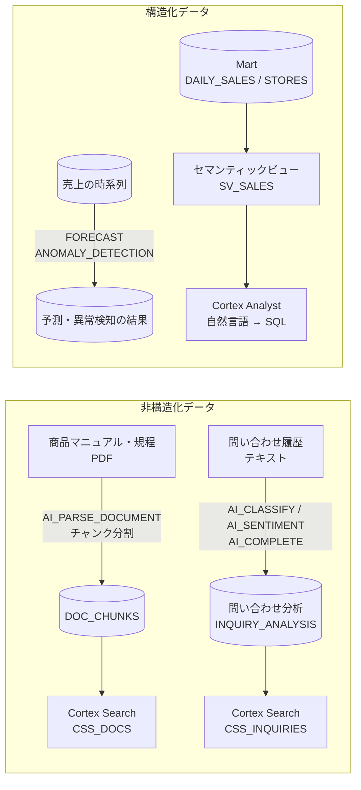

# Step 5 詳細編：Snowflake AI & ML（基礎）

> 学習ロードマップ【全体概要編】の Step 5 を詳しく扱う資料です。
> 構成は「1. 概要 → 2. 概念解説 → 3. ハンズオン → 4. 現場の事例（ケーススタディ） → 5. 考察課題の解答例 → 6. 理解度チェックの解答 → 7. 参考資料」の順です。
> **前提**：Step 1〜4 の環境（3層データベース、ロール、Step 3 のパイプライン、Step 4 のタグ・ポリシー・予算）が残っていること。
> **注意**：Cortex の機能は、**リージョンによって使えるモデルや機能が異なり**、機能の追加や名称の変更も頻繁にあります。演習を始める前に、公式ドキュメントで自分のリージョンの提供状況を確認してください。本書のコードは 2026 年 9 月時点の情報に基づいています。

---

## 1. 概要

### 1.0 この章の物語

8月の監査対応とコスト騒ぎが落ち着き、データ基盤は「守りながら使える」状態になりました。9月、社内の関心は「このデータで何ができるのか」に移ります。

> **【場面】9月1日（火）10:00　カスタマーサポート部のフロア**
>
> 大野さん：「問い合わせが月1万件を超えました。全部はとても読めないので、何の不満が増えているのか、傾向だけでも掴みたいんです。」
>
> 大野さん：「それと、新人のオペレーターが返品規程やマニュアルを探すのに時間がかかっていて……。」
>
> 佐伯さん：「本物の問い合わせ本文は個人情報だらけだから、いきなり流さないでね。まずは合成データで仕組みを作って、精度とコストを測ろう。」

> **【場面】9月2日（水）15:00　経営企画部の打ち合わせスペース**
>
> 高田さん：「10月の経営会議で、来月の売上見込みを出したいんです。今は前年同月に成長率を掛けているだけで、週末や連休の山が反映できていなくて。」
>
> 高田さん：「あと、会議の直前に『関東の先月の客単価は？』と聞かれるたびに、あなたに SQL をお願いするのも申し訳なくて。」
>
> 北村部長：「AI を使うのは賛成。ただし、本番で毎日回したら月いくらになるのかは必ず出してね。で、いくらかかるの？」

**この章であなたが解決すること**

- 月1万件の問い合わせを、SQL だけで分類・感情分析・要約し、カテゴリ別の不満度を出す（演習 5-1）
- 現場が朝一番に対応すべき問い合わせを拾えるよう、本文から決まった形式で項目を抽出する（演習 5-2）
- 経営会議向けに、売上の見込みと「いつもと違う日」を ML 関数で出す（演習 5-3）
- オペレーターがマニュアルと規程をすぐ引けるよう、PDF を検索可能にする（演習 5-4）
- 高田さんや森さんが、売上に日本語で質問できるようにする（演習 5-5）
- 北村部長の「で、いくらかかるの？」に、機能別のコストと月額の見積もりで答える（演習 5-6）

### 1.1 このステップのゴール

SQL から呼び出せる組み込みの AI・ML 機能を使い、**テキストの分析、情報の抽出、需要の予測と異常の検知、ドキュメントの検索、自然言語によるデータへの質問**を、短期間で実現できるようになることがゴールです。

### 1.2 このステップで作るもの



### 1.3 到達目標チェックリスト

- [ ] Snowflake の AI・ML 機能群（AI Functions、ML 関数、Cortex Search、Cortex Analyst）の役割を説明できる
- [ ] AI 機能へのアクセスを、ロールとモデルの許可リストで統制できる
- [ ] AI Functions でテキストの分類・感情分析・要約・集約を行い、結果をテーブルに保存できる
- [ ] 構造化出力（JSON スキーマ）を使い、テキストから安定した形式で情報を抽出できる
- [ ] ML 関数で時系列の予測と異常の検知を行い、結果を評価できる
- [ ] PDF を解析・チャンク分割し、Cortex Search のサービスを作成・クエリできる
- [ ] セマンティックビューを設計し、Cortex Analyst で自然言語の質問に回答させられる
- [ ] AI 機能のコストの仕組みを説明し、使用量を集計できる

### 1.4 所要時間の目安

| パート | 目安 |
| --- | --- |
| 概念解説の読み込み | 5〜6h |
| 環境準備（3.0） | 1〜2h |
| 演習 5-1〜5-6 | 15〜18h |
| 考察課題・理解度チェック | 3h |
| **合計** | **25〜30h** |

---

## 2. 概念解説

### 2.1 Snowflake の AI・ML 機能の全体像

| 機能 | 何をするか | 使い方 | このステップの演習 |
| --- | --- | --- | --- |
| **Cortex AI Functions** | LLM を使ったテキスト・ドキュメント・画像・音声の処理 | SQL の関数（`AI_COMPLETE`、`AI_CLASSIFY` など） | 5-1、5-2、5-4 |
| **ML 関数** | 時系列の予測、異常検知、分類、要因分析（Top Insights） | SQL のクラス（`SNOWFLAKE.ML.FORECAST` など） | 5-3 |
| **Cortex Search** | 非構造化テキストのハイブリッド検索（ベクトル検索＋キーワード検索） | 検索サービスのオブジェクト | 5-4 |
| **Cortex Analyst** | 自然言語の質問を SQL に変換し、構造化データに回答する | セマンティックビュー＋ Snowsight / REST API | 5-5 |
| **Cortex Agents** | 上記を「ツール」として組み合わせ、質問に応じて使い分ける | エージェントのオブジェクト | **Step 6** |

**重要な性質**：これらの機能は、**データを Snowflake の外に出さずに**処理します。Step 2 の RBAC と Step 4 のマスキング・行アクセスポリシーも、そのまま適用されます。

### 2.2 AI 機能の利用を統制する

| 統制の手段 | 内容 |
| --- | --- |
| **`SNOWFLAKE.CORTEX_USER` データベースロール** | AI 関数などを使うための権限。既定では **PUBLIC に付与されている**ため、全員が使える状態になっている。統制したい場合は PUBLIC から取り消し、必要なロールにだけ付与する |
| **モデルの許可リスト** | アカウントパラメータ `CORTEX_MODELS_ALLOWLIST` で、使ってよいモデルを制限する |
| **クロスリージョン推論** | アカウントパラメータ `CORTEX_ENABLED_CROSS_REGION` で、自分のリージョンにないモデルを、別のリージョンで処理することを許可する。**データが一時的にリージョンの外で処理される**ため、社内の規程に照らして判断する |
| **予算** | Step 4 の Budgets で、AI 機能を含む支出を監視する |

### 2.3 Cortex AI Functions

| 関数 | 用途 | 戻り値の例 |
| --- | --- | --- |
| `AI_COMPLETE` | 汎用の生成（要約、書き換え、抽出、質問応答など） | 文字列（構造化出力を指定すると JSON） |
| `AI_CLASSIFY` | 指定したラベルへの分類（複数ラベルも可） | `{"labels": ["配送の遅れ"]}` |
| `AI_SENTIMENT` | 感情の判定（全体・観点別） | `{"categories": [{"name": "overall", "sentiment": "negative"}]}` |
| `AI_EXTRACT` | テキストやドキュメントから、質問に対する答えを抽出 | `{"response": {...}}` |
| `AI_PARSE_DOCUMENT` | PDF などのドキュメントからテキストとレイアウトを抽出 | `{"content": "..."}` |
| `AI_AGG` / `AI_SUMMARIZE_AGG` | **複数行**のテキストをまとめて集約・要約（集計関数） | 文字列 |
| `AI_FILTER` | 条件に当てはまるかどうかの判定（WHERE 句や JOIN で使う） | BOOLEAN |
| `AI_TRANSLATE` | 翻訳 | 文字列 |
| `AI_EMBED` | ベクトル埋め込みの生成（Step 6） | VECTOR |

- **関数の選び方**：分類や感情のように**目的が決まった処理は、専用の関数**を使います。プロンプトを工夫する必要がなく、コストも抑えやすいからです。専用の関数でできないことに `AI_COMPLETE` を使います。
- **構造化出力**：`AI_COMPLETE` に `response_format`（JSON スキーマ）を指定すると、決まった形式の JSON が返ります。後続の SQL で安全に扱えるようになります。
- **非決定性**：同じ入力でも、結果が毎回同じになるとは限りません。業務で使う結果は、**一度実行してテーブルに保存**し、そのテーブルを使うのが基本です。

### 2.4 AI 機能のコスト

- AI Functions は、主に**入力と出力のトークン数**に応じて課金されます。単価はモデルによって大きく異なります。
- 関数の実行そのものはサーバーレスで行われますが、SQL を実行するためのウェアハウスは別途必要です。
- **コストを抑える工夫**：
  - 対象の行を絞る（新しい行や変更された行だけを処理する）。
  - 結果を保存し、同じテキストを何度も処理しない。
  - 目的に合った小さなモデル、または専用の関数を使う。
  - プロンプトと出力を短くする（出力の文字数を指定する、構造化出力を使う）。
  - 実行前に `AI_COUNT_TOKENS` でトークン数を見積もる。
- 使用量は `ACCOUNT_USAGE` の Cortex 関連のビューで確認できます（演習 5-6）。

### 2.5 ML 関数

| クラス | 用途 | 入力 |
| --- | --- | --- |
| `SNOWFLAKE.ML.FORECAST` | 時系列の予測 | タイムスタンプ、目的変数、（任意）系列 ID、外生変数 |
| `SNOWFLAKE.ML.ANOMALY_DETECTION` | 時系列の異常検知 | 学習用データと検知用データ、（任意）正解ラベル |
| `SNOWFLAKE.ML.CLASSIFICATION` | 表形式データの分類（例：解約するかどうか） | 特徴量と正解ラベル |
| `SNOWFLAKE.ML.TOP_INSIGHTS` | 指標の変化の要因分析 | 指標と、その要因となる次元 |

- 使い方は共通です。**モデルのオブジェクトを作成して学習させ**（`CREATE SNOWFLAKE.ML.FORECAST ...`）、**メソッドを呼び出して推論する**（`CALL model!FORECAST(...)`）。
- 評価指標（`!SHOW_EVALUATION_METRICS()`）や、特徴量の重要度（`!EXPLAIN_FEATURE_IMPORTANCE()`）も確認できます。
- 自分でモデルを作り込む必要がある場合は、Snowpark ML とモデルレジストリを使います（Step 7）。

### 2.6 Cortex Search

```sql
CREATE CORTEX SEARCH SERVICE docs_search
  ON chunk                          -- 検索対象のテキスト列
  ATTRIBUTES doc_type, product_id   -- 絞り込みに使う列
  WAREHOUSE = wh
  TARGET_LAG = '1 day'              -- 元のテーブルの変更を、どれくらいの遅れで反映するか
AS SELECT chunk, doc_name, doc_type, product_id FROM doc_chunks;
```

- **ハイブリッド検索**：意味の近さ（ベクトル）とキーワードの一致を組み合わせ、さらに並べ替え（リランキング）を行います。埋め込みの生成やインデックスの管理は Snowflake が自動で行います。
- **チャンク分割**：長いドキュメントは、意味のまとまりごとに数百〜千文字程度に分けて格納します。長すぎると関係のない内容が混ざり、短すぎると文脈が失われます。
- **コスト**：インデックスの作成と更新（ウェアハウス、埋め込みのトークン）、サービスを提供し続けるためのコスト（データ量に応じて常にかかる）、検索の実行、の3つがあります。**使わないサービスは停止・削除**します。
- クエリは、SQL の `SNOWFLAKE.CORTEX.SEARCH_PREVIEW`（検証用）、REST API、Python API から行います。Step 6 では、エージェントのツールとして使います。

### 2.7 Cortex Analyst とセマンティックビュー

Cortex Analyst は、自然言語の質問を SQL に変換して実行します。精度を決めるのは、**テーブルの業務上の意味を記述したセマンティックビュー**です。

| 要素 | 意味 | 例 |
| --- | --- | --- |
| 論理テーブル（TABLES） | 対象のテーブルと主キー | 日次売上、店舗マスタ |
| リレーションシップ | テーブル間の結合条件 | 売上.店舗 ID → 店舗.店舗 ID |
| ファクト（FACTS） | 行単位の数値 | 売上金額、数量 |
| ディメンション（DIMENSIONS） | 分析の切り口 | 日付、チャネル、地域 |
| メトリクス（METRICS） | 集計の定義 | 売上合計、客単価 |
| 同義語・コメント | 業務用語と列の対応 | 「売上高」「エリア」「客単価」 |
| 検証済みクエリ | 質問と正しい SQL の組 | 「先月の地域別売上」→ 正しい SQL |

- **検証済みクエリ**は、Cortex Analyst が似た質問に答えるときの手本になります。精度を上げるうえで最も効果的な手段の一つです。
- **カスタム指示**で、「金額は税込の円」「年度は4月始まり」のような社内の約束事を伝えられます。
- Cortex Analyst が生成した SQL は、**質問したユーザーのロール**で実行されます。そのため、行アクセスポリシーやマスキングがそのまま効きます。

### 2.8 Cortex Search と Cortex Analyst の使い分け

| | Cortex Search | Cortex Analyst |
| --- | --- | --- |
| 対象 | 非構造化テキスト（ドキュメント、問い合わせ、FAQ） | 構造化データ（テーブル） |
| 得意な質問 | 「返品の条件は？」「充電できない場合の対処は？」 | 「先月の関東の売上は？」「チャネル別の客単価の推移は？」 |
| 回答の根拠 | 関連する文章の抜粋 | SQL とその実行結果 |
| 精度を上げる手段 | チャンク分割、属性による絞り込み、スコアリングの調整 | セマンティックビューの記述、同義語、検証済みクエリ |

両方を組み合わせて、「売上が落ちた商品について、どんな問い合わせが来ているか」のような横断的な質問に答えるのが、Step 6 の Cortex Agents です。

---

## 3. ハンズオン

各演習は **「手順（コード）」→「確認ポイント」→「考察課題」** の順に進みます。考察課題の解答例は第5章にあります。

### 3.0 環境準備

#### (1) AI 用のデータベースとロールを作る（`07_ai_setup.sql`）

```sql
-- 07_ai_setup.sql
-- ---------- データベースとスキーマ ----------
USE ROLE SYSADMIN;
CREATE DATABASE IF NOT EXISTS DEV_AI_DB COMMENT = 'AI・ML 用';
CREATE SCHEMA IF NOT EXISTS DEV_AI_DB.TEXT    COMMENT = 'テキスト分析';
CREATE SCHEMA IF NOT EXISTS DEV_AI_DB.DOCS    COMMENT = 'ドキュメントと検索サービス';
CREATE SCHEMA IF NOT EXISTS DEV_AI_DB.ANALYST COMMENT = 'セマンティックビュー';
CREATE SCHEMA IF NOT EXISTS DEV_AI_DB.ML      COMMENT = 'ML 関数';
CREATE SCHEMA IF NOT EXISTS DEV_AI_DB.AGENTS  COMMENT = 'エージェント（Step 6）';

-- ---------- アクセスロール ----------
USE ROLE USERADMIN;
CREATE ROLE IF NOT EXISTS AR_DEV_AI_R;
CREATE ROLE IF NOT EXISTS AR_DEV_AI_W;
GRANT ROLE AR_DEV_AI_R TO ROLE AR_DEV_AI_W;
GRANT ROLE AR_DEV_AI_W TO ROLE FR_DATA_ENGINEER;                    -- AI 機能の開発者
GRANT ROLE AR_DEV_AI_R TO ROLE FR_ANALYST;
GRANT ROLE AR_DEV_AI_R TO ROLE FR_MARKETING;
GRANT ROLE AR_DEV_AI_R TO ROLE FR_REGION_KANTO;
GRANT ROLE AR_DEV_AI_R TO ROLE FR_REGION_KANSAI;

-- ---------- 権限 ----------
USE ROLE SECURITYADMIN;
-- R：参照と、検索サービス・セマンティックビューの利用
GRANT USAGE  ON DATABASE DEV_AI_DB                              TO ROLE AR_DEV_AI_R;
GRANT USAGE  ON ALL SCHEMAS    IN DATABASE DEV_AI_DB            TO ROLE AR_DEV_AI_R;
GRANT USAGE  ON FUTURE SCHEMAS IN DATABASE DEV_AI_DB            TO ROLE AR_DEV_AI_R;
GRANT SELECT ON FUTURE TABLES  IN DATABASE DEV_AI_DB            TO ROLE AR_DEV_AI_R;
GRANT SELECT ON FUTURE VIEWS   IN DATABASE DEV_AI_DB            TO ROLE AR_DEV_AI_R;
GRANT SELECT ON FUTURE SEMANTIC VIEWS IN DATABASE DEV_AI_DB     TO ROLE AR_DEV_AI_R;
GRANT USAGE  ON FUTURE CORTEX SEARCH SERVICES IN DATABASE DEV_AI_DB TO ROLE AR_DEV_AI_R;
-- W：オブジェクトの作成
GRANT CREATE TABLE, CREATE VIEW, CREATE STAGE, CREATE FILE FORMAT
  ON ALL SCHEMAS IN DATABASE DEV_AI_DB TO ROLE AR_DEV_AI_W;
GRANT CREATE CORTEX SEARCH SERVICE ON SCHEMA DEV_AI_DB.DOCS    TO ROLE AR_DEV_AI_W;
GRANT CREATE CORTEX SEARCH SERVICE ON SCHEMA DEV_AI_DB.TEXT    TO ROLE AR_DEV_AI_W;
GRANT CREATE SEMANTIC VIEW         ON SCHEMA DEV_AI_DB.ANALYST TO ROLE AR_DEV_AI_W;
GRANT CREATE SNOWFLAKE.ML.FORECAST, CREATE SNOWFLAKE.ML.ANOMALY_DETECTION
  ON SCHEMA DEV_AI_DB.ML TO ROLE AR_DEV_AI_W;

-- ---------- AI 機能の利用の統制（ACCOUNTADMIN） ----------
USE ROLE ACCOUNTADMIN;
-- AI 関数を使えるロールを限定する
GRANT DATABASE ROLE SNOWFLAKE.CORTEX_USER TO ROLE AR_DEV_AI_R;
-- REVOKE DATABASE ROLE SNOWFLAKE.CORTEX_USER FROM ROLE PUBLIC;   -- 下の注意を読んでから実行する
```

> **PUBLIC からの取り消しについて**：アカウント内の他の利用者が AI 機能を使っている場合、取り消すと、その利用者も使えなくなります。検証用のアカウントでは実行して効果を確かめ、共有のアカウントでは管理者と合意してから実行してください。

> 権限の名前（`FUTURE SEMANTIC VIEWS`、`FUTURE CORTEX SEARCH SERVICES` など）でエラーになる場合は、対象のオブジェクトを作成した後に、個別に `GRANT SELECT ON SEMANTIC VIEW ...` や `GRANT USAGE ON CORTEX SEARCH SERVICE ...` を実行してください。

#### (2) 使うモデルを決める

```sql
-- クロスリージョン推論の設定を確認する（社内の規程に従って設定を判断する）
USE ROLE ACCOUNTADMIN;
SHOW PARAMETERS LIKE 'CORTEX_ENABLED_CROSS_REGION' IN ACCOUNT;
-- 例：同じ地域のリージョン間だけで許可する場合
-- ALTER ACCOUNT SET CORTEX_ENABLED_CROSS_REGION = 'AWS_APJ';

-- 以降の演習で使うモデルをセッション変数にしておく
USE ROLE FR_DATA_ENGINEER;
USE SECONDARY ROLES NONE;
USE WAREHOUSE DEV_TRANSFORM_WH;
SET LLM = 'claude-sonnet-4-5';     -- 自分のリージョンで使え、日本語の品質が十分なモデルを選ぶ

SELECT AI_COMPLETE($LLM, 'Snowflake を小学生にもわかるように一文で説明してください。');
```

> **モデルの選び方**：公式ドキュメントの「Cortex AI 関数」のページで、リージョンごとのモデルの提供状況を確認します。日本語のテキストを扱うため、日本語の品質が高いモデルを選びます。コストを比べたい場合は、演習 5-1 を2つのモデルで実行し、結果の品質と使用量（演習 5-6）を比較します。セッション変数は、セッションが変わるたびに設定し直す必要があります。

---

### 演習 5-1：問い合わせ履歴を AI Functions で分析する

> **【場面】9月3日（木）11:00　データ基盤チームの席**
>
> 大野さん（チャット）：「今は担当者が手で分類コードを付けていて、人によって付け方がバラバラなんです。7分類＋その他で揃えたいです。」
>
> 佐伯さん：「合成データを作るときに『正解のカテゴリ』を残しておけば、AI の分類がどれくらい当たるか数字で言えるよ。」
>
> あなた：「精度が分からないまま『AI で分類しました』とは言えませんね。まず200件でやってみます。」

**ねらい**：大量のテキストを SQL だけで分類・感情分析・要約し、「カテゴリ別の不満度」を集計する。

#### 手順 A：演習用の問い合わせデータを生成する

実際の問い合わせデータの代わりに、LLM で合成データを作ります。生成のときに使った「正解のカテゴリ」を残しておき、後で分類の精度を測ります。

```sql
USE ROLE FR_DATA_ENGINEER;
USE SECONDARY ROLES NONE;
USE WAREHOUSE DEV_TRANSFORM_WH;
SET LLM = 'claude-sonnet-4-5';

CREATE OR REPLACE TABLE DEV_AI_DB.TEXT.INQUIRIES AS
WITH seed AS (
  SELECT
    SEQ4() + 1 AS n,
    GET(ARRAY_CONSTRUCT('配送の遅れ','商品の破損','返品・交換','サイズ・仕様の質問','支払い','店舗スタッフの対応','ポイント'),
        UNIFORM(0, 6, RANDOM()))::STRING                                      AS gen_topic,
    GET(ARRAY_CONSTRUCT('怒っている','困っている','落ち着いている','感謝している'),
        UNIFORM(0, 3, RANDOM()))::STRING                                      AS gen_tone,
    'P' || LPAD(UNIFORM(1, 500, RANDOM())::STRING, 4, '0')                    AS product_id,
    IFF(UNIFORM(1, 10, RANDOM()) <= 6, 'EC', 'STORE')                         AS channel,
    DATEADD(day, -UNIFORM(0, 89, RANDOM()), CURRENT_DATE())                   AS received_date,
    'C' || LPAD(UNIFORM(1, 20000, RANDOM())::STRING, 6, '0')                  AS customer_id
  FROM TABLE(GENERATOR(ROWCOUNT => 200))
)
SELECT
  'INQ' || LPAD(n::STRING, 5, '0') AS INQUIRY_ID,
  received_date AS RECEIVED_DATE, customer_id AS CUSTOMER_ID, channel AS CHANNEL, product_id AS PRODUCT_ID,
  gen_topic AS GEN_TOPIC, gen_tone AS GEN_TONE,      -- 生成の条件（精度の評価用。本番のデータにはない）
  AI_COMPLETE($LLM,
    '小売企業「スノー商事」のお客様相談窓口に届いた問い合わせを1件だけ作成してください。'
    || '条件：内容=' || gen_topic || '、お客様の気持ち=' || gen_tone
    || '、商品番号=' || product_id || '、購入チャネル=' || IFF(channel = 'EC', 'オンラインストア', '実店舗')
    || '。100〜200文字の自然な日本語で、問い合わせの本文だけを出力してください。') AS INQUIRY_TEXT
FROM seed;

SELECT INQUIRY_ID, GEN_TOPIC, INQUIRY_TEXT FROM DEV_AI_DB.TEXT.INQUIRIES LIMIT 5;
```

> 200件の生成には数分かかります。コストを抑えたい場合は、`ROWCOUNT` を 50 程度に減らしてください。

#### 手順 B：分類・感情分析・要約を実行し、結果を保存する

```sql
CREATE OR REPLACE TABLE DEV_AI_DB.TEXT.INQUIRY_ANALYSIS AS
SELECT
  INQUIRY_ID, RECEIVED_DATE, CUSTOMER_ID, CHANNEL, PRODUCT_ID, INQUIRY_TEXT, GEN_TOPIC,
  AI_CLASSIFY(
    INQUIRY_TEXT,
    ['配送の遅れ','商品の破損','返品・交換','サイズ・仕様の質問','支払い','店舗スタッフの対応','ポイント','その他']
  ):labels[0]::STRING                                                AS CATEGORY,
  AI_SENTIMENT(INQUIRY_TEXT):categories[0]:sentiment::STRING          AS SENTIMENT,
  AI_COMPLETE($LLM, '次の問い合わせを、要点がわかるように40文字以内の日本語で要約してください。要約だけを出力してください。\n'
                    || INQUIRY_TEXT)                                   AS SUMMARY,
  CURRENT_TIMESTAMP()                                                  AS ANALYZED_AT
FROM DEV_AI_DB.TEXT.INQUIRIES;
```

> **分類のラベルに説明を付ける**：精度が低いラベルがある場合は、`AI_CLASSIFY` のラベルに、ラベル名だけでなく説明を付けたり、タスクの説明を追加したりできます（公式ドキュメントの AI_CLASSIFY を参照）。

#### 手順 C：分類の精度を確かめる

```sql
-- 全体の正解率
SELECT COUNT_IF(CATEGORY = GEN_TOPIC) / COUNT(*) AS accuracy
FROM DEV_AI_DB.TEXT.INQUIRY_ANALYSIS;

-- 混同行列（どのカテゴリを、どのカテゴリと取り違えているか）
SELECT GEN_TOPIC, CATEGORY, COUNT(*) AS cnt
FROM DEV_AI_DB.TEXT.INQUIRY_ANALYSIS
GROUP BY 1, 2
ORDER BY 1, cnt DESC;
```

#### 手順 D：カテゴリ別の不満度と、傾向の要約

```sql
-- カテゴリ別の件数とネガティブの割合
SELECT CATEGORY,
       COUNT(*)                                                     AS inquiries,
       ROUND(COUNT_IF(SENTIMENT IN ('negative', 'mixed')) / COUNT(*) * 100, 1) AS negative_pct
FROM DEV_AI_DB.TEXT.INQUIRY_ANALYSIS
GROUP BY CATEGORY
ORDER BY negative_pct DESC;

-- 複数の問い合わせをまとめて要約する（集計関数）
SELECT CATEGORY,
       AI_AGG(INQUIRY_TEXT, 'これらの問い合わせに共通する不満点と、会社として取るべき改善策を、それぞれ3点以内で日本語の箇条書きにしてください。') AS insights
FROM DEV_AI_DB.TEXT.INQUIRY_ANALYSIS
WHERE SENTIMENT IN ('negative', 'mixed')
GROUP BY CATEGORY;
```

#### 確認ポイント

- `INQUIRY_ANALYSIS` に200件の結果が保存されている。
- 分類の正解率と、取り違えやすいカテゴリの組を把握している。
- `FR_ANALYST` で `INQUIRY_ANALYSIS` を参照できる（`AR_DEV_AI_R` の FUTURE GRANTS の効果）。

#### 考察課題

- **Q5-1a**：分類の結果を、毎回 `AI_CLASSIFY` を実行して求めるのではなく、テーブルに保存しておく理由を2つ挙げよ。
- **Q5-1b**：分類の正解率が低いカテゴリがあった。精度を上げるための方法を3つ挙げよ。
- **Q5-1c**：この分析を本番の問い合わせデータで毎日実行するなら、Step 3 のどの仕組みと組み合わせるか。

---

### 演習 5-2：構造化出力で情報を抽出する

> **【場面】9月4日（金）14:00　カスタマーサポート部のフロア**
>
> 大野さん：「カテゴリ別の不満度、わかりやすいです！　でも現場が朝一番に欲しいのは、『折り返しの電話が必要で、緊急なもの』のリストなんですよ。」
>
> あなた：「本文から商品番号や緊急度を取り出して、列にしましょう。」
>
> 佐伯さん：「後ろで SQL が読むなら、出力の形を固定しておかないと。キーの名前が一文字ずれただけで、毎朝のリストが空になるからね。」

**ねらい**：問い合わせの本文から、後続の処理で使える形式（決まったキーと値）で情報を取り出す。

#### 手順 A：JSON スキーマを指定して抽出する

```sql
CREATE OR REPLACE TABLE DEV_AI_DB.TEXT.INQUIRY_EXTRACTED AS
SELECT
  INQUIRY_ID,
  TRY_PARSE_JSON(AI_COMPLETE(
    model  => $LLM,
    prompt => '次の問い合わせの内容から、指定された項目を抽出してください。\n' || INQUIRY_TEXT,
    response_format => {
      'type': 'json',
      'schema': {
        'type': 'object',
        'properties': {
          'product_id':     {'type': 'string',  'description': '商品番号（P から始まる5文字）。書かれていなければ空文字'},
          'issue_type':     {'type': 'string',  'enum': ['配送', '品質', '返品', '質問', '支払い', '接客', 'その他']},
          'urgency':        {'type': 'string',  'enum': ['高', '中', '低'], 'description': '対応の緊急度'},
          'needs_callback': {'type': 'boolean', 'description': '折り返しの連絡を求めているか'},
          'requested_action': {'type': 'string', 'description': 'お客様が求めている対応（30文字以内）'}
        },
        'required': ['product_id', 'issue_type', 'urgency', 'needs_callback', 'requested_action']
      }
    }
  )::STRING) AS EXTRACTED
FROM DEV_AI_DB.TEXT.INQUIRIES;

-- 抽出した値を列として扱う
SELECT INQUIRY_ID,
       EXTRACTED:product_id::STRING       AS product_id,
       EXTRACTED:issue_type::STRING       AS issue_type,
       EXTRACTED:urgency::STRING          AS urgency,
       EXTRACTED:needs_callback::BOOLEAN  AS needs_callback,
       EXTRACTED:requested_action::STRING AS requested_action
FROM DEV_AI_DB.TEXT.INQUIRY_EXTRACTED
LIMIT 10;
```

#### 手順 B：出力の安定性を確かめる

```sql
-- 必須のキーが欠けている行、許されていない値が入っている行を数える
SELECT
  COUNT(*)                                                                 AS total,
  COUNT_IF(EXTRACTED IS NULL)                                              AS parse_failed,
  COUNT_IF(EXTRACTED:urgency::STRING NOT IN ('高', '中', '低'))            AS invalid_urgency,
  COUNT_IF(EXTRACTED:needs_callback IS NULL)                               AS missing_callback
FROM DEV_AI_DB.TEXT.INQUIRY_EXTRACTED;

-- 元データの商品番号と、抽出した商品番号の一致率
SELECT COUNT_IF(e.EXTRACTED:product_id::STRING = i.PRODUCT_ID) / COUNT(*) AS product_id_match
FROM DEV_AI_DB.TEXT.INQUIRY_EXTRACTED e
JOIN DEV_AI_DB.TEXT.INQUIRIES i USING (INQUIRY_ID);
```

#### 手順 C：AI_EXTRACT と比べる

```sql
SELECT INQUIRY_ID,
       AI_EXTRACT(
         text => INQUIRY_TEXT,
         responseFormat => {'product_id': '商品番号は何ですか？', 'urgency': '対応の緊急度は高・中・低のどれですか？'}
       ) AS extracted
FROM DEV_AI_DB.TEXT.INQUIRIES
LIMIT 10;
```

#### 確認ポイント

- `parse_failed`、`invalid_urgency`、`missing_callback` がすべて 0（またはごく少数）である。
- 商品番号の一致率が高い。

#### 考察課題

- **Q5-2a**：構造化出力を使わずに「JSON で出力してください」とプロンプトに書くだけの場合と比べて、何が違うか。
- **Q5-2b**：`AI_EXTRACT` と、構造化出力を指定した `AI_COMPLETE` は、どのように使い分けるか。

---

### 演習 5-3：ML 関数で売上を予測し、異常を検知する

> **【場面】9月7日（月）10:00　経営企画部の打ち合わせスペース**
>
> 高田さん：「問い合わせの次は、売上見込みの番ですね。前年同月×成長率だと、週末や年末の山がまったく表せないんです。」
>
> 高田さん：「EC の障害の日みたいな『変な日』も、自動で拾えると助かります。毎月、グラフを目で見て探しているので。」
>
> 佐伯さん：「実データは傾向がまだ弱いから、まず傾向と異常を仕込んだデータで、手法が期待どおりに動くかを確かめよう。答えが分かっているデータで試すのが先。」

**ねらい**：時系列の予測と異常検知を SQL だけで行い、結果を評価する。

> Step 3 の売上データは、ランダムに生成したため、曜日や季節の傾向がありません。ここでは、傾向と異常を意図的に含めた2年分の日次売上を別に用意します。

#### 手順 A：時系列データを用意する

```sql
USE ROLE FR_DATA_ENGINEER;
USE SECONDARY ROLES NONE;
USE WAREHOUSE DEV_TRANSFORM_WH;

CREATE OR REPLACE TABLE DEV_AI_DB.ML.DAILY_SALES_HISTORY AS
WITH days AS (
  SELECT DATEADD(day, -SEQ4() - 1, CURRENT_DATE()) AS d, SEQ4() AS days_ago
  FROM TABLE(GENERATOR(ROWCOUNT => 730))
),
base AS (
  SELECT d, days_ago, ch.channel,
         IFF(ch.channel = 'EC', 3000000, 5000000)                                   AS base_amount,
         1 + 0.0004 * (730 - days_ago)                                               AS trend,          -- 緩やかな成長
         CASE WHEN DAYOFWEEKISO(d) IN (6, 7) THEN IFF(ch.channel = 'EC', 1.10, 1.35)
              ELSE 1.0 END                                                            AS weekly,         -- 週末に増える
         1 + 0.15 * SIN(2 * PI() * DAYOFYEAR(d) / 365.25)
           + IFF(MONTH(d) = 12, 0.25, 0)                                             AS seasonal,       -- 季節性と年末
         1 + UNIFORM(-5, 5, RANDOM()) / 100                                         AS noise
  FROM days, (SELECT 'EC' AS channel UNION ALL SELECT 'STORE') ch
)
SELECT
  d::TIMESTAMP_NTZ AS TS,
  channel          AS CHANNEL,
  ROUND(base_amount * trend * weekly * seasonal * noise
        * CASE WHEN channel = 'EC' AND days_ago = 10 THEN 0.30   -- EC のシステム障害
               WHEN channel = 'EC' AND days_ago = 20 THEN 2.20   -- TV キャンペーン
               WHEN channel = 'STORE' AND days_ago = 15 THEN 0.40 -- 台風による臨時休業
               ELSE 1 END) AS SALES_AMOUNT
FROM base;

-- 直近30日を検証用に残し、それより前を学習に使う
CREATE OR REPLACE VIEW DEV_AI_DB.ML.V_SALES_TRAIN AS
SELECT TS, CHANNEL, SALES_AMOUNT FROM DEV_AI_DB.ML.DAILY_SALES_HISTORY
WHERE TS <  DATEADD(day, -30, CURRENT_DATE())::TIMESTAMP_NTZ;

CREATE OR REPLACE VIEW DEV_AI_DB.ML.V_SALES_TEST AS
SELECT TS, CHANNEL, SALES_AMOUNT FROM DEV_AI_DB.ML.DAILY_SALES_HISTORY
WHERE TS >= DATEADD(day, -30, CURRENT_DATE())::TIMESTAMP_NTZ;
```

#### 手順 B：予測モデルを作り、30日先を予測する

```sql
CREATE OR REPLACE SNOWFLAKE.ML.FORECAST DEV_AI_DB.ML.FC_DAILY_SALES(
  INPUT_DATA        => TABLE(DEV_AI_DB.ML.V_SALES_TRAIN),
  SERIES_COLNAME    => 'CHANNEL',
  TIMESTAMP_COLNAME => 'TS',
  TARGET_COLNAME    => 'SALES_AMOUNT'
);

CALL DEV_AI_DB.ML.FC_DAILY_SALES!FORECAST(FORECASTING_PERIODS => 30);
CREATE OR REPLACE TABLE DEV_AI_DB.ML.FC_RESULT AS SELECT * FROM TABLE(RESULT_SCAN(LAST_QUERY_ID()));

-- 評価指標と、特徴量の重要度
CALL DEV_AI_DB.ML.FC_DAILY_SALES!SHOW_EVALUATION_METRICS();
CALL DEV_AI_DB.ML.FC_DAILY_SALES!EXPLAIN_FEATURE_IMPORTANCE();

-- 予測と実績を比較する（Snowsight のグラフで、TS を横軸に FORECAST と ACTUAL を表示する）
SELECT f.SERIES::STRING AS channel, f.TS, f.FORECAST, f.LOWER_BOUND, f.UPPER_BOUND, t.SALES_AMOUNT AS ACTUAL,
       ROUND(ABS(f.FORECAST - t.SALES_AMOUNT) / t.SALES_AMOUNT * 100, 1) AS ape_pct
FROM DEV_AI_DB.ML.FC_RESULT f
JOIN DEV_AI_DB.ML.V_SALES_TEST t ON t.TS = f.TS AND t.CHANNEL = f.SERIES::STRING
ORDER BY channel, f.TS;
```

#### 手順 C：異常を検知する

```sql
CREATE OR REPLACE SNOWFLAKE.ML.ANOMALY_DETECTION DEV_AI_DB.ML.AD_DAILY_SALES(
  INPUT_DATA        => TABLE(DEV_AI_DB.ML.V_SALES_TRAIN),
  SERIES_COLNAME    => 'CHANNEL',
  TIMESTAMP_COLNAME => 'TS',
  TARGET_COLNAME    => 'SALES_AMOUNT',
  LABEL_COLNAME     => ''            -- 正解ラベルなし（教師なし）
);

CALL DEV_AI_DB.ML.AD_DAILY_SALES!DETECT_ANOMALIES(
  INPUT_DATA        => TABLE(DEV_AI_DB.ML.V_SALES_TEST),
  SERIES_COLNAME    => 'CHANNEL',
  TIMESTAMP_COLNAME => 'TS',
  TARGET_COLNAME    => 'SALES_AMOUNT'
);
CREATE OR REPLACE TABLE DEV_AI_DB.ML.AD_RESULT AS SELECT * FROM TABLE(RESULT_SCAN(LAST_QUERY_ID()));

SELECT SERIES::STRING AS channel, TS, Y AS actual, FORECAST, LOWER_BOUND, UPPER_BOUND, IS_ANOMALY, PERCENTILE
FROM DEV_AI_DB.ML.AD_RESULT
WHERE IS_ANOMALY
ORDER BY TS;
```

#### 確認ポイント

- 予測の結果に、週末に売上が増える傾向が反映されている。
- 異常検知で、仕込んだ3日（EC の障害、TV キャンペーン、STORE の臨時休業）が検出されている。
- 予測と実績の比較で、仕込んだ異常の日だけ誤差（`ape_pct`）が大きくなっている。

#### 考察課題

- **Q5-3a**：異常検知の結果、仕込んだ日以外にも異常と判定された日があった場合、どう扱うべきか。
- **Q5-3b**：予測の精度をさらに上げるために、追加できる情報（外生変数）の例を挙げよ。
- **発展**：異常検知を毎日実行し、異常が見つかったら通知する仕組みを、Step 3 のタスクと Step 4 のアラートで作れ。

---

### 演習 5-4：ドキュメントを解析し、Cortex Search で検索する

> **【場面】9月9日（水）16:00　カスタマーサポート部のフロア**
>
> 大野さん：「新人から『初期不良の交換って何日以内でしたっけ』と、1日に10回は聞かれるんです。マニュアルも規程も PDF で、探すだけで数分かかって。」
>
> 佐伯さん：「PDF はそのままだと検索できない。テキストにして、ちょうどいい大きさに切るところが肝だよ。」
>
> あなた：「問い合わせ履歴も検索できるようにしておけば、『似た問い合わせにどう答えたか』も引けますね。」

**ねらい**：PDF の商品マニュアルと社内規程を検索できるようにする。問い合わせ履歴も検索できるようにし、Step 6 のエージェントで使う。

#### 手順 A：演習用の PDF を用意する（ローカル端末）

架空の商品マニュアルと規程の PDF を、Python で生成します。

```bash
pip install reportlab
```

`make_docs.py` を作成します。

```python
"""スノー商事の架空の商品マニュアルと社内規程を PDF で生成する。"""
from pathlib import Path

from reportlab.lib.pagesizes import A4
from reportlab.lib.styles import ParagraphStyle
from reportlab.pdfbase import pdfmetrics
from reportlab.pdfbase.cidfonts import UnicodeCIDFont
from reportlab.platypus import Paragraph, SimpleDocTemplate, Spacer

pdfmetrics.registerFont(UnicodeCIDFont("HeiseiKakuGo-W5"))
H1 = ParagraphStyle("h1", fontName="HeiseiKakuGo-W5", fontSize=16, leading=22, spaceAfter=10)
H2 = ParagraphStyle("h2", fontName="HeiseiKakuGo-W5", fontSize=12, leading=18, spaceBefore=8)
BODY = ParagraphStyle("body", fontName="HeiseiKakuGo-W5", fontSize=10, leading=16)

DOCS = {
    "manuals/P0001_ワイヤレスイヤホン_取扱説明書.pdf": [
        ("h1", "ワイヤレスイヤホン SNOW BUDS（商品番号 P0001）取扱説明書"),
        ("h2", "1. 充電のしかた"),
        ("p", "付属の USB Type-C ケーブルでケースを充電します。ケースのランプが赤く点灯している間は充電中で、緑色に変わると充電完了です。フル充電には約2時間かかります。"),
        ("h2", "2. ペアリング"),
        ("p", "ケースのふたを開け、背面のボタンを3秒間長押しすると、ランプが青く点滅してペアリングモードになります。スマートフォンの Bluetooth 設定から「SNOW BUDS」を選択してください。"),
        ("h2", "3. 充電できない・電源が入らないとき"),
        ("p", "ケースの充電端子にほこりが付着していないか確認し、乾いた綿棒で清掃してください。それでも改善しない場合は、ケースのボタンを15秒間長押ししてリセットしてください。改善しない場合は初期不良の可能性があるため、購入後30日以内であれば無償で交換します。"),
        ("h2", "4. 防水性能"),
        ("p", "本製品は IPX4 相当の防滴性能を備えていますが、水没には対応していません。入浴中や水泳中には使用しないでください。"),
    ],
    "manuals/P0002_電気ケトル_取扱説明書.pdf": [
        ("h1", "電気ケトル SNOW KETTLE 1.0L（商品番号 P0002）取扱説明書"),
        ("h2", "1. ご使用の前に"),
        ("p", "初めてご使用になる前に、満水まで水を入れて2〜3回沸騰させ、お湯を捨ててください。製造時のにおいが取れます。"),
        ("h2", "2. 空だき防止機能"),
        ("p", "水が入っていない状態で電源を入れると、空だき防止機能が働いて自動的に電源が切れます。本体が冷えるまで約10分お待ちください。"),
        ("h2", "3. お手入れ"),
        ("p", "内側に白い湯あかが付いた場合は、クエン酸大さじ1杯を入れて満水まで水を入れ、沸騰させてから1時間置き、よくすすいでください。本体を水につけて洗うことはできません。"),
        ("h2", "4. 保証"),
        ("p", "保証期間はお買い上げ日から1年間です。保証書とレシートを保管してください。"),
    ],
    "manuals/P0003_ダウンジャケット_お手入れガイド.pdf": [
        ("h1", "ダウンジャケット SNOW DOWN（商品番号 P0003）お手入れガイド"),
        ("h2", "1. サイズの目安"),
        ("p", "S は身長155〜165cm、M は165〜175cm、L は175〜185cm が目安です。厚手のニットの上から着る場合は、ワンサイズ大きめをおすすめします。"),
        ("h2", "2. 洗濯のしかた"),
        ("p", "家庭の洗濯機で、中性洗剤を使い、ネットに入れて弱水流で洗えます。乾燥機は低温で使用し、途中で数回取り出してたたくと、ダウンのかたよりを防げます。"),
        ("h2", "3. 保管"),
        ("p", "圧縮袋での長期保管は、ダウンの復元力を損なうため避けてください。風通しのよい場所でハンガーにかけて保管してください。"),
    ],
    "policies/返品交換規程.pdf": [
        ("h1", "スノー商事 返品・交換規程"),
        ("h2", "第1条 返品の受付期間"),
        ("p", "未使用品に限り、商品到着日（店舗購入の場合は購入日）から14日以内であれば、返品を受け付けます。セール品、下着類、食品、お客様の都合で開封したソフトウェアは返品できません。"),
        ("h2", "第2条 初期不良の交換"),
        ("p", "初期不良と認められる場合は、商品到着日から30日以内であれば、送料当社負担で同一商品と交換します。同一商品の在庫がない場合は返金します。"),
        ("h2", "第3条 返金の方法"),
        ("p", "オンラインストアでの購入はお支払いに使用した方法で、店舗での購入は現金または購入時のカードで返金します。返金までの期間は、商品の到着を確認してから7営業日以内です。"),
    ],
    "policies/配送規程.pdf": [
        ("h1", "スノー商事 配送規程"),
        ("h2", "第1条 お届け日数"),
        ("p", "ご注文確定後、通常2〜4営業日でお届けします。離島および一部地域は、さらに2〜3日かかる場合があります。"),
        ("h2", "第2条 送料"),
        ("p", "1回のご注文金額が5,000円（税込）以上の場合は送料無料です。5,000円未満の場合は、全国一律550円（税込）です。"),
        ("h2", "第3条 配送の遅延"),
        ("p", "お届け予定日を3日以上過ぎても商品が届かない場合は、お客様相談窓口にご連絡ください。調査のうえ、再送または返金で対応します。天候や災害による遅延の場合は、この限りではありません。"),
    ],
}

for path, blocks in DOCS.items():
    out = Path("docs") / path
    out.parent.mkdir(parents=True, exist_ok=True)
    story = []
    for kind, text in blocks:
        story.append(Paragraph(text, {"h1": H1, "h2": H2, "p": BODY}[kind]))
        story.append(Spacer(1, 4))
    SimpleDocTemplate(str(out), pagesize=A4).build(story)
    print("created:", out)
```

```bash
python make_docs.py
```

#### 手順 B：ステージにアップロードし、解析する

```sql
USE ROLE FR_DATA_ENGINEER;
USE SECONDARY ROLES NONE;
USE WAREHOUSE DEV_TRANSFORM_WH;
SET LLM = 'claude-sonnet-4-5';

-- ドキュメント処理用のステージ（サーバー側暗号化とディレクトリテーブルが必要）
CREATE STAGE IF NOT EXISTS DEV_AI_DB.DOCS.DOC_STAGE
  DIRECTORY  = (ENABLE = TRUE)
  ENCRYPTION = (TYPE = 'SNOWFLAKE_SSE')
  COMMENT    = '商品マニュアル・社内規程';
```

```bash
snow stage copy ./docs/manuals/  @DEV_AI_DB.DOCS.DOC_STAGE/manuals/  -c training --role FR_DATA_ENGINEER
snow stage copy ./docs/policies/ @DEV_AI_DB.DOCS.DOC_STAGE/policies/ -c training --role FR_DATA_ENGINEER
```

> **PDF は圧縮せずにアップロードします**。CLI のバージョンによって、自動圧縮の既定値とオプションの名前が異なるため、`snow stage copy --help` で確認してください。Snowsight でステージを開き、画面からアップロードしても構いません。

```sql
ALTER STAGE DEV_AI_DB.DOCS.DOC_STAGE REFRESH;
SELECT RELATIVE_PATH, SIZE FROM DIRECTORY(@DEV_AI_DB.DOCS.DOC_STAGE);

-- PDF を解析する（LAYOUT モードでは、見出しなどの構造が Markdown として保持される）
CREATE OR REPLACE TABLE DEV_AI_DB.DOCS.PARSED_DOCS AS
SELECT
  RELATIVE_PATH,
  AI_PARSE_DOCUMENT(TO_FILE('@DEV_AI_DB.DOCS.DOC_STAGE', RELATIVE_PATH), {'mode': 'LAYOUT'}):content::STRING AS CONTENT
FROM DIRECTORY(@DEV_AI_DB.DOCS.DOC_STAGE)
WHERE RELATIVE_PATH ILIKE '%.pdf';

SELECT RELATIVE_PATH, LEFT(CONTENT, 300) FROM DEV_AI_DB.DOCS.PARSED_DOCS;
```

> ファイル名に日本語を含むため、`snow stage copy` や `TO_FILE` でエラーになる場合は、ファイル名を英数字に変えて試してください。

#### 手順 C：チャンクに分割する

```sql
CREATE OR REPLACE TABLE DEV_AI_DB.DOCS.DOC_CHUNKS AS
SELECT
  p.RELATIVE_PATH,
  SPLIT_PART(p.RELATIVE_PATH, '/', -1)                         AS DOC_NAME,
  IFF(p.RELATIVE_PATH ILIKE 'manuals/%', 'manual', 'policy')   AS DOC_TYPE,
  COALESCE(REGEXP_SUBSTR(p.RELATIVE_PATH, 'P[0-9]{4}'), '')    AS PRODUCT_ID,
  c.INDEX                                                      AS CHUNK_NO,
  c.VALUE::STRING                                              AS CHUNK
FROM DEV_AI_DB.DOCS.PARSED_DOCS p,
     LATERAL FLATTEN(INPUT => SNOWFLAKE.CORTEX.SPLIT_TEXT_RECURSIVE_CHARACTER(p.CONTENT, 'markdown', 400, 50)) c;

SELECT DOC_NAME, CHUNK_NO, LENGTH(CHUNK) AS len, LEFT(CHUNK, 80) FROM DEV_AI_DB.DOCS.DOC_CHUNKS ORDER BY 1, 2;
```

> 演習用のドキュメントは短いため、チャンクの大きさを 400 文字にしています。実際のドキュメントでは、800〜1,500 文字程度から試し、検索の結果を見ながら調整します。

#### 手順 D：検索サービスを作り、クエリする

```sql
CREATE OR REPLACE CORTEX SEARCH SERVICE DEV_AI_DB.DOCS.CSS_DOCS
  ON CHUNK
  ATTRIBUTES DOC_TYPE, PRODUCT_ID
  WAREHOUSE = DEV_TRANSFORM_WH
  TARGET_LAG = '1 day'
  EMBEDDING_MODEL = 'snowflake-arctic-embed-l-v2.0'     -- 多言語に対応した埋め込みモデル
  COMMENT = '商品マニュアル・社内規程の検索'
AS
SELECT CHUNK, DOC_NAME, DOC_TYPE, PRODUCT_ID, CHUNK_NO FROM DEV_AI_DB.DOCS.DOC_CHUNKS;

-- 検索する
SELECT PARSE_JSON(SNOWFLAKE.CORTEX.SEARCH_PREVIEW(
  'DEV_AI_DB.DOCS.CSS_DOCS',
  '{"query": "イヤホンが充電できない", "columns": ["CHUNK", "DOC_NAME"], "limit": 3}'
)):results AS results;

-- 属性で絞り込む（規程だけを対象にする）
SELECT PARSE_JSON(SNOWFLAKE.CORTEX.SEARCH_PREVIEW(
  'DEV_AI_DB.DOCS.CSS_DOCS',
  '{"query": "返品できるのは何日以内？", "columns": ["CHUNK", "DOC_NAME"],
    "filter": {"@eq": {"DOC_TYPE": "policy"}}, "limit": 3}'
)):results AS results;
```

#### 手順 E：検索結果を根拠にして回答を生成する（簡易的な RAG）

```sql
SET question = '初期不良のイヤホンは、いつまでなら交換してもらえますか？';

WITH hits AS (
  SELECT PARSE_JSON(SNOWFLAKE.CORTEX.SEARCH_PREVIEW(
    'DEV_AI_DB.DOCS.CSS_DOCS',
    OBJECT_CONSTRUCT('query', $question, 'columns', ARRAY_CONSTRUCT('CHUNK', 'DOC_NAME'), 'limit', 4)::STRING
  )):results AS res
),
ctx AS (
  SELECT LISTAGG('【' || r.value:DOC_NAME::STRING || '】' || r.value:CHUNK::STRING, '\n---\n') AS context
  FROM hits, LATERAL FLATTEN(INPUT => hits.res) r
)
SELECT AI_COMPLETE($LLM,
  'あなたはスノー商事のお客様相談窓口の担当者です。次の【資料】の内容だけを根拠にして、質問に日本語で回答してください。'
  || '資料に書かれていないことは「資料には記載がありません」と答えてください。回答の最後に、根拠にした資料名を示してください。\n\n'
  || '【資料】\n' || context || '\n\n【質問】\n' || $question) AS answer
FROM ctx;
```

#### 手順 F：問い合わせ履歴も検索できるようにする（Step 6 で使う）

```sql
CREATE OR REPLACE CORTEX SEARCH SERVICE DEV_AI_DB.TEXT.CSS_INQUIRIES
  ON INQUIRY_TEXT
  ATTRIBUTES CATEGORY, SENTIMENT, PRODUCT_ID, CHANNEL
  WAREHOUSE = DEV_TRANSFORM_WH
  TARGET_LAG = '1 day'
  EMBEDDING_MODEL = 'snowflake-arctic-embed-l-v2.0'
  COMMENT = '問い合わせ履歴の検索'
AS
SELECT INQUIRY_ID, INQUIRY_TEXT, SUMMARY, CATEGORY, SENTIMENT, PRODUCT_ID, CHANNEL, RECEIVED_DATE::STRING AS RECEIVED_DATE
FROM DEV_AI_DB.TEXT.INQUIRY_ANALYSIS;
```

#### 確認ポイント

- 「イヤホンが充電できない」で、P0001 のマニュアルの該当箇所が上位に返る。
- 手順 E の回答が、資料の内容（30日以内）に沿っており、資料名が示されている。
- 資料にない質問（例：「イヤホンの色は何色ありますか？」）に対して、「記載がありません」と答える。

#### 考察課題

- **Q5-4a**：手順 E のプロンプトに「資料に書かれていないことは『記載がありません』と答える」という指示を入れた理由を説明せよ。
- **Q5-4b**：チャンクを大きくしすぎた場合と、小さくしすぎた場合に、それぞれ検索と回答にどのような問題が起こるか。
- **Q5-4c**：`TARGET_LAG = '1 day'` の検索サービスに、新しいマニュアルを追加したとき、検索できるようになるまでの流れを説明せよ。

---

### 演習 5-5：セマンティックビューと Cortex Analyst

> **【場面】9月10日（木）13:00　経営企画部の打ち合わせスペース**
>
> 高田さん：「見込みの件、ありがとうございます。あとは、会議の直前に飛んでくる『ちょっとした数字』を自分で出せれば完璧なんですが。」
>
> 森さん：「マーケティング部も、キャンペーンの翌日にチャネル別の売上を自分で見たいです。SQL は書けないので、日本語で。」
>
> 佐伯さん：「AI に SQL を書かせるなら、先に言葉の定義を渡すこと。それと、関東のロールで聞いたら関東の数字だけが返るか、必ず確かめてね。」

**ねらい**：売上データに自然言語で質問できるようにする。検証済みクエリで精度を上げ、Step 4 の行アクセスポリシーが効くことも確かめる。

#### 手順 A：セマンティックビューを作る

```sql
USE ROLE FR_DATA_ENGINEER;
USE SECONDARY ROLES NONE;
USE WAREHOUSE DEV_TRANSFORM_WH;

CREATE OR REPLACE SEMANTIC VIEW DEV_AI_DB.ANALYST.SV_SALES
  TABLES (
    sales AS DEV_MART_DB.SALES.DAILY_SALES
      PRIMARY KEY (ORDER_DATE, CHANNEL, STORE_ID)
      WITH SYNONYMS = ('売上', '日次売上', '販売実績')
      COMMENT = '日次・チャネル・店舗別の売上実績',
    stores AS DEV_MART_DB.SALES.STORES
      PRIMARY KEY (STORE_ID)
      WITH SYNONYMS = ('店舗', '店')
      COMMENT = '店舗マスタ'
  )
  RELATIONSHIPS (
    sales_to_stores AS sales (STORE_ID) REFERENCES stores
  )
  FACTS (
    sales.amount AS SALES_AMOUNT COMMENT = '売上金額（円、税込）',
    sales.qty    AS SALES_QTY    COMMENT = '販売数量（個）',
    sales.orders AS ORDER_COUNT  COMMENT = '注文件数'
  )
  DIMENSIONS (
    sales.sale_date     AS ORDER_DATE
      WITH SYNONYMS = ('日付', '注文日', '販売日') COMMENT = '注文日',
    sales.sale_month    AS DATE_TRUNC('month', ORDER_DATE)
      WITH SYNONYMS = ('月', '年月')              COMMENT = '注文月（月初日で表す）',
    sales.sales_channel AS CHANNEL
      WITH SYNONYMS = ('チャネル', '販売経路')      COMMENT = '販売チャネル。EC はオンラインストア、STORE は実店舗',
    stores.store_label  AS STORE_NAME
      WITH SYNONYMS = ('店舗名')                   COMMENT = '店舗名',
    stores.area         AS REGION
      WITH SYNONYMS = ('地域', 'エリア')            COMMENT = '店舗の地域。関東・関西・中部・九州・東北のいずれか'
  )
  METRICS (
    sales.total_sales     AS SUM(sales.amount)
      WITH SYNONYMS = ('売上合計', '売上高', '売上金額') COMMENT = '売上金額の合計（円）',
    sales.total_orders    AS SUM(sales.orders)
      WITH SYNONYMS = ('注文数', '件数')                COMMENT = '注文件数の合計',
    sales.avg_order_value AS SUM(sales.amount) / NULLIF(SUM(sales.orders), 0)
      WITH SYNONYMS = ('客単価', '平均注文単価')        COMMENT = '1注文あたりの平均売上金額（円）'
  )
  COMMENT = 'スノー商事 売上分析用';

-- SQL からセマンティックビューを直接クエリする
SELECT * FROM SEMANTIC_VIEW(
  DEV_AI_DB.ANALYST.SV_SALES
  DIMENSIONS stores.area, sales.sales_channel
  METRICS sales.total_sales, sales.avg_order_value
)
ORDER BY total_sales DESC;
```

> セマンティックビューの構文（句の順序や名前の付け方）はまだ変更が入ることがあります。エラーになる場合は、Snowsight の **[AI & ML] → [Cortex Analyst]** から、画面の案内に従ってセマンティックビューを作成し、`GET_DDL('SEMANTIC_VIEW', ...)` で生成された DDL を確認してください。

#### 手順 B：Cortex Analyst で質問する

Snowsight の **[AI & ML] → [Cortex Analyst]** を開き、`DEV_AI_DB.ANALYST.SV_SALES` を選んで、次の質問をします。生成された SQL と結果を、それぞれ記録します。

| # | 質問 | 生成された SQL は正しいか |
| --- | --- | --- |
| 1 | 先月の地域別の売上合計を教えて | |
| 2 | 関東エリアで売上が多い店舗トップ5は？ | |
| 3 | EC と実店舗で、客単価はどちらが高い？ | |
| 4 | 直近3か月の月別・チャネル別の売上の推移を見せて | |
| 5 | 今年度の売上は？ | |

> 質問 5 の「今年度」は、4月始まりか1月始まりかが曖昧です。どう解釈されたかを確認してください。

#### 手順 C：精度を上げる

1. **カスタム指示を追加する**：Snowsight のセマンティックビューの編集画面で、「年度は4月1日に始まり翌年3月31日に終わる」「金額は円で、3桁ごとにカンマで区切って表示する」といった指示を追加します。
2. **検証済みクエリを登録する**：手順 B の質問のうち、正しく答えられたもの（または SQL を修正したもの）を、検証済みクエリとして5件以上登録します。
3. 手順 B の質問と、言い回しを変えた質問（例：「前月のエリアごとの売上高は？」）で、改善したかを確認します。

#### 手順 D：行アクセスポリシーが効くことを確かめる

Snowsight の右上でロールを `FR_REGION_KANTO` に切り替え、セカンダリロールを無効にしたうえで、「地域別の売上合計を教えて」と質問します。**関東の売上だけが返る**ことを確かめます。

#### 確認ポイント

- 手順 A の `SEMANTIC_VIEW(...)` のクエリが、地域別・チャネル別の売上を返す。
- 手順 C の後、手順 B の質問への回答が改善している。特に質問 5 が、4月始まりの年度として解釈される。
- `FR_REGION_KANTO` では、関東の売上だけが返る。

#### 考察課題

- **Q5-5a**：セマンティックビューで、同義語やコメントを丁寧に書く必要があるのはなぜか。
- **Q5-5b**：検証済みクエリを増やしていくときに、注意すべき点を挙げよ。
- **Q5-5c**：手順 D の結果から、Cortex Analyst を全社に公開するときのセキュリティ上の利点を説明せよ。

---

### 演習 5-6：AI 機能のコストを把握する

> **【場面】9月11日（金）17:00　情報システム部長席**
>
> 北村部長：「分類、抽出、予測、検索、日本語での質問。いろいろできるのはよくわかった。で、いくらかかるの？」
>
> 北村部長：「演習でいくら使ったかと、本番で毎日回したら月いくらになるか。来週の部内会議までにお願い。」
>
> 佐伯さん：「AI のコストは、ウェアハウスとは別のビューに出てくるよ。トークンとモデルで単価が全然違うから、機能別・モデル別に分けて見て。」

**ねらい**：演習 5-1〜5-5 で使った AI 機能のコストを、機能別・モデル別に把握する。

```sql
USE ROLE FR_GOVERNANCE;              -- Step 4 で SNOWFLAKE.USAGE_VIEWER を付与済み
USE SECONDARY ROLES NONE;
USE WAREHOUSE DEV_TRANSFORM_WH;

-- (1) サービス種別ごとのクレジット（AI 関連の行に注目する）
SELECT usage_date, service_type, ROUND(SUM(credits_used), 4) AS credits
FROM SNOWFLAKE.ACCOUNT_USAGE.METERING_DAILY_HISTORY
WHERE usage_date >= DATEADD(day, -7, CURRENT_DATE())
GROUP BY 1, 2
ORDER BY 1 DESC, 3 DESC;

-- (2) AI 関数の、関数別・モデル別のトークンとクレジット
SELECT function_name, model_name,
       SUM(tokens) AS tokens, ROUND(SUM(token_credits), 4) AS credits
FROM SNOWFLAKE.ACCOUNT_USAGE.CORTEX_FUNCTIONS_USAGE_HISTORY
WHERE start_time >= DATEADD(day, -7, CURRENT_TIMESTAMP())
GROUP BY 1, 2
ORDER BY credits DESC;

-- (3) Cortex Search のサービス別のクレジット
SELECT service_name, consumption_type, ROUND(SUM(credits), 4) AS credits
FROM SNOWFLAKE.ACCOUNT_USAGE.CORTEX_SEARCH_DAILY_USAGE_HISTORY
WHERE usage_date >= DATEADD(day, -7, CURRENT_DATE())
GROUP BY 1, 2
ORDER BY credits DESC;

-- (4) Cortex Analyst の利用回数とクレジット
SELECT username, COUNT(*) AS requests, ROUND(SUM(credits), 4) AS credits
FROM SNOWFLAKE.ACCOUNT_USAGE.CORTEX_ANALYST_USAGE_HISTORY
WHERE start_time >= DATEADD(day, -7, CURRENT_TIMESTAMP())
GROUP BY 1;
```

実行前にトークン数を見積もる方法も確かめます。

```sql
USE ROLE FR_DATA_ENGINEER;
SET LLM = 'claude-sonnet-4-5';
SELECT SUM(AI_COUNT_TOKENS('ai_complete', $LLM, INQUIRY_TEXT)) AS input_tokens
FROM DEV_AI_DB.TEXT.INQUIRIES;
```

> Cortex 関連の `ACCOUNT_USAGE` のビューは、機能の追加に合わせて名前や列が変わることがあります（新しい統合ビューが追加されている場合もあります）。エラーになった場合は、公式ドキュメントの「アカウント使用状況による Cortex AI 関数のコスト管理」で最新のビューを確認してください。

#### 成果物：機能別のコスト表

| 機能 | 演習 | 使用量（トークン・リクエスト数など） | クレジット | 1件あたり | 気づき |
| --- | --- | --- | --- | --- | --- |
| AI_COMPLETE（データ生成） | 5-1 A | | | | |
| AI_CLASSIFY / AI_SENTIMENT | 5-1 B | | | | |
| AI_COMPLETE（構造化出力） | 5-2 | | | | |
| ML 関数 | 5-3 | | | | |
| AI_PARSE_DOCUMENT | 5-4 | | | | |
| Cortex Search | 5-4 | | | | |
| Cortex Analyst | 5-5 | | | | |

#### 考察課題

- **Q5-6a**：コスト表から、最もコストのかかった処理と、その理由を説明せよ。
- **Q5-6b**：問い合わせが1日1,000件届くとして、演習 5-1 の分析を毎日実行した場合の月額のクレジットを見積もれ。見積もりの前提も書くこと。

---

### 3.7 次のステップに向けた状態

- `CSS_DOCS`、`CSS_INQUIRIES`、`SV_SALES` は、Step 6 のエージェントのツールとして使います。
- Cortex Search のサービスは、使っていなくても提供のためのコストがかかります。演習の合間に長く使わない場合は、停止しておきます：`ALTER CORTEX SEARCH SERVICE DEV_AI_DB.DOCS.CSS_DOCS SUSPEND SERVING;`（再開は `RESUME SERVING`）。

---

## 4. 現場の事例（ケーススタディ）

演習で作った仕組みを、9月後半に本物の問い合わせと売上データへ広げていく中で起こりがちな出来事を追体験します。AI 機能の事例は「動いたが、使える結果ではなかった」「動いたが、高くついた」という形で表に出ることが多いのが特徴です。

| 事例 | 種類 | 深刻度 | 関連する節・演習 |
| --- | --- | --- | --- |
| 5-A 問い合わせ本文に紛れ込んだ個人情報 | セキュリティ・監査 | 高 | 2.1、2.2、演習 5-1、5-4 手順 F |
| 5-B 一晩で400クレジットを使った全件処理 | コスト | 高 | 2.3、2.4、演習 5-1、5-6 |
| 5-C カテゴリが63種類になった集計表 | 設計判断 | 中 | 2.3、演習 5-1、5-2 |
| 5-D 「売上」が経営会議の資料と合わない | 障害対応 | 中 | 2.7、演習 5-5 |
| 5-E シルバーウィークで外れた売上見込み | 依頼対応 | 中 | 2.5、演習 5-3 |

### 事例 5-A：問い合わせ本文に紛れ込んだ個人情報

> **【事例】9月14日（月）10:30　石井さんからのチャット**
>
> 石井さん：「大野さんのチームから、本物の問い合わせ履歴を AI にかけると聞きました。本文には電話番号やメールアドレス、住所まで書かれていますよね。」
>
> 石井さん：「8月に顧客マスタの列はマスキングしてもらいましたが、問い合わせ本文の中身はどうなりますか？　取り込む前に説明してください。」
>
> 佐伯さん：「`CSS_INQUIRIES` は `AR_DEV_AI_R` 経由で森さんたちも検索できる設定だよね。本文がそのまま索引に入ったら、検索結果に電話番号が出るよ。」

#### 調べる

まず「どれくらい含まれているか」と「誰が見られるか」を確かめます。本番のデータを取り込む前に、大野さんから受け取ったサンプル（数百件）を、演習と同じ形の一時的なテーブルに入れて調べるのが安全です。ここでは演習の `INQUIRIES` を例に書きます（合成データなので、ほとんど検出されません）。

```sql
USE ROLE FR_DATA_ENGINEER;
USE SECONDARY ROLES NONE;
USE WAREHOUSE DEV_TRANSFORM_WH;

-- 電話番号・メールアドレスらしき文字列を含む行を数える（正規表現による簡易チェック）
SELECT
  COUNT(*)                                                                         AS total,
  COUNT_IF(REGEXP_INSTR(INQUIRY_TEXT, '0[0-9]{1,4}-?[0-9]{1,4}-?[0-9]{3,4}') > 0)  AS phone_like,
  COUNT_IF(REGEXP_INSTR(INQUIRY_TEXT, '[A-Za-z0-9._%+-]+@[A-Za-z0-9.-]+\\.[A-Za-z]{2,}') > 0) AS email_like
FROM DEV_AI_DB.TEXT.INQUIRIES;

-- 問い合わせの本文が、どのロールから見えるかを確かめる
SHOW GRANTS TO ROLE AR_DEV_AI_R;
SHOW GRANTS OF ROLE AR_DEV_AI_R;
```

- サンプルでは、約2割の問い合わせに電話番号、約1割にメールアドレスが含まれていた、という結果になったとします。氏名や住所は正規表現では拾いきれません。
- `AR_DEV_AI_R` は `FR_ANALYST`、`FR_MARKETING`、地域ロールに付与されており、`INQUIRY_ANALYSIS`（`INQUIRY_TEXT` 列を含む）と `CSS_INQUIRIES` を参照できます。

#### 原因

- Step 4 のマスキングは**列単位**です。自由記述の本文は1つの列に、氏名・電話番号・住所が混ざって入っているため、列ごとのタグとマスキングポリシーでは「本文の一部だけを隠す」ことができません。
- AI の処理そのものは Snowflake の中で行われます（2.1）。問題は、**処理の結果**（本文のコピー、要約、検索の索引）が、元の顧客マスタより広いロールに公開されることです。要約にも、本文に書かれた氏名がそのまま含まれることがあります。

#### 対処

本文を**マスキング済みのテキスト**に置き換えてから、AI の処理と検索サービスに渡します。元の本文は、限られたロールしか参照できない場所に残します。

```sql
-- (1) 決まった形の情報（メール・電話番号）は正規表現で置き換え、
--     氏名・住所のような形の決まらない情報は AI_REDACT で置き換える
CREATE OR REPLACE TABLE DEV_AI_DB.TEXT.INQUIRIES_REDACTED AS
SELECT
  INQUIRY_ID, RECEIVED_DATE, CUSTOMER_ID, CHANNEL, PRODUCT_ID,
  AI_REDACT(
    REGEXP_REPLACE(
      REGEXP_REPLACE(INQUIRY_TEXT, '[A-Za-z0-9._%+-]+@[A-Za-z0-9.-]+\\.[A-Za-z]{2,}', '[メール]'),
      '0[0-9]{1,4}-?[0-9]{1,4}-?[0-9]{3,4}', '[電話番号]')
  ) AS INQUIRY_TEXT
FROM DEV_AI_DB.TEXT.INQUIRIES;

-- (2) 置き換えの漏れがないかを確かめる
SELECT COUNT_IF(REGEXP_INSTR(INQUIRY_TEXT, '0[0-9]{1,4}-?[0-9]{1,4}-?[0-9]{3,4}') > 0) AS phone_left
FROM DEV_AI_DB.TEXT.INQUIRIES_REDACTED;
```

> `AI_REDACT` は、個人を特定できる情報を検出して置き換える AI 関数です（参考資料 160「個人を特定できる情報（PII）の検出と編集」）。提供状況（プレビューかどうか）、対応言語、引数（置き換える情報の種類の指定など）、出力の形式は、**公式ドキュメントで確認してください**。使えない場合は、構造化出力の `AI_COMPLETE` で「氏名・住所を [氏名]・[住所] に置き換えた本文」を返させる方法もありますが、置き換えの漏れを必ずサンプルで確認します。

- (3) 演習 5-1 手順 B と 5-4 手順 F の入力を、`INQUIRIES` から `INQUIRIES_REDACTED` に切り替えて、`INQUIRY_ANALYSIS` と `CSS_INQUIRIES` を作り直します。要約もマスキング済みの本文から作るため、氏名が混ざりません。
- (4) 元の本文を入れるテーブルは、サポート部門の担当ロールとデータ基盤チームだけが参照できるスキーマに置き、`AR_DEV_AI_R` には付与しません。

#### 再発防止

- 設計のルールとして「**AI 関数と検索サービスの入力は、マスキング済みの列だけ**」を決め、Step 4 のレビューの観点に加えます。
- 日次のパイプライン（Q5-1c の Streams + Tasks）の中で、マスキングを AI 処理より**前**の工程に置きます。
- 上の `phone_left` のようなチェックを、Step 4 演習 4-4 の独自の DMF やアラートにして、置き換えの漏れを毎日監視します。
- 石井さんには、「どの列が、どのロールに、どの形で見えるか」を表にして説明します（Step 2 の説明資料の更新）。

#### この事例の学び

- AI の処理は「データを外に出さない」だけでは安全にならない。**結果のコピーや索引を誰が見られるか**まで設計する（2.1、2.2）。
- 自由記述のテキストは、列単位のマスキングでは守れない。AI 処理の前段で、テキストの中身を置き換える（Step 4 の列のマスキングとの役割分担）。
- 置き換えの漏れはゼロにはならない前提で、検出のチェックを定期的に回す。

---

### 事例 5-B：一晩で400クレジットを使った全件処理

> **【事例】9月17日（木）9:05　北村部長からの電話**
>
> 北村部長：「Budgets の通知メールが来たよ。今月の支出が予算を超える見込みだって。AI の利用は、月30クレジットくらいじゃなかった？　で、いくらかかったの？」
>
> あなた：「……昨夜、過去3年分の問い合わせを一度に分析するクエリを流しました。すぐ確認します。」
>
> 佐伯さん：「まだ動いているなら、先に止めて。調べるのはそれから。」

前日の夕方、あなたは大野さんから受け取った過去3年分の問い合わせ（マスキング済み、約36万件）を、演習 5-1 と同じ形のテーブルに入れました。そして「カテゴリ・感情・要約・緊急度をまとめて JSON で返して」という長いプロンプトの `AI_COMPLETE` を、演習で使った大きなモデル（`$LLM`）で全件に実行していました。

#### 調べる

```sql
-- (1) まだ動いているクエリを探して止める（FR_DATA_ENGINEER で実行したクエリ）
USE ROLE FR_DATA_ENGINEER;
SELECT query_id, start_time, execution_status, LEFT(query_text, 100) AS query_text
FROM TABLE(DEV_AI_DB.INFORMATION_SCHEMA.QUERY_HISTORY_BY_USER(RESULT_LIMIT => 50))
WHERE execution_status = 'RUNNING';
-- SELECT SYSTEM$CANCEL_QUERY('<query_id>');

-- (2) 日別・関数別・モデル別に、AI 関数のトークンとクレジットを見る
USE ROLE FR_GOVERNANCE;
USE WAREHOUSE DEV_TRANSFORM_WH;
SELECT DATE_TRUNC('day', start_time) AS usage_day, function_name, model_name,
       SUM(tokens) AS tokens, ROUND(SUM(token_credits), 2) AS credits
FROM SNOWFLAKE.ACCOUNT_USAGE.CORTEX_FUNCTIONS_USAGE_HISTORY
WHERE start_time >= DATEADD(day, -7, CURRENT_TIMESTAMP())
GROUP BY 1, 2, 3
ORDER BY credits DESC;

-- (3) どのクエリが使ったかを特定する（クエリ単位の使用量ビューとクエリ履歴を結合する）
WITH u AS (
  SELECT query_id, model_name, SUM(tokens) AS tokens, SUM(token_credits) AS credits
  FROM SNOWFLAKE.ACCOUNT_USAGE.CORTEX_FUNCTIONS_QUERY_USAGE_HISTORY
  GROUP BY 1, 2
)
SELECT q.start_time, q.user_name, q.role_name, q.warehouse_name,
       ROUND(q.total_elapsed_time / 1000 / 60) AS minutes,
       u.model_name, u.tokens, ROUND(u.credits, 2) AS credits,
       LEFT(q.query_text, 200) AS query_text
FROM u
JOIN SNOWFLAKE.ACCOUNT_USAGE.QUERY_HISTORY q ON q.query_id = u.query_id
WHERE q.start_time >= DATEADD(day, -3, CURRENT_TIMESTAMP())
ORDER BY u.credits DESC
LIMIT 10;
```

> `ACCOUNT_USAGE` のビューには、数十分〜数時間の反映の遅れがあります。止めるための確認は (1) の `INFORMATION_SCHEMA` で行い、金額の確定は (2)(3) で後から行います。`CORTEX_FUNCTIONS_QUERY_USAGE_HISTORY` の列名や、新しい統合ビューの有無は、演習 5-6 の注記と同じく**公式ドキュメントで確認してください**。

調べた結果、1本のクエリが約9時間動き続け、約2.7億トークン・約400クレジットを使っていたことがわかりました。ウェアハウス `DEV_TRANSFORM_WH` も、その間ずっと動いていました。

#### 原因

- **全件に、いきなり実行した**：演習 5-6 の見積もり（1件あたりのクレジット × 件数）をせず、36万件に直接かけた。
- **大きなモデルで、専用の関数で済む処理までしていた**：カテゴリと感情は `AI_CLASSIFY`・`AI_SENTIMENT` で足りるのに、すべてを `AI_COMPLETE` の1回の呼び出しにまとめ、入力（長い指示）も出力（JSON 全体）も大きくなっていた。
- **止める仕組みがなかった**：ウェアハウスにクエリのタイムアウトが設定されておらず、夜間に誰も気づかなかった。

#### 対処

- クエリを止め、途中までの結果は破棄しました（部分的な結果は、後で差分の管理を難しくするため）。
- 処理を次のように作り直しました。
  - **過去分は直近12か月に絞る**（大野さんと相談し、3年前の傾向は経営会議の目的に不要と合意）。
  - カテゴリと感情は**専用の関数**（`AI_CLASSIFY`、`AI_SENTIMENT`）にする。
  - 要約は、`negative` と `mixed` の問い合わせだけに、40文字以内で行う。日本語の品質を確かめたうえで、より小さなモデルも比較する。
  - **まず500件**で実行し、演習 5-6 のビューで1件あたりのクレジットを測ってから、残りを流す。
- 北村部長には、使った金額、原因、作り直した後の見積もり（1か月分の差分処理で数クレジット程度）を、その日のうちに報告しました。

```sql
-- 実行前の見積もり：対象件数と入力トークンを測る（演習 5-6 と同じ関数）
USE ROLE FR_DATA_ENGINEER;
SET LLM = 'claude-sonnet-4-5';
SELECT COUNT(*) AS rows_cnt,
       SUM(AI_COUNT_TOKENS('ai_complete', $LLM, INQUIRY_TEXT)) AS input_tokens
FROM DEV_AI_DB.TEXT.INQUIRIES_REDACTED;

-- ウェアハウスに、1本のクエリの上限時間を設ける（例：2時間）
USE ROLE SYSADMIN;
ALTER WAREHOUSE DEV_TRANSFORM_WH SET STATEMENT_TIMEOUT_IN_SECONDS = 7200;
```

#### 再発防止

- 「**サンプルで測ってから全件**」を作業のルールにし、1万件を超える AI 処理は、見積もりを添えて佐伯さんのレビューを受けることにしました。
- モデルの許可リスト（`CORTEX_MODELS_ALLOWLIST`、2.2）で、使ってよいモデルを絞ります。値の書き方は公式ドキュメントで確認します。
- Step 4 の Budgets の通知先に、データ基盤チームのメーリングリストを加え、夜間でも気づけるようにしました。
- 本番の日次処理は、Q5-1c のとおり**差分だけ**を処理する形にします。

#### この事例の学び

- AI 関数のコストは「行数 × トークン数 × モデルの単価」で決まる。**実行前に見積もれる**ので、必ず見積もってから流す（2.4、演習 5-6）。
- 目的の決まった処理は専用の関数に任せ、`AI_COMPLETE` は本当に必要な部分にだけ使う（2.3「関数の選び方」）。
- AI 関数はサーバーレスで課金されるが、SQL を動かすウェアハウスも動き続ける。**タイムアウトと予算の通知**という「止める仕組み」を先に用意する。

---

### 事例 5-C：カテゴリが63種類になった集計表

> **【事例】9月18日（金）15:40　森さんからのチャット**
>
> 森さん：「秋のキャンペーンの反応を見たくて、問い合わせを自分でカテゴリ分けしてみたんです。でもグラフにしたら、カテゴリが63種類もあって……。『配送の遅れ』『配送遅延』『配送関係（遅延）』が別々になっています。」
>
> 大野さん：「サポート部の週次レポートとも件数が合わないんです。どちらが正しいんでしょう？」

森さんは `FR_MARKETING`（`AR_DEV_AI_R` 経由で AI 関数を使える）で、`INQUIRY_ANALYSIS` の本文に対して「この問い合わせのカテゴリを答えてください」という `AI_COMPLETE` を実行し、結果を自分のテーブルに保存していました。

#### 調べる

```sql
-- 森さんのやり方を、演習の INQUIRIES で再現して、カテゴリの種類数を見る
USE ROLE FR_DATA_ENGINEER;
SET LLM = 'claude-sonnet-4-5';

WITH free_form AS (
  SELECT INQUIRY_ID,
         AI_COMPLETE($LLM, '次の問い合わせのカテゴリを1つ答えてください。\n' || INQUIRY_TEXT) AS CATEGORY
  FROM DEV_AI_DB.TEXT.INQUIRIES
  LIMIT 50
)
SELECT CATEGORY, COUNT(*) AS cnt
FROM free_form
GROUP BY CATEGORY
ORDER BY cnt DESC;
```

50件でも、カテゴリの名前が数十種類に分かれ、「カテゴリ：配送の遅れ」のように余計な文字が付いたものや、説明文が付いたものが混ざります。

#### 原因

- 自由形式の `AI_COMPLETE` は、**選択肢を与えない限り、毎回の言い回しが揺れる**。LLM は「意味として正しい」答えを返しますが、`GROUP BY` で集計できる「同じ文字列」を返す保証はありません（2.3「非決定性」）。
- 「どのカテゴリ体系を使うか」が、部署ごとに決まっていなかった。サポート部は演習 5-1 の7分類＋その他、森さんは独自の切り口で分類していました。

#### 対処

- **カテゴリの体系をテーブルで管理する**ことにしました。大野さんと森さんで合意した分類と、その説明を登録します。

```sql
CREATE OR REPLACE TABLE DEV_AI_DB.TEXT.INQUIRY_CATEGORIES (
  CATEGORY     STRING  COMMENT 'カテゴリ名（集計に使う正式な名前）',
  DESCRIPTION  STRING  COMMENT 'AI と人のための説明（何を含み、何を含まないか）',
  VERSION      STRING  COMMENT 'カテゴリ体系の版'
);
INSERT INTO DEV_AI_DB.TEXT.INQUIRY_CATEGORIES VALUES
  ('配送の遅れ', 'お届け予定日を過ぎても届かない、配送状況がわからない。破損は含まない', 'v1'),
  ('商品の破損', '届いた商品が壊れている、傷がある、動かない（初期不良）', 'v1'),
  ('返品・交換', '返品や別の商品への交換の依頼・条件の確認', 'v1');
  -- 以下、合意したカテゴリを登録する
```

- 分類は、決まったラベルだけを返す方法で行います。
  - **`AI_CLASSIFY`**（演習 5-1）：ラベルの一覧から選ばせる。ラベルに説明を付けることもできます（演習 5-1 手順 B の注記。書き方は公式ドキュメントの AI_CLASSIFY を参照）。
  - **構造化出力の `AI_COMPLETE`**（演習 5-2）：`enum` でカテゴリの一覧を指定すると、それ以外の値が返りません。判断の理由や別の項目も同時に取り出したい場合に使います。
- 結果には、どの版のカテゴリ体系で分類したかを残します。

```sql
-- 分類結果が、正式なカテゴリだけになっているかを確かめる
SELECT a.CATEGORY, COUNT(*) AS cnt
FROM DEV_AI_DB.TEXT.INQUIRY_ANALYSIS a
LEFT JOIN DEV_AI_DB.TEXT.INQUIRY_CATEGORIES c ON c.CATEGORY = a.CATEGORY
WHERE c.CATEGORY IS NULL AND a.CATEGORY <> 'その他'
GROUP BY 1;     -- 0 行であること
```

- 森さんには、自分で `AI_COMPLETE` を回すのではなく、`INQUIRY_ANALYSIS` の `CATEGORY` を使って集計してもらうように案内しました。キャンペーン独自の切り口が必要な場合は、カテゴリ体系に追加する依頼として受け付けます。

#### 再発防止

- カテゴリ体系を変えるときは、版を上げ、変更前後の件数の比較を大野さんと森さんに共有します（月をまたいだ比較が崩れるため）。
- 「その他」の割合を週次で監視します。急に増えた場合は、新しい種類の問い合わせ（例：新サービスの開始）が増えたサインなので、カテゴリの追加を検討します。
- `SNOWFLAKE.CORTEX_USER` を誰に付与するか（2.2）を、利用目的と合わせて見直します。分析の担当者が各自で AI 関数を回すと、コストも結果もばらばらになります。

#### この事例の学び

- 集計に使う AI の出力は、**選択肢を固定する**（専用の関数、または構造化出力の `enum`）。自由記述のまま `GROUP BY` しない（2.3、演習 5-2）。
- カテゴリの定義は技術ではなく**業務の合意**。テーブルで管理し、版を付けて変更を追えるようにする。
- 分類の結果は「一度作って保存し、みんなで同じものを使う」（Q5-1a）。

---

### 事例 5-D：「売上」が経営会議の資料と合わない

> **【事例】9月25日（金）11:20　高田さんからの電話**
>
> 高田さん：「Cortex Analyst で『8月の売上は？』と聞いたら、先月の経営会議の資料より9%くらい多い数字が出たんです。資料が間違っていたのかと、朝から冷や汗をかきました。」
>
> 高田さん：「部長に見せる前でよかったです。どちらが正しいんですか？」
>
> 佐伯さん：「9%くらいって、税の割合に近いね。」

#### 調べる

Cortex Analyst の画面で、回答に使われた SQL を確認します。次に、同じ集計を SQL で直接実行し、資料の数字と比べます。

```sql
USE ROLE FR_ANALYST;
USE SECONDARY ROLES NONE;
USE WAREHOUSE DEV_TRANSFORM_WH;

-- セマンティックビューで、8月の売上合計を求める（Analyst が生成した SQL と同じ定義）
SELECT * FROM SEMANTIC_VIEW(
  DEV_AI_DB.ANALYST.SV_SALES
  DIMENSIONS sales.sale_month
  METRICS sales.total_sales
)
WHERE sale_month = '2026-08-01';

-- 列とメトリクスの説明を確かめる
DESCRIBE SEMANTIC VIEW DEV_AI_DB.ANALYST.SV_SALES;
```

- SQL は正しく `SUM(SALES_AMOUNT)` を集計していました。数字の差は、資料との比で約1.09倍でした。
- セマンティックビューでは、`SALES_AMOUNT` の説明が「売上金額（円、税込）」、`total_sales` の同義語が「売上合計」「売上高」「売上金額」でした。
- 一方、経営企画部の資料は、社内のルールで**税抜**で作られていました。

#### 原因

- Cortex Analyst は、セマンティックビューの定義どおりに正しく答えていました。問題は、**「売上」という言葉の意味が、部署によって違っていた**ことです。Mart の `SALES_AMOUNT` は POS から届く税込の金額、経営会議の「売上」は税抜の金額でした。
- 差が単純な 1.1 倍でなく約 1.09 倍だったのは、食品など軽減税率（8%）の商品が含まれるためです。

#### 対処

1. **指標の定義を業務側と合意する**：高田さんと、「社内で『売上』とだけ言ったら税抜。税込は『税込売上』と呼ぶ」ことを確認しました。
2. **Mart に税抜の金額を持たせる**：税込の金額を 1.1 で割ると、軽減税率の商品で誤差が出ます。税率がわかる明細の段階で税抜の金額を計算し、Step 3 の Dynamic Table `DAILY_SALES` に税抜の列（例：`SALES_AMOUNT_EX_TAX`）を追加します。
3. **セマンティックビューを直す**：税抜の列をファクトとメトリクスに加え、「売上」「売上高」の同義語を税抜のメトリクスに付け替えます。

```sql
-- セマンティックビューの変更点（抜粋。全体は演習 5-5 手順 A の定義に追記して CREATE OR REPLACE する）
  FACTS (
    sales.amount        AS SALES_AMOUNT        COMMENT = '売上金額（円、税込）。POS の金額',
    sales.amount_ex_tax AS SALES_AMOUNT_EX_TAX COMMENT = '売上金額（円、税抜）。経営会議の「売上」はこちら',
    ...
  )
  METRICS (
    sales.total_sales        AS SUM(sales.amount_ex_tax)
      WITH SYNONYMS = ('売上', '売上合計', '売上高', '税抜売上') COMMENT = '売上金額の合計（円、税抜）。社内の標準の売上',
    sales.total_sales_in_tax AS SUM(sales.amount)
      WITH SYNONYMS = ('税込売上', '税込の売上')             COMMENT = '売上金額の合計（円、税込）',
    ...
  )
```

4. **カスタム指示と検証済みクエリを直す**：カスタム指示に「『売上』は税抜。税込を求められた場合だけ税込のメトリクスを使う。回答には税抜か税込かを必ず明記する」と書きます（2.7 の例にある「金額は税込の円」という指示は、この合意に合わせて書き換えます）。検証済みクエリ「先月の売上合計」も、税抜のメトリクスで登録し直します。

> 税抜の列を Dynamic Table に追加すると、定義の変更によって再計算（初期化）が起きることがあります。Step 3 と Step 4 の注意（下流への影響、行アクセスポリシーの付け直しが必要かどうか）を確認してから変更します。

#### 再発防止

- 「売上」「客単価」「注文数」などの主要な指標について、**定義・単位・税込か税抜か・担当部署**を1枚の指標定義表にまとめ、セマンティックビューのコメントと一致させます。
- 経営会議で確定した過去の数字を「正解」として、Cortex Analyst の回答と毎月突き合わせるチェックを用意します（精度の継続的な評価は Step 7 で扱います）。
- 検証済みクエリを登録するときは、業務の担当者（ここでは高田さん）に結果の数字を確認してもらいます（Q5-5b）。

#### この事例の学び

- Cortex Analyst の誤りの多くは、SQL の生成ではなく**言葉の定義**のずれから起きる。セマンティックビューは、業務の合意を書き込む場所（2.7、Q5-5a）。
- 同義語は「どの言葉を、どのメトリクスに対応させるか」の宣言。曖昧な言葉（「売上」）ほど、社内の標準に合わせて慎重に付ける。
- データの定義を直すときは、Mart・セマンティックビュー・カスタム指示・検証済みクエリを**まとめて**直す。

---

### 事例 5-E：シルバーウィークで外れた売上見込み

> **【事例】9月28日（月）9:30　経営企画部の打ち合わせスペース**
>
> 高田さん：「10月の会議の予行演習のつもりで、8月末に出してもらった9月の見込みと実績を比べてみたんです。19日から23日の5連休、店舗の売上が見込みより4割近く多くて……。逆に連休明けは見込みを下回りました。」
>
> 高田さん：「10月には3連休と『秋の感謝セール』もあります。このまま経営会議に出して大丈夫でしょうか。」
>
> 佐伯さん：「過去2年分のデータに、5連休は一度もないからね。モデルは見たことのない日を当てられないよ。」

高田さんは、演習 5-3 と同じ手順で、Mart の日次売上を使った予測モデルを作っていました。2026年は、9月21日（月）の敬老の日と9月23日（水）の秋分の日に挟まれた22日（火）が休日になり、9月19日（土）〜23日（水）が5連休になりました。

#### 調べる

演習 5-3 の手順 B と同じ比較で、誤差の大きい日を並べます（ここでは演習 5-3 のオブジェクト名で示します。高田さんの実データでは、テーブル名を読み替えてください）。

```sql
USE ROLE FR_DATA_ENGINEER;
USE SECONDARY ROLES NONE;
USE WAREHOUSE DEV_TRANSFORM_WH;

SELECT f.SERIES::STRING AS channel, f.TS, DAYNAME(f.TS) AS dow,
       f.FORECAST, f.LOWER_BOUND, f.UPPER_BOUND, t.SALES_AMOUNT AS ACTUAL,
       ROUND((t.SALES_AMOUNT - f.FORECAST) / f.FORECAST * 100, 1) AS diff_pct,
       t.SALES_AMOUNT NOT BETWEEN f.LOWER_BOUND AND f.UPPER_BOUND AS outside_interval
FROM DEV_AI_DB.ML.FC_RESULT f
JOIN DEV_AI_DB.ML.V_SALES_TEST t ON t.TS = f.TS AND t.CHANNEL = f.SERIES::STRING
ORDER BY ABS(diff_pct) DESC
LIMIT 10;
```

- 誤差の大きい日は、5連休と、その直後の平日に集中していました。いずれも予測区間の外でした。
- 誤差の小さい日も含めると、月の合計の誤差は数%でした。「外れた」のは特定の日で、月全体では大きく外れていないこともわかりました。

#### 原因

- FORECAST は、過去のデータから曜日・季節・傾向のパターンを学びます。**祝日やセールのように、年によって日付が変わる出来事**は、情報として与えない限り学べません。
- 高田さんへの説明が「予測値の1つの数字」だけで、**予測区間**（どれくらいの幅でぶれうるか）と、**前提**（連休やセールを考慮していない）が伝わっていませんでした。

#### 対処

- 祝日とセールの予定を**カレンダーのテーブル**にし、外生変数として学習に使います（Q5-3b）。祝日は公開されている祝日の一覧から、セールの予定は森さんのキャンペーン計画から登録します。

```sql
-- カレンダー（祝日・連休・セール）
CREATE OR REPLACE TABLE DEV_AI_DB.ML.CALENDAR_EVENTS (
  D            DATE,
  HOLIDAY_FLAG NUMBER COMMENT '土日祝の休日なら 1',
  LONG_HOLIDAY NUMBER COMMENT '3連休以上の一部なら 1',
  SALE_FLAG    NUMBER COMMENT 'セール・キャンペーンの実施日なら 1'
);
-- 過去2年分と、予測する期間（10月分）の行を登録しておく

-- 外生変数を加えた学習データ
CREATE OR REPLACE VIEW DEV_AI_DB.ML.V_SALES_TRAIN_X AS
SELECT t.TS, t.CHANNEL, t.SALES_AMOUNT,
       COALESCE(c.HOLIDAY_FLAG, 0) AS HOLIDAY_FLAG,
       COALESCE(c.LONG_HOLIDAY, 0) AS LONG_HOLIDAY,
       COALESCE(c.SALE_FLAG, 0)    AS SALE_FLAG
FROM DEV_AI_DB.ML.V_SALES_TRAIN t
LEFT JOIN DEV_AI_DB.ML.CALENDAR_EVENTS c ON c.D = t.TS::DATE;

CREATE OR REPLACE SNOWFLAKE.ML.FORECAST DEV_AI_DB.ML.FC_DAILY_SALES_X(
  INPUT_DATA        => TABLE(DEV_AI_DB.ML.V_SALES_TRAIN_X),
  SERIES_COLNAME    => 'CHANNEL',
  TIMESTAMP_COLNAME => 'TS',
  TARGET_COLNAME    => 'SALES_AMOUNT'
);

-- 予測する期間の外生変数（未来の日付の行）を渡して予測する
CREATE OR REPLACE VIEW DEV_AI_DB.ML.V_SALES_FUTURE_X AS
SELECT c.D::TIMESTAMP_NTZ AS TS, ch.CHANNEL, c.HOLIDAY_FLAG, c.LONG_HOLIDAY, c.SALE_FLAG
FROM DEV_AI_DB.ML.CALENDAR_EVENTS c,
     (SELECT 'EC' AS CHANNEL UNION ALL SELECT 'STORE') ch
WHERE c.D BETWEEN '2026-10-01' AND '2026-10-31';

CALL DEV_AI_DB.ML.FC_DAILY_SALES_X!FORECAST(
  INPUT_DATA        => TABLE(DEV_AI_DB.ML.V_SALES_FUTURE_X),
  SERIES_COLNAME    => 'CHANNEL',
  TIMESTAMP_COLNAME => 'TS',
  CONFIG_OBJECT     => {'prediction_interval': 0.8}      -- 80% の予測区間
);

-- 特徴量の重要度で、外生変数が効いているかを確かめる
CALL DEV_AI_DB.ML.FC_DAILY_SALES_X!EXPLAIN_FEATURE_IMPORTANCE();
```

> 外生変数を使って学習したモデルでは、予測のときに、予測する期間の外生変数の値を `INPUT_DATA` で渡す必要があります。引数の名前や、学習データの期間（5連休のような出来事が過去に1回もない場合の扱い）については、**公式ドキュメントの「時系列予測」で確認してください**。演習用のデータ（`DAILY_SALES_HISTORY`）には祝日の効果が入っていないため、この手順を演習のデータで試しても、精度はほとんど変わりません。

- 経営会議では、見込みを**幅と前提**とともに示す形に変えました。

| 伝え方 | 例 |
| --- | --- |
| 1つの数字だけ（変更前） | 「10月の売上見込みは ○億円です」 |
| 幅と前提を添える（変更後） | 「10月の売上見込みは ○億円。過去の実績では、月の誤差はおおむね ±△%。前提：10月9日〜12日の秋の感謝セールを計画どおり実施、台風などによる臨時休業は含まない」 |

> **日ごとの予測区間の上限・下限を足し合わせても、月の合計の予測区間にはなりません**（すべての日が同時に上振れする前提になり、幅が広すぎます）。月の幅を示すには、月単位の予測を別に作るか、過去の月ごとの誤差の実績から幅を示します。

#### 再発防止

- カレンダーのテーブルを、森さんのキャンペーン計画と連動して毎月更新する運用にしました（登録漏れのセールは、そのまま予測の外れになるため）。
- 月末に「先月の見込み」と「実績」を比べる表を作り、誤差の推移を高田さんと共有します。予測の精度は、1回の当たり外れではなく**継続的な誤差**で評価します。
- 異常検知（演習 5-3 手順 C）でも、カレンダーに登録済みの日は、業務上の理由がある日として区別して扱います（Q5-3a）。

#### この事例の学び

- ML 関数は、**与えた情報からしか学べない**。業務の出来事は、外生変数やカレンダーとして明示的に渡す（2.5、Q5-3b）。
- 予測は「1つの数字」ではなく「幅と前提」で伝える。経営層が知りたいのは、見込みがどれくらい外れうるかと、何が起きたら外れるか。
- 予測の評価は、日ごとの誤差と月の合計の誤差を分けて見る。

---

## 5. 考察課題の解答例

### 演習 5-1

**Q5-1a（解答例）**
- **再現性**：LLM の出力は実行のたびに変わる可能性がある。保存しておけば、同じ集計を何度実行しても同じ結果になり、レポートの数字が「昨日と違う」ことが起きない。
- **コスト**：分析のたびに AI 関数を呼び出すと、同じテキストに対して何度もトークンの料金がかかる。保存しておけば、処理は1件につき1回で済む。
- （その他）結果を BI や Cortex Analyst、Cortex Search から、通常のテーブルとして高速に使える。いつ、どのモデルで分析したかを記録しておけば、後からモデルを変えたときの比較もできる。

**Q5-1b（解答例）**
- ラベルに説明を付ける（例：「返品・交換：商品の返品や別の商品への交換の依頼」）。似たラベルの違いを明確にする。
- ラベルの体系そのものを見直す（重なりのあるラベルを統合する、取り違えの多い組を分ける）。
- 分類の指示（タスクの説明）や、少数の例を与える。
- 専用の関数で足りない場合は、構造化出力を指定した `AI_COMPLETE` で、より大きなモデルを使う。
- 人が正解を付けたデータで正解率を定期的に測り、変更の効果を数字で確認する。

**Q5-1c（解答例）**
Step 3 の **Streams + Tasks** と組み合わせます。問い合わせの Raw テーブルにストリームを作り、タスクで新しく届いた問い合わせだけに AI 関数を適用して、分析結果のテーブルに追記します。差分だけを処理するため、コストは届いた件数に比例し、全件を毎日処理し直すことはありません。Dynamic Tables で AI 関数を使う方法も考えられますが、全件の再計算が起きたときにコストが大きくなるため、注意が必要です。

### 演習 5-2

**Q5-2a（解答例）**
プロンプトで指示するだけの場合、JSON の前後に説明文が付く、キーの名前が揺れる、必須の項目が欠ける、許されない値が入る、といったことが起こりえます。そのため、後続の SQL で扱うたびに例外への対処が必要になります。構造化出力では、スキーマ（キー、型、必須項目、列挙値）に従った出力が返るため、後続の処理を単純にでき、パイプラインに組み込みやすくなります。

**Q5-2b（解答例）**
- **`AI_EXTRACT`**：「この文書の中から、この質問の答えを取り出す」という抽出に特化している。テキストだけでなく、ファイル（PDF など）からも直接抽出できる。プロンプトの設計が不要で、手軽に使える。
- **構造化出力の `AI_COMPLETE`**：「緊急度を判定する」「対応内容を要約する」のように、抽出に加えて判断や言い換えが必要な場合や、型・列挙値・必須項目を厳密に制御したい場合に向いている。

### 演習 5-3

**Q5-3a（解答例）**
すぐにデータの誤りと決めつけず、まず業務の出来事（祝日、セール、天候、システムの変更など）と照らし合わせます。業務上の理由がある場合は、その情報を外生変数として予測モデルに加える、あるいはカレンダーとして管理し、異常の判定から除外します。本当に理由がわからない場合は、調査の対象として記録します。異常検知の感度（予測区間の幅）は、見逃しと誤検知のどちらを重く見るかという業務上の判断によって調整します。また、正解ラベルを付けられる場合は、ラベル付きで学習させると精度が上がります。

**Q5-3b（解答例）**
祝日・連休のカレンダー、セールやキャンペーンの実施日、広告の出稿量、天候（気温、降水量）、店舗の営業日数、新店舗の開店・閉店、競合のイベント、給料日などが考えられます。予測期間の外生変数の値は、予測を実行する時点で分かっている（または計画されている）必要があります。

### 演習 5-4

**Q5-4a（解答例）**
LLM は、根拠となる情報がないときにも、もっともらしい回答を作ってしまうことがあります（ハルシネーション）。お客様対応の場面で、存在しない返品条件を案内すると、業務上の問題になります。資料にない場合は答えないように指示し、根拠の資料名を示させることで、回答が検証できるようになり、誤った案内のリスクを下げられます。

**Q5-4b（解答例）**
- **大きすぎる場合**：1つのチャンクに複数の話題が混ざり、検索の精度が下がる。関係のない内容まで LLM に渡されて、回答がぼやけたり、トークンの消費が増えたりする。
- **小さすぎる場合**：文の途中で切れるなど、文脈が失われる。質問に答えるのに必要な情報が複数のチャンクに分かれ、すべてが検索にかからないと正しく回答できない。

見出しなどの文書の構造に沿って分割し、チャンクの間に重なり（オーバーラップ）を持たせると、この問題を軽減できます。

**Q5-4c（解答例）**
1. 新しいマニュアルをステージにアップロードし、ディレクトリテーブルを更新する。
2. 解析とチャンク分割を実行して、`DOC_CHUNKS` に行を追加する（本番では、Step 3 のタスクで自動化する）。
3. 検索サービスは、元のクエリの結果の変更を、最大でターゲットラグ（1日）の遅れで検知し、インデックスを更新する。
4. インデックスの更新が終わると、検索できるようになる。

すぐに検索できるようにしたい場合は、サービスを手動で更新するか、ターゲットラグを短くします（その分、更新のコストが増えます）。

### 演習 5-5

**Q5-5a（解答例）**
Cortex Analyst は、セマンティックビューの記述をもとに、質問の中の言葉が「どのテーブルの、どの列や計算式に当たるか」を判断します。利用者は「売上高」「エリア」「客単価」のような業務の言葉で質問するため、列の名前（`SALES_AMOUNT`、`REGION`）だけでは対応が付けられないことがあります。また、「EC はオンラインストアのこと」「金額は税込の円」といった、データの意味や単位の説明がなければ、誤った解釈や誤った集計につながります。セマンティックビューは、人が読むデータ辞書を兼ねるため、丁寧に書くことはデータの管理にも役立ちます。

**Q5-5b（解答例）**
- 登録する SQL が本当に正しいかを、業務の担当者と一緒に確認する（誤った SQL を手本にすると、誤りが広がる）。
- 似た質問ばかりにならないよう、よくある質問の種類を網羅する。
- テーブルや列の定義が変わったら、検証済みクエリも見直す（壊れた SQL が残らないようにする）。
- 「今月」「直近」のように時間が関わる質問は、固定の日付ではなく、相対的な日付の式で書く。

**Q5-5c（解答例）**
Cortex Analyst が生成した SQL は、**質問したユーザーのロール**で実行され、行アクセスポリシーやマスキングがそのまま適用されます。そのため、AI 用に別の権限の仕組みを作る必要がなく、「AI を通せば、見てはいけないデータが見えてしまう」という事態を防げます。全社に公開しても、各利用者に見える範囲は、Step 2 と Step 4 で設計したとおりに保たれます。

### 演習 5-6

**Q5-6a（解答例：典型的な傾向）**
多くの場合、`AI_COMPLETE` を使った処理（データの生成や要約、構造化出力）が上位になります。大きなモデルを使い、入力と出力のトークン数が多いからです。一方、`AI_CLASSIFY` や `AI_SENTIMENT` のような専用の関数は、1件あたりのコストが比較的小さくなります。Cortex Search は、使っていない間もサービスの提供のためのコストがかかるため、検索の回数が少なくても一定のコストが発生します。

**Q5-6b（解答例：考え方）**
1. 演習 5-1 の実測値から、1件あたりのクレジットを求める（例：分類・感情・要約の合計を 200 で割る）。
2. 1日 1,000件 × 30日 = 30,000件を掛ける。
3. 前提を明記する：使用したモデル、問い合わせの平均文字数（トークン数）、要約の出力文字数、差分だけを処理すること（再処理をしないこと）、生成のための処理（手順 A）は本番では不要であること。
4. 余裕を見て、見積もりの 1.2〜1.5 倍程度を Budgets の予算に設定する。

---

## 6. 理解度チェックの解答

**問1**：Cortex Search と Cortex Analyst は、それぞれどのような種類のデータ・質問に向いているか。

> **Cortex Search** は、マニュアル、規程、問い合わせ、FAQ のような**非構造化テキスト**を対象に、「〜の場合はどうすればよいか」「〜についての記載はどこか」といった、関連する文章を探す質問に向いています。**Cortex Analyst** は、売上や在庫のような**構造化データ（テーブル）** を対象に、「先月の地域別の売上は？」「客単価の推移は？」といった、集計や比較を求める質問に向いています。前者は文章の抜粋を根拠として返し、後者は SQL とその実行結果を返します。

**問2**：大量の行に AI 関数を適用する際に、コストを抑えるための工夫を3つ挙げよ。

> - **差分だけを処理する**：新しい行や変更された行だけに適用し、結果をテーブルに保存して、同じテキストを何度も処理しない。
> - **目的に合った関数とモデルを選ぶ**：分類や感情分析は専用の関数を使い、`AI_COMPLETE` を使う場合も、品質を満たす範囲で小さなモデルを選ぶ。
> - **トークンを減らす**：プロンプトを簡潔にし、出力の長さを指定する。構造化出力で必要な項目だけを返させる。
> - （その他）小さなサンプルで結果とコストを確かめてから、全件に適用する。`AI_COUNT_TOKENS` で事前に見積もる。Budgets で監視する。

**問3**：セマンティックビューに業務用語の同義語や検証済みクエリを登録する目的は何か。

> 利用者の業務の言葉と、データの構造（テーブル、列、計算式）とを正しく対応付け、Cortex Analyst が**正確な SQL を生成できるようにする**ためです。同義語やコメントは、「売上高」がどの列の合計か、「エリア」がどの列かといった対応を教えます。検証済みクエリは、よくある質問に対する正しい SQL の手本となり、似た質問への回答の精度と一貫性を高めます。結果として、利用者は SQL を知らなくても、信頼できる数字を得られるようになります。

---

## 7. 参考資料

ロードマップのソース番号に対応する Snowflake 公式ドキュメントです。

| 番号 | ドキュメント | 関連する節 |
| --- | --- | --- |
| 44, 48, 51 | Snowflake AI & ML（概要） | 2.1 |
| 148 | AI 機能のオプトアウト | 2.2 |
| 173 | クロスリージョン推論 | 2.2、3.0 |
| 3 | Snowflake Cortex AI 関数（LLM 関数を含む） | 2.3、演習5-1 |
| 179 | 感情の抽出 | 演習5-1 |
| 62, 189 | AI_COMPLETE 構造化出力 / 構造化出力 | 2.3、演習5-2 |
| 76 | AI_EXTRACT でドキュメントから情報を抽出する | 演習5-2 |
| 36, 31, 194 | Cortex AI 関数：ドキュメント / AI_PARSE_DOCUMENT / ドキュメントを使用した AI_COMPLETE | 演習5-4 |
| 126 | Cortex AI Functions: Audio | 発展（音声の問い合わせの文字起こし） |
| 178 | Cortex Playground | 3.0（モデルの比較） |
| 152 | アカウント使用状況による Cortex AI 関数のコスト管理 | 2.4、演習5-6 |
| 182 | ML 関数 | 2.5、演習5-3 |
| 170, 167 | 時系列予測 / 現実世界のデータの取り扱い | 演習5-3 |
| 162 | 異常検知 | 演習5-3 |
| 39, 181 | 分類 / Top Insights | 2.5（発展） |
| 202 | Cortex Search | 2.6、演習5-4 |
| 195, 166, 174 | Cortex Search のチュートリアル（検索アプリ、PDF チャットボット） | 演習5-4 |
| 24 | Cortex Search Service にクエリする | 演習5-4 |
| 83 | Cortex Search スコアリングのカスタマイズ | 演習5-4（発展） |
| 32 | Cortex Search Service のコストについて | 2.6、演習5-6 |
| 57, 58 | Cortex Analyst | 2.7、演習5-5 |
| 96, 91 | セマンティックビューの概要 | 2.7、演習5-5 |
| 164, 180 | 検証済みクエリ / 検証済みクエリリポジトリ | 演習5-5 |
| 26 | Cortex Analyst のカスタム手順 | 演習5-5 |
| 176 | リテラル検索を改善し、Cortex Analyst の反応を向上させる | 演習5-5（発展） |
| 115 | Cortex Analyst のルーティングモード | 2.7 |
| 168 | Cortex Analyst で時系列収益データに関する質問に答える（チュートリアル） | 演習5-5 |
| 34 | Cortex Analyst evaluations | Step 7 |
| 204 | Cortex Analyst REST API | Step 6 |
| 160 | 個人を特定できる情報（PII）の検出と編集 | 発展（問い合わせ本文の PII 対策） |
| 175 | Snowpark 用に最適化されたウェアハウス | Step 7 |

---

### 次のステップへの接続

Step 5 で、AI の「部品」（テキスト分析、予測、検索、自然言語での質問）がそろいました。Step 6 では、これらの部品を **Cortex Agents のツール**として組み合わせ、「売上が落ちた商品について、どんな問い合わせが来ているか」のように、構造化データと非構造化データを横断する質問に答える「スノー商事アシスタント」を構築します。さらに、自前のベクトル検索による RAG、アプリからの呼び出し、MCP による外部クライアントとの連携、ガードレールによる安全対策を扱います。

> **【場面】9月30日（水）18:10　情報システム部長席**
>
> 北村部長：「今日の役員会で高田さんが Cortex Analyst を見せたら、社長がすっかり気に入ってね。『データに日本語で質問できるようにしろ』と。」
>
> 北村部長：「売上だけじゃなくて、問い合わせもマニュアルも、ひとつの窓口で聞けるようにしてほしい。10月から本格的に始めよう。……で、いくらかかるの？」
>
> 佐伯さん：「部品はもうそろっています。難しいのは、どの質問にどの部品を使うかを AI に判断させるところと、間違った答えを返させない仕組みですね。」
