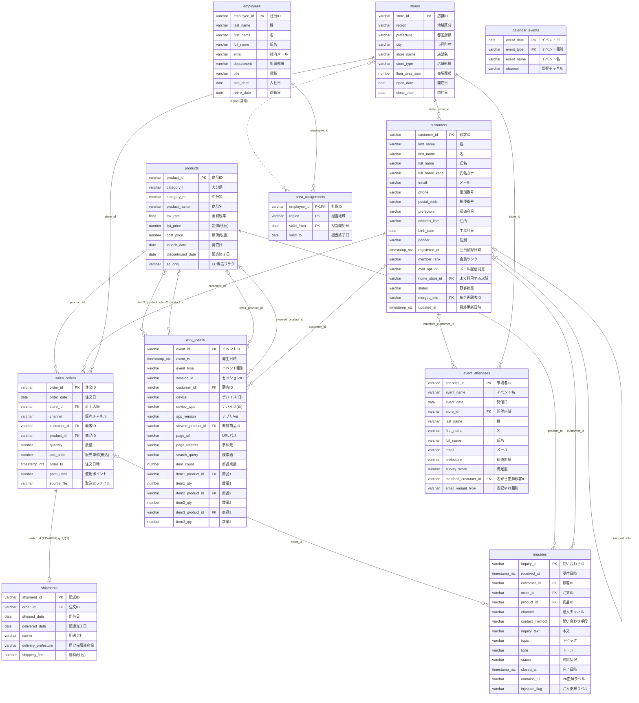

# スノー商事 研修用データセット テーブル設計書

## 1. 概要

| 項目 | 内容 |
| --- | --- |
| データセット名 | `snow_shoji_training` |
| 対象 | 架空の小売企業「スノー商事」（実店舗50店 + ECサイト + 2026-07リリースのアプリ） |
| データ期間 | 2024-04-01〜2026-12-31（マスタの開店日・入社日・発売日・登録日時はこれより前も可） |
| 生成元の指示 | [data_generation_prompt.md](data_generation_prompt.md) |
| 実体 | [../sqls/](../sqls/) 配下の `*.csv` / `*.parquet`（同一内容）と各DWH向けDDL `ddl_*.sql` |
| 本書の型表記 | Snowflake DDL（[ddl_snowflake.sql](../sqls/ddl_snowflake.sql)）に準拠 |
| 外部テーブル | Snowflake 外部テーブル DDL（[ddl_snowflake_external.sql](../sqls/ddl_snowflake_external.sql)）。「[7. Snowflake 外部テーブル](#7-snowflake-外部テーブル)」を参照 |
| 命名規則 | テーブル名・列名は英小文字スネークケース（元指示の大文字表記と識別子としては同一） |

> **注意**：DDLの制約（PK / FK）は Snowflake では強制されない情報的制約です。
> 実データの整合性は「[6. 実データとの整合性確認結果](#6-実データとの整合性確認結果)」を参照してください。
> 列の定義は DDL・CSV・Parquet の3者で一致していますが、**値の中身には設計と矛盾する箇所が多数あります**。

---

## 2. テーブル一覧

| No | 物理名 | 論理名 | 種別 | 件数（実データ） | 元指示の目安 | 主キー | 対象ファイル |
| --- | --- | --- | --- | ---: | ---: | --- | --- |
| 1 | `stores` | 店舗マスタ | マスタ | 50 | 50 | `store_id` | [stores.csv](stores.csv) / [stores.parquet](stores.parquet) |
| 2 | `products` | 商品マスタ | マスタ | 700 | 500 | `product_id` | [products.csv](products.csv) / [products.parquet](products.parquet) |
| 3 | `employees` | 社員マスタ | マスタ | 131 | 120 | `employee_id` | [employees.csv](employees.csv) / [employees.parquet](employees.parquet) |
| 4 | `customers` | 顧客マスタ（個人情報を含む） | マスタ | 20,000 | 20,000 | `customer_id` | [customers.csv](customers.csv) / [customers.parquet](customers.parquet) |
| 5 | `area_assignments` | エリア担当履歴 | 履歴 | 26 | 20 | `employee_id`, `region`, `valid_from` | [area_assignments.csv](area_assignments.csv) / [area_assignments.parquet](area_assignments.parquet) |
| 6 | `calendar_events` | 祝日・販促カレンダー | マスタ | 150 | 150 | `event_date`, `event_type` | [calendar_events.csv](calendar_events.csv) / [calendar_events.parquet](calendar_events.parquet) |
| 7 | `sales_orders` | 売上明細 | トランザクション | 1,000,000 | 1,000,000 | `order_id` | [sales_orders.csv](sales_orders.csv) / [sales_orders.parquet](sales_orders.parquet) |
| 8 | `shipments` | 配送実績 | トランザクション | 450,000 | 450,000 | `shipment_id` | [shipments.csv](shipments.csv) / [shipments.parquet](shipments.parquet) |
| 9 | `web_events` | ECアクセスログ | ログ | 500,000 | 500,000 | `event_id` | [web_events.csv](web_events.csv) / [web_events.parquet](web_events.parquet) |
| 10 | `inquiries` | 問い合わせ | トランザクション | 3,000 | 3,000 | `inquiry_id` | [inquiries.csv](inquiries.csv) / [inquiries.parquet](inquiries.parquet) |
| 11 | `event_attendees` | 店頭イベント来場者 | トランザクション | 1,500 | 1,500 | `attendee_id` | [event_attendees.csv](event_attendees.csv) / [event_attendees.parquet](event_attendees.parquet) |

件数が元指示と違う理由（[design_notes.md](../sqls/design_notes.md) より）：

- `products`：毎月の新商品追加（33か月 × 5〜10点）を加えて 700 行
- `employees`：2026-04-01 入社の11名を加えて 131 行
- `area_assignments`：2026-10-01 の組織変更による行追加を加えて 26 行

---

## 3. ER図

実線は DDL に FK が定義されている関係、点線は FK のない論理的な関係（`region` による結合）です。



`calendar_events` は他テーブルと FK を持たず、`sales_orders.order_date` などと日付で突き合わせて使います。

### リレーション一覧

| No | 子テーブル.列 | 親テーブル.列 | 多重度 | 任意/必須 | 備考 |
| --- | --- | --- | --- | --- | --- |
| R01 | `customers.home_store_id` | `stores.store_id` | N : 1 | 必須 | 閉店・引越しで付け替え |
| R02 | `customers.merged_into` | `customers.customer_id` | N : 1 | 任意 | 自己参照。重複登録の統合先（`status='MERGED'` のみ） |
| R03 | `area_assignments.employee_id` | `employees.employee_id` | N : 1 | 必須 | 営業本部の社員のみ |
| R04 | `sales_orders.store_id` | `stores.store_id` | N : 1 | 必須 | EC/APP は顧客の `home_store_id` |
| R05 | `sales_orders.customer_id` | `customers.customer_id` | N : 1 | 必須 | |
| R06 | `sales_orders.product_id` | `products.product_id` | N : 1 | 必須 | |
| R07 | `shipments.order_id` | `sales_orders.order_id` | 1 : 0..1 | 必須 | `channel IN ('EC','APP')` の注文のみ |
| R08 | `web_events.customer_id` | `customers.customer_id` | N : 1 | 任意 | 非会員は空 |
| R09 | `web_events.viewed_product_id` | `products.product_id` | N : 1 | 任意 | 商品ページ閲覧時 |
| R10 | `web_events.item{1..3}_product_id` | `products.product_id` | N : 1 | 任意 | 元JSON `items[]` を3スロットに平坦化 |
| R11 | `inquiries.customer_id` | `customers.customer_id` | N : 1 | 必須 | |
| R12 | `inquiries.order_id` | `sales_orders.order_id` | N : 1 | 任意 | 注文に関する問い合わせのみ |
| R13 | `inquiries.product_id` | `products.product_id` | N : 1 | 必須 | |
| R14 | `event_attendees.store_id` | `stores.store_id` | N : 1 | 必須 | |
| R15 | `event_attendees.matched_customer_id` | `customers.customer_id` | N : 1 | 任意 | 評価用の名寄せ正解。新規来場者は空 |
| R16 | `area_assignments.region` | `stores.region` | N : N | — | FKなし。担当地域と店舗の地域区分を結合する論理関係 |

---

## 4. テーブル定義

凡例：**PK** = 主キー、**FK** = 外部キー、**NULL** の「○」= 空を許容（CSVでは空文字）

### 4.1 `stores`（店舗マスタ）

全国50店舗の所在地・店舗形態・売場面積・開閉店日。地域別・店舗形態別分析の軸マスタ。

| No | 列名 | 論理名 | 型 | PK | FK | NULL | 説明 |
| --- | --- | --- | --- | --- | --- | --- | --- |
| 1 | `store_id` | 店舗ID | VARCHAR | ○ | | | `S001`〜`S050` |
| 2 | `region` | 地域区分 | VARCHAR | | | | 関東 / 関西 / 中部 / 九州 / 東北。S001-015=関東、S016-025=関西、S026-035=中部、S036-042=九州、S043-050=東北 |
| 3 | `prefecture` | 都道府県 | VARCHAR | | | | 地域区分と矛盾しない都道府県 |
| 4 | `city` | 市区町村 | VARCHAR | | | | |
| 5 | `store_name` | 店舗名 | VARCHAR | | | | 「スノー商事 ○○店」 |
| 6 | `store_type` | 店舗形態 | VARCHAR | | | | 路面店 / ショッピングセンター / 駅ビル |
| 7 | `floor_area_sqm` | 売場面積 | NUMBER(38,0) | | | | 平方メートル。300〜3000 |
| 8 | `open_date` | 開店日 | DATE | | | | この日より前に売上は発生しない（S050 は 2025-10-01 開店） |
| 9 | `close_date` | 閉店日 | DATE | | | ○ | 営業中は空（S037 は 2026-08-31 閉店） |

### 4.2 `products`（商品マスタ）

取扱商品。価格とカテゴリは履歴を持たず、常に現在値で上書きされる。

| No | 列名 | 論理名 | 型 | PK | FK | NULL | 説明 |
| --- | --- | --- | --- | --- | --- | --- | --- |
| 1 | `product_id` | 商品ID | VARCHAR | ○ | | | `P0001`〜。毎月の新商品追加で連番が伸びる |
| 2 | `category_l` | 大分類 | VARCHAR | | | | 家電 / キッチン / 衣料 / 食品 / 日用品 / インテリア。2026-04-01 に分類見直しあり |
| 3 | `category_m` | 中分類 | VARCHAR | | | | 大分類と矛盾しない値（例：オーディオ、調理家電、アウター） |
| 4 | `product_name` | 商品名 | VARCHAR | | | | P0001=ワイヤレスイヤホン SNOW BUDS、P0002=電気ケトル SNOW KETTLE 1.0L、P0003=ダウンジャケット SNOW DOWN は固定 |
| 5 | `tax_rate` | 消費税率 | FLOAT | | | | 0.10。食品のみ 0.08（元指示は NUMBER(3,2)） |
| 6 | `list_price` | 定価 | NUMBER(38,0) | | | | 税込（円）。2025-04-01・2026-10-01 に価格改定（上書き） |
| 7 | `cost_price` | 原価 | NUMBER(38,0) | | | | 税抜（円）。定価より低い |
| 8 | `launch_date` | 発売日 | DATE | | | | この日より前に売上は発生しない |
| 9 | `discontinued_date` | 販売終了日 | DATE | | | ○ | 販売中は空。以降の売上はない |
| 10 | `ec_only` | EC専売フラグ | VARCHAR | | | | Y=EC・アプリのみ / N=実店舗でも販売 |

### 4.3 `employees`（社員マスタ）

所属部署・役職・在籍状況。部署異動は上書きで履歴なし。

| No | 列名 | 論理名 | 型 | PK | FK | NULL | 説明 |
| --- | --- | --- | --- | --- | --- | --- | --- |
| 1 | `employee_id` | 社員ID | VARCHAR | ○ | | | `E0001`〜 |
| 2 | `last_name` | 姓 | VARCHAR | | | | |
| 3 | `first_name` | 名 | VARCHAR | | | | |
| 4 | `full_name` | 氏名 | VARCHAR | | | | 姓 + 半角スペース + 名 |
| 5 | `email` | 社内メール | VARCHAR | | | | `e0001@example.jp` 形式 |
| 6 | `department` | 所属部署 | VARCHAR | | | | 情報システム部 / 経営企画部 / マーケティング部 / 営業本部 / カスタマーサポート部 / 経理部 / 情報セキュリティ室 / EC事業部 / 店舗運営部 |
| 7 | `title` | 役職 | VARCHAR | | | | 部長 / マネージャー / リーダー / 担当 |
| 8 | `hire_date` | 入社日 | DATE | | | | 2026-04-01 に11名入社 |
| 9 | `retire_date` | 退職日 | DATE | | | ○ | 在籍中は空。2026-03-31 付で5名退職 |

指定人物：北村（情報システム部 部長）、佐伯（情報システム部）、高田（経営企画部）、森（マーケティング部）、石井（情報セキュリティ室）、野口（経理部）、中川（EC事業部）、小池（営業本部 東日本エリアマネージャー）、大野（カスタマーサポート部 リーダー）

### 4.4 `customers`（顧客マスタ）

氏名・連絡先・住所・会員ランク・在籍状況を持つ日次スナップショット。個人情報を含む。

| No | 列名 | 論理名 | 型 | PK | FK | NULL | 説明 |
| --- | --- | --- | --- | --- | --- | --- | --- |
| 1 | `customer_id` | 顧客ID | VARCHAR | ○ | | | `C000001`〜`C020000`。退会・統合・個人情報削除後も保持される不変キー |
| 2 | `last_name` | 姓 | VARCHAR | | | | 旧姓のままの登録あり（名寄せの難所） |
| 3 | `first_name` | 名 | VARCHAR | | | | |
| 4 | `full_name` | 氏名 | VARCHAR | | | ○ | 姓 + 半角スペース + 名。個人情報削除依頼の顧客は空 |
| 5 | `full_name_kana` | 氏名カナ | VARCHAR | | | ○ | 個人情報削除依頼の顧客は空 |
| 6 | `email` | メールアドレス | VARCHAR | | | | `user000001@example.com` 形式。重複登録では大文字小文字が異なる |
| 7 | `phone` | 電話番号 | VARCHAR | | | | `090-1234-5678` 形式 |
| 8 | `postal_code` | 郵便番号 | VARCHAR | | | | 引越しで変更 |
| 9 | `prefecture` | 都道府県 | VARCHAR | | | | 引越しで変更 |
| 10 | `address_line` | 住所 | VARCHAR | | | ○ | 市区町村以下。個人情報削除依頼の顧客は空 |
| 11 | `birth_date` | 生年月日 | DATE | | | | 18〜80歳 |
| 12 | `gender` | 性別 | VARCHAR | | | | M / F / U（未回答） |
| 13 | `registered_at` | 会員登録日時 | TIMESTAMP_NTZ | | | | 日本時間。これより前の注文はない |
| 14 | `member_rank` | 会員ランク | VARCHAR | | | | REGULAR / SILVER / GOLD。毎年4/1に見直し |
| 15 | `mail_opt_in` | メール配信同意 | VARCHAR | | | | Y / N |
| 16 | `home_store_id` | よく利用する店舗 | VARCHAR | | ○ | | → `stores.store_id`。EC・アプリ注文の計上店舗 |
| 17 | `status` | 顧客状態 | VARCHAR | | | | ACTIVE / WITHDRAWN（退会）/ MERGED（統合済み） |
| 18 | `merged_into` | 統合先顧客ID | VARCHAR | | ○ | ○ | → `customers.customer_id`（自己参照）。`status='MERGED'` の行のみ値あり |
| 19 | `updated_at` | 最終更新日時 | TIMESTAMP_NTZ | | | | 日本時間。マスタ差分取り込みの基準列 |

### 4.5 `area_assignments`（エリア担当履歴）

営業本部社員の担当地域を有効期間で持つ履歴テーブル。過去行は削除せず `valid_to` を設定する。

| No | 列名 | 論理名 | 型 | PK | FK | NULL | 説明 |
| --- | --- | --- | --- | --- | --- | --- | --- |
| 1 | `employee_id` | 社員ID | VARCHAR | ○ | ○ | | → `employees.employee_id`。営業本部の社員のみ |
| 2 | `region` | 担当地域 | VARCHAR | ○ | | | 関東 / 関西 / 中部 / 九州 / 東北（`stores.region` と同じ区分） |
| 3 | `valid_from` | 担当開始日 | DATE | ○ | | | |
| 4 | `valid_to` | 担当終了日 | DATE | | | ○ | 担当中は空 |

※ 小池さんは関東・東北を担当し、2026-10-01 から中部も担当する（中部の前任者は 2026-09-30 で終了）。

### 4.6 `calendar_events`（祝日・販促カレンダー）

売上変動の説明変数・予測モデルの特徴量として使うイベントカレンダー。

| No | 列名 | 論理名 | 型 | PK | FK | NULL | 説明 |
| --- | --- | --- | --- | --- | --- | --- | --- |
| 1 | `event_date` | イベント日 | DATE | ○ | | | |
| 2 | `event_type` | イベント種別 | VARCHAR | ○ | | | HOLIDAY / SALE / CAMPAIGN / INCIDENT |
| 3 | `event_name` | イベント名 | VARCHAR | | | | 敬老の日 / 夏のボーナスセール / TVCM 放映 / EC システム障害 など |
| 4 | `channel` | 影響チャネル | VARCHAR | | | | ALL / EC / STORE |

※ 2024〜2026年の日本の祝日を正確に収録する。2026-06-20 CM、2026-08-21 台風、2026-09-19〜23 シルバーウィーク、2025-11-10・2026-12-18 EC障害、2026-10-01 送料規程改定は必須。

### 4.7 `sales_orders`（売上明細）

1行 = 1注文の1商品。全チャネルを含む。毎日1ファイル（`sales_YYYYMMDD.csv`）で翌日2時に到着。

| No | 列名 | 論理名 | 型 | PK | FK | NULL | 説明 |
| --- | --- | --- | --- | --- | --- | --- | --- |
| 1 | `order_id` | 注文ID | VARCHAR | ○ | | | `ORD` + 8桁の連番 |
| 2 | `order_date` | 注文日 | DATE | | | | 2024-04-01〜2026-12-31 |
| 3 | `store_id` | 計上店舗ID | VARCHAR | | ○ | | → `stores.store_id`。実店舗は購入店舗、EC/APP は顧客の `home_store_id` |
| 4 | `channel` | 販売チャネル | VARCHAR | | | | STORE / EC / APP（APP は 2026-07-01 以降） |
| 5 | `customer_id` | 顧客ID | VARCHAR | | ○ | | → `customers.customer_id`。必ず値あり |
| 6 | `product_id` | 商品ID | VARCHAR | | ○ | | → `products.product_id` |
| 7 | `quantity` | 数量 | NUMBER(38,0) | | | | 1〜5（1 が約75%） |
| 8 | `unit_price` | 販売単価 | NUMBER(38,0) | | | | 税込（円）。セール時は定価から値引き |
| 9 | `order_ts` | 注文日時 | TIMESTAMP_NTZ | | | | 日本時間。店舗は昼・夕方、EC/APP は21〜23時にピーク |
| 10 | `point_used` | 使用ポイント | NUMBER(38,0) | | | ○ | 2026-07-07 到着分から追加された列。それ以前は空 |
| 11 | `source_file` | 取込元ファイル | VARCHAR | | | | `sales_YYYYMMDD.csv`。再送・遅延到着・日付跨ぎの追跡用 |

※ 1〜8列目は元指示の列順を保持し、シナリオで追加された列（9〜11）を末尾に置いている。

### 4.8 `shipments`（配送実績）

EC・アプリ注文と1対1。毎日1ファイル（`shipments_YYYYMMDD.csv`）で到着。

| No | 列名 | 論理名 | 型 | PK | FK | NULL | 説明 |
| --- | --- | --- | --- | --- | --- | --- | --- |
| 1 | `shipment_id` | 配送ID | VARCHAR | ○ | | | `SHP` + 8桁の連番 |
| 2 | `order_id` | 注文ID | VARCHAR | | ○ | | → `sales_orders.order_id`。`channel` が EC / APP の注文のみ。一意 |
| 3 | `shipped_date` | 出荷日 | DATE | | | | 注文日の0〜2日後 |
| 4 | `delivered_date` | 配達完了日 | DATE | | | | 出荷日の1〜3日後（年末・悪天候時は延びる） |
| 5 | `carrier` | 配送会社 | VARCHAR | | | | 架空3社（スノーロジ便 / あおば運輸 / ひかり宅配） |
| 6 | `delivery_prefecture` | 届け先都道府県 | VARCHAR | | | | |
| 7 | `shipping_fee` | 送料 | NUMBER(38,0) | | | | 税込。注文金額が基準額以上で0円、未満で550円。基準額は5,000円（2026-10-01 以降 7,000円） |

### 4.9 `web_events`（ECアクセスログ）

元は JSON Lines（`weblog_YYYYMMDD.json`）。1行 = 1イベントに平坦化している。期間は直近180日。

| No | 列名 | 論理名 | 型 | PK | FK | NULL | 元のJSONキー | 説明 |
| --- | --- | --- | --- | --- | --- | --- | --- | --- |
| 1 | `event_id` | イベントID | VARCHAR | ○ | | | `event_id` | UUID |
| 2 | `event_ts` | 発生日時 | TIMESTAMP_NTZ | | | | `event_ts` | 日本時間 |
| 3 | `event_type` | イベント種別 | VARCHAR | | | | `event_type` | page_view / search / add_to_cart / purchase |
| 4 | `session_id` | セッションID | VARCHAR | | | | `session_id` | UUID。同一セッションのイベントをまとめる |
| 5 | `customer_id` | 顧客ID | VARCHAR | | ○ | ○ | `user.customer_id` | → `customers.customer_id`。非会員は空 |
| 6 | `device` | デバイス（旧） | VARCHAR | | | ○ | `user.device` | pc / sp / tablet。2026-04-27 到着分まで |
| 7 | `device_type` | デバイス（新） | VARCHAR | | | ○ | `user.device_type` | 2026-04-28 到着分以降 |
| 8 | `app_version` | アプリVer | VARCHAR | | | ○ | — | 2026-04-28 以降のアプリ経由のみ |
| 9 | `viewed_product_id` | 閲覧商品ID | VARCHAR | | ○ | ○ | （URLから導出） | → `products.product_id`。商品ページ閲覧時 |
| 10 | `page_url` | URLパス | VARCHAR | | | | `page.url` | 商品ページは `/products/{商品ID}` |
| 11 | `page_referrer` | 参照元 | VARCHAR | | | | `page.referrer` | search / sns / direct / mail |
| 12 | `search_query` | 検索語 | VARCHAR | | | ○ | `search_query` | `event_type='search'` のときのみ |
| 13 | `item_count` | 商品点数 | NUMBER(38,0) | | | | `items[]` の件数 | add_to_cart / purchase は1〜3、それ以外は0 |
| 14 | `item1_product_id` | 商品1 | VARCHAR | | ○ | ○ | `items[0].product_id` | `item_count >= 1` のとき |
| 15 | `item1_qty` | 数量1 | NUMBER(38,0) | | | ○ | `items[0].qty` | |
| 16 | `item2_product_id` | 商品2 | VARCHAR | | ○ | ○ | `items[1].product_id` | `item_count >= 2` のとき |
| 17 | `item2_qty` | 数量2 | NUMBER(38,0) | | | ○ | `items[1].qty` | |
| 18 | `item3_product_id` | 商品3 | VARCHAR | | ○ | ○ | `items[2].product_id` | `item_count = 3` のとき |
| 19 | `item3_qty` | 数量3 | NUMBER(38,0) | | | ○ | `items[2].qty` | |

### 4.10 `inquiries`（問い合わせ）

自然文の本文とトピック・トーンのラベルを持つ。月1回（`inquiries_YYYYMM.csv`）で到着。テキストAIの要約・分類、PII検出、プロンプトインジェクション耐性評価に使う。

| No | 列名 | 論理名 | 型 | PK | FK | NULL | 説明 |
| --- | --- | --- | --- | --- | --- | --- | --- |
| 1 | `inquiry_id` | 問い合わせID | VARCHAR | ○ | | | `INQ` + 5桁の連番 |
| 2 | `received_at` | 受付日時 | TIMESTAMP_NTZ | | | | 日本時間。2026年内 |
| 3 | `customer_id` | 顧客ID | VARCHAR | | ○ | | → `customers.customer_id` |
| 4 | `order_id` | 注文ID | VARCHAR | | ○ | ○ | → `sales_orders.order_id`。注文に関する問い合わせのみ |
| 5 | `product_id` | 商品ID | VARCHAR | | ○ | | → `products.product_id` |
| 6 | `channel` | 購入チャネル | VARCHAR | | | | STORE / EC / APP |
| 7 | `contact_method` | 問い合わせ手段 | VARCHAR | | | | mail / form / phone / chat |
| 8 | `inquiry_text` | 本文 | VARCHAR | | | | 100〜300字の日本語 |
| 9 | `topic` | トピック | VARCHAR | | | | 配送の遅れ / 商品の破損 / 返品・交換 / サイズ・仕様の質問 / 支払い / 店舗スタッフの対応 / ポイント / その他。本文と一致 |
| 10 | `tone` | トーン | VARCHAR | | | | 怒っている / 困っている / 落ち着いている / 感謝している。本文と一致 |
| 11 | `status` | 対応状況 | VARCHAR | | | | OPEN / CLOSED |
| 12 | `closed_at` | 完了日時 | TIMESTAMP_NTZ | | | ○ | OPEN は空。`received_at` より後 |
| 13 | `contains_pii` | PII正解ラベル | VARCHAR | | | | 評価用。Y（約5%）/ N |
| 14 | `injection_flag` | 注入正解ラベル | VARCHAR | | | | 評価用。Y（12件）/ N |

### 4.11 `event_attendees`（店頭イベント来場者）

来場者の約70%は既存顧客だが、メールアドレスに表記ゆれがあり単純一致では名寄せできない。月1回（`event_attendees_YYYYMM.csv`）で到着。

| No | 列名 | 論理名 | 型 | PK | FK | NULL | 説明 |
| --- | --- | --- | --- | --- | --- | --- | --- |
| 1 | `attendee_id` | 来場者ID | VARCHAR | ○ | | | `ATT` + 5桁の連番 |
| 2 | `event_name` | イベント名 | VARCHAR | | | | 春の新生活フェア など |
| 3 | `event_date` | 開催日 | DATE | | | | 2026年内 |
| 4 | `store_id` | 開催店舗ID | VARCHAR | | ○ | | → `stores.store_id` |
| 5 | `last_name` | 姓 | VARCHAR | | | | 旧姓で記入されるケースあり |
| 6 | `first_name` | 名 | VARCHAR | | | | |
| 7 | `full_name` | 氏名 | VARCHAR | | | | |
| 8 | `email` | メールアドレス | VARCHAR | | | | 既存顧客は顧客マスタのアドレスに表記ゆれ（大文字・前後空白・全角）を加えた値 |
| 9 | `prefecture` | 都道府県 | VARCHAR | | | | |
| 10 | `survey_score` | 満足度 | NUMBER(38,0) | | | | 1（不満）〜5（満足） |
| 11 | `matched_customer_id` | 名寄せ正解顧客ID | VARCHAR | | ○ | ○ | → `customers.customer_id`。評価用。新規来場者（約30%）は空 |
| 12 | `email_variant_type` | 表記ゆれ種別 | VARCHAR | | | | 評価用。exact / uppercase / space / fullwidth / new |

---

## 5. 元指示（data_generation_prompt.md）との差分

| 区分 | 内容 |
| --- | --- |
| 列の追加 | `employees`・`customers`・`event_attendees` に `last_name` / `first_name`、`customers` に `merged_into`、`sales_orders` に `order_ts` / `point_used` / `source_file`、`web_events` に `device_type` / `app_version` / `viewed_product_id` / `item_count`、`inquiries` に `contains_pii` / `injection_flag`、`event_attendees` に `matched_customer_id` / `email_variant_type` |
| 列順の変更 | `stores` は `store_name` が5列目、`products` は `product_name` が4列目に移動（元指示では2列目）。`sales_orders` は元の8列の順序を保持 |
| 値の追加 | `customers.status` に `MERGED`、`inquiries.topic` に `その他` |
| 型 | 桁指定（`VARCHAR(4)` など）を外して `VARCHAR`。`tax_rate` は `NUMBER(3,2)` → `FLOAT` |
| 構造 | `web_events` の JSON を列に平坦化（`items[]` は最大3件のスロット） |
| 件数 | `products` 500→700、`employees` 120→131、`area_assignments` 20→26 |

---

## 6. 実データとの整合性確認結果

確認日：2026-09-28。対象は [../sqls/](../sqls/) の CSV 全件（Parquet は列構成が CSV と一致することを確認）。

### 6.1 問題なし

| 観点 | 結果 |
| --- | --- |
| 列構成 | DDL（6方言とも11テーブル）・CSV・Parquet の列名と列順が一致 |
| 主キーの一意性 | `calendar_events` 以外の10テーブルで重複なし |
| 外部キーの参照整合性 | 16関係すべてで、参照先に存在しない値はなし |
| ID形式・件数 | 各IDは仕様の形式どおり。件数は2章の値どおり |
| 値の範囲 | `stores.floor_area_sqm`（300〜3000）、`sales_orders.quantity`（1〜5、1が75%）、`order_date` の期間、`inquiries.received_at` / `event_attendees.event_date` の年 |
| 構成比 | `sales_orders.channel` は STORE 59% / EC 33% / APP 8%（EC+APP ≒ 40%） |
| 氏名・メール | `full_name` = 姓 + 空白 + 名、顧客・社員メールの形式 |
| 平坦化の整合 | `web_events.page_url` = `/products/{viewed_product_id}` |

### 6.2 問題あり（設計と矛盾する値）

生成器が列ごとに独立して値を作っており、列間・テーブル間の業務ルールがほぼ反映されていません。`design_notes.md` の「生成器への申し送り」に書かれた後処理が行われていない状態です。

| 重要度 | テーブル | 内容 | 件数 / 対象 |
| --- | --- | --- | --- |
| 高 | `shipments` | `order_id` が重複している（1対1になっていない） | 87,752 / 450,000 |
| 高 | `shipments` | 対象注文が `channel='STORE'` | 265,052 / 450,000 |
| 高 | `shipments` | 出荷日が注文日の0〜2日後でない（-862〜+863日） | 448,697 / 450,000 |
| 高 | `shipments` | 配達日が出荷日の1〜3日後でない | 448,660 / 450,000 |
| 高 | `shipments` | 送料が「金額と基準額」のルールと合わない | 132,678 / 450,000 |
| 高 | `sales_orders` | APP 注文が 2026-07-01 より前にある | 65,642 / 80,341 |
| 高 | `sales_orders` | `order_ts` の日付が `order_date` と違う | 999,011 / 1,000,000 |
| 高 | `sales_orders` | EC/APP の `store_id` が顧客の `home_store_id` と違う | 402,013 / 410,202 |
| 高 | `sales_orders` | `unit_price` が定価の0.5〜1.2倍の範囲外（中央値1.01倍、最大約38倍） | 667,098 / 1,000,000 |
| 中 | `sales_orders` | 発売前の売上 / 販売終了後の売上 / 開店前の売上 | 159,481 / 33,565 / 7,837 |
| 中 | `sales_orders` | EC専売商品（`ec_only='Y'`）が店舗で売れている | 107,658 / 589,798 |
| 中 | `sales_orders` | 会員登録日時より前の注文 | 118,481 / 1,000,000 |
| 中 | `sales_orders` | `source_file` が `sales_YYYY-MM-DD.csv`（ハイフン付き）で、仕様の `sales_YYYYMMDD.csv` と違う。再送ファイルもない | 全件 |
| 中 | `sales_orders` | `point_used` が 2026-07-06 以前も含めて全件に値がある | 全件 |
| 中 | `sales_orders` | 曜日・季節の変動がない（曜日別件数ほぼ均等、1〜3月は他の月の約2/3） | — |
| 高 | `stores` | `region` が店舗IDのブロック割り当てと合わない | 35 / 50 |
| 高 | `stores` | `prefecture` が `region` と矛盾（例：S001 関東・京都府） | 43 / 50 |
| 中 | `stores` | 閉店店舗がない（S037 の閉店が未反映）。S050 の開店日が 2001-03-19 | — |
| 高 | `products` | P0001〜P0003 の固定商品名が反映されていない（例：P0001 = ドリップコーヒー） | 3 / 3 |
| 高 | `products` | `category_l` と `category_m` が対応していない（例：キッチン × オーディオ） | 多数 |
| 高 | `products` | `tax_rate` が「食品のみ0.08」のルールと合わない | 219 / 700 |
| 高 | `products` | `list_price <= cost_price`（原価割れ） | 209 / 700 |
| 低 | `products` | 発売日 ≥ 販売終了日 | 11 / 700 |
| 高 | `employees` | 指定人物（北村・佐伯・高田・石井・野口・小池・大野）がいない。森・中川は部署が違う | 9名中9名 |
| 高 | `area_assignments` | 担当者が営業本部でない。小池さんの担当行がない | 20 / 26 |
| 低 | `area_assignments` | `valid_from >= valid_to` | 2 / 26 |
| 高 | `customers` | `full_name_kana` が氏名と対応しない（例：石川 康弘 → ナカジマ キョウスケ） | ほぼ全件 |
| 中 | `customers` | `address_line` が「607 渡辺 Street」形式（英語住所表記） | 全件 |
| 中 | `customers` | `phone` の先頭0が欠落（例：`41-3937-4616`） | 4,436 / 20,000 |
| 高 | `customers` | `status='MERGED'` の行に `merged_into` がなく、MERGED 以外の行に `merged_into` がある | 225 / 109 |
| 中 | `customers` | `updated_at < registered_at` | 2,393 / 20,000 |
| 低 | `customers` | 年齢が18〜80歳の範囲外 | 223 / 20,000 |
| 中 | `customers` | C004821 の個人情報削除が未反映 | 1 |
| 高 | `calendar_events` | `event_type` と `event_name` が合わない（例：CAMPAIGN × 勤労感謝の日、HOLIDAY × 夏のボーナスセール） | 多数 |
| 高 | `calendar_events` | 祝日の日付が不正確（実在の祝日52日のうち収録は5日） | 5 / 52 |
| 高 | `calendar_events` | 必須イベント（2026-06-20 CM、2026-08-21 台風、2026-09-19 SW、EC障害、送料改定）がない | 0 / 6 |
| 中 | `calendar_events` | 主キー（`event_date`, `event_type`）の重複 | 3組 |
| 高 | `web_events` | `item_count=0` の行にも `item1〜3_product_id` が入っている | 425,180 / 425,180 |
| 高 | `web_events` | `item_count` がイベント種別と矛盾 | 126,955 / 500,000 |
| 高 | `web_events` | `search_query` が search 以外に入り、search の85%で空 | 63,817 / 63,988 |
| 中 | `web_events` | `device` / `device_type` の切り替え日（2026-04-28）が守られていない | 68,187 / 62,915 |
| 中 | `web_events` | 非会員（`customer_id` 空）が0件（仕様は約35%） | 0 / 500,000 |
| 中 | `web_events` | 全イベントが別セッション（1セッション平均1.0イベント）で、ファネル分析ができない | — |
| 高 | `inquiries` | 注文の顧客・商品と、問い合わせの顧客・商品が違う | 2,999 / 2,998 |
| 高 | `inquiries` | `topic` が本文と合わない（キーワードによる簡易判定） | 2,119 / 3,000 |
| 高 | `inquiries` | `closed_at <= received_at` | 1,417 / 3,000 |
| 中 | `inquiries` | `status='OPEN'` なのに `closed_at` がある | 379 / 379 |
| 中 | `inquiries` | `order_id` が全件に入っている（注文以外の問い合わせがない） | 3,000 / 3,000 |
| 中 | `inquiries` | 受付日が注文日より前 | 522 / 3,000 |
| 中 | `inquiries` | 本文が100〜300字の範囲外。本文のパターンが14種類しかない | 765 / 3,000 |
| 高 | `event_attendees` | `matched_customer_id` の顧客とメールが、正規化後も一致しない（名寄せの正解になっていない） | 1,500 / 1,500 |
| 高 | `event_attendees` | `email_variant_type='new'` なのに `matched_customer_id` がある | 476 / 476 |
| 中 | `event_attendees` | メールのドメインが `example.org` など指定外 | 522 / 1,500 |

### 6.3 対応方針の案

- **スキーマ（DDL・本設計書）はそのまま使える**：列構成・キー・FK参照は正しい。
- **データは研修の演習シナリオ（履歴・時点参照・名寄せ・ファネル・送料改定など）の検証に使えない**：6.2 の「高」はシナリオの前提そのものを壊している。
- 再生成するか、`design_notes.md` 5章の後処理（列間相関、日付の順序、NULL化、固定値行の上書き、送料の再計算、`source_file` の整形）を実装して適用する必要がある。

---

## 7. Snowflake 外部テーブル

DDL：[ddl_snowflake_external.sql](../sqls/ddl_snowflake_external.sql)

S3 上の Parquet をロードせずに参照するための外部テーブルです。列名・型・コメントは 4章（内部テーブル）と同じで、テーブル名に `ext_` を付けています。

### 7.1 構成

| オブジェクト | 名前 | 内容 |
| --- | --- | --- |
| ストレージ統合 | `si_snow_shoji_training` | S3 への認証（IAM ロール）。ACCOUNTADMIN で作成 |
| ファイル形式 | `ff_snow_shoji_parquet` | `TYPE = PARQUET`、`USE_LOGICAL_TYPE = TRUE` |
| 外部ステージ | `snow_shoji_training_ext_stage` | `s3://<バケット名>/snow_shoji_training/` |
| 外部テーブル | `ext_stores` 〜 `ext_event_attendees`（11本） | `LOCATION = @snow_shoji_training_ext_stage/<テーブル名>/` |

S3 にはテーブルごとにフォルダを分けて配置します（同じフォルダに置くと、外部テーブルが他テーブルのファイルも読んでしまうため）。

```text
s3://<バケット名>/snow_shoji_training/
├── stores/stores.parquet
├── products/products.parquet
├── ...
└── event_attendees/event_attendees.parquet
```

### 7.2 列の定義方法

外部テーブルの列は、Parquet の1行を表す `VALUE`（VARIANT）から取り出して型変換する「仮想列」として定義します。

| 元の値 | 列の式 | 対象 |
| --- | --- | --- |
| 文字列 | `NULLIF(value:<列>::VARCHAR, '')` | VARCHAR 列すべて |
| 文字列で入っている日付 | `TRY_TO_DATE(NULLIF(value:<列>::VARCHAR, ''))` | `stores.close_date`、`products.discontinued_date`、`employees.retire_date`、`area_assignments.valid_from` / `valid_to` |
| 数値・日付・日時 | `value:<列>::<型>` | 上記以外 |

- Parquet の空値は **NULL ではなく空文字（`''`）** で入っているため、`NULLIF` で NULL に変換しています（例：`web_events.device`、`customers.merged_into`）。
- 上の5つの日付列は Parquet 上で文字列型のため、`TRY_TO_DATE` で DATE に変換しています。
- タイムスタンプ列は Parquet の `TIMESTAMP(NANOS)` 論理型で、ファイル形式の `USE_LOGICAL_TYPE = TRUE` で解釈させます。

### 7.3 内部テーブルとの違い

| 観点 | 内部テーブル（`ddl_snowflake.sql`） | 外部テーブル（`ddl_snowflake_external.sql`） |
| --- | --- | --- |
| データの置き場所 | Snowflake 内のストレージ | S3（ロード不要） |
| PK / FK 制約 | 定義あり（情報的制約） | 定義できない。キーは本書の 4章を参照 |
| 更新 | INSERT / COPY INTO | S3 のファイルを置き換えて `ALTER EXTERNAL TABLE ... REFRESH` |
| 自動更新 | — | `AUTO_REFRESH = FALSE`。S3 のイベント通知を設定すれば TRUE にできる |
| 検索性能 | 高い（マイクロパーティション） | 低い。頻繁に参照するテーブルは内部テーブルへロードするか、マテリアライズドビューを作る |
